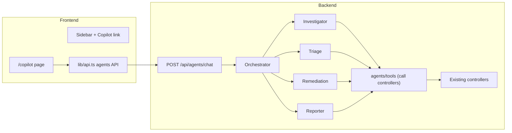
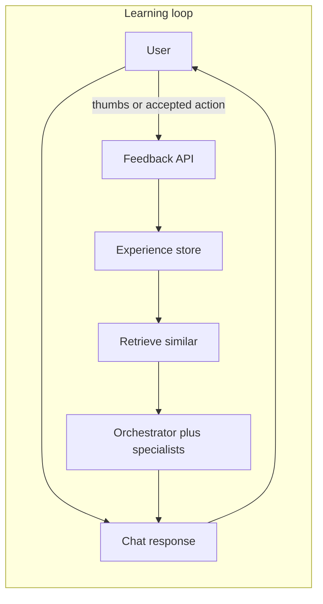

# 5-Agent Agentic AI Pipeline — End-to-End Integration Plan

## Architecture (where it lives)

- **Single entry:** `POST /api/agents/chat`. Request body: `message`, optional `conversation_id`. Response: `reply`, `suggested_actions[]`, `turn_id` (for feedback and self-learning).
- **Orchestrator** is the only node that sees the user message; it calls specialists via internal “meta-tools” (invoke_investigator, etc.) and returns one final reply.
- **Specialists** use a **shared tool layer** that calls existing backend **controllers in-process** (same process, `get_db` session) so no extra HTTP hop and existing auth/DB are reused. See [backend/controllers/alerts.py](backend/controllers/alerts.py) and sibling controllers for the call surface.

---

## Self-learning agents (design)

Agents improve over time from **feedback** and **outcomes**, without changing the core LLM.

- **Feedback collection:** Each turn returns a stable `turn_id`. User sends explicit feedback (thumbs up/down or "Was this helpful?") via `POST /api/agents/feedback`. When the user **accepts a suggested action** (e.g. confirms "Block IP"), the frontend calls the same feedback endpoint with `turn_id`, `action_type`, and `accepted: true` as an implicit positive signal.
- **Experience store (DB):** Persist per turn: `turn_id`, `conversation_id`, `message`, `reply`, `suggested_actions`, which **specialists** were invoked and in what order, **tool calls** (tool name + sanitized params, no PII), and **feedback** (rating, accepted_actions). This is the "experience" dataset for retrieval and analytics.
- **Retrieval-augmented behavior:** Before running the orchestrator (or a specialist), **retrieve** top-K similar past turns from the experience store (e.g. by embedding the user message or keyword match). Inject as few-shot examples or "Similar past cases:" into the system prompt so the agent can mimic successful past behavior. No model weights updated in v1.
- **Outcome signals (optional, later):** When a suggested action was "block IP", later correlate with WAF data (e.g. that IP caused no further alerts in 24h) to derive a reward. Use to rank which specialist/tool combos to prefer for similar intents; can start as a background job that aggregates feedback and writes summary stats for routing bias.

**In this plan:** Feedback API + experience store + `turn_id` in Phase 2; retrieval (RAG over experience store) in Phase 5; frontend feedback UI (thumbs, accepted action) in Phase 4. Outcome-based reward and routing bias are a follow-up.

---

## Phase 1: Foundation (scaffold + tool layer)

**Goal:** Backend agents module, config, one working route that runs a single agent with real tools.

1. **Config and dependencies**
  - Add to [backend/config.py](backend/config.py): `AGENTS_ENABLED`, `AGENTS_LLM_PROVIDER` (e.g. `openai`), `AGENTS_LLM_API_KEY`, `AGENTS_LLM_MODEL`, `AGENTS_LLM_BASE_URL` (optional, for compatible APIs), `AGENTS_MAX_STEPS` (e.g. 10), `AGENTS_REQUEST_TIMEOUT`.
  - Add to `requirements.txt`: `openai>=1.0` (or keep `httpx` and add only if using a different provider). No LangGraph in v1 to keep the stack minimal and scalable.
2. **Module layout**
  - Create `backend/agents/` with:
    - `__init__.py` — expose `run_chat(message, conversation_id, db)` and optionally the orchestrator/specialists for tests.
    - `schemas.py` — Pydantic: `ChatRequest`, `ChatResponse` (include `turn_id` for feedback and self-learning), `SuggestedAction` (e.g. `type: Literal["block_ip","view_rule","add_rule"]`, `payload: dict`).
    - `tools/__init__.py` — re-export all tool functions.
    - `tools/base.py` — dependency injection: `get_tools_context(db, request_app_state)` returning a context object that holds `db` and optional `waf_service` (from `app.state`) so tools can call controllers and WAF check without touching globals.
3. **Tool layer (in-process)**
  - Implement `backend/agents/tools/` modules that **call existing controllers** (same process), not HTTP:
    - `tools/alerts.py` — `get_active_alerts(ctx)`, `get_alert_history(ctx, range_str)` using `backend.controllers.alerts.get_active(ctx.db)` etc.
    - `tools/traffic.py` — `get_traffic_recent(ctx, limit)`, `get_traffic_by_range(ctx, range_str)`, `get_traffic_by_endpoint(ctx, endpoint, range_str)` via `backend.controllers.traffic`.
    - `tools/threats.py` — `get_threats_recent`, `get_threats_by_range`, `get_threats_by_type`, `get_threat_stats` via `backend.controllers.threats`.
    - `tools/metrics.py` — `get_metrics_realtime`, `get_metrics_historical` via `backend.controllers.metrics`.
    - `tools/charts.py` — `get_charts_requests`, `get_charts_threats` via `backend.controllers.charts`.
    - `tools/analytics.py` — `get_analytics_overview`, `get_analytics_trends`, `get_analytics_summary` via `backend.controllers.analytics`.
    - `tools/rules.py` — `get_security_rules`, `get_owasp_rules` via `backend.controllers.security_rules`.
    - `tools/ip_geo_bots.py` — blacklist/whitelist, geo rules, bot signatures via `backend.controllers.ip_management`, `geo_rules`, `bot_detection`.
    - `tools/waf.py` — `waf_check_request(ctx, method, path, query_params, headers, body)` using `app.state.waf_service` or `WAF_SERVICE_URL` HTTP fallback; return anomaly result for the Investigator.
  - Each function takes `ctx` (with `db`, optional `waf_service`/base URL), returns JSON-serializable dict (or list). No LLM in the tool layer.
4. **Single-agent endpoint (no orchestrator yet)**
  - Implement **Investigator** only: `backend/agents/investigator.py` with a fixed system prompt and tool list (get_active_alerts, get_alert_history, get_traffic_*, get_threats_*, waf_check_request). Use OpenAI (or one provider) with tool-calling in a loop: LLM → tool calls → execute via tools above → inject results → repeat until final answer or `AGENTS_MAX_STEPS`.
  - Add `backend/routes/agents.py`: `POST /chat` that receives `ChatRequest`, gets `db` via `Depends(get_db)`, gets `request.app.state` for WAF service, builds tool context, calls `investigator.run(message, context)` (or equivalent), maps result to `ChatResponse` with `reply` and empty `suggested_actions` for now. Use `get_current_user_optional` from [backend/auth.py](backend/auth.py) if the rest of the app allows unauthenticated dashboard; otherwise `get_current_user`.
  - Register in [backend/main.py](backend/main.py): `include_router(agents.router, prefix="/api/agents", tags=["agents"])` (inside a try/except like other optional features).

**Deliverable:** `POST /api/agents/chat` with “Why did we block X?”-style questions answered by Investigator using live alerts/traffic/threats/WAF check. No UI yet.

---

## Phase 2: Orchestrator + all four specialists

**Goal:** Orchestrator routes to Investigator, Reporter, Triage, Remediation; each specialist has its own tools and prompt.

1. **Orchestrator**
  - `backend/agents/orchestrator.py`: System prompt that classifies intent (investigate / triage / remediate / report) and has four meta-tools: `invoke_investigator`, `invoke_triage`, `invoke_remediation`, `invoke_reporter`, each accepting a `sub_question` or `context` string. Implementation: when the LLM requests a meta-tool call, the backend runs the corresponding specialist’s `run(sub_question, context)` with the same `ctx`, then returns the specialist’s text back to the orchestrator. Loop until orchestrator returns a final answer (or max steps).
2. **Specialists**
  - **Investigator** (already present): refine prompt; ensure tools are only alerts, traffic, threats, waf_check.
  - **Reporter:** `backend/agents/reporter.py` — tools: metrics, charts, analytics (overview, trends, summary). Prompt: summarize trends, top-N, time-bound reports.
  - **Triage:** `backend/agents/triage.py` — tools: alerts (active + history), traffic, threat stats. Prompt: assess true/false positive, severity, suggest prioritization; no write tools.
  - **Remediation:** `backend/agents/remediation.py` — tools: security_rules, ip (blacklist/whitelist read-only), geo_rules, bot_signatures; “draft” helpers that return suggested payloads (e.g. `draft_block_ip(ip, reason)`) without calling POST. Prompt: suggest actions only; output structured suggestions that the backend maps to `SuggestedAction` (e.g. `block_ip` with `payload: { ip, reason }`).
3. **Suggested actions**
  - In `schemas.py`, define `SuggestedAction` with `type` and `payload`. In the route, after the orchestrator returns, parse the final message or a dedicated “suggested_actions” output (e.g. from Remediation) and fill `ChatResponse.suggested_actions`. Keep actions draft-only: frontend will turn “Block IP” into navigation + confirmation + existing `POST /api/ip/blacklist`.
4. **Self-learning: experience store and feedback** — Generate unique `turn_id` per turn; after each turn persist to **agent_experience** table: `turn_id`, `conversation_id`, `user_id`, `message`, `reply`, `suggested_actions`, `specialists_invoked`, `tool_calls` (sanitized), `created_at`. Add `POST /api/agents/feedback` with `turn_id`, optional `rating`, optional `accepted_actions`; update store so retrieval can prefer high-rated/accepted turns. DB model/migration for agent_experience (and optional agent_feedback).

**Deliverable:** Full 5-agent pipeline with `turn_id`, experience persistence, and feedback endpoint; `suggested_actions` in response.

---

## Phase 3: API route hardening and streaming (optional)

- Add `POST /api/agents/chat/stream` that returns SSE or streaming JSON: same orchestration, stream the final reply only (or stream per agent; start with final reply only).
- Add rate limiting for `/api/agents/*` (e.g. reuse [backend/middleware/rate_limit_middleware.py](backend/middleware/rate_limit_middleware.py)) and a timeout (e.g. 60s) so one turn cannot run forever.
- Log agent requests (user id if authenticated, timestamp, message length, which specialists were invoked) for audit; no PII in logs.

---

## Phase 4: Frontend Copilot UI

**Goal:** Dashboard page and API client for chat and suggested actions.

1. **API client**
  - In [frontend/lib/api.ts](frontend/lib/api.ts): add types `AgentChatRequest`, `AgentChatResponse`, `SuggestedAction`; add `agentsApi.chat(body)` calling `POST /api/agents/chat` with the same `apiRequest` pattern (and optional `agentsApi.chatStream` if streaming is implemented). Send auth if the app uses it (e.g. session token in header or cookie via proxy).
2. **Sidebar**
  - Add a “Copilot” (or “AI Assistant”) item to the sidebar in [frontend/components/sidebar.tsx](frontend/components/sidebar.tsx) (e.g. icon: MessageCircle or Bot), `href: '/copilot'`, same visibility rules as other nav items.
3. **Copilot page**
  - New page: `frontend/app/copilot/page.tsx`. Layout: same shell as [frontend/app/dashboard/page.tsx](frontend/app/dashboard/page.tsx) (Sidebar + Header). Main area: chat UI — message list (user/assistant), input, send button. On send: call `agentsApi.chat({ message })`; append user message to list, then append assistant reply; if `suggested_actions.length > 0`, render buttons (e.g. “Block IP”, “View rule”). No direct POST to IP/rules from the client for write actions: “Block IP” opens IP Management page with query param or a confirmation modal that then calls existing `POST /api/ip/blacklist` after user confirms.
4. **Suggested-action handling**
  - Map `SuggestedAction.type` to UI: e.g. `block_ip` → button that opens modal or navigates to `/ip-management?block=1&ip=<payload.ip>` and pre-fill form; `view_rule` → link to `/security-rules` with highlight; `add_rule` → navigate to security rules with draft in state or query. Reuse existing pages; no new write endpoints.
5. **Self-learning: feedback UI**
  - For each assistant message, show **thumbs up / thumbs down** (or "Helpful" / "Not helpful"). On click, call `POST /api/agents/feedback` with current `turn_id` and the chosen rating. Store `turn_id` in component state from the last `ChatResponse`.
  - When the user **accepts** a suggested action (e.g. confirms block IP in the modal and the POST succeeds), call `POST /api/agents/feedback` with `turn_id`, `accepted_actions: [{ action_type: "block_ip", payload: { ip } }]` so the experience store records positive outcome for that turn.

**Deliverable:** User can open Copilot, chat, use suggested actions with confirmation, and give explicit feedback (thumbs) or implicit (accepted action) so the system can learn.

---

## Phase 5: Scalability and maintainability + self-learning retrieval

- **Conversation persistence (optional):** Store `conversation_id` and last N messages in memory or DB; pass `conversation_id` in request and include prior messages in orchestrator context so multi-turn dialogue works. Can be a later PR.
- **Self-learning: retrieval over experience store:** Before calling the orchestrator (or when building the orchestrator prompt), **retrieve** top-K past turns from the experience store where feedback was positive (rating high or action accepted) and the stored `message` is similar to the current user message. Similarity: simple keyword overlap or an embedding (e.g. small embedding model or provider embedding API) stored at write time. Inject retrieved examples as "Similar past cases:" or few-shot into the orchestrator (or relevant specialist) system prompt so the agent can reuse successful patterns. No model fine-tuning; behavior improves from experience.
- **Testing:** Unit tests for each tool (mock `ctx.db` or in-memory DB); integration test for `POST /api/agents/chat` with a canned message and mocked LLM response if needed; test feedback and experience store write/read.
- **Docs:** Document `AGENTS_*` env vars, feedback API, and the fact that the agentic pipeline is off when `AGENTS_ENABLED=false` (route can return 503 or a clear message).

---

## File and dependency summary

| Area          | Add/change                                                                                                                                                                                                                           |
| ------------- | ------------------------------------------------------------------------------------------------------------------------------------------------------------------------------------------------------------------------------------ |
| Config        | [backend/config.py](backend/config.py) — add `AGENTS_*` settings                                                                                                                                                                     |
| Deps          | `requirements.txt` — add `openai>=1.0` (or minimal LLM client)                                                                                                                                                                       |
| New module    | `backend/agents/` — `__init__.py`, `schemas.py`, `orchestrator.py`, `investigator.py`, `triage.py`, `remediation.py`, `reporter.py`, `tools/` (base + alerts, traffic, threats, metrics, charts, analytics, rules, ip_geo_bots, waf) |
| Routes        | `backend/routes/agents.py` — POST /chat, POST /feedback, optional POST /chat/stream                                                                                                                                                  |
| DB / learning | Agent experience table (turn_id, message, reply, specialists_invoked, tool_calls, feedback); optional agent_feedback table; migration                                                                                                |
| Main          | [backend/main.py](backend/main.py) — register agents router under `/api/agents`                                                                                                                                                      |
| Frontend API  | [frontend/lib/api.ts](frontend/lib/api.ts) — agents types and `agentsApi.chat` (and stream)                                                                                                                                          |
| Frontend nav  | [frontend/components/sidebar.tsx](frontend/components/sidebar.tsx) — Copilot link                                                                                                                                                    |
| Frontend page | `frontend/app/copilot/page.tsx` — chat UI and suggested-action handling                                                                                                                                                              |

---

## Implementation order (phased)

1. **Phase 1** — Config, `backend/agents/` scaffold, tool layer (in-process controller calls), Investigator-only agent, `POST /api/agents/chat`, router registration.
2. **Phase 2** — Orchestrator + Reporter, Triage, Remediation; wire meta-tools; suggested_actions; **self-learning:** turn_id, agent_experience store, POST /api/agents/feedback.
3. **Phase 3** — Streaming endpoint, rate limit, timeout, audit logging.
4. **Phase 4** — Frontend: api.ts agents API, sidebar, Copilot page, suggested-action UX, **feedback UI** (thumbs, report accepted action).
5. **Phase 5** — **Self-learning retrieval:** RAG/few-shot from experience store before orchestrator; optional conversation context; tests; env docs.

This keeps the pipeline scalable and **self-learning**: feedback and experience store feed retrieval so agents improve from past successful turns without changing model weights.