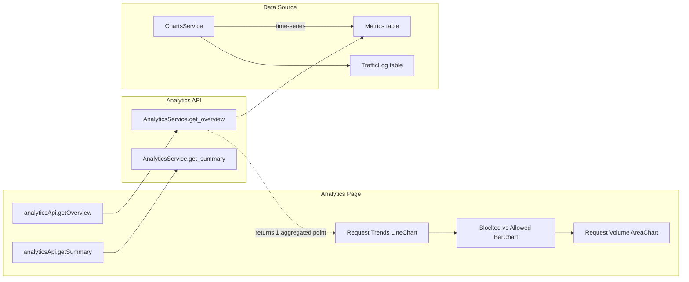

# Analytics Charts Integration Plan

## Current State

The Analytics page at [frontend/app/analytics/page.tsx](frontend/app/analytics/page.tsx) already has all 3 chart components:

1. **Request Trends** - LineChart with `time`, `requests`, `blocked`, `allowed`
2. **Blocked vs Allowed** - BarChart with `time`, `blocked`, `allowed`
3. **Request Volume Over Time** - AreaChart with `time`, `requests`

They consume `analyticsData` from `analyticsApi.getOverview(timeRange)`. The charts render empty because:

- **Backend** `AnalyticsService.get_overview()` returns a single aggregated object with `total_requests`, `blocked_requests`, `threats` - not a time-series
- **Field mismatch**: Backend returns `total_requests` / `blocked_requests`; frontend expects `requests` / `blocked` / `allowed`
- **Single point**: Charts need multiple time buckets; overview returns only one

## Data Flow

## Implementation Plan

### 1. Backend: Fix Analytics Overview to Return Time-Series

**File:** [backend/services/analytics_service.py](backend/services/analytics_service.py)

- Change `get_overview()` to return time-series data (multiple points) instead of a single aggregated object
- Reuse the same aggregation logic as [backend/services/charts_service.py](backend/services/charts_service.py) `get_requests_chart_data()`: group by hour from Metrics or TrafficLog
- Return shape: `[{ "time": "...", "requests": n, "blocked": n, "allowed": n }, ...]` (matching `ChartDataPoint`)
- Use `strftime` for SQLite; add `date_trunc` / `to_char` fallback for PostgreSQL if needed

### 2. Backend: Align Summary Fields

**File:** [backend/services/analytics_service.py](backend/services/analytics_service.py)

- Add `attack_rate` to `get_summary()` return (alias for `block_rate`) so the frontend metric card "Attack Rate" displays correctly

### 3. Frontend: Add Fallback Data Sources

**File:** [frontend/app/analytics/page.tsx](frontend/app/analytics/page.tsx)

- When `analyticsApi.getOverview()` returns empty or fails, fall back to `chartsApi.getRequests(timeRange)` (same structure: `time`, `requests`, `blocked`, `allowed`)
- When `analyticsApi.getSummary()` returns empty, derive summary from overview/requests data: `{ total_requests, blocked_requests, allowed_requests, attack_rate }`

### 4. Frontend: Time Formatting and Empty States

**File:** [frontend/app/analytics/page.tsx](frontend/app/analytics/page.tsx)

- Format x-axis labels (e.g. `formatTimeIST` or short date/time) so timestamps are readable
- Add empty-state UI for each chart when `analyticsData.length === 0`: centered message "No data available" and "Waiting for traffic data..."
- Ensure charts still render with empty data (Recharts handles `data={[]}` but a friendly message improves UX)

### 5. Frontend: Apply Positivus Theme

**File:** [frontend/app/analytics/page.tsx](frontend/app/analytics/page.tsx)

- Replace `var(--border)` and `var(--muted-foreground)` with Positivus tokens: `var(--positivus-gray)`, `var(--positivus-gray-dark)`, `var(--positivus-black)`
- Use `var(--positivus-green)` for allowed/positive series; red/orange for blocked
- Add `fontFamily: 'var(--font-space-grotesk)'` to headings
- Match card styling from dashboard: `border-2 border-[var(--positivus-gray)]`

## Key Code References

- Charts service aggregation: [backend/services/charts_service.py](backend/services/charts_service.py) lines 22-63 (`get_requests_chart_data`)
- Time range parsing: [backend/core/time_range.py](backend/core/time_range.py)
- Chart structure from dashboard: [frontend/components/charts-section.tsx](frontend/components/charts-section.tsx) AreaChart / BarChart usage

## Files to Modify

| File                                    | Changes                                                                      |
| --------------------------------------- | ---------------------------------------------------------------------------- |
| `backend/services/analytics_service.py` | Rewrite `get_overview()` to return time-series; add `attack_rate` to summary |
| `frontend/app/analytics/page.tsx`       | Fallback to chartsApi; time formatting; empty states; Positivus theme        |

## Out of Scope

- PostgreSQL date functions (strftime works for SQLite; DB is SQLite by default)
- New API endpoints (existing endpoints suffice)
- Attack Type Distribution chart (already conditional; depends on summary threat data)

