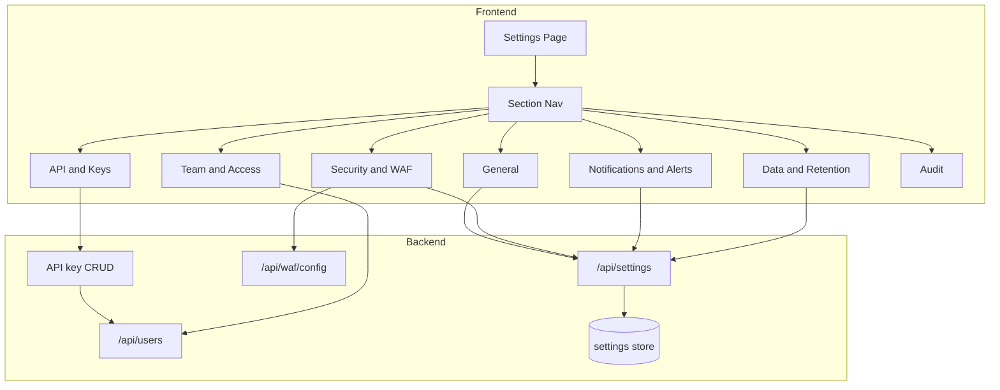

# End-to-end B2B SaaS settings (enterprise-style hub)

## Current state

- **Settings page** ([frontend/app/settings/page.tsx](frontend/app/settings/page.tsx)): Single column of cards (Theme, Notifications, Auto Block, Email Alerts, API Key “View Keys”) with local state only; no persistence, no backend calls. “Save Settings” does nothing.
- **Backend**: No settings/preferences API. WAF config exists at GET/PUT [backend/routes/waf.py](backend/routes/waf.py) (`/api/waf/config`). Users have `api_keys` JSON in [backend/models/users.py](backend/models/users.py) but no create/revoke API. Server config (retention, etc.) lives in [backend/config.py](backend/config.py) and YAML; not exposed for UI editing.
- **Feature pages** already exist and are linked from the sidebar: Geo Rules, IP Management, Bot Detection, Threat Intel, Security Rules, Users, Audit Logs. They are the right place for detailed configuration; Settings should act as a hub and centralize account-level toggles.

## Target experience

A single **Settings** entry point that feels like an enterprise WAF/security dashboard:

- **Sectioned layout**: Left sidebar (or top tabs) for categories; main area shows the selected section.
- **General**: Theme, default time range; persisted where possible.
- **Security and WAF**: WAF threshold and “fail open” behavior (wired to existing APIs), auto-block default, and short cards/links to “Manage” Security Rules, Geo Rules, IP Management, Bot Detection, Threat Intel.
- **Notifications and Alerts**: Toggles for notifications and email alerts; severity filters; optional channel placeholders (e.g. webhook URL); persisted.
- **API and Keys**: List current user’s API keys, Create key, Revoke key; backed by real API key CRUD.
- **Team and Access**: Short description of roles (Admin, Operator, Viewer) and a link to the existing Users page.
- **Data and Retention**: Read (and optionally edit) retention days for metrics, traffic, alerts, threats; backed by config or a small settings API.
- **Audit**: Link to Audit Logs and optional retention note.

All toggles and options that affect behavior should persist (backend or, as fallback, documented localStorage) and “Save” should commit changes and show success/error.

## Architecture

## Implementation plan

### 1. Backend: Settings / preferences API

- Add a **settings store**: Either a new table (e.g. `account_settings`: `key` string, `value` JSON/text, optional `scope` for future multi-tenant) or a single row/key-value table. For single-tenant B2B, one global scope is enough.
- Add **GET /api/settings** (and optionally **GET /api/settings/me** for user-scoped preferences) returning a JSON object of keys (e.g. `notifications`, `email_alerts`, `auto_block_threats`, `default_time_range`, `retention_*` if editable).
- Add **PUT /api/settings** (or PATCH) accepting a JSON body to update one or more keys; validate and persist, then return updated settings. Optionally audit log config changes via existing audit middleware.
- Register the router in [backend/main.py](backend/main.py). Add a minimal controller and route module (e.g. `backend/routes/settings.py`, `backend/controllers/settings.py` or inline in route).

### 2. Backend: API key CRUD

- **GET /api/users/me/keys** (or **GET /api/settings/api-keys**): Return list of API key metadata (name, last used, created) for the current user; do not return full secret after creation.
- **POST /api/users/me/keys** (or **POST /api/settings/api-keys**): Body `{ "name": "optional label" }`. Generate a secure token, store a hash (or opaque id) in `User.api_keys` JSON, return the plain key once in the response (e.g. `{ "key": "waf_...", "name": "...", "created_at": "..." }`).
- **DELETE /api/users/me/keys/:id** (or **DELETE /api/settings/api-keys/:id**): Revoke one key by id (remove from `User.api_keys`). Require auth (session or API key).
- Use existing auth (e.g. JWT/session from [backend/auth.py](backend/auth.py)) to resolve current user; ensure only that user’s keys are listed/created/revoked.

### 3. Backend: Data retention (read and optional write)

- Add **GET /api/settings/retention** returning `{ metrics_days, traffic_days, alerts_days, threats_days }` from [backend/config.py](backend/config.py) (read-only from env/YAML for now).
- Optional: **PUT /api/settings/retention** to update retention (only if you introduce a DB or file-backed override; otherwise keep read-only and document that retention is set via env/config).

### 4. Frontend: Settings hub layout and navigation

- Refactor [frontend/app/settings/page.tsx](frontend/app/settings/page.tsx) into a **sectioned layout**:
  - Left sidebar (desktop) or top tabs (mobile-friendly): General, Security and WAF, Notifications and Alerts, API and Keys, Team and Access, Data and Retention, Audit.
  - Main content area renders one section at a time (e.g. via `?section=general` or client-side state). Use existing UI primitives (e.g. [frontend/components/ui/tabs.tsx](frontend/components/ui/tabs.tsx) or a list of buttons with active state).
- Keep **Header** (e.g. “Settings” + subtitle) and optional **Save / Cancel** at section or page level that submit the current section’s form and call the settings API.

### 5. Frontend: Section contents

- **General**: Theme selector (existing); default time range dropdown (e.g. 1h, 24h, 7d). Load/save via GET/PUT settings API (keys like `theme`, `default_time_range`). If settings API is not ready, keep theme client-only and document that default time range will persist once API exists.
- **Security and WAF**: 
  - Card for WAF: fetch [wafApi.getConfig](frontend/lib/api.ts); slider or input for threshold; “Fail open” toggle if you add it to WAF config API. Save via `wafApi.updateConfig(threshold)`.
  - Card “Auto block threats” toggle: load/save from settings API (`auto_block_threats`).
  - One card per area with title and “Manage” link: Security Rules → `/security-rules`, Geo Rules → `/geo-rules`, IP Management → `/ip-management`, Bot Detection → `/bot-detection`, Threat Intel → `/threat-intelligence`.
- **Notifications and Alerts**: Toggles for “Notifications” and “Email alerts”; optional severity checkboxes (e.g. critical, high). Load/save via settings API. Optional: placeholder field for “Webhook URL” or “Slack URL” (can be stored in settings JSON and shown in UI even if not used by backend yet).
- **API and Keys**: List of keys (name, created, last used if available) from new GET keys endpoint; “Create API key” button (calls POST, shows modal with copyable key once); “Revoke” per key (calls DELETE). Replace current “View Keys” with this.
- **Team and Access**: Short copy on Admin / Operator / Viewer; link “Manage users” → `/users`.
- **Data and Retention**: Display retention days from GET retention API; if you add PUT, show inputs and Save.
- **Audit**: Link to “View audit logs” → `/audit-logs`; optional note on retention.

### 6. Frontend: API layer and persistence

- In [frontend/lib/api.ts](frontend/lib/api.ts): Add `settingsApi.get()`, `settingsApi.update(payload)`, `settingsApi.getRetention()`, and (if implemented) `settingsApi.updateRetention(payload)`. Add `apiKeysApi.list()`, `apiKeysApi.create({ name })`, `apiKeysApi.revoke(id)` (or under users API). Use existing `apiRequest` and error handling.
- On Save in each section (or one global Save): call the appropriate update endpoints; show success toast or inline message; on error show error message. Avoid leaving users with the impression that toggles are persisted when they are not.

### 7. Optional: Fail open and WAF config

- If desired, extend WAF config API to include `fail_open` (and any other flags in [backend/config.py](backend/config.py)) so the Security and WAF section can display and toggle it. This may require config override storage (e.g. in settings table or a small config table) so the running app reads it.

## Files to add or touch

| Area     | File                                                             | Change                                                                           |
| -------- | ---------------------------------------------------------------- | -------------------------------------------------------------------------------- |
| Backend  | New: `backend/models/settings.py` (optional)                     | Key-value or JSON model for account settings.                                    |
| Backend  | New: `backend/routes/settings.py`                                | GET/PUT settings; GET (and optional PUT) retention; mount under `/api/settings`. |
| Backend  | New: `backend/controllers/settings.py` (or inline)               | Logic for reading/writing settings and retention.                                |
| Backend  | `backend/routes/users.py` or new `backend/routes/api_keys.py`    | GET/POST/DELETE for current user’s API keys.                                     |
| Backend  | `backend/main.py`                                                | Include settings router; register API key routes if in a separate module.        |
| Frontend | [frontend/app/settings/page.tsx](frontend/app/settings/page.tsx) | Sectioned layout, nav, all section content, wire to APIs.                        |
| Frontend | [frontend/lib/api.ts](frontend/lib/api.ts)                       | settingsApi and API key client methods.                                          |

## Out of scope (for later)

- Multi-tenancy / organizations / “zones” (single-tenant B2B only for this plan).
- Actual email or webhook delivery (only store and show preferences).
- 2FA, SSO, or billing (no Cloudflare name or branding).
- Changing behavior of WAF middleware based on “auto block” toggle (can be a follow-up: e.g. middleware reads from settings store or config).

## Testing

- Change theme and (once API exists) other toggles, save, reload page and confirm values.
- Create and revoke an API key; confirm list updates and key is no longer valid after revoke.
- Open each “Manage” link and confirm it goes to the correct feature page.
- Call GET/PUT settings and retention from the frontend and verify backend persistence and audit (if applicable).

