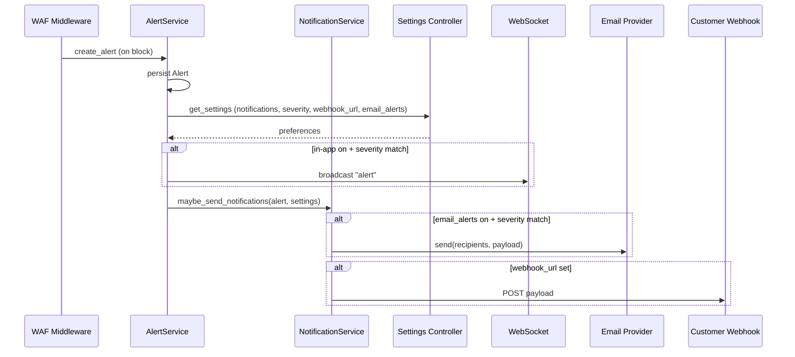

# B2B SaaS WAF Notifications – Complete Plan

## Why notifications are not working today

- **Alerts are never created on WAF block.** [backend/middleware/waf_middleware.py](backend/middleware/waf_middleware.py) creates traffic logs and threat records and broadcasts `traffic` and `threat`, but it never calls `AlertService.create_alert()` or broadcasts `alert`. The frontend [frontend/components/alerts-section.tsx](frontend/components/alerts-section.tsx) and WebSocket subscribe to `alert`, so the list stays empty.
- **Settings are not wired.** Backend exposes GET/PUT [backend/routes/settings.py](backend/routes/settings.py) with `notifications`, `email_alerts`, `alert_severity_*`, `webhook_url`, but [frontend/app/settings/page.tsx](frontend/app/settings/page.tsx) uses only local state; it does not load or save settings, so "Save Settings" has no effect.
- **No outbound delivery.** There is no email sending or webhook POST. [backend/controllers/settings.py](backend/controllers/settings.py) stores preferences but nothing consumes them when an alert is created.
- **Header notification bell is static.** [frontend/components/header.tsx](frontend/components/header.tsx) shows a bell with a hardcoded red dot; no dropdown, no count, no link to alerts.

---

## Target behavior (enterprise-style WAF notifications)

- **In-app:** When the WAF blocks a request (and optionally on other security events), create an Alert, broadcast it over WebSocket so the dashboard and notification center update in real time. Users see a notification center (bell) with recent alerts, unread count, and quick actions (dismiss, view all).
- **Preferences:** One place (Settings → Notifications and Alerts) to enable/disable in-app notifications, email alerts, and webhook; choose which severities to notify (e.g. critical only, or critical + high). All persisted via existing settings API.
- **Email:** If "Email alerts" is on and severity matches, send an email to configured recipients (e.g. account admins or a dedicated list). Optional: rate limiting or digest to avoid spam.
- **Webhook:** If a webhook URL is configured, POST a JSON payload for each alert (or batched) so customers can integrate with Slack, PagerDuty, or internal systems. Optional: retries and a simple delivery log.

---

## Architecture (high level)

---

## Implementation plan

### 1. Create alerts from WAF blocks and broadcast

- **Where:** [backend/middleware/waf_middleware.py](backend/middleware/waf_middleware.py), inside `_store_traffic_log_async` → `store_traffic()`, after creating the threat (when `result.get('is_anomaly', False)`).
- **What:**
  - Inject `AlertService` (or get a DB session and instantiate it in the same thread that already has `SessionLocal()`).
  - Map threat severity/type to `AlertType` (e.g. critical/high → `critical`, medium → `warning`, low → `info`) and `AlertSeverity`; build a short `title` and `description` from path, IP, threat type, score.
  - Call `alert_service.create_alert(...)` with `source="waf"`, `related_ip`, `related_endpoint`, and optionally `related_threat_id` from the newly created threat.
  - After creating the alert, call `broadcast_update_sync("alert", alert.to_dict())` so existing WebSocket subscribers (e.g. [frontend/components/alerts-section.tsx](frontend/components/alerts-section.tsx)) receive it.
- **Optional:** Respect account-level "notifications" and severity filters here: load settings in this flow (e.g. via a small helper that reads from `AccountSetting` or a cached settings facade). Only create the alert (and broadcast) if `notifications` is true and the alert’s severity is in the allowed set (`alert_severity_critical`, `alert_severity_high`, `alert_severity_medium`). If you prefer simplicity first, create and broadcast every WAF-block alert and add filtering in a later step.

### 2. Notification delivery service (backend)

- **New module:** e.g. `backend/services/notification_service.py`.
- **Responsibilities:**
  - **Input:** An `Alert` (or its dict), and current account settings (from [backend/controllers/settings.py](backend/controllers/settings.py) `get_settings(db)` or a passed-in dict).
  - **Logic:**
    - If `notifications` is false, skip all delivery (or only skip outbound; in-app is already done by step 1).
    - If alert severity is not in the enabled severity flags, skip email and webhook.
    - **Email:** If `email_alerts` is true and severity matches, determine recipients (see below), build a plain-text or HTML body (title, description, time, link to dashboard if you have a base URL), and call an email sender.
    - **Webhook:** If `webhook_url` is non-empty, POST a JSON body (e.g. `{ "event": "waf.alert", "alert": alert.to_dict(), "timestamp": "..." }`) to that URL. Use a short timeout (e.g. 5s) and optionally 1–2 retries with backoff. Do not block the request path too long; run in the same background thread as traffic logging or enqueue to a small in-process queue.
- **Email sender:** Add a thin abstraction (e.g. `backend/services/email_sender.py`) that uses SMTP (from config: `SMTP_HOST`, `SMTP_PORT`, `SMTP_USER`, `SMTP_PASSWORD`, `ALERT_FROM_EMAIL`) or a transactional API. If no provider is configured, no-op and log. Recipients: either a new setting `alert_emails` (list of emails) or derive from users with role Admin (using [backend/models/users.py](backend/models/users.py) `User.email`). Prefer one configurable list (e.g. `alert_emails` in settings) for simplicity.
- **Invocation:** From the same place where you create the alert (inside `store_traffic()`), after `broadcast_update_sync("alert", ...)`, call the notification service (e.g. `notification_service.maybe_send_notifications(db, alert, settings)`). Pass the same DB session so it can read settings and optionally log delivery. Keep this call in the background thread so it doesn’t block the request.

### 3. Settings: persistence and Notifications UI

- **Backend:** Already has GET/PUT and [backend/controllers/settings.py](backend/controllers/settings.py) with `notifications`, `email_alerts`, `alert_severity_critical`, `alert_severity_high`, `alert_severity_medium`, `webhook_url`. Add `alert_emails` (string: comma-separated emails, or JSON array) to `ALLOWED_KEYS` and `DEFAULTS` if you use it for email recipients.
- **Frontend:** [frontend/app/settings/page.tsx](frontend/app/settings/page.tsx)
  - Add a settings API in [frontend/lib/api.ts](frontend/lib/api.ts): `settingsApi.get()` → GET `/api/settings`, `settingsApi.update(payload)` → PUT `/api/settings`.
  - On mount, call `settingsApi.get()` and set state for theme, notifications, email alerts, auto block, and (in the Notifications section) severity checkboxes and webhook URL. Map response keys to existing/local state.
  - "Save Settings" should call `settingsApi.update({ theme, notifications, email_alerts, auto_block_threats, alert_severity_critical, alert_severity_high, alert_severity_medium, webhook_url })` and then show success/error (toast or inline). Optionally persist theme to the backend as well so it’s consistent across devices.
  - In the Notifications and Alerts section (or current single column), add:
    - Toggles: Notifications (in-app), Email alerts (already present; wire to API).
    - Checkboxes: "Critical", "High", "Medium" (map to `alert_severity_*`).
    - Optional: "Webhook URL" input and "Alert recipient emails" (if you add `alert_emails`).

This makes notifications "work" in the sense that preferences are saved and used by the backend when creating and delivering alerts.

### 4. Notification center (header bell)

- **Component:** Build a small notification center (e.g. `frontend/components/notification-center.tsx` or inline in [frontend/components/header.tsx](frontend/components/header.tsx)).
  - Trigger: click on the bell in [frontend/components/header.tsx](frontend/components/header.tsx). Show a dropdown (or popover) that lists the last N alerts (e.g. 10), with title, severity, time, and "Dismiss" or "View all".
  - Data: use `alertsApi.getActive()` on open and optionally subscribe to `wsManager.subscribe('alert', ...)` to append new alerts in real time. Unread count = count of active non-dismissed alerts (or a dedicated "unread" flag if you add it later).
  - Badge: replace the static red dot with the actual count of active (or unread) alerts; hide when 0.
  - "View all" link: navigate to the existing alerts/dashboard view where [frontend/components/alerts-section.tsx](frontend/components/alerts-section.tsx) is shown, or a dedicated `/alerts` page if you have one.
- **Header:** Replace the current bell button with the new notification center component so the bell opens the dropdown and shows the count.

### 5. Optional: notification delivery log and rate limiting

- **Delivery log:** Optional table `notification_deliveries` (e.g. `alert_id`, `channel` enum: email | webhook, `recipient`/`url`, `status`: sent | failed, `error_message`, `created_at`) for audit and debugging. The notification service can insert a row per attempt. No UI required in the first iteration.
- **Rate limiting:** For email, optionally cap the number of emails per severity per hour (e.g. max 10 critical per hour) or send a digest every N minutes. This can be a follow-up to avoid spam.

### 6. Configuration and env

- **Backend:** Document (e.g. in `.env.example`) SMTP or transactional email vars and optional `ALERT_FROM_EMAIL`, `DASHBOARD_BASE_URL` (for links in emails). If SMTP is not set, email delivery is no-op.
- **Frontend:** No new env vars required for the notification center; it uses existing `NEXT_PUBLIC_API_URL` and WebSocket URL.

---

## File-level summary

| Area                       | Files to add or change                                                                                                                                                                                                        |
| -------------------------- | ----------------------------------------------------------------------------------------------------------------------------------------------------------------------------------------------------------------------------- |
| Alert creation + broadcast | [backend/middleware/waf_middleware.py](backend/middleware/waf_middleware.py): in `store_traffic()`, add AlertService, create_alert, broadcast "alert"; optionally load settings and filter by severity.                       |
| Notification delivery      | New: `backend/services/notification_service.py`; new (or minimal): `backend/services/email_sender.py`. Config: SMTP (or similar) in backend config / .env.example.                                                            |
| Settings backend           | [backend/controllers/settings.py](backend/controllers/settings.py): add `alert_emails` if you want configurable recipients.                                                                                                   |
| Settings frontend          | [frontend/app/settings/page.tsx](frontend/app/settings/page.tsx): load/save via API; add severity checkboxes and webhook URL. [frontend/lib/api.ts](frontend/lib/api.ts): add `settingsApi.get()` and `settingsApi.update()`. |
| Notification center        | New: `frontend/components/notification-center.tsx` (or integrate into header). [frontend/components/header.tsx](frontend/components/header.tsx): use new component for bell, show count and dropdown.                         |

---

## Order of implementation

1. **Backend: create alert + broadcast** – So in-app alerts and AlertsSection start showing WAF blocks immediately.
2. **Frontend: settings load/save** – So notification toggles and severity/webhook are persisted and later used by the backend.
3. **Backend: notification service** – Email + webhook using settings; invoke from the same place that creates the alert.
4. **Frontend: notification center** – Bell dropdown, count, and "View all" so the product feels complete.
5. **Optional:** Delivery log, rate limiting, and `alert_emails` in settings.

This plan gives you a full B2B SaaS-style WAF notification flow: in-app alerts from real WAF events, a working notification center, persisted preferences, and optional email and webhook delivery—without referencing any third-party vendor by name.