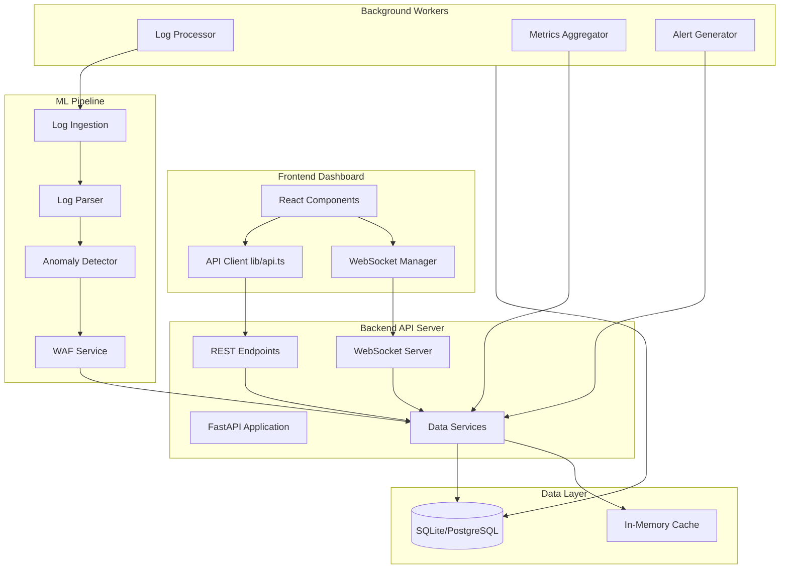

# Complete Backend-Frontend Integration Plan

## Overview

The frontend dashboard (`frontend/lib/api.ts`) expects a comprehensive REST API and WebSocket server, but the backend only has a basic WAF service (`src/integration/waf_service.py`) with minimal endpoints. This plan implements a complete backend API layer that integrates with the existing ML pipeline, provides data persistence, and delivers real-time updates to the frontend.

## Current State Analysis

### Frontend (✅ Ready)

- API client defined in `frontend/lib/api.ts` with all endpoint interfaces
- Components expect real-time data via REST API and WebSocket
- TypeScript interfaces defined for all data types
- WebSocket manager implemented for real-time updates

### Backend (⚠️ Partial)

- WAF service exists with basic endpoints: `/check`, `/health`, `/metrics`, `/update-threshold`, `/config`
- ML pipeline fully functional: ingestion → parsing → tokenization → model inference
- Log parsing produces `HTTPRequest` objects
- No database/persistence layer
- No comprehensive REST API matching frontend expectations
- No WebSocket server for real-time updates
- No data aggregation services

### Data Flow Gap

- Logs are parsed but not stored or aggregated
- Model inference happens but results aren't tracked over time
- No historical data for charts/analytics
- No alert generation from detections

## Architecture



## Implementation Plan

### Phase 1: Database Layer & Models

**Files to Create:**

- `src/api/database.py` - Database connection, session management, SQLAlchemy setup
- `src/api/models/__init__.py` - Models package initialization
- `src/api/models/metrics.py` - Metrics table (real-time and historical)
- `src/api/models/alerts.py` - Alerts table (active and historical)
- `src/api/models/traffic.py` - Traffic logs table
- `src/api/models/threats.py` - Detected threats table
- `src/api/models/security.py` - Security checks table
- `src/api/models/activities.py` - Activity log table

**Key Features:**

- SQLite for development, PostgreSQL for production
- SQLAlchemy ORM with proper relationships
- Timestamp indexing for time-range queries
- Data retention policies (auto-cleanup old data)

### Phase 2: FastAPI Server Infrastructure

**Files to Create:**

- `src/api/main.py` - FastAPI application entry point with CORS, middleware
- `src/api/config.py` - Configuration management (database URL, API settings)
- `src/api/dependencies.py` - Dependency injection (database sessions, WAF service)
- `src/api/middleware.py` - Request logging, error handling middleware

**Key Features:**

- CORS enabled for frontend
- Request/response logging
- Error handling with proper HTTP status codes
- Health check endpoints
- API versioning

### Phase 3: REST API Endpoints

**Files to Create:**

- `src/api/routes/__init__.py` - Routes package
- `src/api/routes/metrics.py` - `/api/metrics/realtime`, `/api/metrics/historical`
- `src/api/routes/alerts.py` - `/api/alerts/active`, `/api/alerts/history`, `/api/alerts/{id}/dismiss`, `/api/alerts/{id}/acknowledge`
- `src/api/routes/activities.py` - `/api/activities/recent`, `/api/activities`
- `src/api/routes/charts.py` - `/api/charts/requests`, `/api/charts/threats`, `/api/charts/performance`
- `src/api/routes/traffic.py` - `/api/traffic/recent`, `/api/traffic`, `/api/traffic/endpoint/{endpoint}`
- `src/api/routes/threats.py` - `/api/threats/recent`, `/api/threats`, `/api/threats/type/{type}`, `/api/threats/stats`
- `src/api/routes/security.py` - `/api/security/checks`, `/api/security/checks/{id}/run`, `/api/security/compliance-score`
- `src/api/routes/analytics.py` - `/api/analytics/overview`, `/api/analytics/trends/{metric}`, `/api/analytics/summary`

**Endpoint Specifications:**

- All endpoints match frontend expectations from `frontend/lib/api.ts`
- Support time-range queries (`?range=24h`, `?range=7d`, etc.)
- Pagination for large datasets
- Proper error responses matching frontend error handling

### Phase 4: WebSocket Server

**Files to Create:**

- `src/api/websocket.py` - WebSocket connection manager and broadcasting
- `src/api/websocket_manager.py` - Connection pool management

**Key Features:**

- Real-time broadcasting for:
  - Metrics updates (every 1-5 seconds)
  - New alerts (immediate)
  - Traffic activity (batched every 2 seconds)
  - Threat detections (immediate)
  - Activity feed updates (batched)
- Connection heartbeat/ping-pong
- Automatic reconnection handling
- Message queuing for disconnected clients

### Phase 5: Data Collection Services

**Files to Create:**

- `src/api/services/__init__.py` - Services package
- `src/api/services/metrics_service.py` - Aggregate metrics from logs and model inference
- `src/api/services/alert_service.py` - Generate alerts from anomaly detections
- `src/api/services/traffic_service.py` - Process and store traffic logs
- `src/api/services/threat_service.py` - Process threat detections and classifications
- `src/api/services/security_service.py` - Run security compliance checks
- `src/api/services/analytics_service.py` - Generate analytics and trend data
- `src/api/services/websocket_service.py` - Broadcast updates via WebSocket

**Service Responsibilities:**

- **Metrics Service**: Aggregate request counts, block rates, response times, CPU/memory from system
- **Alert Service**: Create alerts from high anomaly scores, threshold breaches, system issues
- **Traffic Service**: Store parsed HTTPRequest objects, track endpoints, IPs, methods
- **Threat Service**: Classify threats (SQL injection, XSS, DDoS, etc.), track severity
- **Security Service**: Run compliance checks (model health, threshold settings, system status)
- **Analytics Service**: Calculate trends, generate chart data points, summary statistics

### Phase 6: Background Workers

**Files to Create:**

- `src/api/tasks/__init__.py` - Background tasks package
- `src/api/tasks/log_processor.py` - Process logs from ingestion system
- `src/api/tasks/metrics_aggregator.py` - Aggregate metrics periodically
- `src/api/tasks/alert_processor.py` - Process and escalate alerts
- `src/api/tasks/data_cleanup.py` - Archive/delete old data

**Worker Responsibilities:**

- **Log Processor**: Read from log ingestion queue, parse, check with model, store results
- **Metrics Aggregator**: Calculate aggregated metrics every minute, store in database
- **Alert Processor**: Check for alert conditions, create alerts, trigger notifications
- **Data Cleanup**: Remove data older than retention period (configurable)

### Phase 7: ML Pipeline Integration

**Integration Points:**

- Connect `LogIngestionSystem` to log processor worker
- Use `ParsingPipeline` to parse logs into `HTTPRequest` objects
- Feed parsed requests to `WAFService.check_request()` for anomaly detection
- Store detection results in database
- Generate alerts from high-scoring anomalies
- Track model performance metrics

**Files to Modify:**

- `src/integration/waf_service.py` - Add hooks for metrics collection
- Create integration layer in `src/api/services/waf_integration.py`

### Phase 8: Configuration & Startup

**Files to Create/Modify:**

- `config/config.yaml` - Add API server configuration section
- `src/api/startup.py` - Application startup/shutdown handlers
- `scripts/start_api_server.py` - API server startup script
- Update `docker-compose.yml` - Add API server service

**Configuration Sections:**

```yaml
api_server:
  host: "0.0.0.0"
  port: 3001
  workers: 4
  database:
    url: "sqlite:///./data/waf_dashboard.db"  # or PostgreSQL
  websocket:
    enabled: true
    ping_interval: 30
  data_retention:
    metrics_days: 30
    traffic_days: 7
    alerts_days: 90
```

### Phase 9: Frontend Integration Verification

**Tasks:**

- Verify all API endpoints match frontend expectations
- Test WebSocket connections and real-time updates
- Ensure data types match TypeScript interfaces
- Test error handling and loading states
- Verify time-range queries work correctly
- Test pagination for large datasets

### Phase 10: Remove Mock Data

**Files to Review:**

- `frontend/components/metrics-overview.tsx` - Remove hardcoded initial values
- `frontend/app/threats/page.tsx` - Remove hardcoded "Blocked Today" value
- Any remaining placeholder data

**Verification:**

- All components fetch from real API
- No mock data in components
- All data comes from backend database

## Data Flow

1. **Log Ingestion**: Log files → `LogIngestionSystem` → Queue
2. **Log Processing**: Queue → `LogProcessor` worker → Parse → Model Check → Store
3. **Metrics Collection**: Model results + System stats → `MetricsService` → Database
4. **Alert Generation**: Anomaly scores → `AlertService` → Database + WebSocket broadcast
5. **API Requests**: Frontend → REST API → Database queries → Response
6. **Real-time Updates**: Background services → WebSocket broadcast → Frontend

## Key Integration Points

### Existing Components to Leverage

- `src/integration/waf_service.py` - WAFService class for anomaly detection
- `src/ingestion/ingestion.py` - LogIngestionSystem for log reading
- `src/parsing/pipeline.py` - ParsingPipeline for log parsing
- `src/model/anomaly_detector.py` - AnomalyDetector for model inference
- `src/model/scoring.py` - AnomalyScorer for scoring requests

### New Components to Create

- Complete API server infrastructure
- Database models and persistence
- Data aggregation services
- WebSocket broadcasting
- Background workers

## Testing Strategy

1. **Unit Tests**: Test each service independently
2. **Integration Tests**: Test API endpoints with test database
3. **End-to-End Tests**: Test full flow from log ingestion to frontend display
4. **WebSocket Tests**: Test real-time update delivery
5. **Performance Tests**: Test with high log volume

## Deployment Considerations

- Database migrations for schema changes
- Environment variables for configuration
- Docker Compose for local development
- Health checks for monitoring
- Logging for debugging
- Rate limiting for API protection

## Success Criteria

- All frontend API calls return real data
- WebSocket provides real-time updates
- Historical data available for charts
- Alerts generated from real detections
- No mock/hardcoded data in frontend
- Dashboard displays live WAF metrics
- Performance acceptable (< 200ms API response time)