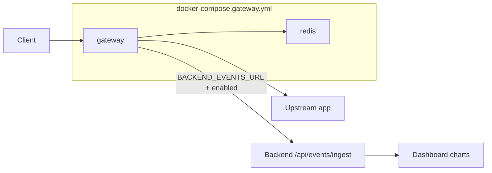

# DDoS and Rate Limit Integration Fixes

## Problem summary

- **Event reporting off by default**: `BACKEND_EVENTS_ENABLED` defaults to `false`, so the dashboard shows no rate-limit/DDoS data unless manually enabled.
- **No Redis in deployment**: No compose file exists; docs reference `docker-compose.gateway.yml`, so Redis is not started and rate limit/DDoS are disabled at runtime.
- **Minimal event payload**: Gateway sends only `event_type`, `ip`, `method`, `path`, `decision`, `anomaly_score`; backend supports `retry_after`, `content_length`, `max_bytes`, `block_duration_seconds` but receives them empty.

## Approach

1. Default event reporting to **on** when `BACKEND_EVENTS_URL` is set (or change default to true and keep URL check in sender).
2. **Enrich** the payload sent to `/api/events/ingest` with `retry_after`, `block_duration_seconds`, `content_length`, `max_bytes` where applicable.
3. Add **Docker Compose** so Redis + gateway (and optionally backend) run together and rate limit/DDoS/events work without manual Redis setup.
4. Update **.env.example** and **docs** so the “full stack” path is clear.

---

## 1. Default event reporting when URL is set

**File**: [gateway/config.py](gateway/config.py)

- Change `BACKEND_EVENTS_ENABLED` default from `"false"` to `"true"`.
- Sending in [gateway/events.py](gateway/events.py) already requires a non-empty `BACKEND_EVENTS_URL` before POSTing, so:
  - If only `BACKEND_EVENTS_URL` is set → events are sent.
  - If operators want to disable reporting they set `BACKEND_EVENTS_ENABLED=false`.

**File**: [.env.example](.env.example)

- Set `BACKEND_EVENTS_ENABLED=true` in the “Event reporting” section so copy-paste gives working dashboard metrics when backend URL is set.

---

## 2. Enrich gateway event payload for backend ingest

**File**: [gateway/main.py](gateway/main.py)

- Extend `_log_gateway_event` with optional kwargs: `retry_after_seconds`, `block_duration_seconds`, `content_length`, `max_bytes` (or a single `event_details: dict`). Pass these into the existing `report_event({...})` call so the payload matches [backend/routes/events.py](backend/routes/events.py) `IngestEvent`: `retry_after`, `content_length`, `max_bytes`, `block_duration_seconds`.
- At each block site, pass the known values:
  - **rate_limit**: `retry_after_seconds` from `rate_limiter.is_allowed` (already available as `retry_after`).
  - **ddos_size**: `content_length` from request header (or 0), `max_bytes` from `gateway_config.DDOS_MAX_BODY_BYTES`.
  - **ddos_blocked**: `block_ttl_seconds` or `retry_after_seconds` from `ttl` returned by `ddos.is_blocked`.
  - **ddos_burst**: `block_duration_seconds` from `gateway_config.DDOS_BLOCK_DURATION_SECONDS`.

No backend API change required; `IngestEvent` already has these optional fields.

---

## 3. Docker Compose with Redis and gateway

Add a compose file so Redis and the gateway run together. The docs reference `docker-compose.gateway.yml`; implement that file.

**New file**: `docker-compose.gateway.yml` (project root)

- **Services**:
  - **redis**: image `redis:7-alpine`, port 6379, no persistent volume required for dev (optional volume for persistence can be documented).
  - **gateway**: build from [gateway/Dockerfile](gateway/Dockerfile), context project root (Dockerfile expects `COPY gateway/`, `COPY backend/`, etc.). Environment: `REDIS_URL=redis://redis:6379`, `UPSTREAM_URL` (e.g. `http://host.docker.internal:3000` or a placeholder), `BACKEND_EVENTS_URL` (e.g. `http://host.docker.internal:3001/api/events/ingest` when backend runs on host), `BACKEND_EVENTS_ENABLED=true`, and existing gateway env vars from .env.example. Expose port 8080. Depends on `redis`.
- Use `context: .` and `dockerfile: gateway/Dockerfile` so the existing Dockerfile works.

Optional: add a second compose file or profile that also starts **backend** (and optionally **frontend**) so “full stack” (Redis + gateway + backend + dashboard) runs with one command. If scope is kept minimal, only `docker-compose.gateway.yml` (Redis + gateway) is required; docs can describe how to point `BACKEND_EVENTS_URL` at a separately run backend.

---

## 4. Documentation and .env.example

- **[docs/rate-limiting.md](docs/rate-limiting.md)** and **[docs/ddos-protection.md](docs/ddos-protection.md)**: State that with the new compose file, run `docker compose -f docker-compose.gateway.yml up -d` and ensure `REDIS_URL` and (for dashboard) `BACKEND_EVENTS_URL` + `BACKEND_EVENTS_ENABLED=true` are set. Mention that rate limit and DDoS are disabled if Redis is unavailable (fail-open).
- **[.env.example](.env.example)**: Already has `BACKEND_EVENTS_URL` and Redis; set `BACKEND_EVENTS_ENABLED=true` and add a short comment that events are sent when both URL and this flag are set (and that default is now true).
- **README or docs/README.md**: Add one line under “Rate Limiting & DDoS” pointing to the new compose file for running gateway + Redis.

---

## Flow after changes

- Requests hit the gateway; rate limit and DDoS use Redis; blocks are logged and sent to the backend with full details; dashboard shows Rate Limit Hits and DDoS Blocks without extra manual steps when URL is set and compose is used.

---

## Implementation order

1. Config and .env.example: default `BACKEND_EVENTS_ENABLED` to true and update .env.example.
2. Gateway: extend `_log_gateway_event` and all block branches to pass and send `retry_after` / `block_duration_seconds` / `content_length` / `max_bytes` in `report_event`.
3. Add `docker-compose.gateway.yml` (Redis + gateway, env for backend URL).
4. Update docs (rate-limiting.md, ddos-protection.md, README or docs index).

No new tests strictly required for “101% integration,” but existing unit tests for rate limit and DDoS should remain green; optional: add a short integration note in docs on running `scripts/stress_test_rate_limit.py` against the composed stack.