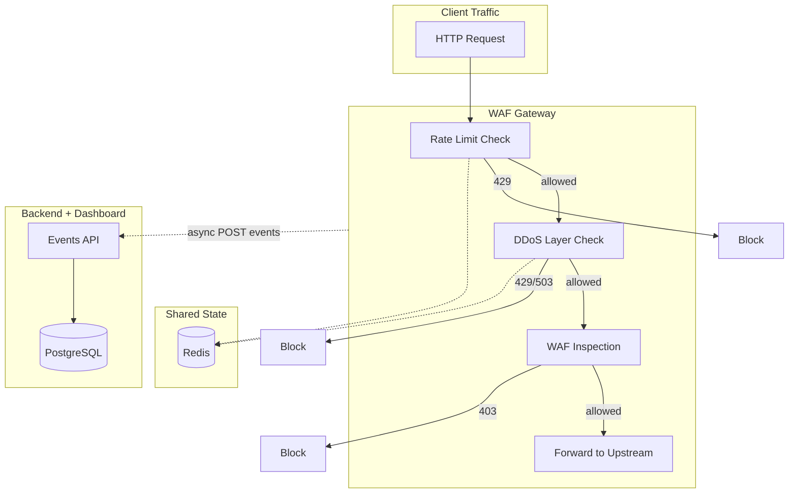

# DDoS and Rate Limiting Integration Plan

## Current State

- **Gateway** ([gateway/main.py](gateway/main.py)): FastAPI reverse proxy, request flow: `body read → WAF inspect → forward`. No rate limiting, no DDoS layer. Runs standalone in [docker-compose.gateway.yml](docker-compose.gateway.yml) without Redis.
- **Backend** ([backend/main.py](backend/main.py)): Has `RateLimitMiddleware` for dashboard API (in-memory `PerIPRateLimiter`). Redis exists in main stack via [backend/services/cache_service.py](backend/services/cache_service.py).
- **Traffic model** ([backend/models/traffic.py](backend/models/traffic.py)): Stores `was_blocked`, `threat_type`. No `block_reason` for rate-limit/DDoS.

---

## Architecture Overview




**Request order** (early rejection to save resources): Rate Limit → DDoS checks → (optional body size) → WAF → Forward.

---

## Phase 1: Gateway Rate Limiting (Redis-backed)

### 1.1 Add Redis to Gateway Stack

- Update [docker-compose.gateway.yml](docker-compose.gateway.yml): add Redis service, connect gateway to `waf-gateway-network`.
- Add `REDIS_URL` to gateway environment (default `redis://redis:6379`).
- Gateway must start only after Redis is healthy.

### 1.2 Redis-Backed Rate Limiter Module

Create `gateway/rate_limit.py`:

- **Algorithm**: Sliding window log via Redis (`ZADD`/`ZREMRANGEBYSCORE`/`ZCARD`) or fixed window (`INCR` + `EXPIRE`) for simplicity. Sliding window is more accurate; fixed window is faster.
- **Key format**: `rl:{scope}:{identifier}` e.g. `rl:ip:192.168.1.1`, `rl:path:/api/login:192.168.1.1`.
- **Config**: `RATE_LIMIT_ENABLED`, `RATE_LIMIT_REQUESTS_PER_MINUTE` (default 120), `RATE_LIMIT_WINDOW_SECONDS` (60), optional `RATE_LIMIT_BURST` (e.g. 20).
- **Per-IP only** for MVP; optional per-path rules later.
- **Response**: 429 + `Retry-After` header.
- **Fail-open**: If Redis unavailable, allow request (configurable via `RATE_LIMIT_FAIL_OPEN`).

### 1.3 Integrate into Gateway Request Flow

Modify [gateway/main.py](gateway/main.py):

- **Before** `await request.body()`: run rate limit check. Extract client IP from `X-Forwarded-For` or `request.client.host`.
- If over limit → return 429 immediately (do not read body).
- Initialize rate limiter in lifespan; pass Redis URL from config.

### 1.4 Gateway Config

Add to [gateway/config.py](gateway/config.py):

- `REDIS_URL`
- `RATE_LIMIT_ENABLED`, `RATE_LIMIT_REQUESTS_PER_MINUTE`, `RATE_LIMIT_WINDOW_SECONDS`, `RATE_LIMIT_BURST`, `RATE_LIMIT_FAIL_OPEN`

---

## Phase 2: Gateway DDoS Layer

### 2.1 DDoS Protection Module

Create `gateway/ddos_protection.py`:

**L7 DDoS mitigations:**


| Mitigation                 | Implementation                                                                                                                           |
| -------------------------- | ---------------------------------------------------------------------------------------------------------------------------------------- |
| **Request rate per IP**    | Reuse rate limiter (already limits floods)                                                                                               |
| **Concurrent connections** | Optional: asyncio semaphore per IP (requires connection tracking; defer to Phase 2b if needed)                                           |
| **Request size**           | Reject before body read if `Content-Length` > `DDoS_MAX_BODY_BYTES` (default 10MB, align with `BODY_MAX_BYTES`)                          |
| **Slowloris**              | Enforce `DDoS_REQUEST_TIMEOUT` (e.g. 30s) - FastAPI/Starlette handles per-request timeouts                                               |
| **Burst detection**        | Track requests/second per IP in Redis; if > `DDoS_BURST_THRESHOLD` (e.g. 100 req/s) for N seconds, temporarily block or throttle that IP |
| **Global rate**            | Optional: global request counter; if total RPS > threshold, return 503 (circuit breaker)                                                 |


**MVP scope**: Request size check (pre-body), burst detection with auto-throttle/block window (e.g. block IP for 60s if > 50 req/s over 5s).

### 2.2 Burst Detection Logic

- Redis key: `ddos:burst:{ip}` with sliding window of timestamps or a counter with TTL.
- If IP exceeds burst threshold → set `ddos:blocked:{ip}` with TTL (e.g. 60s). Subsequent requests from that IP get 429/503 until TTL expires.
- Config: `DDoS_BURST_THRESHOLD`, `DDoS_BURST_WINDOW_SECONDS`, `DDoS_BLOCK_DURATION_SECONDS`.

### 2.3 Integrate DDoS into Gateway Flow

- After rate limit check, before body read: run DDoS checks (body size from `Content-Length`, burst/block check).
- If blocked → return 429 or 503 with clear message.

### 2.4 Gateway Config (DDoS)

Add to [gateway/config.py](gateway/config.py):

- `DDoS_ENABLED`, `DDoS_MAX_BODY_BYTES`, `DDoS_BURST_THRESHOLD`, `DDoS_BURST_WINDOW_SECONDS`, `DDoS_BLOCK_DURATION_SECONDS`, `DDoS_FAIL_OPEN`

---

## Phase 3: Event Reporting and Backend Storage

### 3.1 Database Models

Create `backend/models/rate_limit_event.py` and `backend/models/ddos_event.py` (or single `security_event` with `event_type`):

- Fields: `id`, `timestamp`, `ip`, `event_type` (rate_limit | ddos_burst | ddos_blocked), `method`, `path`, `details` (JSON), `block_duration_seconds` (optional).
- Register in [backend/database.py](backend/database.py) `init_db()`.

### 3.2 Events API

Create `backend/routes/events.py`:

- `POST /api/events/ingest`: Accept batch of events from gateway. Auth: API key or internal network. Store in DB.
- `GET /api/events/rate-limit` and `GET /api/events/ddos`: List/filter for dashboard.

### 3.3 Gateway → Backend Reporting

In gateway, after blocking a request:

- Fire-and-forget HTTP POST to `BACKEND_EVENTS_URL` (e.g. `http://backend:3001/api/events/ingest`) with event payload.
- Non-blocking: use `asyncio.create_task()` or background thread. Do not await; avoid adding latency.
- If backend unreachable, log only. Config: `BACKEND_EVENTS_URL`, `BACKEND_EVENTS_ENABLED`.

**Note**: In docker-compose.gateway.yml, gateway and backend are in different compose files. For full integration, either:

- Merge gateway into main stack, or
- Configure `BACKEND_EVENTS_URL` to backend's exposed URL when both run.

---

## Phase 4: Dashboard and Configuration

### 4.1 Charts API

Extend [backend/routes/charts.py](backend/routes/charts.py) or add `backend/controllers/events.py`:

- `GET /api/charts/rate-limit` and `GET /api/charts/ddos`: Time-series counts for dashboard charts (same pattern as `get_requests`/`get_threats`).

### 4.2 Frontend Components

- Add **Rate Limit** and **DDoS** metrics to [frontend/components/metrics-overview.tsx](frontend/components/metrics-overview.tsx) (or equivalent).
- Add charts in [frontend/components/charts-section.tsx](frontend/components/charts-section.tsx) for rate-limit hits and DDoS blocks over time.
- Add **Activity/Alert** entries when rate limit or DDoS blocks occur (reuse [frontend/components/activity-feed.tsx](frontend/components/activity-feed.tsx) or alerts section).

### 4.3 Settings UI (Optional)

- Add rate limit and DDoS config to Settings: editable limits, burst thresholds, block duration. Requires backend config API and env override or DB-stored config. Defer to later phase if needed; start with env-only config.

---

## Phase 5: Unified Docker Compose and Documentation

### 5.1 Unified Stack

Create or update a compose file that runs Gateway + Redis + Backend + Frontend + Postgres for end-to-end testing:

- Gateway depends on Redis.
- Set `BACKEND_EVENTS_URL` when backend is reachable.
- Document which compose file to use for "full WAF + DDoS + rate limit" deployment.

### 5.2 Environment Variables

Document in [.env.example](.env.example):

```bash
# Rate Limiting (Gateway)
RATE_LIMIT_ENABLED=true
RATE_LIMIT_REQUESTS_PER_MINUTE=120
RATE_LIMIT_WINDOW_SECONDS=60
RATE_LIMIT_BURST=20
RATE_LIMIT_FAIL_OPEN=true

# DDoS Protection (Gateway)
DDoS_ENABLED=true
DDoS_MAX_BODY_BYTES=10485760
DDoS_BURST_THRESHOLD=50
DDoS_BURST_WINDOW_SECONDS=5
DDoS_BLOCK_DURATION_SECONDS=60
DDoS_FAIL_OPEN=true

# Event reporting (Gateway -> Backend)
BACKEND_EVENTS_URL=http://backend:3001/api/events/ingest
BACKEND_EVENTS_ENABLED=true

# Redis (Gateway)
REDIS_URL=redis://redis:6379
```

### 5.3 Documentation

Update [README.md](README.md) and [docs/README.md](docs/README.md): mention rate limiting and DDoS protection. Add `docs/rate-limiting.md` and `docs/ddos-protection.md` with config and behavior.

---

## Phase 6: Testing and Scalability Validation

### 6.1 Unit Tests

- `gateway/rate_limit.py`: Test sliding/fixed window logic, Redis failure fallback.
- `gateway/ddos_protection.py`: Test burst detection, block window.

### 6.2 Integration / Stress Test

- Script similar to [scripts/stress_test_1000_evasive.py](scripts/stress_test_1000_evasive.py): send burst of requests from single IP, verify 429 after limit; verify DDoS block triggers and expires.
- Load test with multiple IPs to ensure Redis handles concurrency.

### 6.3 Horizontal Scaling

- Run 2+ gateway replicas behind a load balancer; verify Redis-backed rate limit applies globally (same IP limited across replicas).
- Document deployment: Redis as single point of coordination; Redis Cluster for high availability.

---

## File Summary


| Action | Path                                                             |
| ------ | ---------------------------------------------------------------- |
| Create | `gateway/rate_limit.py`                                          |
| Create | `gateway/ddos_protection.py`                                     |
| Modify | `gateway/main.py`                                                |
| Modify | `gateway/config.py`                                              |
| Modify | `docker-compose.gateway.yml`                                     |
| Create | `backend/models/rate_limit_event.py` (or `security_event.py`)    |
| Create | `backend/routes/events.py`                                       |
| Modify | `backend/database.py`                                            |
| Modify | `backend/routes/charts.py` or create events controller           |
| Modify | `frontend/components/metrics-overview.tsx`, `charts-section.tsx` |
| Modify | `.env.example`                                                   |
| Create | `scripts/stress_test_rate_limit.py`                              |
| Update | `README.md`, `docs/`                                             |


---

## Implementation Order

1. **Phase 1** (Rate limiting): Redis in gateway compose → rate_limit.py → gateway main.py → config.
2. **Phase 2** (DDoS): ddos_protection.py → gateway main.py → config.
3. **Phase 3** (Events): DB models → events API → gateway reporting.
4. **Phase 4** (Dashboard): Charts API → frontend components.
5. **Phase 5** (Compose + docs): Unified stack, .env.example, docs.
6. **Phase 6** (Tests): Unit tests, stress script, scaling validation.

