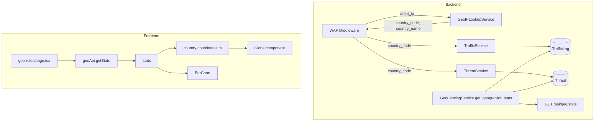

# Geo Rules, Globe, and Graphs Full Integration

## Problem Summary

The Geo Rules page shows "No geographic data" because `**country_code` is never populated** when traffic and threats are logged. The frontend (globe, bar chart, Top Threat Countries) is already wired to `GET /api/geo/stats`; the backend returns empty stats because `TrafficLog.country_code` and `Threat.country_code` are always `NULL`.

## Root Cause

In [backend/middleware/waf_middleware.py](backend/middleware/waf_middleware.py):

- `create_traffic_log` (lines 314-326): `**country_code` is never passed** (defaults to `None`)
- `create_threat` (lines 357-368): `**country_code=None**` is explicitly passed with a comment "Could add geo lookup here"

The [GeoIPLookupService](backend/services/geoip_lookup.py) exists and is used by geo-fencing for rule checks, but it is **not** invoked when storing logs.

## Architecture (Data Flow)

## Implementation Plan

### 1. Add GeoIP Lookup in WAF Middleware

**File:** [backend/middleware/waf_middleware.py](backend/middleware/waf_middleware.py)

- Import `GeoIPLookupService` and instantiate it (or get from a shared/cached instance).
- In `store_traffic()`, before creating the traffic log:
  - Call `geoip.get_country_code(client_ip)` or `geoip.lookup(client_ip)`.
  - Use `country_code` from the result; use `country_name` if available for downstream use (optional).
- Pass `country_code` to `traffic_service.create_traffic_log(...)`.
- When creating a threat (blocked request), pass the same `country_code` to `threat_service.create_threat(...)`.
- Use a **thread-safe** lookup: GeoIPLookupService is read-only per request; instantiate once or use a module-level singleton to avoid re-loading the MMDB on every request.

### 2. Improve Geographic Stats Aggregation

**File:** [backend/services/geo_fencing.py](backend/services/geo_fencing.py)

Currently `get_geographic_stats`:

- Builds stats only from `TrafficLog` rows (countries with traffic).
- Maps threat IPs to countries via `TrafficLog` lookup; if the traffic log has no `country_code`, threats are not attributed.

**Changes:**

- **Use `Threat.country_code` directly** when available: aggregate threats by `Threat.country_code` in addition to the IP→TrafficLog mapping. This captures threat geography even when the traffic log lookup fails.
- **Include countries that have only threats** (no traffic): merge threat-only countries into the result with `total_requests=0`, `blocked_requests=0`, `threat_count=N`.
- **Country name fallback**: Use `GeoRule` for names when present; add a minimal `country_code → country_name` map (or use GeoIP’s `country_name`) for countries not in rules. Alternatively, add a small lookup table in `backend/lib/countries.py` for common codes.

### 3. GeoIP Database Setup

**File:** [backend/services/geoip_lookup.py](backend/services/geoip_lookup.py) (no code change; document)

- GeoLite2-City is expected at `./data/GeoLite2-City.mmdb` (or `GEOIP_DB_PATH`).
- Add a short note in `README` or `docs/` on how to download: MaxMind GeoLite2 (free, sign-up required) or provide a download script.

### 4. Demo/Seed Data for Development

When GeoIP DB is missing (`geoip_db` is `None`), lookups return `None` and `country_code` stays empty. To make the Geo Rules page usable in development:

- Add a **demo mode**: if `GEOIP_DB_PATH` is not set or file does not exist, optionally use a deterministic mapping from IP suffix to a small set of country codes (e.g. for `scripts/generate_live_traffic.py` or local testing). This can be behind an env flag like `GEOIP_DEMO_FALLBACK=true`.
- Or add a **seed script** `scripts/seed_geo_traffic.py` that inserts sample `TrafficLog` and `Threat` rows with `country_code` set (US, IN, CN, RU, etc.) so the globe and charts show data without a real GeoIP DB.

### 5. Frontend Fixes (Optional)

**File:** [frontend/app/geo-rules/page.tsx](frontend/app/geo-rules/page.tsx)

- Time range selector and stats are already wired; confirm `statsRange` drives both the globe and charts.
- **Globe marker sizing**: Currently markers use `threat_count` for size; countries with only traffic (`threat_count=0`) get `minSize` (0.02). Consider using `total_requests` or `blocked_requests` as a secondary/fallback for size when `threat_count` is 0, so countries with high traffic but no threats still appear with a visible marker.
- **Empty-state messaging**: Keep the current empty state; optionally add a hint like "Ensure GeoIP database is configured and traffic is being logged with country attribution."

**File:** [frontend/components/ui/globe.tsx](frontend/components/ui/globe.tsx)

- Globe uses `cobe` and `motion`; the config merge and `markers` propagation look correct.
- One potential fix: ensure the globe receives dimensions on first paint. The component uses `width` from `canvasRef.current.offsetWidth` in `onResize`; if the parent has `min-h-[400px]` but `width` is 0 initially, the globe may not render. Consider using `useEffect` with `ResizeObserver` or a small delay to ensure layout is complete before creating the globe.

### 6. Gateway Considerations (Optional, Future)

The **gateway** ([gateway/main.py](gateway/main.py)) logs to MongoDB and does not create `TrafficLog` or `Threat` records. Geo stats are sourced only from the backend SQL DB. To show gateway traffic on the Geo Rules page later:

- Gateway could call a backend endpoint to ingest events (including `country_code` from GeoIP) and create `TrafficLog`/`Threat`.
- Or a sync job could read from MongoDB and populate backend records.

This is out of scope for the current plan; the immediate fix focuses on backend WAF middleware traffic.

---

## Files to Modify

| Area     | File                                                                         | Change                                                                                     |
| -------- | ---------------------------------------------------------------------------- | ------------------------------------------------------------------------------------------ |
| Backend  | [backend/middleware/waf_middleware.py](backend/middleware/waf_middleware.py) | Add GeoIP lookup; pass `country_code` to `create_traffic_log` and `create_threat`.         |
| Backend  | [backend/services/geo_fencing.py](backend/services/geo_fencing.py)           | Use `Threat.country_code`; include threat-only countries; improve country name resolution. |
| Backend  | New: `backend/lib/countries.py` or extend geo_fencing                        | Minimal country_code → country_name map for stats.                                         |
| Dev/ops  | New: `scripts/seed_geo_traffic.py`                                           | Insert sample traffic/threats with `country_code` for local testing.                       |
| Docs     | `README` or `docs/GEOIP_SETUP.md`                                            | How to obtain and place GeoLite2-City.mmdb.                                                |
| Frontend | [frontend/app/geo-rules/page.tsx](frontend/app/geo-rules/page.tsx)           | Optional: improve marker sizing for traffic-only countries; clarify empty state.           |
| Frontend | [frontend/components/ui/globe.tsx](frontend/components/ui/globe.tsx)         | Optional: ensure correct dimensions on first render.                                       |

---

## Testing

1. **With GeoIP DB**: Run backend, generate traffic via `scripts/generate_live_traffic.py` or manually hit app endpoints. Confirm traffic logs and threats have `country_code` set, and the Geo Rules page shows globe markers, bar chart, and Top Threat Countries.
2. **Without GeoIP DB**: Run the seed script; confirm sample data appears on the Geo Rules page.
3. **Empty state**: With no traffic and no seed data, confirm the empty state renders without errors.

