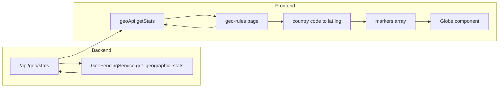

# Globe component for geographical attack origins

## Current state

- **Backend**: Geographic stats at `GET /api/geo/stats?range=24h` return `GeoStats[]`: `country_code`, `country_name`, `total_requests`, `blocked_requests`, `threat_count` ([backend/controllers/geo_rules.py](backend/controllers/geo_rules.py), [backend/services/geo_fencing.py](backend/services/geo_fencing.py)). No latitude/longitude is returned.
- **Frontend**: [frontend/app/geo-rules/page.tsx](frontend/app/geo-rules/page.tsx) shows a bar chart and "Top Threat Countries" list; stats are fetched once with a hardcoded `24h` range.
- **Data models**: [TrafficLog](backend/models/traffic.py) has `ip`, `country_code`; [Threat](backend/models/threats.py) has `source_ip`, `country_code`. GeoIP lookup exists ([backend/services/geoip_lookup.py](backend/services/geoip_lookup.py)) but is not used in the stats response.

## Architecture

## Implementation plan

### 1. Install Magic UI Globe and dependencies

- Run: `npx shadcn@latest add @magicui/globe` (adds [Globe](https://magicui.design/docs/components/globe) to the project).
- Ensure dependencies are installed: `cobe` and `motion` (Magic UI docs require these; the CLI may add them).
- The Globe will live at `frontend/components/ui/globe.tsx` and accept `config?: COBEOptions` with `markers: { location: [lat, lng], size: number }[]`.

### 2. Country code to coordinates (frontend)

- The Cobe config expects `markers[].location` as `[latitude, longitude]`. The API only has `country_code`.
- Add a **country-code to centroid** mapping in the frontend (e.g. `frontend/lib/country-coordinates.ts`): a map or JSON of ISO 3166-1 alpha-2 codes to `[lat, lng]` (e.g. from a minimal dataset or a small npm such as `country-code-to-coordinate`). Cover at least all country codes that appear in your data to avoid missing markers.
- Expose a small helper, e.g. `getCountryCoordinates(countryCode: string): [number, number] | null`, with a safe fallback for unknown codes (skip or use a default).

### 3. Geo Rules page: Globe section and time range

- In [frontend/app/geo-rules/page.tsx](frontend/app/geo-rules/page.tsx):
  - Add a **time range selector** (e.g. 1h, 24h, 7d, 30d) and pass the selected value to `geoApi.getStats(range)` so the globe reflects the chosen period. Reuse the same `stats` state for both the existing bar chart/list and the globe.
  - Add a new **"Attack origins"** (or "Threat origins") section with a Card containing the Globe. Give the globe a fixed or min height (e.g. 400–500px) and responsive width so it renders consistently.
  - **Build markers from `stats**`:
    - For each `GeoStats` entry, resolve `[lat, lng]` via the country-coordinates helper.
    - Prefer **threat_count** to drive marker **size** (so clients see where attacks/malicious payloads come from). Use a simple scale (e.g. `size = minSize + (threat_count / maxThreatCount) * (maxSize - minSize)` with clamped min/max) so high-threat countries are more visible. Optionally filter to `threat_count > 0` so only attack origins appear, or show all countries with traffic and size by threat_count.
  - Pass the computed array to the Globe: `config={{ ...baseConfig, markers: computedMarkers }}`. Optionally set `markerColor` / `glowColor` (e.g. red/orange) to align with a "threat" theme.
  - **Empty state**: When `stats` is empty or no coordinates exist, show a short message and optionally hide or disable the globe.

### 4. Optional: Backend fix for threat-by-country attribution

- In [backend/services/geo_fencing.py](backend/services/geo_fencing.py), `get_geographic_stats` maps threat IPs to countries by querying `TrafficLog` with `TrafficLog.source_ip == source_ip`. [TrafficLog](backend/models/traffic.py) has `**ip**`, not `source_ip`. Fix the filter to use `TrafficLog.ip == source_ip` so threat counts are correctly attributed to countries and the globe reflects real attack origins.

### 5. Optional: Backend exposure of lat/lng

- Not required for this feature: the frontend country-centroid approach is enough for country-level visualization. If you later want server-authoritative coordinates, you could extend the stats response with optional `latitude`/`longitude` per country (e.g. from a small country-centroid table or GeoIP), and have the frontend use those when present.

## Files to touch

| Area               | File                                                               | Change                                                                                                              |
| ------------------ | ------------------------------------------------------------------ | ------------------------------------------------------------------------------------------------------------------- |
| Frontend           | New: `frontend/components/ui/globe.tsx`                            | Added by `npx shadcn@latest add @magicui/globe` (or manual paste from Magic UI docs).                               |
| Frontend           | New: `frontend/lib/country-coordinates.ts`                         | Country code → `[lat, lng]` map and helper.                                                                         |
| Frontend           | [frontend/app/geo-rules/page.tsx](frontend/app/geo-rules/page.tsx) | Time range selector; "Attack origins" Card with Globe; derive markers from `stats` and country coords; empty state. |
| Backend (optional) | [backend/services/geo_fencing.py](backend/services/geo_fencing.py) | Use `TrafficLog.ip` instead of `TrafficLog.source_ip` in threat-by-country query.                                   |

## Testing

- Load the Geo Rules page with backend running and some traffic/threats with `country_code` set; confirm the globe shows markers and that changing the time range updates the globe.
- Test with no stats (empty response) and with unknown country codes; confirm no crashes and sensible empty/fallback behavior.

