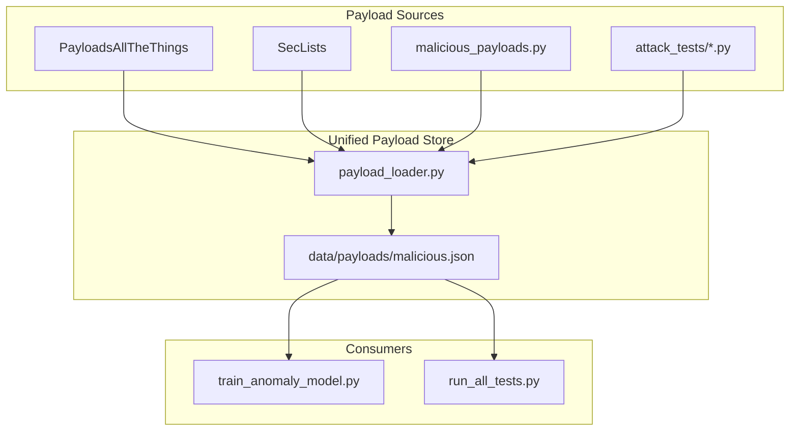

# Large Malicious Payload Dataset for Startup-Competitive WAF

## Problem Summary

| Current State                                     | Target (Cloudflare-competitive)                            |
| ------------------------------------------------- | ---------------------------------------------------------- |
| ~73 unique payloads used for training             | 5,000-15,000+ unique payloads                              |
| Only SQL + XSS loaded in `train_anomaly_model.py` | All categories from unified payload store                  |
| 10-12 attack categories                           | 25+ categories (including Prompt Injection, GraphQL, etc.) |
| Attack tests (453 payloads) not used for training | Single source of truth for training + evaluation           |

**Root cause**: [scripts/train_anomaly_model.py](scripts/train_anomaly_model.py) only imports `SQL_INJECTION_PAYLOADS` and `XSS_PAYLOADS` from [tests/payloads/malicious_payloads.py](tests/payloads/malicious_payloads.py), ignoring the rest. The 10 attack test files have 453 payloads that are never used for training.

---

## Architecture

---

## Implementation Plan

### 1. Create Unified Payload Loader and Store

**New file**: `scripts/payloads/payload_loader.py`

- Load all payloads from `tests/payloads/malicious_payloads.py` (all 12 categories, not just SQL/XSS)
- Load payloads from attack test modules (`01_sql_injection.py` through `10_mixed_blended.py`) by importing or parsing
- Return a dict: `{category: [payload_strings]}` with deduplication
- Export to `data/payloads/malicious.json` for caching and version control

**New file**: `data/payloads/malicious.json`

- JSON structure: `{"category": "sql_injection", "payloads": [...], "source": "malicious_payloads.py"}` or flat list with metadata
- Generated by a one-time or periodic `scripts/payloads/build_payload_dataset.py` script

### 2. Integrate PayloadsAllTheThings (External Repo)

**PayloadsAllTheThings** (75k+ stars) has 50+ categories. Key categories for WAF:

| Category                       | Est. Payloads | Relevance                 |
| ------------------------------ | ------------- | ------------------------- |
| SQL Injection                  | 200+          | Core                      |
| XSS Injection                  | 300+          | Core                      |
| Command Injection              | 100+          | Core                      |
| Path Traversal                 | 80+           | Core                      |
| CRLF Injection                 | 50+           | Header injection          |
| SSRF                           | 80+           | Core                      |
| XXE                            | 40+           | Core                      |
| NoSQL Injection                | 60+           | Core                      |
| Server-Side Template Injection | 50+           | Core                      |
| File Inclusion                 | 80+           | Core                      |
| Prompt Injection               | 100+          | Cloudflare differentiator |
| GraphQL Injection              | 40+           | Modern API                |
| Request Smuggling              | 30+           | HTTP-level                |
| Prototype Pollution            | 30+           | JS/JSON                   |
| Insecure Deserialization       | 40+           | App-level                 |

**Approach**:

- Add `scripts/payloads/fetch_payloads_all_the_things.py` that:
  - Clones or fetches PATT repo (or uses GitHub raw URLs)
  - Parses README.md files (payloads are in markdown code blocks) for SQL Injection, XSS, Command Injection, etc.
  - Parses Intruder/*.txt files where available (easier format)
  - Outputs to `data/payloads/raw/payloads_all_the_things/` by category
- Alternatively: git submodule or `data/payloads/raw/PayloadsAllTheThings` and parse locally

### 3. Integrate SecLists (Optional but Recommended)

**SecLists** (danielmiessler/SecLists) provides:

- `Fuzzing/` - SQL, XSS, LFI payloads
- `Discovery/` - path traversal, web content
- `Payloads/` - various attack payloads
- Add `scripts/payloads/fetch_seclists.py` to pull relevant .txt files and merge into payload store
- Or use as git submodule under `data/payloads/raw/SecLists`

### 4. Fix train_anomaly_model.py to Use Full Dataset

**Update**: [scripts/train_anomaly_model.py](scripts/train_anomaly_model.py)

- Replace `load_malicious_payloads()` with call to `payload_loader.load_all()` or load from `data/payloads/malicious.json`
- Ensure all categories are used (no filtering to just SQL/XSS)
- Add `--max-payloads-per-category` for balanced sampling (e.g., 500 per category to avoid SQL dominance)
- Log payload count and category distribution at startup

### 5. Add New Attack Categories for Cloudflare Differentiation

**New categories** to add to [tests/payloads/malicious_payloads.py](tests/payloads/malicious_payloads.py) or load from PATT:

| Category              | Why                                              |
| --------------------- | ------------------------------------------------ |
| Prompt Injection      | LLM/AI apps - Cloudflare "Firewall for AI" angle |
| GraphQL Injection     | Modern API attacks                               |
| Prototype Pollution   | JSON/JS-based apps                               |
| Request Smuggling     | HTTP/1.1 desync, CL.TE, TE.CL                    |
| JWT attacks           | Algorithm confusion, none alg                    |
| Open Redirect         | Common OWASP                                     |
| CSV Injection         | Data exfiltration                                |
| CORS misconfiguration | Origin reflection                                |

### 6. Unify Attack Tests with Payload Store

- Refactor `scripts/attack_tests/*.py` to optionally load from `data/payloads/malicious.json` so training and evaluation use the same payload set
- Or keep attack tests as integration/evaluation suite but ensure overlapping payloads are in training data

### 7. Target Scale and Balance

| Metric          | Current         | Phase 1                             | Phase 2 (Full)     |
| --------------- | --------------- | ----------------------------------- | ------------------ |
| Unique payloads | ~73             | 2,000-3,000                         | 5,000-15,000       |
| Categories      | 2 (in training) | 15                                  | 25+                |
| Sources         | 1 (partial)     | 3 (mal_py, attack_tests, PATT core) | + SecLists, custom |

**Balance**: Use stratified sampling in `generate_malicious_requests()` so no single category dominates (e.g., cap 500 per category, then fill with random from rest).

---

## Files to Create

| File                                                | Purpose                                        |
| --------------------------------------------------- | ---------------------------------------------- |
| `scripts/payloads/__init__.py`                      | Package init                                   |
| `scripts/payloads/payload_loader.py`                | Load from malicious_payloads.py + attack tests |
| `scripts/payloads/build_payload_dataset.py`         | Build data/payloads/malicious.json             |
| `scripts/payloads/fetch_payloads_all_the_things.py` | Fetch/parse PATT repo                          |
| `scripts/payloads/fetch_seclists.py`                | (Optional) Fetch SecLists                      |
| `data/payloads/malicious.json`                      | Generated unified payload store                |
| `data/payloads/raw/`                                | Raw fetched payloads (gitignored or submodule) |

## Files to Update

| File                                                                         | Changes                                                                       |
| ---------------------------------------------------------------------------- | ----------------------------------------------------------------------------- |
| [scripts/train_anomaly_model.py](scripts/train_anomaly_model.py)             | Use payload_loader, add category balance, log stats                           |
| [tests/payloads/malicious_payloads.py](tests/payloads/malicious_payloads.py) | Add missing categories (Prompt Injection, GraphQL, etc.), ensure all exported |
| [.gitignore](.gitignore)                                                     | Add data/payloads/raw/ if large                                               |

---

## Execution Order

1. Create `payload_loader.py` - load all from malicious_payloads.py + extract from attack tests
2. Create `build_payload_dataset.py` - produce malicious.json (expect ~500-800 from existing sources)
3. Update `train_anomaly_model.py` - use new loader
4. Add `fetch_payloads_all_the_things.py` - integrate PATT
5. Add new categories (Prompt Injection, GraphQL, etc.) to malicious_payloads.py or PATT loader
6. Re-run build, verify 2,000+ payloads
7. (Optional) Add SecLists integration
8. Re-train model and run attack tests - expect improved detection on previously weak categories (e.g., header injection)

---

## Success Criteria

- Training uses 2,000+ unique malicious payloads (Phase 1) or 5,000+ (Phase 2)
- All 12+ existing categories from malicious_payloads.py are used in training
- At least 3 new categories (Prompt Injection, GraphQL, Request Smuggling) included
- `python scripts/payloads/build_payload_dataset.py` produces data/payloads/malicious.json
- Attack test detection rate maintained or improved after retraining
- Header injection detection improves from ~3.3% (per WEEK5-PLAN) with expanded CRLF payloads

