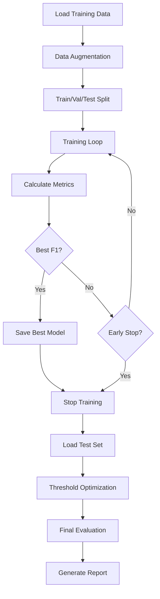

# ML Training Accuracy Improvement Plan

## Overview

Improve model accuracy for both attack detection (high TPR, Precision, Recall) and low false positive rate on legitimate traffic. This requires comprehensive evaluation metrics, proper test datasets, improved training techniques, and threshold optimization.

## Current State Analysis

**Existing Components:**

- Training uses only MSE loss (target = 0 for benign)
- No evaluation metrics during training (only loss)
- No test dataset with malicious samples
- Fixed threshold (0.5) without optimization
- No early stopping mechanism
- Limited data augmentation

**Files to Modify:**

- `src/training/train.py` - Add evaluation metrics, early stopping
- `src/training/evaluator.py` - NEW - Comprehensive evaluation module
- `src/training/losses.py` - NEW - Advanced loss functions
- `scripts/train_model.py` - Add test dataset support
- `tests/payloads/malicious_payloads.py` - NEW - Attack payloads for testing
- `config/config.yaml` - Add evaluation and threshold config

## Implementation Plan

### 1. Evaluation Metrics Module (`src/training/evaluator.py`)

**Purpose:** Calculate comprehensive accuracy metrics during training

**Key Features:**

- TPR (True Positive Rate / Recall) - Attack detection rate
- FPR (False Positive Rate) - False alarms on benign traffic
- Precision - Accuracy of positive predictions
- F1 Score - Harmonic mean of precision and recall
- ROC-AUC - Overall model performance
- Confusion matrix tracking

**Implementation:**

```python
class ModelEvaluator:
    def evaluate(self, model, dataloader, threshold=0.5):
        # Calculate TPR, FPR, Precision, Recall, F1
        # Return comprehensive metrics dict
```

### 2. Test Dataset with Malicious Samples (`tests/payloads/malicious_payloads.py`)

**Purpose:** Create test dataset with known attack patterns

**Attack Categories:**

- SQL Injection payloads
- XSS (Cross-Site Scripting) payloads
- Path Traversal attacks
- Command Injection
- XXE (XML External Entity) attacks
- SSRF (Server-Side Request Forgery)
- File Upload attacks

**Integration:**

- Generate normalized malicious requests
- Mix with benign validation set
- Use for threshold optimization

### 3. Enhanced Training with Evaluation (`src/training/train.py`)

**Improvements:**

- Add evaluation metrics calculation after each epoch
- Track best model based on F1 score (not just loss)
- Early stopping based on validation F1 score
- Log comprehensive metrics to file
- Save metrics with checkpoints

**Key Changes:**

```python
def train(...):
    # After validation
    metrics = evaluator.evaluate(model, val_loader, threshold)
    # Track best F1 score
    # Early stopping if no improvement
```

### 4. Advanced Loss Functions (`src/training/losses.py`)

**Purpose:** Better loss functions for anomaly detection

**Options:**

- **Focal Loss** - Focus on hard examples
- **Weighted MSE** - Penalize false positives more
- **Contrastive Loss** - Learn better separation
- **Combined Loss** - MSE + Regularization term

**Implementation:**

```python
class FocalLoss(nn.Module):
    # Focuses learning on hard examples
    # Reduces false positives

class WeightedMSELoss(nn.Module):
    # Higher weight for false positives
    # Balances precision and recall
```

### 5. Threshold Optimization (`src/training/threshold_optimizer.py`)

**Purpose:** Find optimal threshold to balance TPR and FPR

**Method:**

- ROC curve analysis
- Find threshold that maximizes F1 score
- Or find threshold for target FPR (e.g., FPR < 0.01)
- Grid search or binary search

**Implementation:**

```python
class ThresholdOptimizer:
    def find_optimal_threshold(self, model, val_loader, target_fpr=0.01):
        # Calculate ROC curve
        # Find threshold for target FPR
        # Or maximize F1 score
```

### 6. Data Augmentation (`src/training/data_augmentation.py`)

**Purpose:** Increase training data diversity

**Techniques:**

- URL parameter shuffling
- Case variation (GET vs get)
- Path normalization variations
- Query parameter reordering
- Header value variations

**Implementation:**

```python
class RequestAugmenter:
    def augment(self, request_text):
        # Apply various augmentations
        # Return augmented versions
```

### 7. Improved Training Pipeline (`scripts/train_model.py`)

**Enhancements:**

- Load malicious test samples
- Calculate metrics on test set
- Threshold optimization after training
- Generate comprehensive evaluation report
- Save best model with optimal threshold

**New Arguments:**

- `--test_payloads_path` - Path to malicious payloads
- `--target_fpr` - Target false positive rate
- `--optimize_threshold` - Enable threshold optimization
- `--early_stopping_patience` - Early stopping patience

### 8. Configuration Updates (`config/config.yaml`)

**New Sections:**

```yaml
evaluation:
  metrics: ["tpr", "fpr", "precision", "recall", "f1", "roc_auc"]
  test_split: 0.1
  optimize_threshold: true
  target_fpr: 0.01
  
training:
  early_stopping:
    enabled: true
    patience: 5
    metric: "f1_score"
    min_delta: 0.001
  
  loss:
    type: "weighted_mse"  # or "focal", "mse", "contrastive"
    false_positive_weight: 2.0  # Higher penalty for FPs
```

### 9. Evaluation Report Generation (`src/training/report_generator.py`)

**Purpose:** Generate comprehensive evaluation reports

**Contents:**

- Training/validation loss curves
- Metrics over epochs (TPR, FPR, Precision, Recall, F1)
- Confusion matrix
- ROC curve
- Best threshold recommendation
- Performance on test set

## Training Workflow



## Success Metrics

**Target Goals:**

- **TPR (Recall)**: > 0.95 (detect 95%+ of attacks)
- **FPR**: < 0.01 (false alarm rate < 1%)
- **Precision**: > 0.90 (90%+ of flagged requests are attacks)
- **F1 Score**: > 0.92 (balanced performance)

## Files to Create/Modify

**New Files:**

1. `src/training/evaluator.py` - Evaluation metrics
2. `src/training/losses.py` - Advanced loss functions
3. `src/training/threshold_optimizer.py` - Threshold optimization
4. `src/training/data_augmentation.py` - Data augmentation
5. `src/training/report_generator.py` - Report generation
6. `tests/payloads/malicious_payloads.py` - Attack payloads

**Modified Files:**

1. `src/training/train.py` - Add evaluation, early stopping
2. `scripts/train_model.py` - Enhanced pipeline with metrics
3. `config/config.yaml` - Add evaluation configuration

## Testing Strategy

1. **Unit Tests**: Test each evaluation metric calculation
2. **Integration Tests**: Test full training pipeline with metrics
3. **Validation**: Verify metrics on known benign/malicious samples
4. **Threshold Testing**: Test threshold optimization on validation set

## Implementation Order

1. Create evaluation metrics module
2. Add malicious payloads test set
3. Enhance training with metrics tracking
4. Implement advanced loss functions
5. Add threshold optimization
6. Add data augmentation
7. Update training pipeline
8. Generate evaluation reports
9. Test and validate improvements