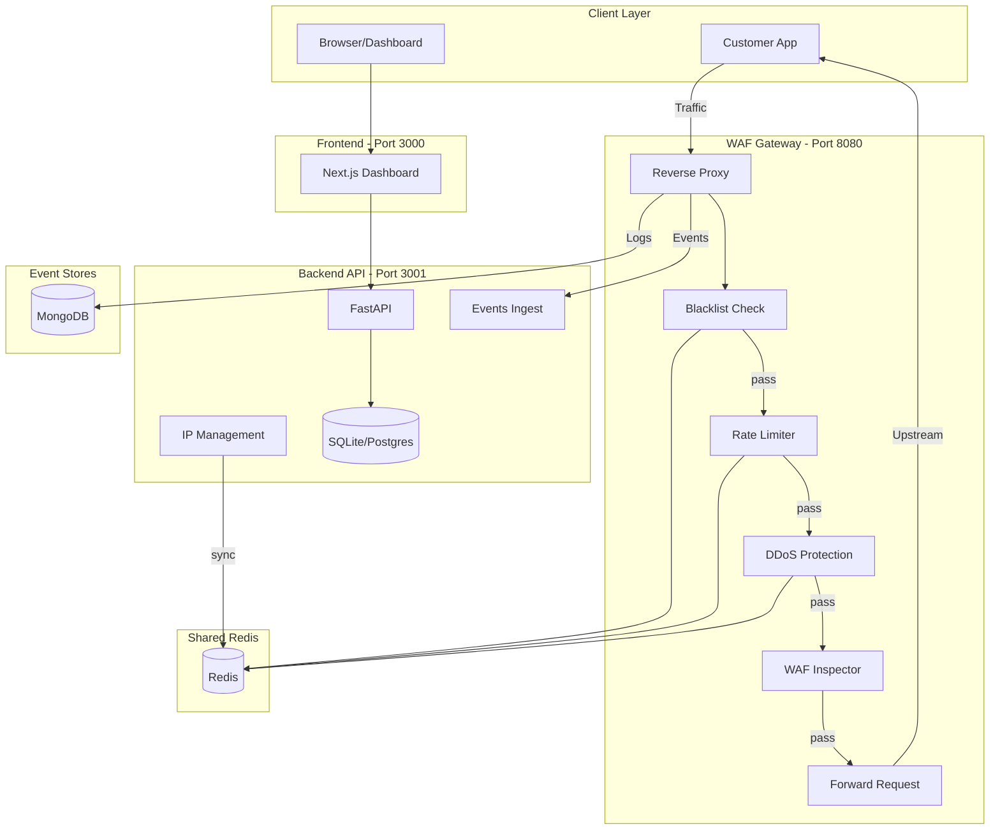
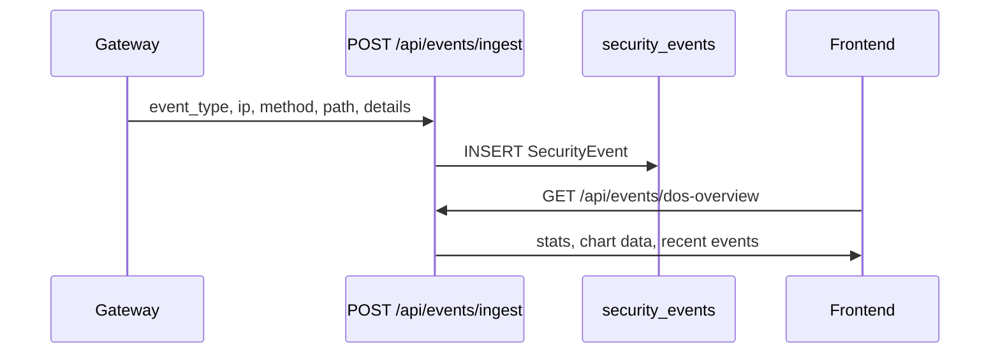

# WAF Pipeline - Network Architecture and Services Plan

## 1. High-Level Architecture

---

## 2. Gateway Request Flow (Order of Execution)

The gateway processes each request in this order ([gateway/main.py](gateway/main.py) lines 255-386):

| Step | Check              | Data Store                               | On Block          |
| ---- | ------------------ | ---------------------------------------- | ----------------- |
| 1    | **IP Blacklist**   | Redis `blacklist:{tenant}:{ip}`          | 403               |
| 2    | **Rate Limit**     | Redis `rl:ip:{ip}` (sliding window)      | 429 + Retry-After |
| 3    | **DDoS Size**      | Content-Length header only               | 413               |
| 4    | **DDoS Blocked**   | Redis `ddos:blocked:{ip}`                | 429 + Retry-After |
| 5    | **DDoS Burst**     | Redis `ddos:burst:{ip}` (sliding window) | 429 + Retry-After |
| 6    | **WAF Inspection** | ML model (DistilBERT)                    | 403               |
| 7    | **Forward**        | Upstream (UPSTREAM_URL)                  | -                 |

Every block/allow is logged to: (a) MongoDB (full event), (b) Backend `/api/events/ingest` (security_event table for rate limit, DDoS, blacklist, waf).

---

## 3. Redis Key Layout (Shared by Gateway and Backend)

| Key Pattern                  | Used By                         | Purpose                                            |
| ---------------------------- | ------------------------------- | -------------------------------------------------- |
| `blacklist:{tenant_id}:{ip}` | Gateway (read), Backend (write) | Manual/DoS block list; backend syncs on add/remove |
| `rl:ip:{ip}`                 | Rate limiter                    | Sliding window of request timestamps               |
| `ddos:burst:{ip}`            | DDoS protection                 | Sliding window of request timestamps               |
| `ddos:blocked:{ip}`          | DDoS protection                 | TTL block after burst exceeded                     |

All keys use Redis string or sorted-set types. Gateway uses `redis.asyncio`; backend blacklist_sync uses sync `redis`.

---

## 4. DDoS Mitigation Service

**Location:** [gateway/ddos_protection.py](gateway/ddos_protection.py)

**Checks (in order):**

1. **Request size** – Reject if `Content-Length` > `DDOS_MAX_BODY_BYTES` (default 10MB) before reading body.
2. **Already blocked** – Check `ddos:blocked:{ip}` TTL; if set, return 429.
3. **Burst detection** – Record request in `ddos:burst:{ip}`; if count >= `DDOS_BURST_THRESHOLD` (50) in `DDOS_BURST_WINDOW_SECONDS` (5s), set `ddos:blocked:{ip}` with `DDOS_BLOCK_DURATION_SECONDS` (60s).

**Config:** [gateway/config.py](gateway/config.py) – `DDOS_*` env vars. See [docs/ddos-protection.md](docs/ddos-protection.md).

---

## 5. Block IP Service (B2B Scalable)

**Flow:**

1. User blocks IP from DoS/DDoS Protection page or IP Management.
2. Frontend calls `POST /api/ip/blacklist` with `{ ip, reason, source: "dos_protection" }`.
3. Backend stores in `ip_blacklist` table and calls [backend/services/blacklist_sync.py](backend/services/blacklist_sync.py) `sync_add(ip, reason, expires_at)`.
4. Backend writes to Redis `blacklist:{BLACKLIST_TENANT_ID}:{ip}`.
5. Gateway checks this key first on every request; if present, returns 403.

**B2B:** Use `BLACKLIST_TENANT_ID` per deployment for tenant isolation. Backend and gateway must share `REDIS_URL`.

**Startup:** Backend runs `sync_full_blacklist()` after init ([backend/main.py](backend/main.py)) to repopulate Redis from DB.

---

## 6. Rate Limiting Service

**Location:** [gateway/rate_limit.py](gateway/rate_limit.py)

**Algorithm:** Sliding window in Redis (`rl:ip:{ip}`). If count > `RATE_LIMIT_REQUESTS_PER_MINUTE` (120) in `RATE_LIMIT_WINDOW_SECONDS` (60), return 429 with `Retry-After`.

---

## 7. Event Flow to Dashboard

**Event types:** `rate_limit`, `ddos_burst`, `ddos_blocked`, `ddos_size`, `blacklist`, `waf`, `allow`.

**Dashboard pages:** Overview, DoS/DDoS Protection ([frontend/app/dos-protection/page.tsx](frontend/app/dos-protection/page.tsx)), IP Management.

---

## 8. Deployment Topology

| Component | Port  | Depends On                                  |
| --------- | ----- | ------------------------------------------- |
| Gateway   | 8080  | Redis, MongoDB, Upstream                    |
| Backend   | 3001  | SQLite/Postgres, Redis (for blacklist sync) |
| Frontend  | 3000  | Backend (API proxy)                         |
| Redis     | 6379  | -                                           |
| MongoDB   | 27017 | - (gateway event store)                     |

**No-Docker:** Use [scripts/run_dos_attack_simulation.sh](scripts/run_dos_attack_simulation.sh) with `--with-services`. Prerequisites: `redis-server`, Python deps.

**Docker:** [docker-compose.gateway.yml](docker-compose.gateway.yml) – Gateway + Redis only. Backend/Frontend run separately.

---

## 9. Gaps and Recommendations

| Gap                                  | Impact                                                                              | Recommendation                                                                                      |
| ------------------------------------ | ----------------------------------------------------------------------------------- | --------------------------------------------------------------------------------------------------- |
| No full-stack docker-compose         | README references `docker-compose up` but only gateway compose exists               | Add root `docker-compose.yml` with backend, frontend, gateway, Redis, optional Postgres/Mongo       |
| Blacklist events not in dos-overview | Blocked-by-blacklist events stored but not shown in DoS page                        | Add `blacklist_count` to events stats and `recent_blacklist` to dos-overview; optional chart series |
| Backend REDIS_URL optional           | If backend has no Redis, blacklist sync is no-op; Block IP won’t enforce at gateway | Document that backend MUST have REDIS_URL for Block IP to work; fail visibly if sync fails          |
| CIDR blacklist in Redis              | IPFencingService supports CIDR; blacklist_sync only syncs exact IPs                 | Extend blacklist_sync to support CIDR (store prefixes; gateway checks with ipaddress module)        |
| Single UPSTREAM_URL                  | One upstream per gateway instance                                                   | For B2B multi-app, add path-based routing or tenant→upstream mapping                                |
| Event batching                       | Gateway sends events one-by-one (fire-and-forget)                                   | Batch events in gateway and POST in bulk to reduce backend load                                     |

---

## 10. Key Files Reference

| Purpose                  | File                                                                         |
| ------------------------ | ---------------------------------------------------------------------------- |
| Gateway entry            | [gateway/main.py](gateway/main.py)                                           |
| Gateway config           | [gateway/config.py](gateway/config.py)                                       |
| Blacklist (gateway)      | [gateway/blacklist.py](gateway/blacklist.py)                                 |
| DDoS                     | [gateway/ddos_protection.py](gateway/ddos_protection.py)                     |
| Rate limit               | [gateway/rate_limit.py](gateway/rate_limit.py)                               |
| Events to backend        | [gateway/events.py](gateway/events.py)                                       |
| Blacklist sync (backend) | [backend/services/blacklist_sync.py](backend/services/blacklist_sync.py)     |
| Events API               | [backend/routes/events.py](backend/routes/events.py)                         |
| IP Management            | [backend/routes/ip_management.py](backend/routes/ip_management.py)           |
| DoS dashboard            | [frontend/app/dos-protection/page.tsx](frontend/app/dos-protection/page.tsx) |

