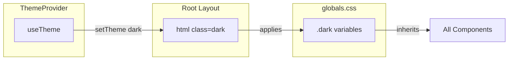

# End-to-End Dark Mode Implementation Plan

## Current State

- **Styling**: Positivus theme (acidic green `#C5E246`, black `#191A23`, white, gray) via CSS variables in [frontend/app/globals.css](frontend/app/globals.css)
- **Components**: 25+ files use `var(--positivus-*)` in inline styles; UI components use semantic tokens (`bg-background`, `bg-card`, etc.)
- **next-themes**: Installed but `ThemeProvider` is not wired; only Sonner uses `useTheme()`
- **Scope**: Landing page, login, dashboard, analytics, traffic, threats, audit logs, settings, admin, and 8+ dashboard sub-pages

## Architecture: CSS Variable Override Strategy

Use a `.dark` class on `<html>` (via next-themes) to override all CSS variables. Components using `var(--positivus-*)` and semantic tokens will automatically inherit dark values without code changes.




---

## Phase 1: Theme Infrastructure

### 1.1 Add ThemeProvider and suppress hydration

In [frontend/app/layout.tsx](frontend/app/layout.tsx):

- Wrap children with `ThemeProvider` from `next-themes` (attribute `class`, defaultTheme `system`, enableSystem, storageKey `waf-theme`)
- Add `suppressHydrationWarning` on `<html>` to avoid flash during SSR

### 1.2 Add dark mode variable overrides in globals.css

In [frontend/app/globals.css](frontend/app/globals.css), add a `.dark` block after `:root`:

**100% black palette:**

- `--background: #000000`
- `--card`, `--popover`, `--positivus-white`: `#0a0a0a` (surface)
- `--positivus-gray`: `#0a0a0a`
- `--positivus-gray-dark`: `#71717a` (muted text)
- `--positivus-black`, `--foreground`: `#ffffff`
- `--positivus-green`: `#C5E246` (keep accent)
- `--positivus-green-bg`: `#1a2a0a` (dark green tint)
- `--positivus-green-light`: `#a8c932`
- `--border`, `--input`: `#1a1a1a`
- `--muted`: `#171717`
- `--primary`: `#ffffff`; `--primary-foreground`: `#000000`
- `--secondary`: `#C5E246`; `--secondary-foreground`: `#000000`
- `--accent`: `#1a2a0a`; `--accent-foreground`: `#ffffff`
- `--destructive`, `--chart-1` through `--chart-5`, security colors: keep for threat semantics
- Sidebar variables: map to dark equivalents

---

## Phase 2: Theme Toggle and Persistence

### 2.1 Theme toggle component

Create `frontend/components/theme-toggle.tsx`:

- Use `useTheme()` from next-themes
- Toggle between `light` and `dark` (exclude `system` for simplicity or support all three)
- Icon: Sun/Moon or `Moon` / `Sun` from lucide-react
- Accessible label: "Toggle dark mode"

### 2.2 Integrate toggle in Header

In [frontend/components/header.tsx](frontend/components/header.tsx):

- Add `ThemeToggle` next to the Bell and Settings buttons in the header (dashboard layout)

### 2.3 Integrate toggle in LandingHeader

In [frontend/components/landing/landing-header.tsx](frontend/components/landing/landing-header.tsx):

- Add `ThemeToggle` in the nav area (next to Sign in) for landing page users

### 2.4 Optional: Settings page preference

In [frontend/app/settings/page.tsx](frontend/app/settings/page.tsx):

- Add a "Theme" section with Light/Dark/System options using `useTheme().setTheme`

---

## Phase 3: Fix Hardcoded Values

Components using direct hex or `bg-white` must be updated to use semantic tokens or ensure CSS variables handle them in dark mode.

### 3.1 Replace direct hex references


| File                                                             | Issue                                                                 | Fix                                                                                                              |
| ---------------------------------------------------------------- | --------------------------------------------------------------------- | ---------------------------------------------------------------------------------------------------------------- |
| [sidebar.tsx](frontend/components/sidebar.tsx)                   | `hover:bg-[#E8F5B8]`                                                  | `hover:bg-accent` or add `--accent-hover`                                                                        |
| [header.tsx](frontend/components/header.tsx)                     | `hover:bg-[#E8F5B8]`                                                  | same                                                                                                             |
| [charts-section.tsx](frontend/components/charts-section.tsx)     | `fill="#E8F5B8"`, `hover:bg-[#E8F5B8]`, threat badges `#fee2e2`, etc. | Use `var(--positivus-green-bg)` for fill; threat badges use semantic `--security-*` or keep distinct for clarity |
| [activity-feed.tsx](frontend/components/activity-feed.tsx)       | `#fee2e2` blocked state, `hover:bg-[#E8F5B8]`                         | Use `var(--destructive)` with opacity for blocked; `hover:bg-accent`                                             |
| [alerts-section.tsx](frontend/components/alerts-section.tsx)     | `hover:bg-[#E8F5B8]`                                                  | `hover:bg-accent`                                                                                                |
| [metrics-overview.tsx](frontend/components/metrics-overview.tsx) | `hover:bg-[#E8F5B8]`                                                  | `hover:bg-accent`                                                                                                |


### 3.2 Fix `bg-white` and non-semantic colors


| File                                                         | Issue                                              | Fix                                                                                  |
| ------------------------------------------------------------ | -------------------------------------------------- | ------------------------------------------------------------------------------------ |
| [login/page.tsx](frontend/app/login/page.tsx)                | `bg-white` in "Or continue with" span              | `bg-card` or `bg-popover`                                                            |
| [ui/slider.tsx](frontend/components/ui/slider.tsx)           | `bg-white` on thumb                                | `bg-primary-foreground` or `bg-card`                                                 |
| [settings/page.tsx](frontend/app/settings/page.tsx)          | Toggle thumb `bg-white`, `bg-black`, `bg-gray-700` | Use `bg-primary-foreground` for thumb, `bg-primary` for on state, `bg-muted` for off |
| [alerts-section.tsx](frontend/components/alerts-section.tsx) | `hover:bg-black/10`                                | `hover:bg-muted` or `hover:bg-foreground/10`                                         |


### 3.3 Charts and Recharts

- [charts-section.tsx](frontend/components/charts-section.tsx) uses Recharts with `fill` and `stroke`. Ensure chart colors use CSS variables or theme-aware values (e.g. `var(--chart-1)` through `var(--chart-5)`).
- [ui/chart.tsx](frontend/components/ui/chart.tsx) uses `fill-muted-foreground`, `stroke-border`; these resolve from semantic tokens and will adapt in dark mode.

---

## Phase 4: Page-Level Backgrounds

Dashboard pages use inline `style={{ backgroundColor: 'var(--positivus-gray)' }}` for the main area. This will automatically switch when `--positivus-gray` is overridden in `.dark`. Verify:

- [dashboard/page.tsx](frontend/app/dashboard/page.tsx)
- [analytics/page.tsx](frontend/app/analytics/page.tsx) (uses `var(--card)`, `var(--border)` in dialogs—already semantic)
- [admin/page.tsx](frontend/app/admin/page.tsx)
- Other pages with Sidebar + Header

No change needed if they use `var(--*)`; only fix any remaining hex or `bg-white`.

---

## Phase 5: Special Cases

### 5.1 Landing sections

Landing components use `var(--positivus-*)` in inline styles. With variable overrides in `.dark`, they should switch automatically. Verify:

- [hero-section.tsx](frontend/components/landing/hero-section.tsx)
- [services-section.tsx](frontend/components/landing/services-section.tsx) (uses `service.bgColor`—variables will update)
- [landing-footer.tsx](frontend/components/landing/landing-footer.tsx) (black footer—in dark mode becomes dark surface)
- [proposal-section.tsx](frontend/components/landing/proposal-section.tsx)
- [contact-section.tsx](frontend/components/landing/contact-section.tsx)
- [pricing-section.tsx](frontend/components/landing/pricing-section.tsx)
- [testimonials-section.tsx](frontend/components/landing/testimonials-section.tsx)
- [case-studies-section.tsx](frontend/components/landing/case-studies-section.tsx)
- [team-section.tsx](frontend/components/landing/team-section.tsx)
- [companies-section.tsx](frontend/components/landing/companies-section.tsx)
- [working-process-section.tsx](frontend/components/landing/working-process-section.tsx)

### 5.2 Sonner toaster

[frontend/components/ui/sonner.tsx](frontend/components/ui/sonner.tsx) already uses `useTheme()` and `var(--popover)`, `var(--border)`. With ThemeProvider in place and dark variables, toasts will theme correctly.

### 5.3 Select/dropdown options

Native `<option>` and `<select>` styling may not respect dark mode. If needed, replace with Radix Select (already in project) for full theme control.

---

## Phase 6: UX Polish

### 6.1 Transition

Add a short transition for `background-color` and `color` on `body` or `html` to avoid jarring theme switches:

```css
html {
  transition: background-color 0.2s ease, color 0.2s ease;
}
```

### 6.2 System preference

With `enableSystem: true` and `defaultTheme: "system"`, users get dark mode automatically when their OS is set to dark.

### 6.3 Avoid flash of wrong theme

- Use `next-themes` built-in script to inject the theme class before paint, or
- Ensure `storageKey` and `attribute="class"` are set so the class is applied as early as possible.

---

## File Change Summary


| Category               | Files                                                                                                                                                                        |
| ---------------------- | ---------------------------------------------------------------------------------------------------------------------------------------------------------------------------- |
| **Infrastructure**     | `layout.tsx`, `globals.css`                                                                                                                                                  |
| **New**                | `theme-toggle.tsx`                                                                                                                                                           |
| **Toggle integration** | `header.tsx`, `landing-header.tsx`                                                                                                                                           |
| **Hardcoded fixes**    | `sidebar.tsx`, `header.tsx`, `charts-section.tsx`, `activity-feed.tsx`, `alerts-section.tsx`, `metrics-overview.tsx`, `login/page.tsx`, `ui/slider.tsx`, `settings/page.tsx` |
| **Optional**           | `settings/page.tsx` (theme preference section)                                                                                                                               |


---

## Validation Checklist

- Light mode unchanged for existing users
- Dark mode: main background is `#000`, surfaces `#0a0a0a`, text `#fff`, accent green visible
- Theme persists across reloads (localStorage)
- Toggle works on landing, login, dashboard
- Charts, tables, modals, toasts render correctly in both themes
- No `bg-white` or hardcoded light colors visible in dark mode
- Accessibility: contrast ratios met in both themes

