# WAF Pipeline Compliance Assessment

## Summary: Partial Alignment with Critical Gaps

The project implements a functional WAF with a Transformer model and dashboard, but **diverges from several core pipeline requirements**. Key gaps include: dataset source (must use synthetic benign logs from the 3 provided apps, not HuggingFace), missing log ingestion pipeline, and incomplete continuous learning.

---

## Requirement-by-Requirement Comparison

### 1. Log Ingestion (Batch + Streaming)

| Requirement                             | Status              | Evidence                                                                                                                                                                           |
| --------------------------------------- | ------------------- | ---------------------------------------------------------------------------------------------------------------------------------------------------------------------------------- |
| Batch ingestion of historical logs      | **Not implemented** | [config/config.yaml](config/config.yaml) has `ingestion:` settings; [backend/tasks/log_processor.py](backend/tasks/log_processor.py) is a placeholder with empty `_process_logs()` |
| Streaming ingestion (tailing live logs) | **Not implemented** | No log tailer or file watcher; LogProcessor loops but does nothing                                                                                                                 |
| Apache/Nginx format support             | **Documented only** | [docs/phase2-log-ingestion.md](docs/phase2-log-ingestion.md) describes implementation; no `src/ingestion/` or equivalent exists                                                    |

**Gap**: The `src/` modules (ingestion, parsing, tokenization, etc.) referenced in README and phase docs **do not exist**. Only 2 files in `backend/ml/`: `waf_classifier.py` and `__init__.py`.

---

### 2. Parsing & Normalization

| Requirement                                        | Status              | Evidence                                                                                                                                                     |
| -------------------------------------------------- | ------------------- | ------------------------------------------------------------------------------------------------------------------------------------------------------------ |
| Extract method, path, parameters, headers, payload | **Partial**         | [backend/ml/waf_classifier.py](backend/ml/waf_classifier.py) builds request text via `_build_request_text()` from live request components—not from log lines |
| Normalize dynamic values (IDs, timestamps, tokens) | **Not implemented** | No normalizer; raw request text sent to model                                                                                                                |

**Gap**: Request handling is direct (method/path/params/headers/body → text). No log parsing, no normalization pipeline, no `src/parsing/` module.

---

### 3. Tokenization & Input Transformation

| Requirement                                | Status                 | Evidence                                                                                                                                        |
| ------------------------------------------ | ---------------------- | ----------------------------------------------------------------------------------------------------------------------------------------------- |
| Convert to token sequences for Transformer | **Different approach** | [backend/ml/waf_classifier.py](backend/ml/waf_classifier.py) uses HuggingFace `AutoTokenizer` (line 106-111), not a custom HTTP-aware tokenizer |
| Vocabulary from training data              | **HuggingFace vocab**  | Uses pre-trained DistilBERT tokenizer, not custom vocabulary from benign traffic                                                                |

**Gap**: Target architecture expects custom tokenization/vocabulary; current setup uses standard HuggingFace tokenization.

---

### 4. Model Training

| Requirement                                | Status            | Evidence                                                                                                                                                                      |
| ------------------------------------------ | ----------------- | ----------------------------------------------------------------------------------------------------------------------------------------------------------------------------- |
| Train on benign traffic only               | **Non-compliant** | [scripts/finetune_waf_model.py](scripts/finetune_waf_model.py) uses `notesbymuneeb/ai-waf-dataset` (benign/malicious labels)—supervised classification, not anomaly detection |
| Generate synthetic access logs from 3 apps | **Critical gap**  | No `generate_training_data.py`; no script to crawl/app-use Juice Shop, WebGoat, DVWA and collect access logs                                                                  |
| Transformer architecture (open choice)     | **OK**            | DistilBERT is valid                                                                                                                                                           |

**Critical**: Target architecture requires generating **synthetic access log dataset representing benign requests only** for the provided applications, then using this data to train the transformer models.

Current training uses a third-party labeled dataset. Required flow: deploy apps → generate benign traffic → collect logs → parse → normalize → tokenize → train.

---

### 5. Real-Time Inference & Live Detection

| Requirement                       | Status          | Evidence                                                                                                                                                                                                                            |
| --------------------------------- | --------------- | ----------------------------------------------------------------------------------------------------------------------------------------------------------------------------------------------------------------------------------- |
| Deploy model alongside sample app | **Implemented** | Backend runs WAF middleware; [backend/middleware/waf_middleware.py](backend/middleware/waf_middleware.py) intercepts requests                                                                                                       |
| Integrate with Apache/Nginx       | **Partial**     | [scripts/nginx_waf.conf](scripts/nginx_waf.conf) exists with Lua block calling WAF service at port 8000; [scripts/start_waf_service.py](scripts/start_waf_service.py) imports non-existent `integration.waf_service` and would fail |
| Non-blocking, concurrent scanning | **Implemented** | [backend/ml/waf_classifier.py](backend/ml/waf_classifier.py) uses `asyncio.to_thread()` for async classification (line 321)                                                                                                         |

**Note**: WAF runs in-process with FastAPI backend (port 3001). For Nginx, a working standalone WAF service (port 8000) would need the broken `start_waf_service.py` fixed or Nginx to proxy to the backend.

---

### 6. Continuous Updates (Incremental Retraining)

| Requirement                                        | Status              | Evidence                                                                                                                           |
| -------------------------------------------------- | ------------------- | ---------------------------------------------------------------------------------------------------------------------------------- |
| Automated re-train/fine-tune on new benign traffic | **Not implemented** | [docs/phase8-continuous-learning.md](docs/phase8-continuous-learning.md) describes design; no `backend/ml/learning/` or equivalent |
| Incremental only (no full retrain)                 | **Not implemented** | [docs/REMAINING_WORK_PLAN.md](docs/REMAINING_WORK_PLAN.md) lists continuous learning as "LOW priority"                             |

**Gap**: No script/API for periodic retraining on incremental data.

---

### 7. Demonstration

| Requirement                          | Status          | Evidence                                                                                                                                        |
| ------------------------------------ | --------------- | ----------------------------------------------------------------------------------------------------------------------------------------------- |
| Live detection of malicious requests | **Implemented** | [scripts/generate_live_traffic.py](scripts/generate_live_traffic.py), [scripts/attack_tests/](scripts/attack_tests/) (SQL injection, XSS, etc.) |
| Inject payloads via curl/script      | **Supported**   | Attack test scripts exist                                                                                                                       |
| External payload testing             | **Ready**       | WAF middleware blocks anomalies; detection logged                                                                                               |

**OK**: Demo capability exists; model accuracy depends on training data and threshold.

---

## Architecture Mismatch

```mermaid
flowchart TB
    subgraph TargetArch [Target Architecture]
        Logs1[Access Logs] --> Ingest1[Log Ingestion]
        Ingest1 --> Parse1[Parse & Normalize]
        Parse1 --> Token1[Tokenizer]
        Token1 --> Train1[Train on Benign Only]
        Train1 --> Model1[Anomaly Model]
        Live1[Live Requests] --> Model1
        Model1 --> Detect1[Anomaly Score]
    end

    subgraph CurrentImpl [Current Implementation]
        Live2[Live Requests] --> WAFMiddleware[WAF Middleware]
        WAFMiddleware --> BuildText[Build Request Text]
        BuildText --> HFModel[HuggingFace Model]
        HFModel --> HFModel
        HFModel --> Classify[Benign/Malicious Classifier]
        Train2[finetune_waf_model] --> HFDataset[ai-waf-dataset]
        HFDataset --> HFModel
    end
```

Target: **anomaly detection** (train on benign only, flag deviations).  
Current: **supervised classification** (train on labeled benign + malicious).

---

## Compliance Checklist

| Expected Solution                             | Implemented                             |
| --------------------------------------------- | --------------------------------------- |
| Ingestion: Batch and real-time                | No                                      |
| Parser: Structured extraction, normalization  | No                                      |
| Tokenizer: Prepares request for Transformer   | Partial (HF tokenizer)                  |
| Model Training: On benign traffic from 3 apps | No                                      |
| Integration: Apache/Nginx pipeline            | Partial (config exists, service broken) |
| Non-Blocking Detection                        | Yes                                     |
| Continuous Update: Incremental retraining     | No                                      |
| Demo: Live malicious input detection          | Yes                                     |

---

## Recommended Priority Fixes

1. **Data generation script**: Implement `scripts/generate_training_data.py` to:
  - Deploy/use Juice Shop, WebGoat, DVWA
  - Generate benign traffic (Selenium, requests, or curl)
  - Collect access logs (or proxy traffic through a logger)
  - Output normalized request dataset
2. **Retrain on benign-only data**: Either:
  - Modify training to use **anomaly detection** (MSE loss, target=0 for all benign), or
  - Keep supervised approach but train on generated benign logs + augment with negative examples
3. **Log ingestion**: Implement minimal batch + stream ingestion from Apache/Nginx log files, with parser and normalizer.
4. **Incremental retraining**: Implement script/API for periodic fine-tuning on new benign logs.
5. **Fix Nginx integration**: Either fix `start_waf_service.py` or document that Nginx should proxy to backend on port 3001 for WAF checking.

---

## References

- Config: [config/config.yaml](config/config.yaml)
- Applications: [applications/app1-juice-shop](applications/app1-juice-shop), app2-webgoat, app3-dvwa

