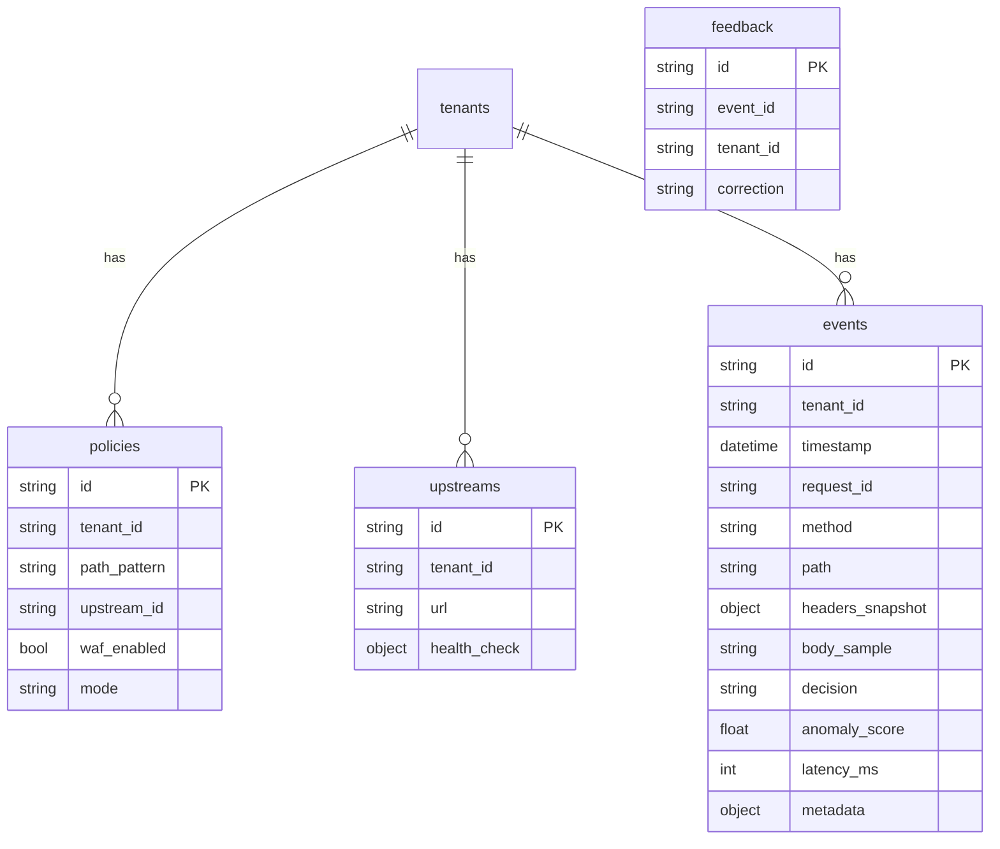
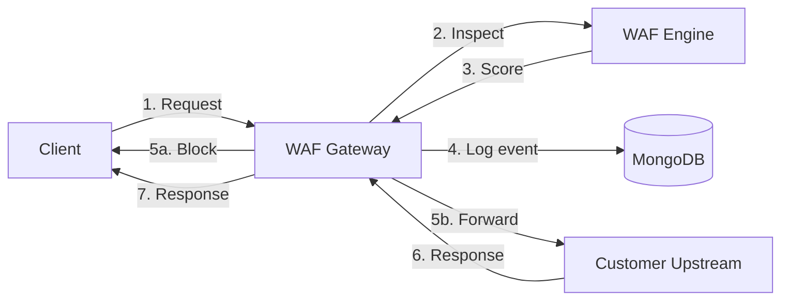

# Production-Grade WAF Gateway — Architecture Re-evaluation and 30-Day Roadmap

## Executive Summary

The current codebase is built as a **research ML project** with a dashboard and WAF middleware that protects only stub test routes. It is **not** a reverse-proxy security gateway. No customer traffic is proxied through the WAF in the default deployment. A complete reorientation is required to ship a product companies can put in front of production APIs.

---

## Critical Finding: There Is No Reverse Proxy

```mermaid
flowchart TB
  subgraph today[Current Architecture]
    Client[Client]
    Nginx[Nginx :80]
    Backend[Backend FastAPI :3001]
    Frontend[Frontend :3000]
    App1[Juice Shop :8080]
    App2[WebGoat :8081]
    App3[DVWA :8082]
    Client -->|"/" or "/api"| Nginx
    Nginx --> Frontend
    Nginx --> Backend
    Client -->|":8080/:8081/:8082"| App1
    Client -->|":8080/:8081/:8082"| App2
    Client -->|":8080/:8081/:8082"| App3
  end
  note[Apps exposed directly. WAF only protects /test/* stub routes. Zero real traffic through WAF.]
```


- **Dashboard Nginx** ([docker/nginx/nginx.conf](docker/nginx/nginx.conf)): Proxies `/` to frontend, `/api` to backend. No proxy to customer apps.
- **Backend WAF middleware** ([backend/middleware/waf_middleware.py](backend/middleware/waf_middleware.py)): Runs only on non-`/api` requests. The only such routes are `/test/*` (stubs). Customer apps are on separate ports; traffic never hits FastAPI.
- `**scripts/nginx_waf.conf**`: Uses OpenResty + Lua to call a standalone WAF service on 8000 and proxy to a single backend. This is a different topology (Nginx + sidecar WAF) and is not integrated into the main product or docker-compose.

**Bottom line**: There is no gateway that receives traffic and forwards to configurable upstreams. The product cannot sit in front of production APIs today.

---

## What Prevents Real Production Deployment TODAY


| Blocker                  | Severity | Description                                                                                                                 |
| ------------------------ | -------- | --------------------------------------------------------------------------------------------------------------------------- |
| No reverse proxy         | Critical | No code path that receives request → inspects → forwards to customer upstream. Apps are reached directly on their ports.    |
| No configurable upstream | Critical | Upstreams are hardcoded (Juice Shop, WebGoat, DVWA). No "my API at [https://api.mycompany.com](https://api.mycompany.com)". |
| Fixed topology           | Critical | Docker setup is dashboard + apps side-by-side. No "WAF as single entry point" deployment.                                   |
| No monitor mode          | High     | WAF always blocks when anomaly. Cannot log-only to validate before enabling block.                                          |
| SQLite/Postgres default  | High     | User requires MongoDB for high-volume events and multi-tenant readiness.                                                    |
| No tenant/org model      | High     | All data is global. No isolation for future SaaS.                                                                           |


---

## What Could Break Login, Session, File Upload, API Behavior


| Risk                       | Cause                                                                                                                                  | Impact                                         |
| -------------------------- | -------------------------------------------------------------------------------------------------------------------------------------- | ---------------------------------------------- |
| Login/session broken       | Missing Cookie/Authorization in WAF check (nginx_waf), or body consumed before forward                                                 | Auth/session context missing or requests fail  |
| File upload broken         | Full body buffered in memory; `request.body()` + `_receive` hack; binary decoded as UTF-8 with `errors='ignore'`                       | Memory exhaustion, corrupted binary uploads    |
| Large API payloads broken  | Nginx Lua truncates body at 1MB ([scripts/nginx_waf.conf:99](scripts/nginx_waf.conf)); backend has no explicit limit but buffers fully | Truncated requests, failures on large JSON/XML |
| Multipart/form-data        | Body parsed as JSON or string; multipart boundaries not preserved                                                                      | File uploads and form submissions fail         |
| WebSocket                  | WAF middleware skips `/ws`; customer app WebSockets have no proxy path                                                                 | Real-time features unusable                    |
| Streaming request/response | Full read of body; no streaming pass-through                                                                                           | Timeouts, memory issues for large payloads     |


---

## What Could Cause False Positives


| Source                 | Detail                                                                                                                                    |
| ---------------------- | ----------------------------------------------------------------------------------------------------------------------------------------- |
| ML threshold           | Default 0.5 may be aggressive; no per-path or per-endpoint tuning                                                                         |
| No monitor phase       | Block immediately; no calibration period on real traffic                                                                                  |
| Broad pattern matching | `_classify_threat_type` uses patterns like `localhost`, `127.0.0.1`, `http://` for SSRF — can flag health checks, webhooks, internal APIs |
| Model gaps             | Untrained or poorly trained model; anomaly detector without enough benign variety                                                         |
| No feedback loop       | No "mark as false positive" or correction path to improve decisions                                                                       |


---

## What Is Over-Engineered for MVP


| Component                                               | Recommendation                                                                              |
| ------------------------------------------------------- | ------------------------------------------------------------------------------------------- |
| Agentic AI / Copilot                                    | Defer. Not needed for traffic correctness or initial beta.                                  |
| Bot detection, geo-fencing, threat intel, IP reputation | Defer. Focus on proxy + WAF + observability first.                                          |
| 15+ route modules (advanced features)                   | Keep only: proxy, WAF config, events/logs, health. Minimize dashboard for 30-day goal.      |
| Continuous learning pipeline                            | Defer until ML is validated and feedback loop exists.                                       |
| Attack test suites (10 categories)                      | Keep for regression; do not expand. Detection breadth comes after proxy correctness.        |
| PostgreSQL + Redis in default stack                     | Simplify: MongoDB only for events/config for now; Redis optional for caching.               |
| Nginx Lua / OpenResty                                   | Standard Nginx reverse proxy + upstream gateway is sufficient; avoid Lua for first version. |


---

## What Is Missing for Appliance-Style Deployment


| Gap                      | Required                                                                                                            |
| ------------------------ | ------------------------------------------------------------------------------------------------------------------- |
| Reverse proxy            | Gateway service that receives HTTP(S), inspects, forwards to configured upstream(s).                                |
| Request normalization    | Canonical representation for inspection (method, path, headers, body sampling) without altering forwarded request.  |
| Pass-through correctness | Forward request/response byte-for-byte (except when blocking). Support binary, multipart, streaming where feasible. |
| Configurable upstreams   | Per-route or per-host mapping: path prefix → upstream URL.                                                          |
| Monitor mode             | Log and score only; no block until explicitly enabled.                                                              |
| Fail-open by default     | WAF/ML down → allow traffic. Already present; keep.                                                                 |
| Sub-10-minute deploy     | Single `docker compose up` or equivalent; env-based config; no manual DB migrations for MVP.                        |
| Observability            | Structured logs (request ID, decision, latency); event store for debugging.                                         |
| Multi-tenant readiness   | `tenant_id` (or `org_id`) on all event/config documents.                                                            |


---

## MongoDB Data Model (High Level)




- **events**: Request metadata, decision (allow/block), score, timing. Flexible schema for future fields.
- **policies**: Path patterns, upstream mapping, WAF on/off, mode (monitor/block).
- **upstreams**: Target URLs and optional health checks.
- **feedback**: FP/FN corrections for future model improvement.
- **tenants**: Isolation for multi-tenant SaaS.

---

## NEW Prioritized 30-Day Roadmap

### Week 1: Gateway Core (Days 1–7)

**Goal**: Inline proxy that receives traffic and forwards to a configurable upstream.


| Task                        | Details                                                                                                                                                                                  |
| --------------------------- | ---------------------------------------------------------------------------------------------------------------------------------------------------------------------------------------- |
| Build reverse proxy service | New service or module: HTTP client (httpx/aiohttp) that forwards request to upstream, streams response back. Preserve method, headers, body, query.                                      |
| Configurable upstream       | Env or config: `UPSTREAM_URL` (e.g. `http://app:8080`). Single upstream for MVP.                                                                                                         |
| Request flow                | Client → Gateway → (inspect) → Upstream → (response) → Client. Inspect = WAF when enabled.                                                                                               |
| Pass-through rules          | Do not modify request/response except on block. For POST/PUT/PATCH: stream or bounded buffer (e.g. 10MB max); reject oversize with 413.                                                  |
| Path-based routing          | Simple: `/*` → default upstream. Extend later with path prefixes.                                                                                                                        |
| Integration                 | Replace or augment current FastAPI app so that non-dashboard routes (e.g. `/proxy/*` or root when used as gateway) go through proxy. Or run proxy as separate process on dedicated port. |


**Output**: A working gateway that forwards real traffic to one upstream.

---

### Week 2: Safety and Observability (Days 8–14)

**Goal**: Monitor mode, correct blocking, and debuggable events.


| Task                  | Details                                                                                                                                                   |
| --------------------- | --------------------------------------------------------------------------------------------------------------------------------------------------------- |
| Monitor mode          | `WAF_MODE=monitor                                                                                                                                         |
| MongoDB integration   | Replace SQLAlchemy for events. Collections: `events`, `policies`, `upstreams`, `feedback`, `tenants`. Use Motor (async) or PyMongo.                       |
| Event logging         | Every request: `request_id`, method, path, headers (sanitized), body sample (truncated, e.g. 4KB), decision, score, latency, timestamp. Write to MongoDB. |
| Request normalization | Canonical string for WAF input (method, path, sorted query, selected headers, body sample). No modification of actual request.                            |
| Health endpoints      | `/health` (liveness), `/ready` (MongoDB + upstream reachable).                                                                                            |
| Bounded body handling | Max body size for inspection (e.g. 1MB); beyond that, forward without WAF body context or reject. Document limits.                                        |


**Output**: Monitor-only deployment with full event trail; safe to run in front of production.

---

### Week 3: Deployment and Onboarding (Days 15–21)

**Goal**: Deploy in under 10 minutes; first "add app" flow.


| Task                  | Details                                                                                                                                  |
| --------------------- | ---------------------------------------------------------------------------------------------------------------------------------------- |
| Single-command deploy | `docker compose up -d` with env file. Gateway + MongoDB (+ optional dashboard). No Postgres/Redis for MVP if not required.               |
| Env-based config      | `UPSTREAM_URL`, `WAF_MODE`, `WAF_THRESHOLD`, `MONGODB_URI`, `BODY_MAX_BYTES`. No hardcoded app URLs.                                     |
| Minimal dashboard     | One page: events table (filter by time, decision, path), simple stats (requests, blocked, latency p95). Auth optional for internal beta. |
| Onboarding flow       | "Add your first app": input upstream URL, optional path prefix. Validate upstream reachable. Save to `upstreams` + `policies`.           |
| Documentation         | README: deploy steps, required env vars, architecture diagram, troubleshooting (logs, MongoDB queries).                                  |


**Output**: Customer can deploy, point to their API, and see traffic in dashboard.

---

### Week 4: Beta Hardening (Days 22–30)

**Goal**: Stable enough for first paying/pilot customer.


| Task                        | Details                                                                                                                                        |
| --------------------------- | ---------------------------------------------------------------------------------------------------------------------------------------------- |
| WebSocket pass-through      | If customer app uses WebSockets, proxy `Upgrade` and `Connection` correctly. Or document "WebSocket not yet supported" and provide workaround. |
| Timeouts and limits         | Upstream connect/send/read timeouts; max body size; max headers size. Document and make configurable.                                          |
| Graceful shutdown           | Drain in-flight requests before exit.                                                                                                          |
| Feedback API                | `POST /api/feedback` with `event_id`, `correction: "false_positive"                                                                            |
| Runbook                     | What to do when: WAF down (fail-open), high latency, MongoDB full, upstream unhealthy.                                                         |
| Optional: rule-based bypass | Allow paths like `/health`, `/ready` to bypass WAF. Configurable list.                                                                         |


**Output**: First beta customer can run behind the gateway with monitoring, feedback collection, and clear operational docs.

---

## Architecture: Target State (30 Days)




- Gateway: reverse proxy + WAF orchestration.
- WAF: ML-based (when model exists) or rule-only; always fail-open if unavailable.
- MongoDB: events, policies, upstreams, feedback.
- Single upstream for MVP; multi-route later.

---

## What to Strip or Defer (30-Day Scope)

- Agentic AI, Copilot, bot detection, geo-fencing, threat intel, IP reputation, advanced security rules: **defer**.
- Full dashboard (analytics, charts, users, audit): **minimize** to events + basic stats.
- PostgreSQL, Redis: **replace** with MongoDB for events; Redis only if needed for rate limiting.
- Juice Shop, WebGoat, DVWA: **optional** for testing; not part of default production deploy.
- Nginx Lua / OpenResty: **use plain Nginx** or gateway as sole entry point; no Lua for v1.
- Continuous learning, retraining: **defer** until feedback data exists and ML is validated.

---

## Files to Create or Heavily Modify


| Area           | Files                                                                                                              |
| -------------- | ------------------------------------------------------------------------------------------------------------------ |
| Gateway        | New `gateway/proxy.py` or `backend/gateway/` — reverse proxy, request forwarding, streaming                        |
| MongoDB        | New `backend/storage/mongodb.py` — connection, events, policies, upstreams                                         |
| Config         | [backend/config.py](backend/config.py) — `UPSTREAM_URL`, `WAF_MODE`, `MONGODB_URI`, `BODY_MAX_BYTES`               |
| WAF middleware | [backend/middleware/waf_middleware.py](backend/middleware/waf_middleware.py) — monitor mode, no block when monitor |
| Main app       | [backend/main.py](backend/main.py) — wire proxy route, gateway as default for non-dashboard paths                  |
| Docker         | New or updated `docker-compose.gateway.yml` — gateway + MongoDB, no Postgres for MVP                               |
| Dashboard      | Simplify to events + stats; remove or hide advanced features for 30-day scope                                      |


---

## Success Criteria (30 Days)

1. Customer runs `docker compose up`, sets `UPSTREAM_URL` to their API, and all traffic flows through the gateway.
2. In monitor mode, zero requests are blocked; all decisions and scores are logged to MongoDB.
3. In block mode (when enabled), anomalous requests are blocked; others pass through unchanged.
4. Login, file upload, and standard API flows work through the gateway (no corruption, no truncation within configured limits).
5. Events are queryable in MongoDB; minimal dashboard shows recent traffic and decisions.
6. Feedback API accepts FP/FN corrections for future use.
7. Deployment and usage are documented in a single README or runbook.

