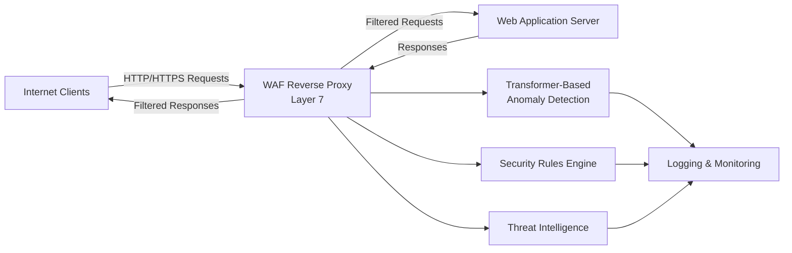
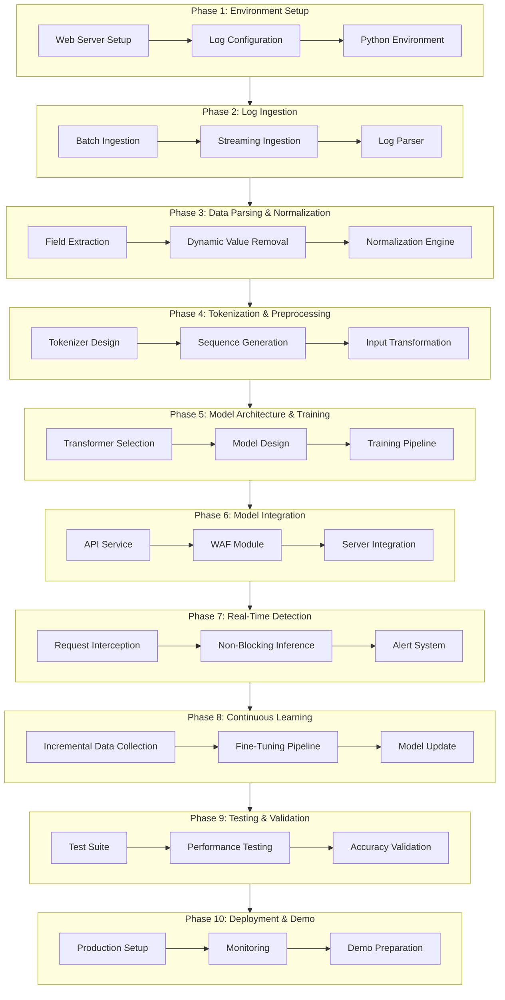

# Transformer-based End-to-End WAF Pipeline - 10 Phase Implementation Plan

## Overview

This plan outlines a complete implementation of a Transformer-based WAF system that processes web server logs, trains anomaly detection models, and provides real-time protection with continuous learning capabilities.

### WAF Fundamentals

**What is a WAF?**

A Web Application Firewall (WAF) is the first line of defense between web applications and internet traffic. It sits between the web application, network, and the internet, monitoring, filtering, and blocking potentially malicious traffic based on predefined security rules.

**Key Characteristics:**

- Operates at **Layer 7 (Application Layer)** of the OSI model
- Functions as a **reverse proxy** - clients communicate only with the WAF, not directly with backend systems
- Protects against: zero-day exploits, malware, OWASP Top 10 vulnerabilities, and impersonation attacks
- Analyzes both incoming requests and outgoing responses

**Security Models:**

- **Positive Security Model:** Explicitly defines allowed patterns and behaviors (whitelist approach)
- **Negative Security Model:** Identifies and blocks known malicious patterns (blacklist approach)
- **Hybrid Approach (Our Implementation):** Combines ML-based anomaly detection (positive model) with signature-based rules (negative model)

**Deployment Modes:**

- **Inline/Bridge Mode:** Deployed between web application and network (our primary mode)
- **Cloud-Based:** Hosted by third-party providers (optional for scalability)
- **Appliance-Based:** Physical device on-premises (for compliance requirements)
- **WAFaaS:** Fully managed service (future consideration)

**Operational Modes:**

- **Log Mode:** Monitors and logs suspicious traffic without blocking (for testing and tuning)
- **Block Mode:** Actively blocks malicious traffic matching security rules (production mode)

## Architecture Overview

### WAF Deployment Architecture (Layer 7 - Reverse Proxy)

### Implementation Pipeline Architecture

### 9 Core WAF Protection Methods

Our Transformer-based WAF will implement the following protection mechanisms:

1. **IP Fencing** - Blacklist malicious IPs using reputation databases
2. **Geo-fencing/Geo-blocking** - Allow/deny based on geographical location
3. **Request Inspection** - Deep analysis of headers, body, query parameters
4. **Response Inspection** - Monitor outbound traffic for data leakage (DLP)
5. **Security Rules** - Pre-defined and custom rules for known attack patterns
6. **Anomaly Scoring** - Risk-based scoring system for deviations
7. **DDoS Rate Limiting** - Behavioral analysis for rate limiting
8. **Bot Mitigation** - Detect and block automated traffic
9. **Threat Intelligence** - Integration with threat intelligence feeds

## Phase Breakdown

### Phase 1: Environment Setup & Web Application Deployment

**Duration:** Day 1

**Objective:** Set up development environment, deploy sample web applications, and configure web servers for log generation with WAF-ready architecture.

**Key Tasks:**

- Deploy 3 sample WAR applications to Apache Tomcat or similar
  - Include diverse endpoints: login, search, file upload, API endpoints
  - Ensure applications generate varied traffic patterns
- Configure Apache/Nginx with detailed access logging
  - Enable full request/response logging (headers, body, query params)
  - Configure HTTPS/TLS for encrypted traffic inspection
  - Set up log rotation and retention policies
- Set up Python 3.9+ environment with virtual environment
- Install dependencies:
  - ML Framework: PyTorch or TensorFlow
  - Transformer Library: Hugging Face Transformers
  - API Framework: FastAPI (for WAF service)
  - GeoIP libraries: geoip2, maxminddb (for Geo-fencing)
  - Threat intelligence: requests, feedparser (for threat feeds)
- Create project directory structure:
  - `src/waf/` - Core WAF modules
  - `src/detection/` - Detection engines
  - `src/rules/` - Security rules engine
  - `src/threat_intel/` - Threat intelligence integration
  - `data/` - Logs and datasets
  - `models/` - Trained models
  - `config/` - Configuration files
  - `tests/` - Test suites including OWASP Top 10 payloads
- Plan WAF deployment architecture (reverse proxy setup)

**Deliverables:**

- Running web applications accessible on different ports
- Access logs being generated in standard format with full request details
- Python environment ready for development with all dependencies
- Project structure with comprehensive directory layout
- WAF deployment architecture documented

---

### Phase 2: Log Ingestion System

**Duration:** Day 2

**Objective:** Build a robust log ingestion system supporting both batch and streaming modes.

**Key Tasks:**

- Implement batch log reader for historical logs
- Implement streaming log tailer for real-time logs
- Add log format detection (Apache Common/Combined, Nginx)
- Create log queue/buffer for processing
- Implement error handling and retry mechanisms
- Add log validation and sanitization

**Deliverables:**

- `log_ingestion.py` module with batch and streaming modes
- Configuration file for log paths and formats
- Unit tests for ingestion components
- Documentation on supported log formats

---

### Phase 3: Request Parsing & Normalization (Request/Response Inspection)

**Duration:** Day 3

**Objective:** Extract and normalize request/response components for comprehensive inspection, removing dynamic values that don't contribute to anomaly detection.

**Key Tasks:**

**Request Inspection:**

- Parse HTTP method, path, query parameters, headers
- Extract POST body/payload content (JSON, XML, form-data, multipart)
- **Header Inspection:**
  - Analyze User-Agent strings for bot detection
  - Check Referer headers for suspicious sources
  - Inspect Cookie headers for suspicious values
  - Validate Content-Type headers
- **Request Body Inspection:**
  - Decode and analyze HTTPS traffic, XML, JSON formats
  - Detect SQL injection patterns in query parameters
  - Identify XSS payloads in input fields
  - Detect command injection attempts
  - Identify directory traversal patterns (../)
  - Detect file inclusion attempts (LFI/RFI)
- **Query Parameter Analysis:**
  - Extract and normalize all query string parameters
  - Detect encoded payloads (URL encoding, base64, etc.)

**Response Inspection (Data Loss Prevention):**

- Parse response headers and body
- Detect PII patterns (SSN, credit cards, emails)
- Identify sensitive data exposure
- Validate response codes (detect anomalies)
- Verify content type matches expected resource type

**Normalization:**

- Replace UUIDs, timestamps, session IDs with placeholders
- Normalize numeric IDs to generic patterns
- Remove or normalize authentication tokens
- Standardize date/time formats
- Normalize IP addresses (for privacy)
- Create normalization configuration file
- Build comprehensive request/response object structure

**Deliverables:**

- `parser.py` module for log parsing with full request/response support
- `normalizer.py` module for request/response normalization
- `inspector.py` module for header/body inspection
- `dlp.py` module for Data Loss Prevention in responses
- Normalization rules configuration
- Test suite with sample requests including OWASP Top 10 attack patterns

---

### Phase 4: Tokenization & Sequence Preparation

**Duration:** Day 4

**Objective:** Convert normalized requests into token sequences suitable for Transformer models.

**Key Tasks:**

- Design tokenization strategy (character-level, subword, or custom)
- Implement tokenizer class
- Create sequence generation from request components
- Handle variable-length sequences (padding/truncation)
- Build vocabulary from training data
- Implement data loader for training

**Deliverables:**

- `tokenizer.py` module
- Vocabulary file generation
- Sequence preparation utilities
- Data loader for PyTorch/TensorFlow

---

### Phase 5: Transformer Model Architecture & Training

**Duration:** Day 5

**Objective:** Select, design, and train a Transformer-based anomaly detection model.

**Key Tasks:**

- Research and select Transformer architecture (BERT, GPT-2, DistilBERT, or custom)
- Design model architecture for anomaly detection
- Implement training script with:
  - Data splitting (train/validation)
  - Training loop with loss calculation
  - Model checkpointing
  - Evaluation metrics
- Generate synthetic benign dataset from 3 web applications
- Train initial model on benign traffic only
- Implement anomaly scoring mechanism

**Deliverables:**

- `model.py` with Transformer architecture
- `train.py` training script
- Trained model checkpoint
- Training logs and metrics
- Synthetic dataset generation script

---

### Phase 6: WAF Integration with Web Server

**Duration:** Day 6

**Objective:** Integrate the trained model into the web server pipeline for real-time detection.

**Key Tasks:**

- Design WAF service architecture (microservice, module, or sidecar)
- Implement WAF API service (FastAPI/Flask)
- Create Apache/Nginx integration:
  - Option A: Lua module for Nginx
  - Option B: ModSecurity-like module for Apache
  - Option C: Reverse proxy/sidecar pattern
- Implement request forwarding to WAF service
- Add configuration for detection thresholds

**Deliverables:**

- `waf_service.py` API service
- Web server integration module/configuration
- Integration documentation
- Health check endpoints

---

### Phase 7: Real-Time Non-Blocking Detection

**Duration:** Day 7

**Objective:** Implement concurrent, non-blocking request processing for high-throughput scenarios.

**Key Tasks:**

- Implement async request processing
- Use thread pool or async/await for concurrent inference
- Add request queuing mechanism
- Implement timeout handling
- Create detection result structure
- Add logging for detected anomalies
- Optimize model inference (batching, quantization)

**Deliverables:**

- Async detection service
- Non-blocking inference implementation
- Performance benchmarks
- Concurrent request handling tests

---

### Phase 8: Continuous Learning & Incremental Updates

**Duration:** Day 8

**Objective:** Build automated system for incremental model updates using new benign traffic.

**Key Tasks:**

- Implement incremental data collection from new logs
- Create fine-tuning pipeline (not full retraining)
- Design model versioning system
- Implement model hot-swapping mechanism
- Add validation before deploying new model
- Create scheduling mechanism for periodic updates
- Implement rollback capability

**Deliverables:**

- `incremental_learning.py` module
- Fine-tuning script
- Model versioning system
- Update scheduler
- Rollback mechanism

---

### Phase 9: Testing, Validation & Performance Tuning

**Duration:** Day 9

**Objective:** Comprehensive testing, accuracy validation, and performance optimization.

**Key Tasks:**

- Create test suite with malicious payloads (SQLi, XSS, RCE, etc.)
- Measure detection accuracy (TPR, FPR)
- Test false positive rate on benign traffic
- Performance testing (latency, throughput)
- Load testing with concurrent requests
- Model optimization (quantization, pruning)
- Create evaluation report

**Deliverables:**

- Comprehensive test suite
- Performance benchmarks
- Accuracy metrics report
- Optimization documentation

---

### Phase 10: Deployment, Monitoring & Demo Preparation

**Duration:** Day 10

**Objective:** Final deployment, monitoring setup, and preparation for live demonstration.

**Key Tasks:**

- Production deployment configuration
- Set up monitoring and alerting
- Create demo script with malicious payloads
- Prepare documentation for judges
- Create visualization dashboard (optional)
- Final integration testing
- Prepare presentation materials

**Deliverables:**

- Production-ready deployment
- Monitoring dashboard
- Demo script with test cases
- Final documentation
- Presentation materials

## Technical Stack Recommendations

- **Web Server:** Apache HTTP Server or Nginx
- **Python:** 3.9+
- **ML Framework:** PyTorch or TensorFlow
- **Transformer Library:** Hugging Face Transformers or custom implementation
- **API Framework:** FastAPI or Flask
- **Database:** SQLite/PostgreSQL for logging detections
- **Containerization:** Docker (optional but recommended)

## Success Criteria

1. Successfully ingests logs from Apache/Nginx
2. Trains Transformer model on benign traffic
3. Detects malicious requests in real-time
4. Non-blocking concurrent request processing
5. Incremental learning capability demonstrated
6. High detection accuracy with low false positives
7. Live demo successfully detects judge-provided payloads

## Risk Mitigation

- **Model Training Time:** Start training early, use pre-trained models if needed
- **Integration Complexity:** Use sidecar pattern for easier integration
- **Performance:** Implement model quantization and caching
- **False Positives:** Fine-tune thresholds based on validation data