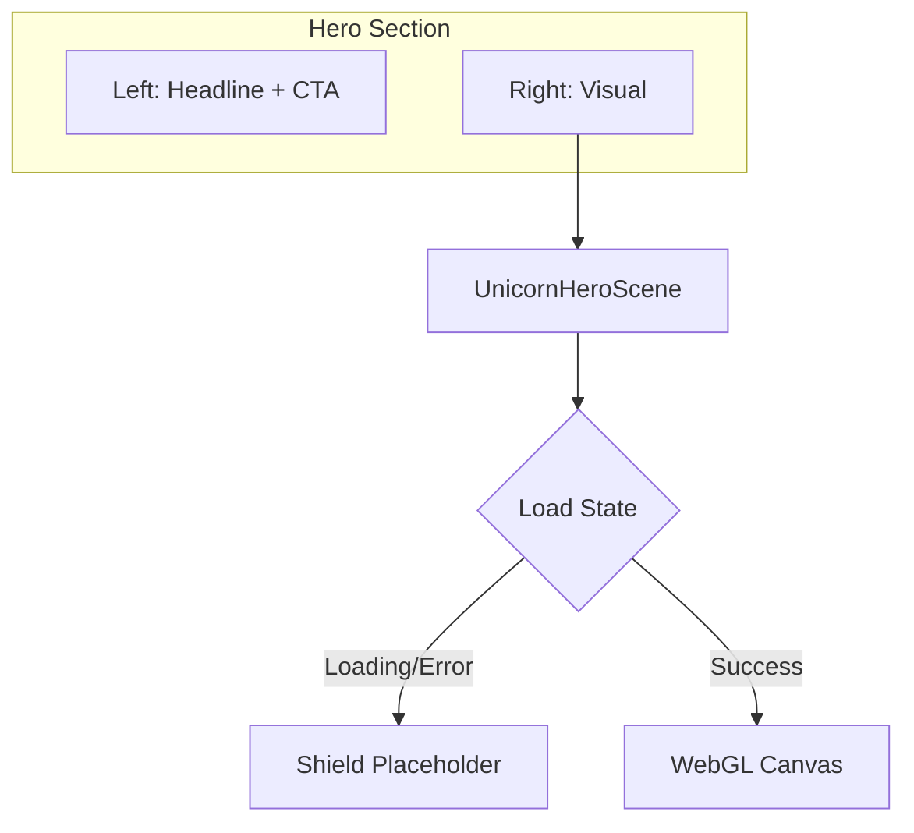

# Unicorn Studio Component Integration Plan

## Summary

[Unicorn Studio](https://www.unicorn.studio/) is a no-code WebGL platform for creating interactive 3D/animated scenes. Your project at [edit/z8LMixQteI8lpp6wJAUr](https://www.unicorn.studio/edit/z8LMixQteI8lpp6wJAUr) can be embedded in the WAF landing page using the `unicornstudio-react` package (36K+ weekly npm downloads, Next.js compatible).

## Prerequisite: Get Embed ID

Before implementation, confirm the **embed project ID**:

1. In Unicorn Studio, open your project and click **Export** (or Share)
2. Select **Embed**
3. Copy the project ID from the embed code — it may be `z8LMixQteI8lpp6wJAUr` (from the edit URL) or a different ID shown in the Embed dialog

## Implementation Steps

### 1. Install dependency

```bash
npm install unicornstudio-react
```

### 2. Create Unicorn Scene wrapper component

Create [frontend/components/landing/unicorn-hero-scene.tsx](frontend/components/landing/unicorn-hero-scene.tsx):

- Use `unicornstudio-react/next` for Next.js
- Make it a client component (`"use client"`)
- Accept `projectId` via prop (e.g. from env: `NEXT_PUBLIC_UNICORN_PROJECT_ID`)
- Use the current Shield icon as a placeholder (while loading or on error)
- Configure: `scale={0.8}` (performance), `lazyLoad={false}` (hero is above-the-fold), `showPlaceholderWhileLoading={true}`, `showPlaceholderOnError={true}`

### 3. Update Hero Section

Modify [frontend/components/landing/hero-section.tsx](frontend/components/landing/hero-section.tsx):

- Add `"use client"` (required for UnicornScene)
- Replace the right-column content (Shield + green-bg box) with `UnicornHeroScene`
- Preserve layout: same `max-w-md aspect-square rounded-2xl` container and green background as fallback
- Ensure responsive sizing for mobile and desktop

### 4. Environment variable (optional)

Add to `.env.local` (if you prefer not to hardcode):

```
NEXT_PUBLIC_UNICORN_PROJECT_ID=z8LMixQteI8lpp6wJAUr
```

## Architecture




## Technical Notes


| Consideration       | Approach                                                           |
| ------------------- | ------------------------------------------------------------------ |
| **SSR**             | UnicornScene loads external script; wrapper must be client-only    |
| **Performance**     | Use `scale={0.8}`; consider `fps={30}` on mobile via media query   |
| **Fallback**        | Shield icon placeholder for loading/error/WebGL-unsupported        |
| **Dependencies**    | Loads `unicornStudio.umd.js` from Unicorn Studio CDN (proprietary) |
| **Browser support** | WebGL2 + hardware acceleration (Chrome recommended)                |


## Files to Modify/Create


| File                                                                                                     | Action                                      |
| -------------------------------------------------------------------------------------------------------- | ------------------------------------------- |
| [frontend/package.json](frontend/package.json)                                                           | Add `unicornstudio-react`                   |
| [frontend/components/landing/unicorn-hero-scene.tsx](frontend/components/landing/unicorn-hero-scene.tsx) | **Create** — wrapper with placeholder       |
| [frontend/components/landing/hero-section.tsx](frontend/components/landing/hero-section.tsx)             | **Edit** — swap Shield for UnicornHeroScene |


## Alternative: Self-hosted JSON export

If you prefer not to rely on Unicorn Studio's CDN, you can:

1. In Unicorn Studio: Export → **Code** (JSON)
2. Save JSON to `frontend/public/unicorn-scene.json`
3. Use `jsonFilePath="/unicorn-scene.json"` instead of `projectId`

This removes external script dependency but requires manual updates when the scene changes.