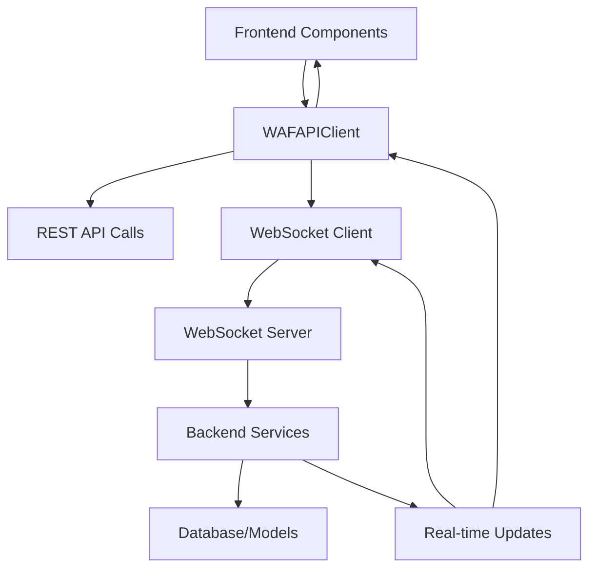

## Overview

This mega-plan outlines the complete transformation of the WAF dashboard from a basic HTML interface with mock data to a professional, real-time monitoring system that seamlessly integrates with the FastAPI backend. The plan addresses both the removal of all mock data and the implementation of a rich, professional UI with comprehensive real-time capabilities.

## Current State Analysis

### Frontend Issues:

- Basic HTML with minimal styling
- No professional UI components
- No real-time data integration
- No error handling or loading states
- No responsive design
- No accessibility features

### Backend Integration Requirements:

- FastAPI service with real-time endpoints
- WebSocket or Server-Sent Events for live updates
- Comprehensive API for dashboard data
- Authentication and authorization
- Error handling and fallback mechanisms

## Backend API Specification (Future Integration)

### Core WAF Service Endpoints

```typescript
// Already planned in backend
POST /check - Request anomaly detection
GET  /health - Service health check  
GET  /metrics - Basic WAF metrics
```

### Dashboard-Specific API Endpoints (To Be Added)

```typescript
// Real-time monitoring
GET  /api/dashboard/overview - Dashboard overview data
GET  /api/traffic/live - Live traffic stream
GET  /api/traffic/recent - Recent traffic with pagination
GET  /api/analytics/summary - Attack analytics summary
GET  /api/analytics/geographic - Geographic attack distribution
GET  /api/analytics/timeline - Attack timeline data
GET  /api/alerts/active - Active alerts
GET  /api/alerts/recent - Recent alerts with filtering
GET  /api/metrics/system - System performance metrics
GET  /api/metrics/model - AI model performance metrics
GET  /api/logs/search - Searchable logs with filters

// Configuration management
GET  /api/config - Get current configuration
PUT  /api/config - Update configuration
POST /api/config/reset - Reset to defaults

// Real-time subscriptions (WebSocket/SSE)
WS   /ws/dashboard - Real-time dashboard updates
WS   /ws/traffic - Live traffic monitoring
WS   /ws/alerts - Real-time alert notifications
```

## Professional UI Architecture

### Component Library Structure

```
frontend/
├── components/
│   ├── ui/                    # Professional UI components
│   │   ├── button.tsx        # Multi-variant buttons
│   │   ├── input.tsx         # Form inputs with validation
│   │   ├── card.tsx          # Professional cards
│   │   ├── table.tsx         # Data tables with sorting
│   │   ├── modal.tsx         # Modal dialogs
│   │   ├── tabs.tsx          # Tab navigation
│   │   ├── badge.tsx         # Status badges
│   │   ├── alert.tsx         # Alert notifications
│   │   ├── loading.tsx       # Loading states
│   │   ├── error-boundary.tsx # Error handling
│   │   └── tooltip.tsx       # Tooltips and help
│   ├── charts/               # Chart components
│   │   ├── traffic-chart.tsx
│   │   ├── anomaly-chart.tsx
│   │   ├── geographic-map.tsx
│   │   ├── timeline-chart.tsx
│   │   └── metrics-chart.tsx
│   ├── dashboard/            # Dashboard-specific components
│   │   ├── metric-card.tsx   # KPI cards
│   │   ├── status-indicator.tsx
│   │   ├── activity-feed.tsx
│   │   └── quick-actions.tsx
│   ├── forms/                # Configuration forms
│   │   ├── waf-settings.tsx
│   │   ├── alert-config.tsx
│   │   └── rate-limiting.tsx
│   └── providers/            # Context providers
│       ├── theme-provider.tsx
│       ├── api-provider.tsx
│       └── websocket-provider.tsx
```

## Implementation Phases

### Phase 1: Foundation & Professional UI Framework (1 week)

#### 1.1 Professional UI Component Library

- **shadcn/ui Integration**: Install and configure professional component library
- **Design System**: Implement consistent color palette, typography, spacing
- **Theme System**: Complete dark/light mode with CSS custom properties
- **Responsive Design**: Mobile-first responsive components

#### 1.2 Core Infrastructure

- **API Client**: Type-safe API client with error handling
- **State Management**: Zustand store for global state
- **WebSocket Client**: Real-time data subscriptions
- **Error Handling**: Comprehensive error boundaries and fallbacks

#### 1.3 Layout & Navigation

- **Professional Sidebar**: Collapsible navigation with icons
- **Header Component**: Search, notifications, user menu
- **Breadcrumb Navigation**: Page hierarchy indication
- **Loading States**: Skeleton loaders and progress indicators

### Phase 2: Dashboard Core Features (1 week)

#### 2.1 Overview Dashboard

- **Real-time Metrics**: Live KPI updates with WebSocket
- **System Health**: Status indicators with animations
- **Activity Feed**: Real-time event stream
- **Quick Actions**: Common operations shortcuts

#### 2.2 Traffic Monitoring Page

- **Live Stream**: Real-time request monitoring
- **Advanced Filtering**: Multi-criteria search and filter
- **Request Details**: Expandable request inspection
- **Export Functionality**: CSV/JSON export capabilities

#### 2.3 Analytics Dashboard

- **Attack Distribution**: Interactive pie/bar charts
- **Geographic Map**: Attack origin visualization
- **Timeline Charts**: Historical trend analysis
- **Top Attackers**: Threat actor identification

### Phase 3: Advanced Features & Real-time Integration (1 week)

#### 3.1 Logs & Alerts Management

- **Advanced Search**: Full-text search with filters
- **Alert Management**: Acknowledge, escalate, resolve
- **Severity Filtering**: Color-coded severity levels
- **Bulk Operations**: Multi-select actions

#### 3.2 Model Performance Monitoring

- **Accuracy Metrics**: Precision, recall, F1-score tracking
- **Inference Latency**: Response time monitoring
- **Throughput Charts**: Requests per second visualization
- **Model Version History**: Performance comparison

#### 3.3 Configuration Management

- **WAF Settings**: Anomaly thresholds, module toggles
- **Alert Configuration**: Notification settings and rules
- **Rate Limiting**: Request throttling configuration
- **Validation**: Real-time configuration validation

### Phase 4: Real-time Features & Performance (1 week)

#### 4.1 WebSocket Integration

- **Live Dashboard**: Real-time metric updates
- **Traffic Stream**: Live request monitoring
- **Alert Notifications**: Instant threat notifications
- **Connection Management**: Auto-reconnect and fallback

#### 4.2 Performance Optimization

- **Code Splitting**: Route-based and component-based splitting
- **Caching**: API response caching with React Query
- **Virtualization**: Large list virtualization
- **Bundle Analysis**: Optimize bundle size

#### 4.3 Accessibility & Polish

- **WCAG Compliance**: Screen reader support, keyboard navigation
- **Error States**: User-friendly error messages
- **Loading States**: Progressive loading and skeletons
- **Animations**: Smooth transitions and micro-interactions

## Backend Integration Strategy

### API Client Architecture

```typescript
// lib/api/client.ts
export class WAFAPIClient {
  private baseURL: string;
  private wsClient: WebSocketClient;
  
  // REST API methods
  async getDashboardOverview(): Promise<DashboardData>
  async getTrafficStream(filters: TrafficFilters): Promise<TrafficData[]>
  async getAnalytics(): Promise<AnalyticsData>
  async acknowledgeAlert(alertId: string): Promise<void>
  
  // Real-time subscriptions
  subscribeToDashboard(onUpdate: (data: DashboardData) => void): Subscription
  subscribeToTraffic(onUpdate: (data: TrafficData) => void): Subscription
  subscribeToAlerts(onUpdate: (data: AlertData) => void): Subscription
}
```

### Real-time Data Flow



### Error Handling Strategy

- **Network Errors**: Retry logic with exponential backoff
- **Backend Unavailable**: Graceful degradation to cached data
- **WebSocket Disconnection**: Auto-reconnect with offline indicators
- **Data Validation**: Runtime type checking for API responses

## Technology Stack Decisions

### UI Framework

- **shadcn/ui + Radix UI**: Professional, accessible component library
- **Tailwind CSS**: Utility-first styling with custom design system
- **Framer Motion**: Smooth animations and transitions
- **React Hook Form**: Form management with validation

### State Management

- **Zustand**: Lightweight state management for global state
- **React Query**: Server state management with caching
- **Context API**: Theme and configuration state

### Real-time Communication

- **WebSocket**: Primary real-time communication protocol
- **Server-Sent Events**: Fallback for environments without WS support
- **Polling**: Backup mechanism for critical data

### Data Visualization

- **Chart.js + react-chartjs-2**: Flexible charting library
- **D3.js**: Advanced visualizations (maps, complex charts)
- **Recharts**: React-native charting components

## Testing & Quality Assurance

### Component Testing

- **Unit Tests**: Component behavior and interactions
- **Integration Tests**: API integration and data flow
- **E2E Tests**: Complete user workflows

### Performance Testing

- **Bundle Size**: Monitor and optimize bundle size
- **Runtime Performance**: Memory usage and rendering performance
- **Network Performance**: API response times and caching efficiency

### Accessibility Testing

- **Screen Reader**: NVDA, JAWS compatibility
- **Keyboard Navigation**: Full keyboard accessibility
- **Color Contrast**: WCAG AA compliance
- **Focus Management**: Proper focus indicators and management

## Deployment & Production Readiness

### Build Optimization

- **Static Generation**: Pre-render dashboard components
- **Image Optimization**: Next.js Image component for charts
- **Font Optimization**: Self-hosted fonts with preloading
- **CSS Optimization**: Purge unused styles, minification

### Environment Configuration

- **Environment Variables**: API endpoints, feature flags
- **Build-time Configuration**: Different builds for dev/staging/prod
- **Runtime Configuration**: Dynamic configuration loading

### Monitoring & Analytics

- **Error Tracking**: Sentry integration for error monitoring
- **Performance Monitoring**: Real user monitoring
- **Usage Analytics**: User behavior and feature usage

## Success Metrics

### Technical Metrics

- **Performance**: <2s initial page load, <100ms subsequent navigation
- **Accessibility**: WCAG AA compliant across all components
- **Bundle Size**: <500KB initial bundle, <100KB per route
- **Real-time Latency**: <500ms for live updates

### User Experience Metrics

- **Usability**: Intuitive navigation and clear information hierarchy
- **Responsiveness**: Perfect mobile and desktop experience
- **Reliability**: <0.1% error rate, graceful error handling
- **Real-time**: Live updates within 2 seconds of backend changes

### Development Metrics

- **Maintainability**: Well-structured, documented codebase
- **Test Coverage**: >80% test coverage for critical components
- **Type Safety**: Full TypeScript coverage with strict mode
- **Developer Experience**: Hot reload, type checking, comprehensive tooling

## Migration Strategy

### Gradual Backend Integration

1. **Mock Data Phase**: Complete UI with mock data for development
2. **API Integration**: Replace mock endpoints with real API calls
3. **WebSocket Integration**: Add real-time subscriptions
4. **Production Deployment**: Full production deployment with monitoring

### Feature Flags

- **Backend Toggle**: Switch between mock and real APIs
- **Real-time Toggle**: Enable/disable WebSocket connections
- **Feature Flags**: Gradually enable new features

### Rollback Plan

- **Version Control**: Git-based rollback capabilities
- **Feature Toggles**: Ability to disable problematic features
- **Monitoring**: Comprehensive error tracking and alerting

This comprehensive plan transforms the basic HTML dashboard into a professional, enterprise-grade monitoring interface with seamless real-time backend integration, setting the foundation for a production-ready WAF management system.