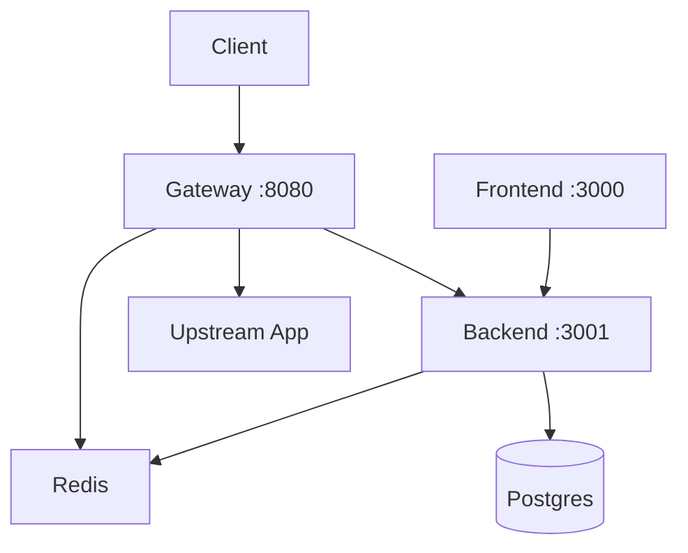

# WAF Pipeline - Next Phases Roadmap

## Current State Summary

The codebase is ~88-90% complete across the [10-phase startup plan](docs/README.md). Key findings:


| Phase | Status          | Notes                                                                                                    |
| ----- | --------------- | -------------------------------------------------------------------------------------------------------- |
| 1-4   | Complete        | Environment, log ingestion, parsing, tokenization                                                        |
| 5     | Partial         | Model exists in `models/waf-distilbert/` (DistilBERT fine-tuned); backend uses it                        |
| 6-7   | Complete        | WAF integration, async real-time detection                                                               |
| 8     | Not implemented | Phase 8 spec exists in docs; no `backend/ml/learning/` code                                              |
| 9     | Partial         | Basic tests in `tests/`; [REMAINING_WORK_PLAN](docs/REMAINING_WORK_PLAN.md) lists gaps                   |
| 10    | Partial         | `scripts/start_all.sh` for dev; **no main `docker-compose.yml**` (README references it but file missing) |


**Critical gap**: README says `docker-compose up -d` but only [docker-compose.gateway.yml](docker-compose.gateway.yml) exists. No full-stack compose.

---

## Recommended Next Phases (In Order)

### Phase A: Finish DDoS / Rate Limit Integration (Immediate)

Complete the [ddos_and_rate_limit_fixes plan](.cursor/plans/ddos_and_rate_limit_fixes_c0298f95.plan.md):

1. **Config and .env**: Default `BACKEND_EVENTS_ENABLED` to `true` in [gateway/config.py](gateway/config.py), update [.env.example](.env.example).
2. **Gateway event payload**: Extend [gateway/main.py](gateway/main.py) `_log_gateway_event` to send `retry_after`, `block_duration_seconds`, `content_length`, `max_bytes` to `/api/events/ingest` for dashboard metrics.
3. **Docs**: Update [rate-limiting.md](docs/rate-limiting.md) and [ddos-protection.md](docs/ddos-protection.md) per the plan.

`docker-compose.gateway.yml` already provides Redis + gateway; these changes make rate-limit and DDoS blocks appear correctly in the dashboard.

---

### Phase B: Full-Stack Docker Compose (High Priority)

Create `docker-compose.yml` so `docker-compose up -d` works as advertised:




**Services**: Redis, Postgres (or keep SQLite for dev), backend (port 3001), frontend (port 3000), gateway (port 8080). Optional: demo apps (Juice Shop, WebGoat, DVWA).

Key files to create or adapt:

- Root `docker-compose.yml` (backend, frontend, gateway, Redis; optional Postgres)
- Align with existing [backend/Dockerfile](backend/Dockerfile), [frontend/Dockerfile](frontend/Dockerfile), [gateway/Dockerfile](gateway/Dockerfile)
- Wire `BACKEND_EVENTS_URL` from gateway to backend

---

### Phase C: Phase 8 - Continuous Learning (ML Investment)

Implement continuous learning per [phase8-continuous-learning.md](docs/phase8-continuous-learning.md):

1. **Data collector**: `backend/ml/learning/data_collector.py` — incremental log collection for benign traffic.
2. **Fine-tuning pipeline**: `backend/ml/learning/fine_tuning.py` — fine-tune on new data (reuse `scripts/finetune_waf_model.py`).
3. **Version manager**: `backend/ml/learning/version_manager.py` — model versioning and rollback.
4. **Validator**: `backend/ml/learning/validator.py` — validation before deploy.
5. **Hot swap**: `backend/ml/learning/hot_swap.py` — swap models without downtime.
6. **Scheduler**: `backend/ml/learning/scheduler.py` — periodic updates (e.g., via APScheduler or cron).
7. **Integration**: Start scheduler from [backend/main.py](backend/main.py) when configured.

Existing scripts: [scripts/finetune_waf_model.py](scripts/finetune_waf_model.py), [scripts/generate_training_data.py](scripts/generate_training_data.py).

---

### Phase D: Phase 9 - Testing and Validation

Address gaps from [REMAINING_WORK_PLAN](docs/REMAINING_WORK_PLAN.md):

1. **DoS patterns test suite**: Populate [scripts/attack_tests/09_dos_patterns.py](scripts/attack_tests/09_dos_patterns.py) with 50+ DoS payloads; integrate into `run_all_tests.py`.
2. **Unit tests**: Expand `tests/unit/` (e.g., `test_waf_classifier.py`, `test_ip_fencing.py`, `test_rate_limiter.py`).
3. **Performance tests**: Add `tests/performance/` with load tests (e.g., Locust); target &lt;100ms p95, &gt;100 RPS.
4. **CI pipeline**: `.github/workflows/ci.yml` — lint, pytest, coverage; run on push/PR.

---

### Phase E: Phase 10 - Production Hardening

Per [phase10-deployment-demo](docs/phase10-deployment-demo.md):

1. **Monitoring**: Metrics endpoint; optional Prometheus/Grafana.
2. **Alerting**: Configurable email/webhook alerts (see phase10 templates).
3. **Demo script**: `scripts/demo.py` — SQLi, XSS, path traversal, RCE scenarios.
4. **Production config**: `config/production.yaml` for deployment.
5. **Auth**: Integrate [backend/auth.py](backend/auth.py) if not already active.
6. **SSL/TLS**: Document or add reverse-proxy HTTPS for production.

---

### Phase F: Optional / Later

- **Header injection improvement**: Raise detection from 3.3% to &gt;80% via training data augmentation ([REMAINING_WORK_PLAN](docs/REMAINING_WORK_PLAN.md) task 3).
- **Kubernetes**: Manifests for k8s deployment.
- **API docs**: OpenAPI/Swagger polish at `/docs` and `/redoc`.

---

## Suggested Execution Order

```text
1. Phase A (DDoS/rate limit fixes)      — 1-2 days, unblocks dashboard metrics
2. Phase B (Full-stack docker-compose) — 2-3 days, unblocks "one command" setup
3. Phase D (Tests + CI)                 — 2-3 days, stabilizes changes
4. Phase C (Continuous learning)       — 1-2 weeks, longer-term ML value
5. Phase E (Production hardening)      — 1-2 weeks, when preparing for production
```

---

## Key Files Reference


| Purpose            | Files                                                                                                              |
| ------------------ | ------------------------------------------------------------------------------------------------------------------ |
| DDoS / rate limit  | [gateway/main.py](gateway/main.py), [gateway/config.py](gateway/config.py), [gateway/events.py](gateway/events.py) |
| Full-stack compose | Create `docker-compose.yml` (none exists at root)                                                                  |
| Backend entry      | [backend/main.py](backend/main.py)                                                                                 |
| ML model           | [backend/ml/waf_classifier.py](backend/ml/waf_classifier.py), `models/waf-distilbert/`                             |
| Phase 8 spec       | [docs/phase8-continuous-learning.md](docs/phase8-continuous-learning.md)                                           |
| Remaining work     | [docs/REMAINING_WORK_PLAN.md](docs/REMAINING_WORK_PLAN.md)                                                         |


