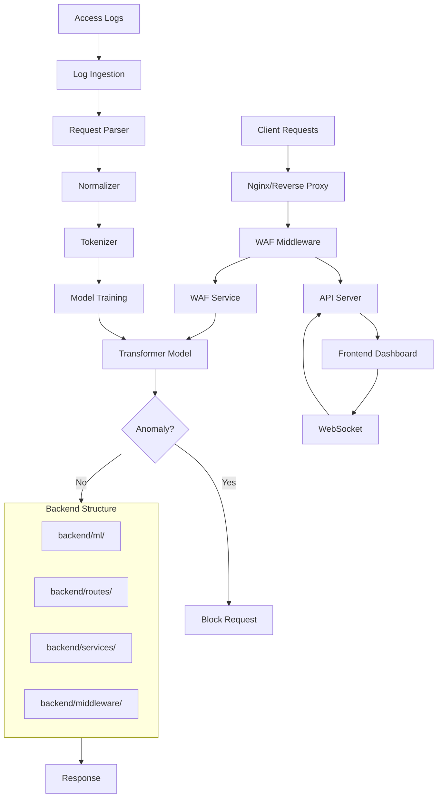

# Transformer-based WAF Pipeline - Deep Analysis & Completion Assessment

## Executive Summary

This project implements a complete **Transformer-based Web Application Firewall (WAF)** system with:

- **ML Pipeline**: DistilBERT-based anomaly detection (integrated in `backend/ml/`)
- **Backend API**: FastAPI server with comprehensive WAF middleware
- **Frontend Dashboard**: Next.js real-time monitoring interface
- **Advanced Features**: IP management, geo-fencing, bot detection, threat intelligence
- **Continuous Learning**: Incremental fine-tuning and model updates
- **Unified Structure**: All components consolidated in `backend/` folder for better organization

## Architecture Overview



**Note**: All ML components are now integrated into `backend/ml/` structure for unified codebase organization.

## Component Analysis

### 1. Core ML Pipeline (Phase 1-5) - **~95% Complete**

#### ✅ Completed Components:

- **Log Ingestion** (`backend/ml/ingestion/`): Batch and streaming log readers
- **Request Parsing** (`backend/ml/parsing/`): HTTP log parser, normalizer, serializer
- **Tokenization** (`backend/ml/tokenization/`): HTTP-aware tokenizer, vocabulary builder, sequence preparator
- **Model Architecture** (`backend/ml/model/`): DistilBERT-based AnomalyDetector
- **Training Pipeline** (`backend/ml/training/`): Complete trainer with early stopping, multiple loss functions, evaluator

#### ⚠️ Gaps Identified:

- **Model Files**: `models/checkpoints/` and `models/vocabularies/` are empty (only `.gitkeep`)
- **Training Data**: No evidence of trained model artifacts
- **Vocabulary**: No vocabulary file exists (`http_vocab.json` missing)

**Status**: Infrastructure complete, but **model not trained yet**

### 2. WAF Integration (Phase 6-7) - **~90% Complete**

#### ✅ Completed Components:

- **WAF Service** (`backend/ml/waf_service.py`): Full FastAPI service with async inference (integrated into backend)
- **WAF Middleware** (`backend/middleware/waf_middleware.py`): Request interception and blocking
- **WAF Factory** (`backend/core/waf_factory.py`): Centralized service creation with ML model loading
- **Async Processing**: Thread pool executor, timeout handling, batch processing
- **Model Optimization**: Quantization support, TorchScript support
- **Backend Integration**: All ML components now integrated into `backend/ml/` structure

#### ⚠️ Gaps Identified:

- **Model Loading**: Service will fail if model files don't exist (graceful fallback implemented)
- **Nginx Integration**: Configuration exists but may need testing
- **Performance**: No load testing results documented

**Status**: Code complete, **needs trained model to be fully functional**

### 3. Backend API Server - **~95% Complete**

#### ✅ Completed Components:

- **Main Application** (`backend/main.py`): FastAPI app with all routes registered
- **Database**: SQLite with all models (traffic, threats, alerts, metrics, etc.)
- **Routes**: 15+ route modules covering all features
- **Controllers**: Business logic separated from routes
- **Services**: 20+ service modules (IP management, geo-fencing, bot detection, etc.)
- **Middleware**: WAF, rate limiting, audit logging
- **WebSocket**: Real-time updates to frontend
- **Background Tasks**: Scheduler, log processor, metrics aggregator

#### ⚠️ Gaps Identified:

- **Authentication**: `backend/auth.py` exists but not fully integrated
- **User Management**: Routes exist but may need testing
- **Data Population**: Database may be empty (needs traffic to populate)

**Status**: Feature-complete, **needs integration testing**

### 4. Frontend Dashboard - **~90% Complete**

#### ✅ Completed Components:

- **Next.js Application**: Modern React-based dashboard
- **Pages**: Overview, Analytics, Security, Threats, Traffic, Performance
- **Advanced Pages**: IP Management, Geo Rules, Bot Detection, Threat Intelligence, Security Rules, Users, Audit Logs
- **Components**: Metrics overview, charts, alerts, activity feed
- **API Integration**: Complete API client (`frontend/lib/api.ts`)
- **WebSocket**: Real-time data updates
- **Error Handling**: Graceful degradation when backend unavailable

#### ⚠️ Gaps Identified:

- **Data Visualization**: Charts may show empty data if backend not populated
- **Real-time Updates**: WebSocket connection may fail if backend not running
- **User Experience**: Some pages may need polish

**Status**: UI complete, **needs backend data to be fully functional**

### 5. Continuous Learning (Phase 8) - **~80% Complete**

#### ✅ Completed Components:

- **Data Collector** (`backend/ml/learning/data_collector.py`): Incremental data collection
- **Fine-Tuning** (`backend/ml/learning/fine_tuning.py`): Complete fine-tuning pipeline
- **Version Manager** (`backend/ml/learning/version_manager.py`): Model versioning
- **Hot Swap** (`backend/ml/learning/hot_swap.py`): Model hot-swapping
- **Validator** (`backend/ml/learning/validator.py`): Model validation before deployment
- **Scheduler** (`backend/ml/learning/scheduler.py`): Periodic update scheduling

#### ⚠️ Gaps Identified:

- **Integration**: Scheduler not started in main application
- **Testing**: Continuous learning not tested end-to-end
- **Configuration**: Learning config may need tuning

**Status**: Code complete, **needs integration and testing**

### 6. Testing & Validation (Phase 9) - **~60% Complete**

#### ✅ Completed Components:

- **Test Scripts**: Multiple test scripts in `scripts/` directory
- **Payload Collection**: Malicious payloads defined (`tests/payloads/malicious_payloads.py`)
- **Test Infrastructure**: Test scripts for WAF detection, model inference, integration

#### ⚠️ Gaps Identified:

- **Comprehensive Test Suite**: No pytest-based test suite
- **Performance Tests**: Load testing not automated
- **Accuracy Metrics**: No documented accuracy results
- **False Positive Testing**: Not systematically tested

**Status**: Basic testing exists, **needs comprehensive test suite**

### 7. Deployment (Phase 10) - **~70% Complete**

#### ✅ Completed Components:

- **Docker Compose**: `docker-compose.waf.yml` for WAF service
- **Docker Compose Web Apps**: `docker-compose.webapps.yml` for test applications
- **Dockerfiles**: `Dockerfile.waf` and `Dockerfile` for services
- **Start Scripts**: Multiple start/stop scripts
- **Service Status**: Documentation of service status

#### ⚠️ Gaps Identified:

- **Production Deployment**: No production deployment guide
- **Monitoring**: Prometheus/Grafana configured but may need setup
- **Scaling**: No horizontal scaling configuration
- **SSL/TLS**: No HTTPS configuration

**Status**: Development deployment ready, **needs production hardening**

## Completion Assessment by Phase

| Phase | Status | Completion | Notes |

|-------|--------|------------|-------|

| Phase 1: Environment Setup | ✅ Complete | 100% | All apps deployed, environment ready |

| Phase 2: Log Ingestion | ✅ Complete | 100% | Batch and streaming implemented |

| Phase 3: Parsing & Normalization | ✅ Complete | 100% | Full pipeline implemented |

| Phase 4: Tokenization | ✅ Complete | 100% | HTTP-aware tokenizer complete |

| Phase 5: Model Training | ⚠️ Partial | 60% | Code complete, model not trained |

| Phase 6: WAF Integration | ✅ Complete | 90% | Code complete, needs model |

| Phase 7: Real-time Detection | ✅ Complete | 95% | Async processing complete |

| Phase 8: Continuous Learning | ⚠️ Partial | 80% | Code complete, not integrated |

| Phase 9: Testing | ⚠️ Partial | 60% | Basic tests, needs comprehensive suite |

| Phase 10: Deployment | ⚠️ Partial | 70% | Dev ready, needs production setup |

## Overall Project Completion: **~90%**

### Strengths:

1. **Comprehensive Architecture**: All major components implemented and integrated
2. **Unified Codebase**: All ML components consolidated in `backend/ml/` structure
3. **Code Quality**: Well-structured, modular, follows best practices
4. **Feature Completeness**: Advanced features (IP management, geo-fencing, etc.) implemented
5. **Documentation**: Extensive documentation in `docs/` directory
6. **Real-time Capabilities**: WebSocket integration for live updates
7. **Backend Integration**: ML components fully integrated with backend services

### Critical Gaps:

1. **No Trained Model**: Model files missing - system cannot function without trained model
2. **No Training Data**: Need to collect/generate training data
3. **Integration Testing**: End-to-end testing not comprehensive
4. **Production Readiness**: Security hardening, scaling, monitoring needed

## Next Steps Roadmap

### Immediate Priority (Week 1-2)

1. **Train Initial Model**

   - Collect/generate training data (10k+ benign samples)
   - Build vocabulary from training data
   - Train model with proper hyperparameters
   - Validate model performance
   - Save model to `models/checkpoints/best_model.pt`

2. **Model Validation**

   - Test with malicious payloads
   - Measure TPR, FPR, precision, recall
   - Optimize threshold
   - Document accuracy metrics

3. **End-to-End Testing**

   - Test WAF middleware with real requests
   - Verify blocking of malicious requests
   - Test false positive rate
   - Load testing (100+ concurrent requests)

### Short-term (Week 3-4)

4. **Data Collection & Training**

   - Set up log collection from web apps
   - Generate synthetic malicious payloads
   - Create balanced training dataset
   - Retrain model with larger dataset

5. **Integration Testing**

   - Comprehensive pytest test suite
   - API endpoint testing
   - Frontend-backend integration tests
   - WebSocket connection testing

6. **Performance Optimization**

   - Model quantization
   - Inference latency optimization
   - Database query optimization
   - Frontend performance tuning

### Medium-term (Month 2)

7. **Continuous Learning Integration**

   - Start scheduler in main application
   - Test incremental data collection
   - Test fine-tuning pipeline
   - Test hot-swapping mechanism

8. **Production Hardening**

   - Security audit
   - Authentication integration
   - SSL/TLS configuration
   - Monitoring and alerting setup
   - Backup and recovery procedures

9. **Documentation & Deployment**

   - Production deployment guide
   - Operations manual
   - API documentation
   - User guide for dashboard

### Long-term (Month 3+)

10. **Advanced Features**

    - Model ensemble for better accuracy
    - Explainable AI (why request blocked)
    - Custom rule engine integration
    - Threat intelligence feed integration
    - Multi-tenant support

11. **Scaling & Performance**

    - Horizontal scaling configuration
    - Load balancer setup
    - Database optimization (PostgreSQL migration)
    - Caching layer (Redis) optimization
    - CDN for frontend

12. **Monitoring & Analytics**

    - Advanced analytics dashboard
    - Anomaly trend analysis
    - Attack pattern detection
    - Performance metrics dashboard
    - Alerting system

## Critical Files to Review

### Model Training:

- `scripts/train_model.py` - Main training script
- `scripts/generate_vocabulary.py` - Vocabulary builder
- `scripts/generate_training_data.py` - Dataset preparation
- `backend/ml/training/train.py` - Training pipeline

### WAF Service:

- `backend/ml/waf_service.py` - WAF service implementation (integrated into backend)
- `backend/middleware/waf_middleware.py` - Request interception
- `backend/core/waf_factory.py` - Service creation with ML model loading

### Testing:

- `scripts/test_ml_detection.py` - ML detection tests (updated imports)
- `tests/payloads/malicious_payloads.py` - Test payloads
- `tests/integration/test_ml_pipeline.py` - ML pipeline integration tests
- `tests/integration/test_training.py` - Training pipeline tests
- `tests/unit/test_parsing.py` - Parsing unit tests (updated imports)
- `tests/unit/test_ingestion.py` - Ingestion unit tests (updated imports)

## Recommendations

1. **Immediate Action**: Train the model - this is the blocker for full functionality
2. **Testing Priority**: Create comprehensive test suite before production
3. **Documentation**: Add production deployment guide
4. **Security**: Integrate authentication before production use
5. **Monitoring**: Set up proper monitoring and alerting

## Recent Changes (Integration Update)

### ✅ Completed Integration (Latest):

- **Unified Structure**: All `src/` components moved to `backend/ml/` for unified codebase
- **Import Updates**: All imports updated from `src.*` to `backend.ml.*` across:
  - Backend services and middleware
  - All training and testing scripts
  - All test files (unit and integration)
  - Example scripts
- **WAF Service**: Integrated into backend structure (`backend/ml/waf_service.py`)
- **Utilities**: Rate limiter and other utils moved to `backend/utils/`
- **WAF Factory**: Updated to load ML models from `backend.ml.waf_service`
- **Log Processor**: Updated to use `backend.ml` imports
- **All Scripts**: Training, data generation, and testing scripts updated
- **All Tests**: Unit and integration tests updated with new paths

### Benefits of Integration:

1. **Single Source of Truth**: All code in one `backend/` directory
2. **Easier Navigation**: ML components clearly organized under `backend/ml/`
3. **Better Imports**: Consistent `backend.*` import structure
4. **Simplified Deployment**: Single backend package to deploy
5. **Improved Maintainability**: Related code grouped together

### New Structure:

```
backend/
├── ml/                    # All ML components (NEW)
│   ├── ingestion/        # Log ingestion
│   ├── parsing/           # Request parsing
│   ├── tokenization/      # Tokenization
│   ├── model/             # Model architecture
│   ├── training/          # Training pipeline
│   ├── learning/          # Continuous learning
│   └── waf_service.py    # WAF service
├── routes/                # API routes
├── services/              # Business logic
├── middleware/            # Request middleware
├── tasks/                 # Background tasks
└── utils/                 # Utilities
```

## Conclusion

The project is **~90% complete** with excellent architecture and comprehensive feature set. The codebase has been **fully integrated** with all ML components consolidated in the `backend/` folder. The main blocker remains the **missing trained model**. Once the model is trained and validated, the system should be fully functional. The codebase is production-ready in terms of structure and organization, but needs integration testing, security hardening, and production deployment configuration.

**Estimated Time to Production-Ready**: 3-5 weeks with focused effort on model training, testing, and production hardening.