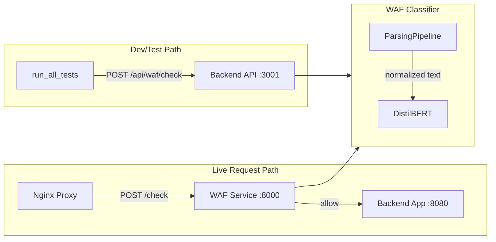

# Week 4: Inference Integration + Validation — Plan

## Current State

- **Task 22 (partial)**: [backend/ml/waf_classifier.py](backend/ml/waf_classifier.py) has `ParsingPipeline` imported and initialized, but it is **not used**. `check_request` and `check_request_async` build request text manually instead of applying normalization.
- **Task 23**: `integration/waf_service.py` does **not exist**. Both [scripts/start_waf_service.py](scripts/start_waf_service.py) and [tests/integration/test_waf_service.py](tests/integration/test_waf_service.py) import it.
- **Task 24**: [scripts/start_waf_service.py](scripts/start_waf_service.py) expects `models/checkpoints/best_model.pt` + `models/vocabularies/http_vocab.json` (old format). Week 3 outputs `models/waf-anomaly/` (HuggingFace: `config.json`, `model.safetensors`, `tokenizer.json`).
- **Task 25**: [scripts/nginx_waf.conf](scripts/nginx_waf.conf) already proxies to `127.0.0.1:8000/check` and expects `{is_anomaly, anomaly_score, threshold, processing_time_ms}`. Minor updates may be needed for consistency.
- **Task 26**: No `.github/workflows` at project root. [scripts/attack_tests/run_all_tests.py](scripts/attack_tests/run_all_tests.py) targets `localhost:3001/api/waf/check` (full backend), not standalone port 8000.
- **Task 27**: `weeks/week4/WEEK4-COMPLETED.md` does not exist yet.

---

## Task 22: Apply Normalizer in WAF Classifier

**File**: [backend/ml/waf_classifier.py](backend/ml/waf_classifier.py)

**Changes**:

1. In `check_request` (lines 199–229): Replace manual request text construction with `self._pipeline.process_dict(request_data)`. Build a dict with `method`, `path`, `query_params`, `headers`, `body` (matching [parse_request_dict](backend/parsing/log_parser.py) format).
2. In `check_request_async` and `_build_request_text`: Use `self._pipeline.process_dict(...)` instead of `_build_request_text` before calling `classify`.

**Edge case**: `parse_request_dict` expects `path` (path only) and `query_params` separate. If callers pass `path` with `?query`, the serializer may duplicate params. Option: in `_build_request_text` or before `process_dict`, split `path` on `?` and merge query into `query_params` when needed. The [serializer](backend/parsing/serializer.py) builds `full_path` from `path` + `query_params`, so `path` should not include the query string.

---

## Task 23: Create integration/waf_service.py

**Create**: `integration/waf_service.py` — standalone FastAPI service on port 8000 for Nginx.

**Interface** (match Nginx Lua and [CheckResponse](backend/schemas/waf.py)):

- `POST /check` — body: `{method, path, query_params?, headers?, body?}` → `{is_anomaly, anomaly_score, threshold, processing_time_ms}`  
Nginx uses `processing_time_ms` (not `processing_time_ms` only in some paths).
- `GET /health` — `{status, service, model_loaded, threshold, device}`
- `GET /metrics` — WAFClassifier metrics (for `/waf-metrics` proxy)

**Implementation**:

- Use `WAFClassifier` from [backend/ml/waf_classifier.py](backend/ml/waf_classifier.py) with `model_path="models/waf-anomaly"` (or configurable).
- Call `classifier.check_request_async(...)` for `/check`. The controller already returns the right shape; map to the Nginx response format.
- Lazy model load on first request or at startup; handle missing model cleanly.
- Add `integration/__init__.py` exporting `app`, `initialize_waf_service`.

**Note**: [tests/integration/test_waf_service.py](tests/integration/test_waf_service.py) uses `initialize_waf_service(model_path=None, vocab_path=None)` for a “placeholder” mode. The new `initialize_waf_service` must support optional `model_path` for placeholder/testing.

---

## Task 24: Fix start_waf_service.py

**File**: [scripts/start_waf_service.py](scripts/start_waf_service.py)

**Changes**:

1. Remove `vocab_path` handling — WAFClassifier uses the tokenizer in the model dir.
2. Use model dir (`models/waf-anomaly`) instead of `.pt` checkpoint. Validate `Path(model_path).exists()` for a directory with `config.json` and `tokenizer.json` (or `model.safetensors`).
3. Default `model_path`: `waf_config.get('model_path', 'models/waf-anomaly')`.
4. Fix `sys.path`: ensure project root is first (already has `parent.parent`), and remove `src` if not needed.
5. Pass only `model_path`, `threshold`, `device` to `initialize_waf_service`; drop `vocab_path`.
6. Update [config/config.yaml](config/config.yaml) `waf_service` section: `model_path: "models/waf-anomaly"`, remove `vocab_path` reference if any.

---

## Task 25: Update Nginx Config for WAF Upstream

**File**: [scripts/nginx_waf.conf](scripts/nginx_waf.conf)

**Changes** (minor):

1. Ensure Lua `waf_request` sends `path` **without** query when `query_params` is populated (use `ngx.var.uri` for path, keep `query_params` from `query_string`) to avoid duplicate query in serialization.
2. Confirm response parsing uses `processing_time_ms` (Lua already uses this).
3. Optional: make upstream `waf_service` host/port configurable via env (e.g. `127.0.0.1:8000` default) if desired for Docker.

---

## Task 26: Create CI Workflow for Model Accuracy

**Create**: `.github/workflows/model-accuracy.yml`

**Flow**:

1. Checkout, set up Python (3.10+).
2. Install deps: `pip install -r requirements.txt` (or equivalent).
3. Ensure model exists: download or use cached `models/waf-anomaly`. If none, skip or fail with a clear message.
4. Start backend with model: `uvicorn backend.main:app --host 0.0.0.0 --port 3001` (background).
5. Wait for health: `curl http://localhost:3001/health` until 200.
6. Run attack tests: `python scripts/attack_tests/run_all_tests.py`.
7. Gate: exit 1 if overall detection rate < 80% (per roadmap). `run_all_tests` already exits 1 when rate < 60%; tighten to 80% or add `--min-rate 80` if needed.
8. Optional: cache `models/waf-anomaly` to avoid re-download on each run.

**Alternative**: If model is not in repo and can’t be cached, workflow can be marked “manual” or “scheduled” and document that a pre-trained model must be present.

---

## Task 27: Week 4 Completion Doc

**Create**: `weeks/week4/WEEK4-COMPLETED.md`

**Content** (mirror week3 format):

- Summary (Tasks 22–27 completed).
- Files created/updated.
- How to run standalone WAF service, Nginx integration, and attack tests.
- CI workflow usage and success criteria.
- Pipeline diagram: Logs → Parse → Normalize → Tokenize → Model → Score.
- Dependencies for Week 5.

---

## Architecture Overview

---

## Execution Order

1. **Task 22** — Normalizer in classifier (no new deps).
2. **Task 23** — Create `integration/waf_service.py` (unblocks start script and tests).
3. **Task 24** — Fix `start_waf_service.py`.
4. **Task 25** — Nginx config tweaks (if needed).
5. **Task 26** — CI workflow.
6. **Task 27** — Week 4 doc.

