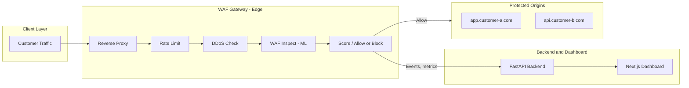
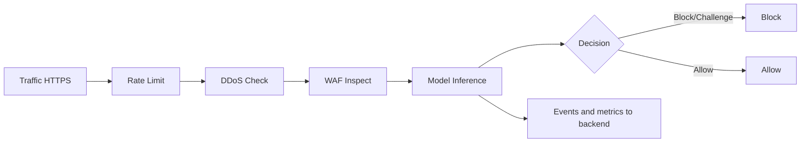

# Transformer-Based End-to-End Web Application Firewall (WAF) Pipeline

---

## Slide 1: Title
- **Title:** AI-Powered Web Application Firewall: Transformer-Based Anomaly Detection
- **Subtitle:** End-to-end WAF pipeline with zero-day readiness and real-time protection
- **Your name / Course / Date** (add as needed)

---

## Slide 2: Introduction
- We built an end-to-end Web Application Firewall (WAF) pipeline that uses a fine-tuned Transformer to protect web applications from malicious and unknown attacks. Instead of relying on attack signatures and rule sets, our system learns what normal traffic looks like and blocks deviations in real time—so apps stay protected even against zero-day and evasive threats.
- From a production-ready gateway (rate limiting, DDoS protection, and ML inspection) to a multi-tenant backend and dashboard, we deliver a complete solution that is zero-day ready and suitable for B2B use. Our goal is to show how modern NLP and anomaly detection can make WAFs more effective with less operational burden. Let this presentation guide you through the problem, the approach, and the architecture.

---

## Slide 3: Problem Statement
- **1. Zero-day and evasive attacks slip through**
  - **Description:** Traditional WAFs rely on attack signatures and rule sets (e.g. OWASP ModSecurity CRS) that match known patterns like SQL injection and XSS. They miss zero-day exploits, novel attacks, and evasive techniques (encoding, fragmentation, obfuscation), so web apps stay exposed to threats that have never been seen before.
- **2. Rules are a constant, manual battle**
  - **Description:** New CVEs and bypasses appear continuously. Keeping rules up to date and tuning them to reduce false positives vs false negatives is time-consuming and app-specific. Without large teams or resources, it is tough to stay on top of the latest threats and keep the WAF effective.
- **3. No generalization to unseen attacks**
  - **Description:** Signature-based systems cannot generalize; they only block what is explicitly described in rules. Inconsistent coverage across attack variants dilutes protection and confuses security teams. Web applications remain exposed to emerging and unknown threats despite having a WAF in place.

*Speaker note:* Give one example of a zero-day or evasive technique (e.g. encoded payload, fragmented request) that signature-based WAFs often miss.

---

## Slide 4: Our Innovative Solutions
- **Title:** Our Innovative Solutions
- **1. Learn Normal Behavior (No Signatures)**
  - **Description:** The WAF learns what normal traffic looks like from benign requests only—no attack signatures or rule sets. It flags deviations in real time, so zero-day and evasive attacks get blocked even if they have never been seen before. This addresses the gap left by signature-based WAFs that cannot generalize to unseen threats.
- **2. Real-Time Anomaly Detection at the Edge**
  - **Description:** Every request is scored by a fine-tuned Transformer (DistilBERT) before it reaches the app. Low-latency inference, a single 0–100 attack score, and configurable block/challenge thresholds let operators tune sensitivity without retraining. Same normalization in training and inference keeps the model consistent and effective.
- **3. End-to-End Pipeline (Gateway + Backend + Dashboard)**
  - **Description:** A complete solution: gateway (rate limit, DDoS protection, ML inspection), multi-tenant backend and dashboard, and continuous learning so the model can be fine-tuned on new traffic and adapt to evolving app behavior. Production-ready with Docker, PostgreSQL, and Redis—one command to run.
- **4. Multi-Tenant B2B Ready**
  - **Description:** The same pipeline serves multiple customers with tenant isolation by API key or tenant ID. Per-org metrics, alerts, config, and API keys in the dashboard; optional per-tenant fine-tuned models so each customer gets a WAF tailored to their app traffic.
- **5. Tune Without Retraining**
  - **Description:** Operators adjust block and challenge thresholds (e.g. score ≥ 80 block, 50–79 challenge) and choose fail-open or fail-closed when the model is unavailable. The dashboard shows score distribution and blocked/allowed counts so teams can tune sensitivity without retraining the model.
- **6. Rate Limiting and DDoS Protection**
  - **Description:** Redis-backed rate limiting (per-IP and per-tenant, sliding or fixed window) and DDoS checks (burst detection, max request size, temporary IP blocking) run before ML inspection. Reduces abuse and volumetric attacks so the WAF focuses on application-layer threats.

*Speaker note:* Contrast with "we need a rule for every attack" — here one model handles all deviations from normal.

---

## Slide 5: Why Transformers?
- **Pre-trained language understanding (DistilBERT):** Captures structure and semantics of token sequences; HTTP requests (method, path, query, headers, body) are treated as sequences, so attention over tokens works for spotting abnormal patterns
- **Fine-tuned on HTTP request sequences** for binary classification (benign vs malicious); optional semi-supervised training with synthetic attack payloads
- **Efficiency:** DistilBERT is ~40% smaller and faster than BERT — suitable for real-time inference at the edge without heavy GPUs
- **Anomaly detection approach:** Train on benign traffic only; deviations from learned distribution = anomalies; no need for a large labeled attack corpus
- **Why not classic ML (e.g. random forest on hand-crafted features)?** Transformers learn representations from raw request text; less feature engineering and better generalization to new attack variants

*Speaker note:* Emphasize that we treat HTTP requests as sequences—method, path, headers, body—so the same attention mechanisms that work for language work for spotting abnormal request patterns. DistilBERT gives us that capability at half the size of BERT for low latency at the edge.

---

## Slide 6: High-Level Architecture
- **B2B SaaS style:** Each customer’s traffic flows through the WAF gateway before reaching their applications; multi-tenant isolation by API key / tenant ID
- **WAF Gateway (Edge, e.g. port 8080):** Reverse proxy → IP blacklist (optional) → Rate limit → DDoS check → WAF inspect (ML) → Score → Allow/Block; forwards allowed requests to customer origin
- **Backend API (FastAPI, e.g. port 3001):** WAF config (thresholds, fail-open/fail-closed), ML model serving, tenant isolation, PostgreSQL for config and metadata, Redis for rate-limit and DDoS state; receives events and metrics from the gateway
- **Dashboard (Next.js, e.g. port 3000):** Multi-tenant UI; per-org metrics, alerts, activity feed, config, API keys; talks to backend via REST and WebSocket for real-time updates
- **Protected origins:** Customer apps (e.g. app.customer-a.com, api.customer-b.com) — gateway forwards only after all checks pass

---

## Slide 7: Request Flow (Pipeline) — Step by Step
1. **Traffic** enters the WAF Gateway (HTTPS); gateway terminates TLS and sees plain HTTP request
2. **Rate limiting:** Redis-backed sliding-window or fixed window; per-IP (and optionally per-tenant); configurable requests per minute; on exceed → 429 + Retry-After
3. **DDoS check:** Burst detection (e.g. request count in short window), max request body size (e.g. Content-Length), temporary IP blocking in Redis; on exceed → 413 or 429
4. **WAF inspection:** Request (method, path, query string, headers, body) serialized and sent to ML service (backend or in-process); optional truncation for latency
5. **Model inference:** Parsing → normalization → tokenization (max length 512) → DistilBERT forward pass; returns **attack score (0–100)** and label (benign/malicious)
6. **Decision:** Compare score to configurable block threshold and challenge threshold; block (403), challenge (e.g. CAPTCHA), or allow; fail-open or fail-closed when ML unavailable
7. **Events and metrics:** Blocked/allowed events, score, latency sent to backend; dashboard shows alerts, activity feed, and charts

---

## Slide 8: ML Pipeline — Training (Detail)
- **Training data:** 26,589+ unique benign samples from three vulnerable apps (Juice Shop, WebGoat, DVWA); collected via crawling live apps, parsing Nginx/Apache logs, and/or synthetic generation
- **Data modes:** (1) Crawl — hit live app endpoints to capture real requests; (2) Log parsing — read access logs and reconstruct requests; (3) Synthetic — generate valid-looking requests; (4) Combined — merge and deduplicate
- **Normalization (critical):** Replace dynamic values (UUIDs, timestamps, session IDs, tokens) with placeholders so the model learns structure, not specific values; preserves method, path pattern, header names, and body structure for generalization to new traffic
- **Tokenization:** HTTP-aware tokenizer; vocabulary built from training data; max sequence length 512; padding/truncation for batch training
- **Model:** DistilBERT base; fine-tuned as binary classifier (benign vs malicious); optional semi-supervised training with synthetic attack payloads (SQLi, XSS, etc.) to improve discrimination
- **Training loop:** Standard cross-entropy loss, early stopping, validation split; optional learning-rate schedule
- **Output:** Saved model (e.g. `models/waf-distilbert`) and vocabulary for deployment; versioned for rollback

---

## Slide 9: ML Pipeline — Inference (Detail)
- **Input:** Raw HTTP request (method, path, query, headers, body); optionally truncate body or cap total length to meet latency targets (e.g. &lt; 100 ms p99)
- **Processing:** (1) Parse request into structured form; (2) Apply same normalization as in training (dynamic value replacement); (3) Serialize to string and tokenize with saved vocabulary; (4) Pad/truncate to max length 512; (5) Model forward pass (CPU or GPU)
- **Output:** Label (benign/malicious), confidence (e.g. softmax probability), **attack score 0–100** (derived from probability for operator-friendly tuning), and latency metrics for monitoring
- **Configurable:** Block threshold (e.g. score ≥ 80 → block), challenge threshold (e.g. score 50–79 → challenge); fail-open (allow on ML error) or fail-closed (block on ML error) when model unavailable or timeout
- **Performance:** Async or batched inference to avoid blocking the gateway; timeout to prevent slow model from holding requests

*Speaker note:* The same normalization used in training is applied at inference so the model sees a consistent representation. The 0–100 attack score lets operators tune sensitivity via block and challenge thresholds without retraining.

---

## Slide 10: Attack Score and Thresholds (Detail)
- **Attack score 0–100:** Single scalar per request; derived from model confidence (e.g. malicious-class probability scaled to 0–100); higher = more likely malicious
- **Block threshold (e.g. 80):** If score ≥ 80 → respond with 403 Forbidden and log event; request never reaches origin
- **Challenge threshold (e.g. 50–79):** If score in range → optional challenge (e.g. CAPTCHA, rate limit) or allow with flag for monitoring; configurable per tenant
- **Allow (score &lt; 50):** Request forwarded to origin; event still sent to backend for analytics
- **Tuning:** Operators can adjust thresholds without retraining; trade off false positives (block legitimate traffic) vs false negatives (allow some attacks); dashboard can show score distribution and blocked/allowed counts to guide tuning

---

## Slide 11: Normalization — Why It Matters
- **Goal:** Model should learn *patterns* (e.g. “path has an ID segment”, “body has JSON with email field”), not *specific values* (e.g. user ID 12345, or a particular timestamp)
- **Replace:** UUIDs, timestamps, session tokens, CSRF tokens, numeric IDs in paths/query/body with placeholders (e.g. `{UUID}`, `{TIMESTAMP}`, `{ID}`)
- **Preserve:** HTTP method, path structure (e.g. `/api/users/{ID}/orders`), query parameter names, header names and order, body structure (keys, nesting)
- **Result:** Same normalization in training and inference ensures the model sees a consistent input distribution; improves generalization to new users, new sessions, and new data without retraining

---

## Slide 12: Key Features (Detail)
- **Zero-day ready** — Learns from benign traffic only; no attack signatures; blocks novel and evasive attacks that deviate from normal
- **Real-time protection** — Low-latency inference (e.g. under 100 ms); blocks threats before they hit the app; async or batched to avoid blocking the gateway
- **Live dashboard** — Next.js: metrics, charts, alerts, activity feed, per-tenant views; WebSocket for real-time updates
- **Production-ready** — Docker Compose for full stack; Nginx as reverse proxy; PostgreSQL and Redis; one command to run (`docker-compose up -d`)
- **Rate limiting** — Redis-backed per-IP (and per-tenant) throttling; sliding or fixed window; configurable requests per minute; 429 + Retry-After on exceed
- **DDoS protection** — Burst detection, max request size, temporary IP blocking in Redis; configurable thresholds
- **Continuous learning** — Fine-tune on new benign (and optional attack) traffic; model versioning and hot-swap; adapt to evolving app behavior

---

## Slide 13: Tech Stack (Detail)
- **ML:** PyTorch, Hugging Face Transformers, DistilBERT (fine-tuned); HTTP-aware tokenizer; vocabulary and checkpoints stored on disk
- **Backend:** FastAPI; multi-tenant API with tenant isolation; WAF config (thresholds, fail-open/fail-closed); ML model loading and inference; PostgreSQL for config and metadata; Redis for rate-limit and DDoS state
- **Frontend:** Next.js dashboard; REST and WebSocket client to backend; per-org metrics, alerts, config, API keys
- **Infrastructure:** Docker and Docker Compose; Nginx as reverse proxy in front of gateway or apps; PostgreSQL, Redis; optional MongoDB for event storage
- **Demo/Testing:** OWASP Juice Shop, OWASP WebGoat, DVWA (intentionally vulnerable apps) for benign traffic collection and attack validation

---

## Slide 14: Project Structure (Codebase)
- **backend/** — FastAPI app, WAF middleware, ML inference (e.g. WAFClassifier), routes (events, config, health), services (bot detection, etc.), ML subpackages (ingestion, parsing, tokenization, model, training)
- **frontend/** — Next.js app; dashboard pages, API client, WebSocket; charts and activity feed
- **gateway/** — Reverse proxy (e.g. Starlette/uvicorn); rate limit, DDoS, blacklist checks; WAF inspect (calls backend ML or local model); events sent to backend
- **applications/** — Demo apps: Juice Shop, WebGoat, DVWA for testing and training data
- **models/** — Trained DistilBERT checkpoints and vocabulary (e.g. `waf-distilbert`, `http_vocab.json`)
- **scripts/** — Fine-tuning, training data generation (crawl, log parse, synthetic), stress tests, threshold sweeps
- **docs/** — Phase-by-phase implementation guides (Phases 1–10, Day 1–10), feature specs, architecture notes

---

## Slide 15: Implementation Phases (10-Day Pipeline) — Detail
1. **Phase 1:** Environment setup and web app deployment (Nginx/Apache, deploy Juice Shop/WebGoat/DVWA, Python env, log config)
2. **Phase 2:** Log ingestion — batch log reader and streaming log tailer; format detection (Nginx/Apache); queue/buffer and retry logic
3. **Phase 3:** Request parsing and normalization — HTTP log parsing, dynamic value replacement, serialization for training and inference
4. **Phase 4:** Tokenization and sequence preparation — HTTP-aware tokenizer, vocabulary build, padding/truncation (max 512), data loader
5. **Phase 5:** Transformer (DistilBERT) architecture and training — model implementation, synthetic benign/attack data, training loop, early stopping, checkpoint save
6. **Phase 6:** WAF integration with web server — WAF API (FastAPI), Nginx/Apache reverse proxy, request forwarding, health checks
7. **Phase 7:** Real-time non-blocking detection — async inference, batching, timeout handling, optional quantization
8. **Phase 8:** Continuous learning — incremental data collection, fine-tuning pipeline, model versioning, hot-swap
9. **Phase 9:** Testing and validation — test suite, TPR/FPR evaluation, load testing, threshold sweeps
10. **Phase 10:** Deployment and demo — production deploy, monitoring, demo script, documentation for judges

---

## Slide 16: Demo Applications (Detail)
- **OWASP Juice Shop** — Modern vulnerable web app (REST API, auth, shopping cart); many endpoints; used for ~9k benign samples and attack tests (e.g. SQLi, XSS)
- **OWASP WebGoat** — Security lessons (SQLi, XSS, auth, JWT, etc.); ~20 lessons/endpoints; ~8.6k samples; good for diverse request patterns
- **DVWA** — Damn Vulnerable Web Application (SQLi, XSS, file upload, etc.); ~25 endpoints; ~8.9k samples
- **Usage:** Crawl or replay logs to generate benign training data; run known attacks to validate that the WAF blocks or scores them high; compare with baseline (no WAF) to show protection

---

## Slide 17: Quick Start (For Judges/Demo)
- **Clone and configure:** `git clone &lt;repo&gt;` → `cd &lt;repo&gt;` → `cp .env.example .env` (edit if needed)
- **Full stack:** `docker-compose up -d` — brings up dashboard, backend, gateway, Redis, PostgreSQL (and optionally demo apps)
- **Dashboard:** Open **http://localhost:3000** — metrics, alerts, activity feed, config
- **Gateway-only:** `docker compose -f docker-compose.gateway.yml up -d` — rate limit + DDoS + WAF inspect without full backend/dashboard
- **Verify:** Send benign and malicious requests through the gateway; check dashboard for scores and blocked events

---

## Slide 18: Why This Matters (Impact)
- **Security:** Protects web apps from known and **unknown** attacks without maintaining large rule sets; reduces exposure to zero-days and novel evasion
- **Scalability:** Same pipeline serves multiple tenants (B2B); per-tenant config and optional per-tenant fine-tuned models
- **Research/Education:** Demonstrates applying NLP/Transformers to security — anomaly detection on HTTP traffic; useful for courses and capstone projects
- **Practical:** Docker-based, config-driven, with dashboard and APIs; close to production use and easy to extend (e.g. managed rulesets, bot management, alerting)

---

## Slide 19: Conclusion & Thank You
- **Summary:** We built an end-to-end WAF pipeline that uses a fine-tuned Transformer (DistilBERT) to detect malicious HTTP requests by learning normal behavior — no signatures, zero-day ready. Traffic flows through a gateway (rate limit, DDoS, ML inspection) before reaching customer origins; backend and dashboard provide config, metrics, and alerts.
- **Deliverables:** WAF Gateway (proxy + rate limit + DDoS + ML), Backend API (FastAPI), Dashboard (Next.js), trained model and vocabulary, scripts (training, stress tests, threshold sweeps), and documentation (phases, features, architecture).
- **Thank you** — Questions?

---

## Notes for Presenters / Iris.ai
- This is the **detailed** version: 19 slides (including Introduction) with in-depth bullets and two extra slides (Attack Score & Thresholds, Normalization).
- Use each "Slide N" block as the source for one slide (or split into two if the audience prefers less density per slide).
- Add institution logo, your name, and date on title (Slide 1) and thank-you (Slide 19) slides.
- **Speaker notes** are included under Slides 4 and 8; use the expanded bullets elsewhere as talking points.
- Suggested tone: **professional, academic, clear** — suitable for a professor and a large audience (e.g. 150 students).
- For a shorter pitch, use only Slides 1–2, 4–9, 12, 13, 17, 19 (omit Problem detail, Attack Score, Normalization, Project Structure, Phases detail, Demo Apps detail, Quick Start, Impact).
