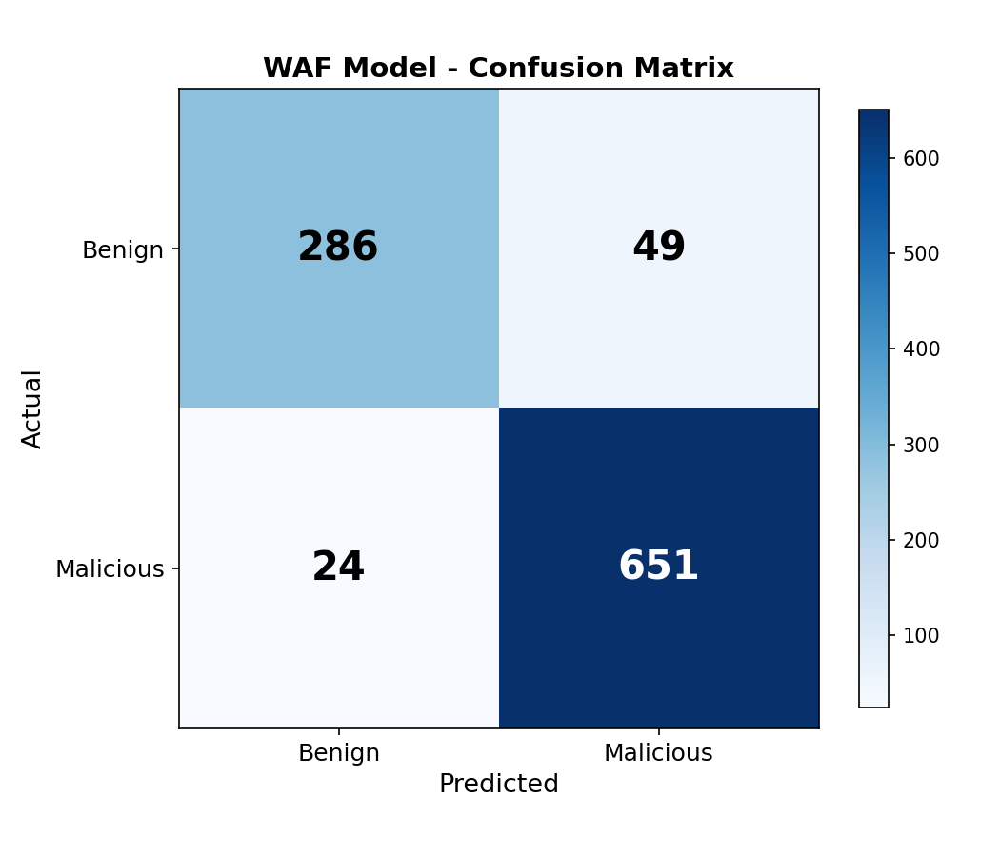
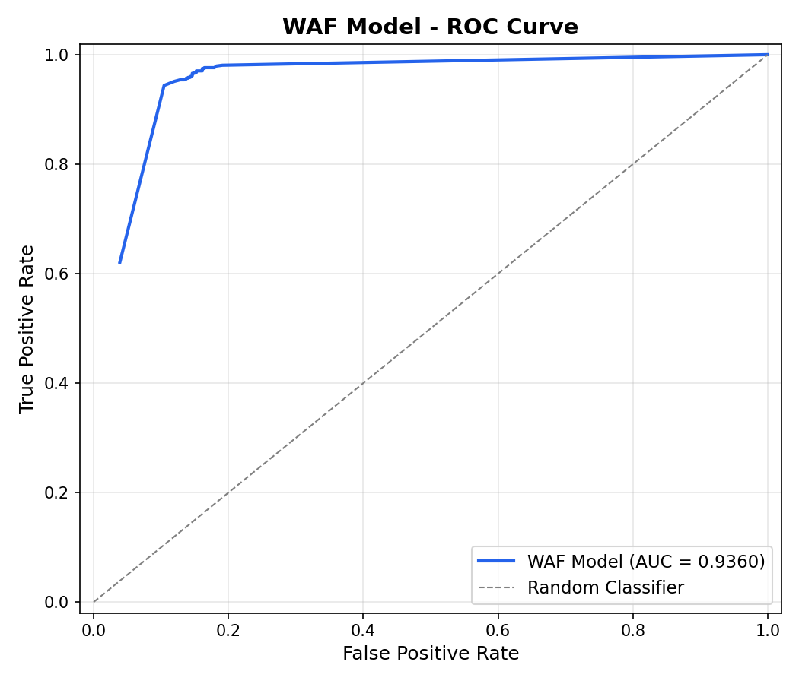
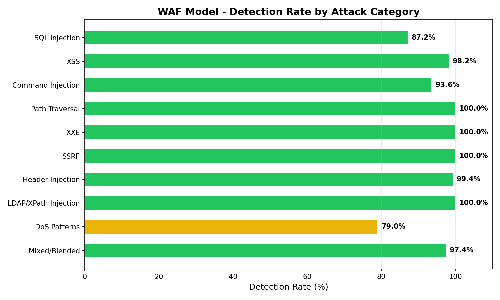

# Transformer-based End-to-End Web Application Firewall (WAF) Pipeline


**Learn what normal traffic looks like. Block everything else.** No signatures, no hand-written rules—one fine-tuned Transformer model for SQLi, XSS, path traversal, header injection, and more.

---

## The Problem

Most web application firewalls still rely on attack signatures and rule sets. They miss zero-days, novel exploits, and evasive payloads—and keeping rules up to date is a constant battle.

## The Solution

This end-to-end WAF pipeline flips that model: instead of matching known attacks, it **learns** what normal traffic looks like and blocks deviations in real time. A fine-tuned Transformer (DistilBERT) scores every HTTP request and decides *block* or *allow*—one model for multiple attack categories, no hand-written signatures.

---

## How the Flow Works

Every request hits a **reverse proxy** (the WAF gateway). Before any traffic reaches your app, it goes through:

```
Edge cache lookup → Redis rate limiting → DDoS check → IP blacklist → Bot scoring → ML inspection (DistilBERT)
```

| Layer | Purpose |
|-------|---------|
| Edge cache | Fast lookup for repeated requests |
| Rate limiting | Redis-backed per-IP throttling |
| DDoS check | Burst detection, request size limits |
| IP blacklist | Block known bad actors |
| Bot scoring | Identify automated traffic |
| ML inspection | DistilBERT binary classification; sigmoid probability → anomaly score |

Only requests that pass all layers get forwarded to the upstream app (e.g. Juice Shop, WebGoat, DVWA). **Blocked requests never reach the origin**—the proxy is the single choke point.

---

## How It Was Trained

I stood up three deliberately vulnerable web apps—**OWASP Juice Shop**, **WebGoat**, and **DVWA**—and ran a mix of benign traffic and real attack payloads against them. Request logs from all three were collected, turned into the same HTTP-style text the model sees at inference, and used to fine-tune DistilBERT on that dataset.

The model learned *normal* vs *malicious* from real traffic and real attacks in a controlled lab—not from hand-written rules.

---

## What's in the Box

| Component | Description |
|-----------|-------------|
| **Edge gateway (reverse proxy)** | Rate limiting, DDoS checks, ML inspection—all before traffic is forwarded to your app |
| **Multi-tenant backend & dashboard** | Metrics, charts, alerts, activity feed per customer |
| **AI copilot** | Ask in plain language (*"what happened in the last 24 hours?"*, *"show high-severity SQLi"*) and get an investigation overview: recent threats, critical findings, risk assessment, and recommended next steps—no need to dig through logs |
| **Redis-backed services** | Rate limiting, DDoS protection, IP blacklist |

---

## Benchmarks

Tested against **876 real-world payloads** (675 attacks + 201 benign) across 10 attack categories. Head-to-head comparison with ModSecurity CRS v4 (the most widely deployed open-source WAF).

| Metric | Transformer WAF | ModSecurity CRS v4 |
|---|---|---|
| **Overall Detection Rate** | 98.5% (665/675) | 45.6% (308/675) |
| **False Positive Rate** | 25.4% | 8.0% |
| **Inference Latency (p50)** | ~6ms (ONNX) | ~3ms (regex) |

### Detection by Category

| Category | Transformer WAF | ModSecurity CRS v4 |
|---|---|---|
| SQL Injection | 87.2% | 84.6% |
| XSS | 100.0% | 8.8% |
| Command Injection | 100.0% | 61.7% |
| Path Traversal | 100.0% | 90.0% |
| XXE | 100.0% | 3.7% |
| SSRF | 100.0% | 51.6% |
| Header Injection | 99.4% | 26.9% |
| LDAP/XPath/Template | 100.0% | 60.5% |
| DoS Patterns | 96.8% | 8.1% |
| Mixed/Blended | 94.9% | 79.5% |

### Charts

| Confusion Matrix | ROC Curve | Detection by Category |
|---|---|---|
|  |  |  |

See [`/benchmarks`](benchmarks/) for full methodology, raw data, and reproduction steps.

---

## Quick Start

```bash
git clone https://github.com/HarshdeepAthawale/Transformer-based-end-to-end-Web-Application-Firewall-WAF-pipeline.git
cd Transformer-based-end-to-end-Web-Application-Firewall-WAF-pipeline
cp .env.example .env
docker-compose up -d
```

- Open **http://localhost:3000** for the dashboard

To run only the WAF gateway with Redis (rate limiting and DDoS):  
`docker compose -f docker-compose.gateway.yml up -d`

See [docs/SETUP.md](docs/SETUP.md) for required configuration (Redis, JWT, NextAuth, gateway URLs) and first-run steps. See [docs/README.md](docs/README.md) for full documentation and deployment.

---

## Architecture

The system operates as a reverse proxy at Layer 7 (Application Layer), intercepting HTTP/HTTPS requests before they reach backend applications. B2B SaaS model: each customer connects their apps; traffic flows through the WAF before reaching their origins.

```
                    Customer Traffic (HTTPS)
                           ↓
┌─────────────────────────────────────────────────────────────┐
│            WAF Gateway (Reverse Proxy · Edge)               │
│     Rate Limit → DDoS Check → Inspect → Score → Allow/Block  │
└──────────────────────┬──────────────────────────────────────┘
                       │ Events, metrics (per tenant)
                       ↓
┌─────────────────────────────────────────────────────────────┐
│                     Customer Dashboard                       │
│                   (Next.js · Multi-tenant)                   │
│         Per-org metrics, alerts, config, API keys            │
└──────────────────────┬──────────────────────────────────────┘
                       │ REST API + WebSocket
                       ↓
┌─────────────────────────────────────────────────────────────┐
│                     Backend API Server                       │
│                  (FastAPI · Multi-tenant)                    │
│         WAF config + ML Model + Tenant isolation             │
└──┬─────────┬────────┬────────────────────────────────┬──────┘
   │         │        │                                │
   ↓         ↓        ↓                                ↓
┌─────┐  ┌──────┐ ┌──────────────────────────┐   ┌─────────┐
│Redis│  │Postgres│ WAF ML Model               │   │WebSocket│
└─────┘  └──────┘ │(DistilBERT Fine-tuned)     │   └─────────┘
                  └──────────────────────────┘

                 ↓ Protects (per customer) ↓

┌──────────────────────────────────────────────────────────────┐
│                   Customer Origins (B2B)                      │
│     app.customer-a.com · api.customer-b.com · ...             │
└──────────────────────────────────────────────────────────────┘
```

**ML pipeline stages:**

1. **Log ingestion** — Captures HTTP access logs from web servers (Nginx/Apache) in batch or streaming
2. **Request parsing** — Extracts structured data from log entries, handles multiple formats
3. **Normalization** — Removes dynamic values (UUIDs, timestamps, tokens) to focus on request structure
4. **Tokenization** — Converts normalized requests into token sequences for the Transformer
5. **Model inference** — DistilBERT generates anomaly scores (0–1) for each request
6. **Decision** — Threshold-based allow/block

---

## Key Features

| Feature | Description |
|---------|-------------|
| **Zero-day ready** | Learns from benign traffic; no attack signatures required |
| **Real-time protection** | Low-latency inference; blocks threats before they hit your app |
| **Live dashboard** | Metrics, charts, alerts, activity feed, AI copilot |
| **Production-ready** | Docker Compose, Nginx, PostgreSQL, Redis |
| **Continuous learning** | Fine-tune on new traffic; adapt to evolving patterns |

---

## Tech Stack

| Layer | Technologies |
|-------|--------------|
| **ML & AI** | PyTorch, Hugging Face Transformers (DistilBERT), ONNX Runtime, scikit-learn |
| **Model** | DistilBERT (6 layers, 12 heads, 768 hidden units), sigmoid output for anomaly score (0–1) |
| **Backend** | FastAPI, Uvicorn |
| **Frontend** | Next.js |
| **Data** | Pandas, NumPy |
| **Infra** | Docker, Redis, PostgreSQL |
| **Utilities** | Loguru, PyYAML, Pydantic |

---

## Project Structure

| Directory | Purpose |
|-----------|---------|
| `backend/` | FastAPI API, WAF middleware, ML inference |
| `frontend/` | Next.js dashboard |
| `gateway/` | Reverse proxy + WAF inspection |
| `benchmarks/` | Model evaluation, charts, ModSecurity CRS comparison |
| `applications/` | Demo apps (Juice Shop, WebGoat, DVWA) for testing |
| `models/` | Trained DistilBERT model |
| `scripts/` | Fine-tuning, stress tests, attack payloads |
| `docs/` | Phase guides and detailed documentation |

---

## Documentation

Full documentation lives in [docs/](docs/), including phase-by-phase implementation guides, architecture notes, and deployment procedures.

## License
This project is proprietary. All rights reserved.
See the LICENSE file for details.
