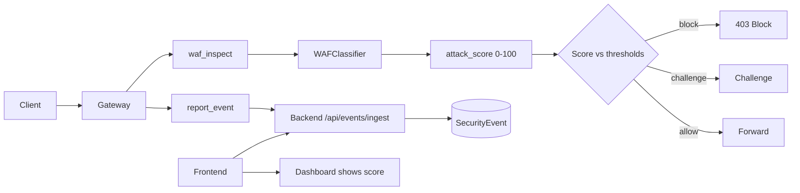

# Feature 1: WAF Attack Score

## Overview

This feature exposes the existing Transformer-based WAF classifier's confidence as a numeric **attack score** (0–100) per request, enabling industry-standard tuning: block or challenge when the score exceeds configurable thresholds. The score is sent with gateway events to the backend, stored for analytics, and displayed in the dashboard so operators can tune sensitivity without hardcoded values.

## Objectives

- Expose ML confidence from [backend/ml/waf_classifier.py](backend/ml/waf_classifier.py) as an integer attack score (0–100).
- Add gateway and backend configuration for block threshold and challenge threshold (no hardcoded values).
- Extend gateway WAF inspection and event payload to include `attack_score`; extend backend events ingest and storage.
- Add backend API to return attack score in event details and aggregated metrics.
- Add frontend display of attack score in event lists and request/event detail views.

## Architecture

## Configuration (no hardcoding)

All thresholds and behaviour MUST come from environment or config.

**Gateway** ([gateway/config.py](gateway/config.py)):

| Variable | Type | Description | Example |
|----------|------|-------------|---------|
| `WAF_ATTACK_SCORE_BLOCK_THRESHOLD` | int | Score >= this value triggers block (when WAF_MODE=block). | `70` |
| `WAF_ATTACK_SCORE_CHALLENGE_THRESHOLD` | int | Score >= this value triggers challenge (optional; 0 = disabled). | `50` |
| `WAF_THRESHOLD` | float | Existing ML probability threshold (0–1) for binary is_malicious. | `0.65` |

**Backend** ([backend/config.py](backend/config.py)):

| Variable | Type | Description |
|----------|------|-------------|
| `WAF_THRESHOLD` | float | Same semantic as gateway; used when backend runs classifier. |
| (none new) | — | Attack score is derived from classifier output; thresholds live at gateway. |

**.env.example** must document:

- `WAF_ATTACK_SCORE_BLOCK_THRESHOLD`
- `WAF_ATTACK_SCORE_CHALLENGE_THRESHOLD`

Defaults: block threshold 70, challenge 0 (disabled).

## Backend

### 1. Attack score derivation

- **Module**: [backend/ml/waf_classifier.py](backend/ml/waf_classifier.py).
- In `classify()` and `classify_batch()`, the result already includes `malicious_score` (float 0–1). Add a computed field `attack_score`: `int(round(malicious_score * 100))` clamped to 0–100. Return it in every classification result so gateway and backend consumers get a single integer score.

### 2. Events ingest schema

- **Module**: [backend/routes/events.py](backend/routes/events.py).
- Extend `IngestEvent` (Pydantic) with optional `attack_score: Optional[int] = None`.
- In `ingest_events`, store `attack_score` in event `details` (JSON). Example: `details = {"attack_score": 85, "retry_after": ...}`. Alternatively add a dedicated column (see Database).

### 3. Event list and stats APIs

- **Routes**: Same [backend/routes/events.py](backend/routes/events.py).
- For `GET /events/rate-limit`, `GET /events/ddos`, and any event list that returns event objects: include `attack_score` in each event’s payload when present (parse from `details` or from new column).
- Add `GET /api/events/waf` or extend existing event listing: filter `event_type=waf_block` or `waf_challenge` (if you introduce these), and return events with `attack_score`, `path`, `method`, `ip`, `timestamp`.
- Stats endpoint (e.g. `GET /events/stats`): add `waf_block_count` and optionally `avg_attack_score` for the time range (from DB).

### 4. Request/response schemas

- **Schemas**: Define in `backend/schemas/` (e.g. `events.py` or existing) so that event DTOs include `attack_score: Optional[int]`.
- No mock responses; all data from DB.

## Gateway

### 1. Score computation and thresholds

- **Module**: [gateway/waf_inspect.py](gateway/waf_inspect.py).
- After receiving `result` from `waf_service.check_request_async()`, derive attack score: if result has `attack_score` use it, else compute `int(round((result.get("malicious_score") or 0) * 100))` clamped to 0–100. Attach `attack_score` to the result dict passed back.
- **Module**: [gateway/config.py](gateway/config.py). Add `WAF_ATTACK_SCORE_BLOCK_THRESHOLD` and `WAF_ATTACK_SCORE_CHALLENGE_THRESHOLD` (read from env, defaults 70 and 0).
- Block logic: if `gateway_config.WAF_MODE == "block"` and `attack_score >= WAF_ATTACK_SCORE_BLOCK_THRESHOLD`, return `(True, result)`. Optionally: if challenge threshold > 0 and score >= challenge threshold but < block threshold, return a challenge response (e.g. 429 or custom status with Retry-After); document behaviour in this spec.

### 2. Event reporting

- **Module**: [gateway/main.py](gateway/main.py) (request handler that calls WAF and then reports).
- When reporting a WAF-related event (block or monitor), include in the event payload: `attack_score` (int). Event type can remain `waf_block` or be a new type like `waf_block` / `waf_challenge` so backend can aggregate.
- **Module**: [gateway/events.py](gateway/events.py). No change to batching; ensure the event dict sent to backend includes `attack_score` when present.

## Frontend

### 1. API client

- **File**: [frontend/lib/api.ts](frontend/lib/api.ts).
- Add or extend function to fetch WAF events (e.g. `getWafEvents(range, limit)`) calling the backend endpoint that returns events with `attack_score`. Response type must include `attack_score?: number`.

### 2. Dashboard / event lists

- **Pages**: [frontend/app/dashboard/page.tsx](frontend/app/dashboard/page.tsx) and any event list (e.g. threats, DoS protection).
- In event tables, add a column “Attack score” that displays the numeric value (or “—” when absent). Use real API response; no hardcoded or mock scores.

### 3. Event detail

- Where a single event is shown (e.g. modal or detail page), display `attack_score` and optionally a visual (e.g. progress bar or badge) indicating low/medium/high based on configurable bands (bands can be env-driven or from a shared constant loaded from config later).

## Data Flow

1. Client sends HTTP request to gateway.
2. Gateway runs WAF inspection ([gateway/waf_inspect.py](gateway/waf_inspect.py)); WAFClassifier returns `malicious_score` and (after implementation) `attack_score`.
3. Gateway derives/clamps attack score to 0–100 and compares to `WAF_ATTACK_SCORE_BLOCK_THRESHOLD` and `WAF_ATTACK_SCORE_CHALLENGE_THRESHOLD` (from config).
4. If block: gateway responds 403 and reports event with `event_type`, `ip`, `method`, `path`, `attack_score`.
5. If not block: gateway forwards to upstream; in monitor mode or when score is high, optionally still report event with `attack_score`.
6. Event batcher POSTs to backend `POST /api/events/ingest` with `attack_score` in each event.
7. Backend stores event (SecurityEvent table with details containing or column holding `attack_score`).
8. Frontend calls `GET /api/events/...` (waf or unified), receives events with `attack_score`, and renders in dashboard and event lists.

## External Integrations

None. Attack score is computed entirely from the existing WAF classifier; no third-party APIs.

## Database

- **Table**: `security_events` ([backend/models/security_event.py](backend/models/security_event.py)).
- **Option A**: Store `attack_score` inside existing `details` JSON. No migration; parsing in API layer.
- **Option B**: Add column `attack_score INTEGER NULL`, index for filtering/aggregation. Migration: add column, backfill from `details` if needed, then document that new events write to column.
- Prefer Option B for cleaner queries (e.g. `avg(attack_score)`, filter by score band). Document migration approach (Alembic or raw SQL) in the spec implementation notes.

## Testing

- **Unit**: WAFClassifier returns `attack_score` in 0–100 for known benign and malicious request strings; threshold comparison in gateway uses config values (inject config in test).
- **Integration**: Start gateway with env `WAF_ATTACK_SCORE_BLOCK_THRESHOLD=50`, send malicious request (e.g. SQLi pattern), assert response 403 and event in backend with `attack_score` >= 50. Send benign request, assert 200 and no block.
- **E2E**: Dashboard loads; event list shows attack score from backend; no mocks. Use real backend and DB; optional test env with seeded events containing `attack_score`.
