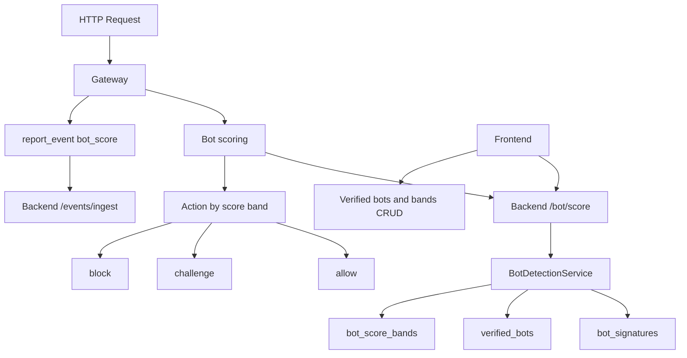

# Feature 2: Bot Management (Bot Score + Verified Bots)

## Overview

This feature extends the existing bot detection with a numeric **bot score** (1–99, industry-standard: low = automated, high = human), a **verified bots** list (allowlist of known-good bots), and configurable **score bands** that map to actions (allow, challenge, block). The gateway uses the score and bands to decide per request; the frontend provides CRUD for verified bots and score-band configuration. No hardcoded scores or actions—all from DB and config.

## Objectives

- Add a numeric bot score (1–99) to [backend/services/bot_detection.py](backend/services/bot_detection.py) output, derived from signatures, behavioral checks, and optional heuristics.
- Store and serve verified-bots list from DB; optional sync from external URL (configurable).
- Introduce score-band configuration (e.g. 1–29 block, 30–69 challenge, 70–99 allow) stored in DB or config; gateway applies action by band.
- Gateway: call backend or local bot-scoring service; enforce allow/challenge/block using bands; report bot events with score to backend.
- Frontend: [frontend/app/bot-detection/page.tsx](frontend/app/bot-detection/page.tsx) extended for score bands and verified-bots CRUD; display score in event lists.

## Architecture

## Configuration (no hardcoding)

**Gateway** ([gateway/config.py](gateway/config.py)):

| Variable | Type | Description | Example |
|----------|------|-------------|---------|
| `BOT_ENABLED` | bool | Enable bot scoring and enforcement. | `true` |
| `BOT_BACKEND_URL` | str | Backend base URL for `POST /api/bot/score` (or empty to use local scoring). | `http://backend:3001` |
| `BOT_FAIL_OPEN` | bool | If bot service unavailable, allow request. | `true` |
| `BOT_TIMEOUT_SECONDS` | float | Timeout for backend bot score call. | `1.0` |

**Backend** ([backend/config.py](backend/config.py)):

| Variable | Type | Description |
|----------|------|-------------|
| `BOT_VERIFIED_SYNC_URL` | str | Optional URL to fetch verified-bots list (JSON array of names/patterns). Empty = disabled. |
| `BOT_VERIFIED_SYNC_CRON` | str | Cron or interval for sync (e.g. `0 */6 * * *` every 6h). |
| `BOT_DEFAULT_SCORE_UNKNOWN` | int | Default score when no signature matches (1–99). | `50` |

**.env.example**: Document all of the above.

## Backend

### 1. Bot score (1–99)

- **Module**: [backend/services/bot_detection.py](backend/services/bot_detection.py).
- Extend `detect_bot()` return value with `bot_score: int` (1–99). Derivation: (a) if matched signature and `is_whitelisted`: high score (e.g. 95); (b) if matched and not whitelisted: low score from confidence (e.g. `int(30 + (1 - confidence) * 40)` so high confidence → low score); (c) behavioral bot: score from config or heuristic (e.g. 25); (d) no match: use `BOT_DEFAULT_SCORE_UNKNOWN` from config. Ensure 1 ≤ bot_score ≤ 99.

### 2. Verified bots storage and sync

- **Model**: New table or reuse. Option A: add `is_whitelisted` and use existing [backend/models/bot_signatures.py](backend/models/bot_signatures.py) (already has `is_whitelisted`). Option B: new table `verified_bots` (id, name, user_agent_pattern, source, synced_at). Prefer B for clear separation and bulk sync from URL.
- **Service**: New `backend/services/verified_bots_service.py`: list, add, delete; optional `sync_from_url(url)` that fetches JSON (array of `{ "name": "...", "pattern": "..." }`), upserts into `verified_bots`, and sets `source=remote`, `synced_at=now`. Call from scheduler or cron (config-driven).
- **Route**: `GET/POST/DELETE /api/bot/verified` for CRUD; optional `POST /api/bot/verified/sync` to trigger sync (admin).

### 3. Score bands

- **Model**: New table `bot_score_bands`: id, min_score, max_score, action (allow|challenge|block), priority (int, lower = evaluated first). Example rows: (1, 29, block), (30, 69, challenge), (70, 99, allow).
- **Service**: `backend/services/bot_detection.py` or new `bot_score_bands_service.py`: get_bands(), get_action_for_score(score). Default bands loaded from config or DB; if DB empty, seed from config/env (e.g. `BOT_BAND_BLOCK_MAX=29`, `BOT_BAND_CHALLENGE_MAX=69`).
- **Routes**: `GET/PUT /api/bot/score-bands` to list and update bands (body: array of { min_score, max_score, action }).

### 4. Score endpoint for gateway

- **Route**: `POST /api/bot/score`. Body: `{ "user_agent": "...", "ip": "...", "headers": { ... } }`. Response: `{ "bot_score": 45, "action": "challenge", "is_verified_bot": false, "matched_signature": null }`. Backend calls BotDetectionService.detect_bot(), derives score, looks up band action, returns. No mocks.

### 5. Events

- When gateway reports a bot block/challenge, include `bot_score`, `action` in event payload. Backend [backend/routes/events.py](backend/routes/events.py) ingest stores in `details` or dedicated columns (see Database).

## Gateway

### 1. Bot scoring call

- **Module**: New `gateway/bot_score.py` or inside [gateway/main.py](gateway/main.py). Before or after WAF: if `BOT_ENABLED`, call backend `POST {BOT_BACKEND_URL}/api/bot/score` with user_agent, ip, headers (or run local scoring if no backend URL). Parse `bot_score`, `action`.
- **Config**: Read `BOT_BACKEND_URL`, `BOT_TIMEOUT_SECONDS`, `BOT_FAIL_OPEN` from [gateway/config.py](gateway/config.py).

### 2. Enforce action

- If action is `block`: return 403 and report event with event_type `bot_block`, `bot_score`, `action`.
- If action is `challenge`: return 429 with Retry-After or custom challenge response; report event `bot_challenge`.
- If action is `allow`: continue to next middleware (WAF, etc.).

### 3. Event reporting

- **Module**: [gateway/events.py](gateway/events.py). Event payload must include `bot_score` (int), `action` (str). Backend ingest accepts and stores them.

## Frontend

### 1. API client

- **File**: [frontend/lib/api.ts](frontend/lib/api.ts). Add: `getBotScoreBands()`, `updateBotScoreBands(bands)`, `getVerifiedBots()`, `addVerifiedBot(...)`, `deleteVerifiedBot(id)`, `syncVerifiedBots()`. Types for band and verified-bot shapes.

### 2. Bot detection page

- **Page**: [frontend/app/bot-detection/page.tsx](frontend/app/bot-detection/page.tsx). Add:
  - Section “Score bands”: table of min_score, max_score, action; edit form to add/update/delete bands; save via API.
  - Section “Verified bots”: table of name, pattern, source; add form; delete button; “Sync from URL” button calling `POST /api/bot/verified/sync` if configured.
- Event list (if present on this page or dashboard): show `bot_score` and `action` for bot events from backend.

## Data Flow

1. Request hits gateway; gateway extracts user_agent, ip, headers.
2. Gateway calls `POST /api/bot/score` (or local equivalent) with those; backend computes bot_score and band action.
3. Gateway receives { bot_score, action }; applies block/challenge/allow.
4. On block/challenge, gateway reports event to backend with bot_score and action.
5. Backend stores event; frontend fetches events and score bands/verified bots from APIs and renders.

## External Integrations

- **Verified-bots sync**: Optional HTTP GET to URL from `BOT_VERIFIED_SYNC_URL`. Expected JSON: array of objects with at least name and pattern (or user_agent_pattern). Auth if required: use header from config (e.g. `BOT_VERIFIED_SYNC_HEADER`). Rate limit: one sync per interval.

## Database

- **bot_signatures**: Existing; no schema change required for score. Score is computed in code.
- **verified_bots** (new): id, name, user_agent_pattern, source (manual|remote), synced_at (nullable), created_at. Index on user_agent_pattern for fast lookup.
- **bot_score_bands** (new): id, min_score, max_score, action (allow|challenge|block), priority. Unique on (min_score, max_score) or enforce no overlap in application.
- **security_events**: Add optional columns `bot_score` (int), or store in `details` JSON. Prefer column for aggregation.

Migration: Alembic or SQL scripts; seed default score bands if table empty.

## Testing

- **Unit**: BotDetectionService returns bot_score in 1–99 for known user-agents; score bands service returns correct action for given score; verified-bots sync parses real JSON from fixture URL.
- **Integration**: Gateway with BOT_ENABLED and BOT_BACKEND_URL; send request with User-Agent of known bot; assert 403 and event with bot_score. Send with browser User-Agent; assert 200 and high score.
- **E2E**: Frontend: load bot-detection page, add verified bot, update score band, trigger sync (with mock or real URL); no hardcoded data.
