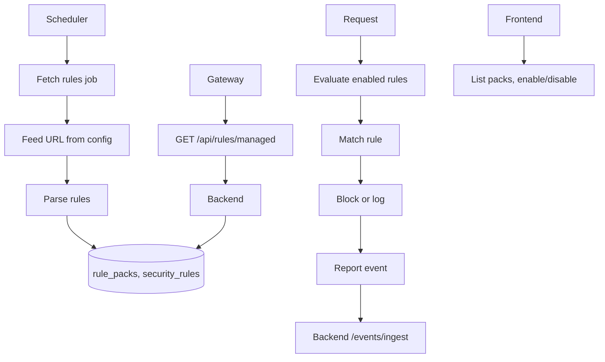

# Feature 3: Managed Rulesets (OWASP CRS + Auto-Update)

## Overview

This feature adds **managed rulesets**: pre-built rule packs (e.g. OWASP Core Rule Set) stored in the database with versioning and enable/disable per pack. A backend job fetches rules from a configurable feed URL, parses them, and stores/updates rules with a pack identifier. The gateway (or backend as sidecar) evaluates enabled rules in addition to the ML WAF. All feed URLs, update intervals, and pack IDs come from config or DB—no hardcoded rule content or URLs.

## Objectives

- Define rule pack (ruleset) entity: id, name, source_url, version, enabled, last_synced_at.
- Store individual rules linked to a pack; reuse or extend [backend/models/security_rules.py](backend/models/security_rules.py) with pack_id and rule_version.
- Backend job (scheduler/cron): fetch from configurable feed URL, parse format (OWASP CRS or documented JSON), upsert rules with versioning; update pack version and last_synced_at.
- Gateway: evaluate enabled managed rules (from backend API or local cache); block/log per rule action; report matches to backend.
- Frontend: list packs, enable/disable, show version and last sync; optional “Sync now” trigger.

## Architecture

## Configuration (no hardcoding)

**Backend** ([backend/config.py](backend/config.py)):

| Variable | Type | Description | Example |
|----------|------|-------------|---------|
| `MANAGED_RULES_FEED_URL` | str | URL to fetch rule pack (OWASP CRS XML/JSON or project-specific JSON). | `https://raw.githubusercontent.com/coreruleset/coreruleset/v4.0.0/rules/*.conf` or single JSON index |
| `MANAGED_RULES_FEED_FORMAT` | str | `owasp_crs` or `json`. Parser selection. | `json` |
| `MANAGED_RULES_UPDATE_INTERVAL_HOURS` | int | Hours between scheduled fetches. | `24` |
| `MANAGED_RULES_PACK_ID` | str | Default pack identifier when single pack. | `owasp_crs` |

**.env.example**: Document all; no default URL that points to real production CRS without operator consent (use empty or placeholder).

## Backend

### 1. Rule pack model and storage

- **Model**: New table `rule_packs`: id, name, pack_id (unique, e.g. `owasp_crs`), source_url, version (string), enabled (bool), last_synced_at, created_at, updated_at.
- **SecurityRule** ([backend/models/security_rules.py](backend/models/security_rules.py)): Add column `rule_pack_id` (FK to rule_packs.id), `rule_pack_version` (string). Optional: `external_id` (id from feed) for deduplication on sync.

### 2. Fetch and parse job

- **Module**: New `backend/services/managed_rules_sync.py`. Functions: `fetch_feed(url, format)` (HTTP GET, return raw bytes or parsed structure), `parse_owasp_crs(content)` or `parse_json_rules(content)` returning list of dicts with at least: name, pattern or equivalent, action, applies_to. `sync_pack(pack_id, feed_url, format)`: fetch, parse, upsert rules into SecurityRule with rule_pack_id and rule_pack_version; update rule_packs.version (e.g. from feed ETag or version file) and last_synced_at. No hardcoded rule content.
- **Scheduler**: In [backend/main.py](backend/main.py) or via APScheduler/celery: run sync on interval from `MANAGED_RULES_UPDATE_INTERVAL_HOURS`; or expose `POST /api/rules/managed/sync` for manual trigger (admin).

### 3. API for gateway

- **Route**: `GET /api/rules/managed?enabled_only=true`. Returns list of enabled packs with their rules (id, name, pattern, applies_to, action) or only rule IDs and patterns for evaluation. Response shape documented (e.g. `{ "packs": [ { "pack_id": "...", "version": "...", "rules": [ ... ] } ] }`). No mocks; data from DB.

### 4. Rules evaluation service

- **Module**: [backend/services/rules_service.py](backend/services/rules_service.py). Extend or add method `evaluate_managed_rules(method, path, headers, query_params, body)` that loads active rules with rule_pack_id in (select enabled packs) and runs existing `_rule_matches` logic. Return first match (rule_id, rule_name, action, pack_id) or no match.

### 5. Route for evaluation (optional)

- If gateway calls backend for rule evaluation: `POST /api/rules/evaluate` with request snapshot; response `{ "matched": true, "rule_id": ..., "action": "block" }`. Otherwise gateway fetches rules via GET and evaluates locally (document both options).

## Gateway

### 1. Load managed rules

- **Module**: New `gateway/managed_rules.py` or inside [gateway/main.py](gateway/main.py). On startup or periodic refresh: GET `{BACKEND_URL}/api/rules/managed?enabled_only=true`. Cache rules in memory; refresh interval from config (e.g. `MANAGED_RULES_CACHE_TTL_SECONDS`).

### 2. Evaluate on request

- Before or after WAF: for each request, run rule engine over method, path, headers, query, body. If a rule matches and action is block: return 403 and report event (event_type `managed_rule_block`, rule_id, pack_id). If action is log: forward and report event. No hardcoded patterns; all from fetched rules.

### 3. Config

- **Gateway config**: `MANAGED_RULES_ENABLED`, `MANAGED_RULES_BACKEND_URL`, `MANAGED_RULES_CACHE_TTL_SECONDS`, `MANAGED_RULES_FAIL_OPEN`.

## Frontend

### 1. API client

- **File**: [frontend/lib/api.ts](frontend/lib/api.ts). Add: `getManagedRulePacks()`, `toggleRulePack(packId, enabled)`, `syncManagedRules()` (POST sync). Types for pack and rule list.

### 2. Security rules or new page

- **Page**: [frontend/app/security-rules/page.tsx](frontend/app/security-rules/page.tsx) or new `frontend/app/managed-rules/page.tsx`. List rule packs (name, version, last_synced_at, enabled toggle). Button “Sync now” calls sync endpoint. No mock data; all from API.

## Data Flow

1. Scheduler or manual trigger runs sync job; job reads MANAGED_RULES_FEED_URL and MANAGED_RULES_FEED_FORMAT from config.
2. Job fetches feed, parses rules, upserts into security_rules with rule_pack_id; updates rule_packs.version and last_synced_at.
3. Gateway (or backend) loads enabled rules; on each request, evaluates rules in order; on match, blocks or logs and reports event.
4. Frontend lists packs and toggles enabled; optional sync triggers job.

## External Integrations

- **OWASP CRS**: Official repository or mirror URL. Format can be ModSecurity-style .conf or project-defined JSON. Document expected JSON schema if using JSON (e.g. `{ "rules": [ { "id": "...", "name": "...", "pattern": "...", "action": "block" } ] }`).
- **Auth**: If feed URL requires auth, use header from config (e.g. `MANAGED_RULES_FEED_HEADER` or separate key for bearer token). No credentials in code.

## Database

- **rule_packs** (new): id, name, pack_id (unique), source_url, version, enabled, last_synced_at, created_at, updated_at.
- **security_rules**: Add rule_pack_id (FK), rule_pack_version, external_id (nullable). Index on (rule_pack_id, is_active).

Migration: Create rule_packs; alter security_rules; backfill rule_pack_id NULL for existing custom rules.

## Testing

- **Unit**: Parser for documented JSON format with real fixture file; sync job upserts and updates version; rules_service evaluates and returns match.
- **Integration**: Start backend with feed URL pointing to test JSON; run sync; GET /api/rules/managed returns rules. Gateway with managed rules enabled; send request matching a rule; assert 403 and event.
- **E2E**: Frontend loads managed rules page; toggle pack; sync (with test feed); no mocks.
