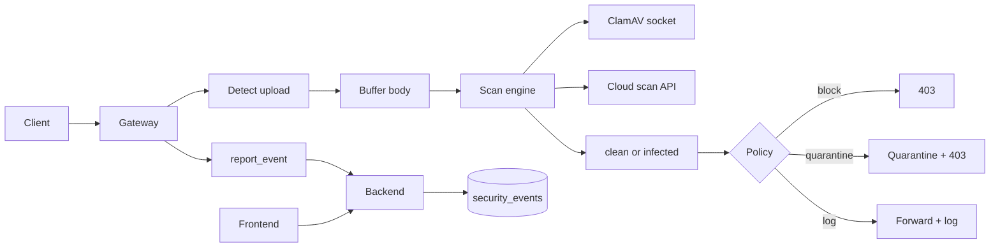

# Feature 4: Malicious Upload Scanning

## Overview

This feature adds **malicious file upload scanning**: requests that include file uploads (multipart or binary body) are streamed or forwarded to a scan engine (ClamAV daemon/socket or a cloud scan API). The engine returns a result (clean/infected); the gateway or backend enforces policy (block or quarantine) based on config. All engine endpoints, API keys, and policies are config-driven—no hardcoded paths or mock “virus found” responses.

## Objectives

- Configure scan engine: ClamAV (socket/daemon) or cloud API (URL + key) via env/config.
- Gateway or backend: detect upload requests (Content-Type multipart or configurable path prefix), buffer or stream body to scanner, receive result.
- Enforce policy: block (403), quarantine (store to quarantine path and return 403), or log-only based on config.
- Report scan events (clean/infected) to backend for dashboard; store scan result and file metadata (size, content-type, filename) in events/details.
- Frontend: show scan events and stats (infected count, last scan) from real API.

## Architecture

## Configuration (no hardcoding)

**Gateway** ([gateway/config.py](gateway/config.py)) or **Backend** ([backend/config.py](backend/config.py)) (choose single place for scan invocation):

| Variable | Type | Description | Example |
|----------|------|-------------|---------|
| `UPLOAD_SCAN_ENABLED` | bool | Enable upload scanning. | `true` |
| `UPLOAD_SCAN_ENGINE` | str | `clamav` or `cloud`. | `clamav` |
| `CLAMAV_SOCKET` | str | ClamAV daemon socket path (when engine=clamav). | `/var/run/clamav/clamd.ctl` |
| `CLAMAV_TIMEOUT_SECONDS` | float | Timeout for ClamAV INSTREAM. | `30` |
| `UPLOAD_SCAN_CLOUD_URL` | str | Cloud scan API endpoint (when engine=cloud). | `https://api.example.com/scan` |
| `UPLOAD_SCAN_CLOUD_API_KEY` | str | API key for cloud (env, not in code). | (secret) |
| `UPLOAD_SCAN_POLICY_INFECTED` | str | `block`, `quarantine`, or `log`. | `block` |
| `UPLOAD_SCAN_QUARANTINE_DIR` | str | Directory for quarantine (when policy=quarantine). Must exist; from config. | `/var/waf/quarantine` |
| `UPLOAD_SCAN_MAX_FILE_BYTES` | int | Max file size to scan; larger files block or skip per policy. | `52428800` (50MB) |
| `UPLOAD_SCAN_PATH_PREFIXES` | str | Comma-separated path prefixes to scan (empty = all). | `/upload,/api/upload` |

**.env.example**: Document all; no default API key or socket path that assumes a specific host.

## Backend

### 1. Scan service (if backend performs scan)

- **Module**: New `backend/services/upload_scan_service.py`. Interface: `scan_bytes(data: bytes, filename: str, content_type: str) -> { "result": "clean" | "infected", "signature": str | null, "engine": str }`. Implementation: if engine=clamav, connect to socket from config, send INSTREAM; if engine=cloud, POST to URL with API key header and body (multipart or raw). Parse response per documented API contract. No mock; real socket or HTTP call.

### 2. Events ingest

- **Module**: [backend/routes/events.py](backend/routes/events.py). Extend IngestEvent with optional `upload_scan_result`, `upload_scan_signature`, `upload_filename`, `upload_size_bytes`. Store in event details or dedicated columns. New event types: `upload_scan_infected`, `upload_scan_clean` (optional for stats).

### 3. API for frontend

- **Routes**: `GET /api/events/upload-scans?range=24h&limit=100` returning list of scan events (infected and optionally clean) with filename, size, result, signature, timestamp. `GET /api/stats/upload-scans?range=24h` returning counts (infected_count, scanned_count). Data from DB.

## Gateway

### 1. Upload detection

- **Module**: New `gateway/upload_scan.py` or in [gateway/main.py](gateway/main.py). Detect upload: Content-Type contains `multipart/form-data` or path matches UPLOAD_SCAN_PATH_PREFIXES (from config). If not upload, skip scan.

### 2. Body buffering and size limit

- Read body up to UPLOAD_SCAN_MAX_FILE_BYTES. If larger, either reject with 413 or skip scan per config (e.g. `UPLOAD_SCAN_SKIP_IF_OVER_MAX=true`). For multipart, extract file parts and scan each (or first file only, documented).

### 3. Call scanner

- If backend performs scan: POST request (or dedicated endpoint) to backend with file bytes and metadata; backend returns `{ "result": "clean"|"infected", "signature": "..." }`. If gateway performs scan: call ClamAV socket or cloud API from gateway using same config vars (duplicated in gateway config or read from backend config endpoint). Use only config for socket path and URLs.

### 4. Policy enforcement

- If result is infected and policy is block: return 403, report event with event_type `upload_scan_infected`, details (filename, size, signature). If policy is quarantine: write file to UPLOAD_SCAN_QUARANTINE_DIR (path from config, unique filename e.g. uuid + original extension), then 403 and report. If policy is log: forward to upstream and report event.

## Frontend

### 1. API client

- **File**: [frontend/lib/api.ts](frontend/lib/api.ts). Add: `getUploadScanEvents(range, limit)`, `getUploadScanStats(range)`. Types: event with upload_scan_result, upload_filename, upload_size_bytes, upload_scan_signature.

### 2. Dashboard or dedicated page

- **Page**: New `frontend/app/upload-scanning/page.tsx` or section in [frontend/app/dashboard/page.tsx](frontend/app/dashboard/page.tsx). Table of recent scan events (time, filename, size, result, signature); summary cards (infected count, scanned count in range). All data from API; no mock.

## Data Flow

1. Client POSTs multipart or binary upload to gateway.
2. Gateway detects upload, buffers body within size limit.
3. Gateway (or backend) sends content to ClamAV/cloud; receives result.
4. If infected: apply policy (block/quarantine); report event to backend with result, filename, size, signature.
5. Backend stores event; frontend fetches events and stats and displays.

## External Integrations

- **ClamAV**: Communicate via daemon socket (INSTREAM command). Document socket path from config; no default path that assumes a specific OS layout. Ref: ClamAV documentation for INSTREAM.
- **Cloud scan API**: HTTP POST; request format (e.g. multipart file upload or base64 body) and response format (e.g. `{ "malicious": false }` or `{ "result": "clean" }`) must be documented in spec or config. Auth: API key in header (config key name, e.g. `X-API-Key`). Rate limits: document in spec.

## Database

- **security_events**: Use existing table. event_type in (`upload_scan_infected`, `upload_scan_clean`). details JSON: `upload_filename`, `upload_size_bytes`, `upload_scan_signature`, `upload_scan_engine`. Optional columns for easier querying: upload_scan_result, upload_filename (indexed for search).

Migration: Optional new columns; or keep in details only.

## Testing

- **Unit**: Scan service with ClamAV socket mock (or real ClamAV in CI with EICAR test file); policy logic returns correct action for infected/clean.
- **Integration**: Gateway with UPLOAD_SCAN_ENABLED, engine=clamav, socket pointing to test daemon; send multipart with EICAR; assert 403 and event with result=infected. Send clean file; assert 200 and optional event.
- **E2E**: Frontend loads upload scan page; stats and event list from backend; no mock data.
