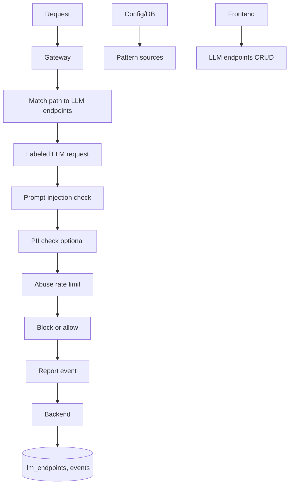

# Feature 5: Firewall for AI (LLM Endpoint Protection)

## Overview

This feature adds **Firewall for AI**: protection for LLM/AI endpoints by labeling routes that receive LLM traffic, applying prompt-injection detection, optional PII detection, and abuse-pattern rate limiting. Labeled endpoints are configured in DB or config; pattern sets (prompt injection, PII regex) are loaded from config or DB—no hardcoded paths or patterns in code.

## Objectives

- Store or configure “LLM endpoints” (path pattern, label, optional method) in DB or config; gateway/backend tags requests that match.
- Implement prompt-injection detection: match request body (and optionally headers) against configurable pattern set or regex list; block or log on match.
- Optional PII detection: regex or external service to flag PII in request/response; configurable action (block, redact, log).
- Abuse patterns: rate limit or block by pattern (e.g. jailbreak keywords, credential stuffing on chat path); thresholds from config.
- Frontend: CRUD for LLM endpoints and optional view for Firewall-for-AI events (blocked prompts, PII flags).

## Architecture

## Configuration (no hardcoding)

**Backend** ([backend/config.py](backend/config.py)):

| Variable | Type | Description | Example |
|----------|------|-------------|---------|
| `FIREWALL_AI_ENABLED` | bool | Enable Firewall for AI. | `true` |
| `FIREWALL_AI_PROMPT_PATTERNS_URL` | str | Optional URL to fetch prompt-injection patterns (one per line or JSON array). Empty = use DB only. | |
| `FIREWALL_AI_PII_PATTERNS_URL` | str | Optional URL for PII regex list. | |
| `FIREWALL_AI_ACTION_PROMPT_MATCH` | str | `block`, `log`, `challenge`. | `block` |
| `FIREWALL_AI_ACTION_PII` | str | `block`, `log`, `redact`. | `log` |
| `FIREWALL_AI_ABUSE_RATE_PER_MINUTE` | int | Max requests per IP per minute to LLM endpoints (abuse rate limit). | `60` |

**Gateway** ([gateway/config.py](gateway/config.py)): Same feature flags and action config if gateway applies checks; or gateway forwards to backend and backend responds with block decision.

**.env.example**: Document all.

## Backend

### 1. LLM endpoints storage

- **Model**: New table `llm_endpoints`: id, path_pattern (e.g. `/api/chat`, `/v1/completions`), methods (e.g. `POST` or comma-separated), label (e.g. `chat`), is_active, created_at. path_pattern can be prefix or regex (document convention).
- **Service**: New `backend/services/llm_endpoint_service.py`: list, create, update, delete; `match_request(path, method) -> llm_endpoint | None`.

### 2. Pattern loading

- **Module**: New `backend/services/firewall_ai_patterns.py`. Load prompt-injection patterns: from DB (new table `firewall_ai_patterns`: id, pattern_type (prompt_injection | pii), pattern_value, is_active) and optionally from FIREWALL_AI_PROMPT_PATTERNS_URL (HTTP GET, parse line-by-line or JSON). Cache in memory; refresh on interval or admin trigger. No hardcoded pattern strings in code.

### 3. Detection logic

- **Module**: Same or new `backend/services/firewall_ai_service.py`. `check_prompt_injection(body: str, headers: dict) -> { matched: bool, pattern: str }`: run body and optionally headers against loaded prompt-injection patterns (regex or substring). `check_pii(text: str) -> { matched: bool, pattern: str }`: run against PII patterns. Return first match.

### 4. Evaluation endpoint

- **Route**: `POST /api/firewall-ai/evaluate`. Body: path, method, body, headers. Backend: match path to LLM endpoint; if not LLM, return { "applicable": false }. If applicable: run prompt-injection and PII checks; apply abuse rate limit (per IP, key from config). Response: `{ "applicable": true, "block": true|false, "reason": "prompt_injection"|"pii"|"abuse_rate"|null }`. No mocks.

### 5. Events and APIs for frontend

- Event types: `firewall_ai_prompt_block`, `firewall_ai_pii`, `firewall_ai_abuse_rate`. Ingest from gateway; store in security_events with details (path, pattern, action). `GET /api/events/firewall-ai?range=24h`, `GET /api/firewall-ai/endpoints` (list LLM endpoints).

## Gateway

### 1. LLM request detection

- **Module**: New `gateway/firewall_ai.py`. On each request: check path (and method) against list of LLM endpoints. Fetch list from backend `GET /api/firewall-ai/endpoints` and cache (TTL from config), or read from gateway config (replicated list). If not LLM path, skip Firewall-for-AI.

### 2. Call backend or local check

- If backend evaluates: POST to `POST /api/firewall-ai/evaluate` with path, method, body, headers; if response block=true, return 403 and report event. If gateway does local check: load patterns from backend or config, run prompt-injection and PII checks; enforce action from config. Abuse rate limit: gateway maintains per-IP counter (Redis) with key prefix and limit from config.

### 3. Config

- **Gateway**: `FIREWALL_AI_ENABLED`, `FIREWALL_AI_BACKEND_URL`, `FIREWALL_AI_TIMEOUT`, `FIREWALL_AI_FAIL_OPEN`.

## Frontend

### 1. API client

- **File**: [frontend/lib/api.ts](frontend/lib/api.ts). Add: `getLlmEndpoints()`, `createLlmEndpoint(...)`, `updateLlmEndpoint(id, ...)`, `deleteLlmEndpoint(id)`, `getFirewallAiEvents(range)`.

### 2. Pages

- **Page**: New `frontend/app/firewall-ai/page.tsx` or under settings. Tab or section “LLM Endpoints”: table (path_pattern, methods, label, active); add/edit form. Section “Events”: table of firewall_ai events (time, path, reason, action). All from API.

## Data Flow

1. Request hits gateway; gateway matches path to LLM endpoints (from backend or config).
2. If LLM: gateway sends snapshot to backend evaluate or runs local pattern check; backend returns block/reason.
3. If block: gateway returns 403 and reports event with reason and pattern.
4. Backend stores event; frontend lists endpoints and events.

## External Integrations

- **Pattern URLs**: Optional HTTP GET to FIREWALL_AI_PROMPT_PATTERNS_URL and FIREWALL_AI_PII_PATTERNS_URL. Document format (plain text one pattern per line, or JSON array). No auth unless configured (e.g. header from config).

## Database

- **llm_endpoints** (new): id, path_pattern, methods, label, is_active, created_at, updated_at.
- **firewall_ai_patterns** (new): id, pattern_type, pattern_value, is_active, source (manual|remote), created_at. Optional: rule_pack_id if reusing rule pack concept.
- **security_events**: event_type in (firewall_ai_prompt_block, firewall_ai_pii, firewall_ai_abuse_rate); details JSON with path, pattern, action.

Migration: Create new tables; no change to security_events schema if using details only.

## Testing

- **Unit**: Pattern loader parses URL response; firewall_ai_service detects known prompt-injection string; LLM endpoint match by path.
- **Integration**: Gateway with FIREWALL_AI_ENABLED; POST to labeled path with prompt-injection payload; assert 403 and event. PII pattern in body; assert log or block per config.
- **E2E**: Frontend CRUD for LLM endpoints; event list shows firewall_ai events from API; no mocks.
