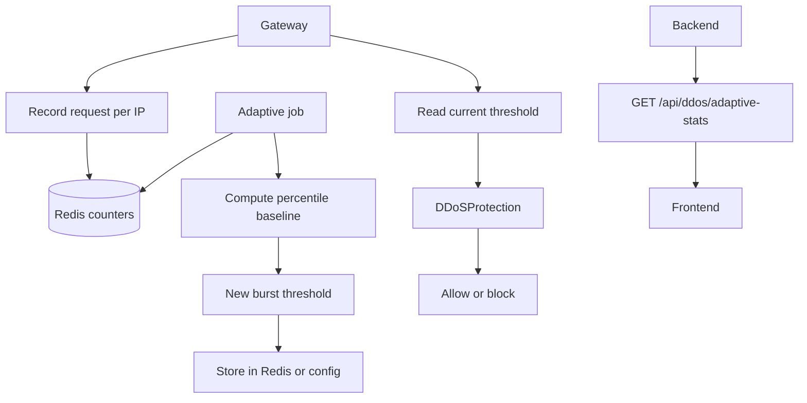

# Feature 6: Adaptive DDoS Protection

## Overview

This feature adds **adaptive DDoS protection**: the system learns a baseline of “normal” traffic (e.g. requests per IP per time window) from real traffic, then auto-tunes the burst threshold (and optionally other parameters) used by [gateway/ddos_protection.py](gateway/ddos_protection.py) so that legitimate traffic spikes are not blocked while attacks are. All learning windows, percentiles, and bounds are config-driven—no fixed magic numbers.

## Objectives

- Collect real request counts per IP (and optionally per path or global) in Redis or DB over a configurable learning window.
- Compute baseline: e.g. percentile (P95 or P99) of request rate per IP over the window; or global rate distribution.
- Auto-tune: set DDoS burst threshold (and optionally block duration) from baseline (e.g. threshold = baseline_percentile * multiplier, with min/max from config).
- Gateway: [gateway/ddos_protection.py](gateway/ddos_protection.py) reads threshold from config or from a backend/Redis “current threshold” key that the adaptive job updates.
- Backend job: periodic (cron/interval) recompute baseline and write new threshold to config store or Redis; gateway or backend reads it.
- Frontend: display current adaptive threshold, baseline stats, and last update time (from API).

## Architecture

## Configuration (no hardcoding)

**Backend** ([backend/config.py](backend/config.py)) or **Gateway** ([gateway/config.py](gateway/config.py)):

| Variable | Type | Description | Example |
|----------|------|-------------|---------|
| `ADAPTIVE_DDOS_ENABLED` | bool | Enable adaptive threshold updates. | `true` |
| `ADAPTIVE_DDOS_LEARNING_WINDOW_MINUTES` | int | Window over which to aggregate request counts for baseline. | `60` |
| `ADAPTIVE_DDOS_PERCENTILE` | float | Percentile of per-IP rate to use as baseline (0–100). | `95` |
| `ADAPTIVE_DDOS_MULTIPLIER` | float | threshold = baseline_rate * multiplier. | `1.5` |
| `ADAPTIVE_DDOS_THRESHOLD_MIN` | int | Minimum burst threshold (floor). | `20` |
| `ADAPTIVE_DDOS_THRESHOLD_MAX` | int | Maximum burst threshold (ceiling). | `500` |
| `ADAPTIVE_DDOS_UPDATE_INTERVAL_MINUTES` | int | How often to recompute and publish new threshold. | `15` |
| `ADAPTIVE_DDOS_REDIS_KEY` | str | Redis key where current threshold is stored (gateway reads). | `waf:ddos:adaptive_threshold` |
| `REDIS_URL` | str | Same Redis as gateway for counters and key. | `redis://localhost:6379` |

**.env.example**: Document all; no hardcoded thresholds in code.

## Backend

### 1. Request counting (if backend receives events)

- Gateway already records requests in Redis for burst (ZADD in [gateway/ddos_protection.py](gateway/ddos_protection.py)). For adaptive learning, either: (a) reuse the same Redis and aggregate from existing keys, or (b) gateway writes a separate “request count” metric (e.g. INCR per IP in a time-bucketed key) that the adaptive job reads. Prefer (b) for clear separation: gateway increments e.g. `ddos:count:{ip}:{bucket_minute}` with TTL; job scans or uses Redis HINCRBY for current window.

### 2. Adaptive job

- **Module**: New `backend/services/adaptive_ddos_service.py` or `backend/tasks/adaptive_ddos_job.py`. Logic: (1) Read request counts per IP for last LEARNING_WINDOW_MINUTES (from Redis keys or DB). (2) Compute requests-per-window per IP; compute percentile (e.g. P95) of that distribution. (3) baseline_rate = percentile value; threshold = max(THRESHOLD_MIN, min(THRESHOLD_MAX, round(baseline_rate * MULTIPLIER))). (4) Write threshold to Redis at ADAPTIVE_DDOS_REDIS_KEY (and optionally to DB for history). (5) Optionally write block_duration or other params to Redis. All constants from config.

### 3. Scheduler

- Run job every ADAPTIVE_DDOS_UPDATE_INTERVAL_MINUTES (APScheduler in [backend/main.py](backend/main.py) or cron). On first run, if no baseline yet (no data), keep existing gateway config default or read from Redis; do not overwrite with zero.

### 4. API for frontend

- **Route**: `GET /api/ddos/adaptive-stats`. Returns: current_threshold (from Redis), baseline_percentile_value, last_updated (timestamp), learning_window_minutes, config (multiplier, min, max). No mocks; read from Redis and DB/config.

## Gateway

### 1. Record request for learning (optional)

- **Module**: [gateway/main.py](gateway/main.py) or [gateway/ddos_protection.py](gateway/ddos_protection.py). In addition to burst check, increment a counter for adaptive learning: e.g. Redis INCR `ddos:adaptive:{ip}:{minute_bucket}` with EXPIRE to retain only learning window. Key format and TTL from config.

### 2. Read adaptive threshold

- **Module**: [gateway/ddos_protection.py](gateway/ddos_protection.py). On init or periodically (e.g. every 60s), read burst_threshold from Redis key ADAPTIVE_DDOS_REDIS_KEY if ADAPTIVE_DDOS_ENABLED; otherwise use static DDOS_BURST_THRESHOLD from config. Use read value in record_request_and_check_burst. If Redis read fails, fall back to static config.

### 3. Config

- **Gateway**: `ADAPTIVE_DDOS_ENABLED`, `ADAPTIVE_DDOS_REDIS_KEY`, `DDOS_BURST_THRESHOLD` (fallback when adaptive disabled or unavailable).

## Frontend

### 1. API client

- **File**: [frontend/lib/api.ts](frontend/lib/api.ts). Add: `getAdaptiveDdosStats()`. Type: current_threshold, baseline_percentile_value, last_updated, learning_window_minutes.

### 2. DoS protection page

- **Page**: [frontend/app/dos-protection/page.tsx](frontend/app/dos-protection/page.tsx). Add section “Adaptive DDoS”: display current threshold, baseline (P95) value, last update time, and link to config (or read-only config values from API). All from API; no mock.

## Data Flow

1. Gateway records each request in Redis (per-IP, per time bucket) for learning.
2. Backend job runs on interval; reads counters, computes percentile baseline, computes new threshold within min/max, writes to Redis.
3. Gateway (on startup or refresh) reads threshold from Redis and uses it in DDoS burst check.
4. Frontend fetches adaptive-stats from backend (backend reads Redis and returns); displays current state.

## External Integrations

None. Redis is shared between gateway and backend; no third-party API.

## Database

- Optional: table `adaptive_ddos_history` (id, threshold_value, baseline_value, computed_at) for auditing. Not required for core feature if Redis-only.

## Testing

- **Unit**: Adaptive service with fixture Redis data (known counts per IP); assert computed threshold is within min/max and equals expected formula.
- **Integration**: Populate Redis with request counts; run job; assert Redis key holds new threshold. Gateway with adaptive enabled reads key and uses value in burst check.
- **E2E**: Frontend shows adaptive stats from API; no mocks.
