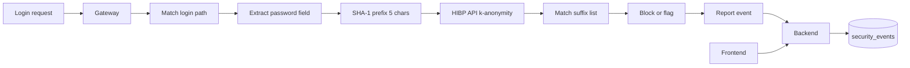

# Feature 7: Credential Leak Protection (HIBP)

## Overview

This feature adds **credential leak protection** by checking passwords (and optionally usernames) against the Have I Been Pwned (HIBP) API or a compatible service. Only a k-anonymity protocol is used: the client or backend sends a prefix of the SHA-1 hash of the password, and the API returns a list of suffix hashes that have been seen in breaches; no plaintext password is sent. On match, the gateway or backend blocks or flags the login attempt. API key and endpoint come from config; no storage of raw passwords anywhere in the spec.

## Objectives

- Integrate with HIBP Passwords API (or equivalent) using k-anonymity: send first 5 characters of SHA-1(password), receive list of suffixes; compare full hash locally.
- Backend endpoint or gateway-side call on login path: extract password from request (e.g. POST body JSON field name from config); compute hash, call API, block or flag on match.
- Config: API key, API URL, which paths trigger check (e.g. `/login`, `/api/auth/login`), field names for password (and optional username), action (block vs flag-only).
- Report events (credential_leak_block or credential_leak_flag) to backend; frontend shows stats and optional event list.
- No raw password in logs, DB, or event payloads; only outcome (blocked/flagged) and optionally hash prefix for debugging (document as optional).

## Architecture

## Configuration (no hardcoding)

**Backend** ([backend/config.py](backend/config.py)) or **Gateway** (if gateway performs check):

| Variable | Type | Description | Example |
|----------|------|-------------|---------|
| `CREDENTIAL_LEAK_ENABLED` | bool | Enable credential leak check. | `true` |
| `CREDENTIAL_LEAK_API_URL` | str | HIBP Passwords API URL (e.g. https://api.pwnedpasswords.com/range/). | `https://api.pwnedpasswords.com/range/` |
| `CREDENTIAL_LEAK_API_KEY` | str | API key (HIBP requires subscription for key). Empty if using public range endpoint (no key). | |
| `CREDENTIAL_LEAK_LOGIN_PATHS` | str | Comma-separated path prefixes or paths that trigger check. | `/login,/api/auth/login` |
| `CREDENTIAL_LEAK_PASSWORD_FIELD` | str | JSON body field name for password. | `password` |
| `CREDENTIAL_LEAK_USERNAME_FIELD` | str | Optional; for logging only (do not send to API). | `username` |
| `CREDENTIAL_LEAK_ACTION` | str | `block` or `flag`. Block = return 403; flag = allow but report. | `block` |
| `CREDENTIAL_LEAK_TIMEOUT_SECONDS` | float | Timeout for API call. | `5` |

**.env.example**: Document all; no default API key. Note that public HIBP range endpoint does not require a key but is rate-limited.

## Backend

### 1. Credential leak service

- **Module**: New `backend/services/credential_leak_service.py`. Method: `check_password(password: str) -> bool`. (1) Compute SHA-1 of password; take first 5 hex chars as prefix. (2) GET `{CREDENTIAL_LEAK_API_URL}{prefix}` (or POST if API differs). (3) Parse response (list of suffix:count lines); compare remaining 35 hex chars of hash against suffixes. (4) Return True if found (pwned), False otherwise. Use API key in header if CREDENTIAL_LEAK_API_KEY set. Timeout from config. No password stored or logged.

### 2. Evaluation endpoint (optional)

- **Route**: `POST /api/credential-leak/check`. Body: `{ "password": "..." }` (or tokenized to avoid logging). Response: `{ "pwned": true|false }`. Used by gateway or by application backend. Alternatively gateway does the check locally (see Gateway).

### 3. Events ingest

- **Module**: [backend/routes/events.py](backend/routes/events.py). New event types: `credential_leak_block`, `credential_leak_flag`. Ingest payload: ip, path, optional username (from request, not password). details JSON: do not include password or full hash; may include hash prefix (5 chars) for debugging, configurable. Store in security_events.

### 4. API for frontend

- **Route**: `GET /api/events/credential-leak?range=24h&limit=100`. Return events (no sensitive data). `GET /api/stats/credential-leak?range=24h` (count blocked, count flagged). Data from DB.

## Gateway

### 1. Login path detection

- **Module**: New `gateway/credential_leak.py` or in [gateway/main.py](gateway/main.py). For requests matching CREDENTIAL_LEAK_LOGIN_PATHS (POST), read body (within size limit from config); parse JSON and extract field from CREDENTIAL_LEAK_PASSWORD_FIELD. If missing, skip check or log and allow.

### 2. Call backend or local check

- **Option A**: Gateway forwards request to backend; backend middleware or dedicated service calls credential_leak_service and returns 403 or injects header (e.g. X-Credential-Leak: pwned) and gateway blocks. **Option B**: Gateway calls backend `POST /api/credential-leak/check` with password from body; if pwned and action=block, gateway returns 403; if action=flag, gateway forwards and reports event. **Option C**: Gateway implements same k-anonymity logic (HTTP GET to HIBP) so no password is sent to backend; gateway reports event on block/flag. Prefer Option B or C for minimal password handling on backend. Document chosen option in spec.

### 3. Event reporting

- On block or flag: report event with event_type, ip, path, optional username (from CREDENTIAL_LEAK_USERNAME_FIELD); no password in payload.

## Frontend

### 1. API client

- **File**: [frontend/lib/api.ts](frontend/lib/api.ts). Add: `getCredentialLeakEvents(range, limit)`, `getCredentialLeakStats(range)`.

### 2. Dashboard or security page

- **Page**: Section in dashboard or [frontend/app/dos-protection/page.tsx](frontend/app/dos-protection/page.tsx) or new “Credential protection”: cards (blocked count, flagged count in range); table of recent events (time, ip, path, username if present, action). No password or hash in UI. Data from API.

## Data Flow

1. Client POSTs login request to gateway.
2. Gateway matches path to CREDENTIAL_LEAK_LOGIN_PATHS; extracts password from configured field.
3. Gateway or backend computes SHA-1 prefix; calls HIBP range API; compares full hash with response.
4. If pwned and action=block: gateway returns 403 and reports credential_leak_block event.
5. If pwned and action=flag: gateway forwards and reports credential_leak_flag event.
6. Backend stores event; frontend displays stats and list.

## External Integrations

- **HIBP Passwords API**: GET https://api.pwnedpasswords.com/range/{prefix}. Returns text list of suffix:count. No auth for range endpoint; rate limit applies. With subscription: API key in header (document header name from config). Ref: https://haveibeenpwned.com/API/v3#PwnedPasswords.

## Database

- **security_events**: event_type in (credential_leak_block, credential_leak_flag). details: optional hash_prefix (5 chars), path, username (optional). No password column.

## Testing

- **Unit**: credential_leak_service with mocked HTTP response (known suffix list); assert check_password returns true for password that hashes to prefix+suffix in list. No real password in test assertions if possible; use known hash.
- **Integration**: Gateway with CREDENTIAL_LEAK_ENABLED; POST to login path with body containing a known-pwned password (e.g. "password"); mock HIBP response or use real API in test env; assert 403 and event. No mocks for E2E if using real HIBP (respect rate limits).
