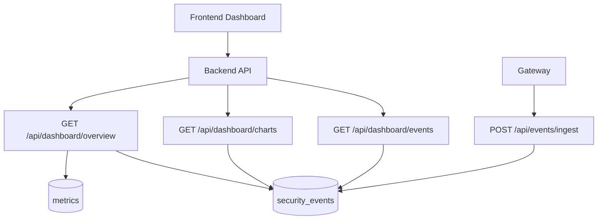

# Feature 8: Unified Security Dashboard and Analytics

## Overview

This feature delivers a **unified security dashboard**: a single view that aggregates WAF blocks, rate-limit events, DDoS events, bot score, attack score, upload scan results, credential leak events, and Firewall-for-AI events from existing and new backend APIs. All data comes from real [backend/routes/events.py](backend/routes/events.py), [backend/routes/metrics.py](backend/routes/metrics.py), and any new aggregation endpoints—no mock or hardcoded chart data.

## Objectives

- Add a single backend endpoint (or compose from existing ones) that returns all security metrics and recent events for a configurable time range.
- Define a clear API contract: time-range filter (e.g. 1h, 6h, 24h, 7d, 30d), response shape (stats, chart series, recent events by type).
- Frontend: one dashboard page that shows overview cards (counts by category), time-series charts (events over time by type), and recent event lists (WAF, rate limit, DDoS, bot, upload scan, credential leak, firewall_ai) with real data.
- Support filtering by event type and time range; all values from backend responses.

## Architecture

## Configuration (no hardcoding)

**Backend** ([backend/config.py](backend/config.py)):

| Variable | Type | Description |
|----------|------|-------------|
| (none new) | — | Time range parsing uses existing [backend/core/time_range.py](backend/core/time_range.py). Supported range values (e.g. 1h, 6h, 24h, 7d, 30d) documented in API. |

**Frontend**: Base URL for API from env (existing); no hardcoded range defaults beyond initial request (e.g. 24h).

## Backend

### 1. Overview endpoint

- **Route**: `GET /api/dashboard/overview?range=24h`. Response: `{ "waf_block_count": number, "rate_limit_count": number, "ddos_count": number, "bot_block_count": number, "upload_scan_infected_count": number, "credential_leak_block_count": number, "firewall_ai_block_count": number, "avg_attack_score": number | null, "avg_bot_score": number | null }`. Query security_events (and metrics if needed) filtered by timestamp >= start_time for given range. Use existing event_type values and new ones from other feature specs. No mocks; aggregate from DB.

### 2. Charts endpoint

- **Route**: `GET /api/dashboard/charts?range=24h`. Response: `{ "series": [ { "name": "waf_block", "data": [ { "time": "YYYY-MM-DD HH:00:00", "count": number } ] }, ... ] }`. One series per event type (or grouped). Reuse or extend aggregation logic from [backend/routes/events.py](backend/routes/events.py) (`_aggregate_security_events`). Same time bucketing (e.g. hourly). Data from DB.

### 3. Recent events endpoint

- **Route**: `GET /api/dashboard/events?range=24h&limit=50&event_type=`. Query params: range (required), limit (default 50, max 200), event_type (optional, filter by type). Response: `{ "data": [ { "id", "timestamp", "event_type", "ip", "method", "path", "details", "attack_score", "bot_score", ... } ] }`. Include fields needed for dashboard tables (attack_score, bot_score from details or columns). Pagination optional (limit only). Data from security_events.

### 4. Optional single combined endpoint

- **Route**: `GET /api/dashboard/unified?range=24h`. Returns overview + charts + recent events in one response to reduce round-trips. Same data as above; structure documented (e.g. `{ "overview": { ... }, "charts": { ... }, "recent_events": [ ... ] }`).

## Gateway

No changes. Gateway continues to report events to existing ingest endpoint; dashboard consumes stored data.

## Frontend

### 1. API client

- **File**: [frontend/lib/api.ts](frontend/lib/api.ts). Add: `getDashboardOverview(range)`, `getDashboardCharts(range)`, `getDashboardEvents(range, limit, eventType?)`. Or single `getDashboardUnified(range)` if backend exposes it. Types for overview, chart series, and event item.

### 2. Dashboard page

- **Page**: [frontend/app/dashboard/page.tsx](frontend/app/dashboard/page.tsx). Implement or extend:
  - **Overview cards**: One card per metric (WAF blocks, rate limit, DDoS, bot blocks, upload infected, credential leak, firewall_ai). Value from overview API; time range selector (1h, 6h, 24h, 7d) that updates all requests.
  - **Charts**: Time-series chart(s) with series from charts API (e.g. line or bar per event type). Use real series data; no mock arrays.
  - **Recent events table**: Columns (time, type, ip, path, attack_score, bot_score, details summary). Data from dashboard/events API. Optional filter by event type dropdown.
- All state (range, filters) in URL or React state; refetch on change. No hardcoded counts or chart data.

## Data Flow

1. User opens dashboard; frontend requests overview, charts, and recent events with default range (e.g. 24h).
2. Backend queries security_events (and metrics) for range; returns aggregates and raw events.
3. Frontend renders cards, charts, and table from response.
4. User changes range or filter; frontend refetches with new params and re-renders.

## External Integrations

None. All data from own DB.

## Database

- Uses existing **security_events** table. Ensure event_type and details (or dedicated columns) support all event types from other features (waf_block, rate_limit, ddos_*, bot_block, upload_scan_*, credential_leak_*, firewall_ai_*). Add columns or details keys as per other specs.

## Testing

- **Integration**: Seed security_events with known event types and timestamps; call overview and charts endpoints; assert counts and series match. No mocks.
- **E2E**: Load dashboard in browser; verify cards and chart show data from API; change range and verify request/response; no mock data in frontend.
