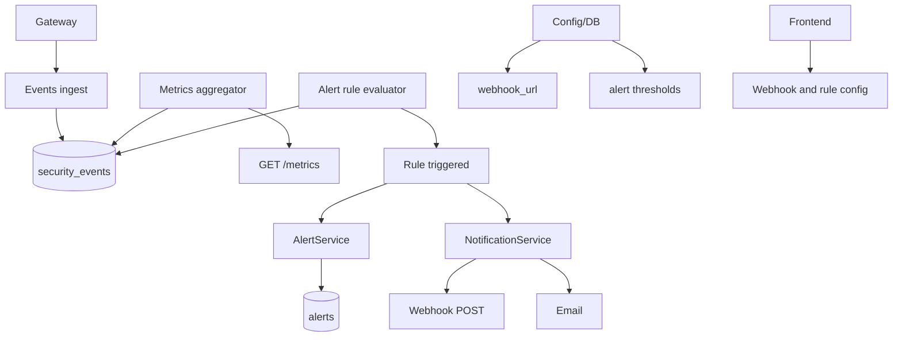

# Feature 10: Alerting and Metrics (Prometheus + Webhooks)

## Overview

This feature adds **alerting and metrics** in a production-ready way: Prometheus metrics export (format and labels documented), configurable webhook URL(s) for alerts (from env/settings, not hardcoded), and alert rules (e.g. block rate above threshold, DDoS spike) that trigger notifications via [backend/services/notification_service.py](backend/services/notification_service.py) and [backend/services/alert_service.py](backend/services/alert_service.py). All webhook URLs, thresholds, and metric names are config-driven.

## Objectives

- Expose a Prometheus metrics endpoint (e.g. GET /metrics) with WAF-relevant metrics (request counts, block counts, latency, attack score histogram, etc.); document metric names and labels.
- Store webhook URL(s) and alert rules in config or DB (e.g. settings table); no hardcoded URLs or thresholds in code.
- Evaluate alert rules periodically (e.g. block rate in last 5 minutes > X); on trigger, create alert record and invoke webhook and/or email via notification_service.
- Frontend: configure webhooks and alert rules (or read-only display); show active alerts from alert_service.

## Architecture

## Configuration (no hardcoding)

**Backend** ([backend/config.py](backend/config.py)) and/or **Settings** (DB-backed):

| Variable | Type | Description | Example |
|----------|------|-------------|---------|
| `PROMETHEUS_METRICS_ENABLED` | bool | Expose /metrics endpoint. | `true` |
| `PROMETHEUS_METRICS_NAMESPACE` | str | Prefix for metric names (e.g. waf_). | `waf` |
| `ALERT_WEBHOOK_URL` | str | Default webhook URL for alerts. Empty = use DB/settings only. | |
| `ALERT_WEBHOOK_HEADERS` | str | Optional JSON or comma-separated key:value for headers. | |
| `ALERT_RULE_BLOCK_RATE_THRESHOLD` | float | Trigger alert if block rate (blocks/total in window) exceeds this (0–1). | `0.1` |
| `ALERT_RULE_BLOCK_RATE_WINDOW_MINUTES` | int | Window for block rate calculation. | `5` |
| `ALERT_RULE_DDOS_COUNT_THRESHOLD` | int | Trigger alert if DDoS event count in window exceeds this. | `100` |
| `ALERT_EVALUATION_INTERVAL_SECONDS` | int | How often to evaluate rules. | `60` |

**Settings table** (if used): webhook_url, webhook_headers (JSON), alert_rule_block_rate_threshold, alert_rule_ddos_count_threshold, etc. Override env when present.

**.env.example**: Document all; no default webhook URL with real endpoint.

## Backend

### 1. Prometheus metrics endpoint

- **Route**: `GET /metrics` (or `/api/metrics/prometheus`). Return text format (Prometheus exposition). Metrics (examples): `waf_requests_total` (counter, labels: outcome=block|allow), `waf_blocks_total` (counter), `waf_request_duration_seconds` (histogram), `waf_attack_score` (histogram or gauge). Values from in-memory counters updated by request path, or from DB/Redis aggregates if no in-memory path. Document exact names and labels in spec. No mock values; either real counters or documented “not yet implemented” for each metric.

### 2. Metrics collection

- **Module**: [backend/tasks/metrics_aggregator.py](backend/tasks/metrics_aggregator.py) or new: periodically aggregate from security_events into counters/gauges that the /metrics endpoint reads. Or gateway increments Redis counters and backend /metrics reads from Redis. Document data source for each metric.

### 3. Alert rules storage

- **Model**: Use existing [backend/models/alerts.py](backend/models/alerts.py) for alert records. Alert rules (thresholds): store in [backend/models/settings.py](backend/models/settings.py) or new table `alert_rules` (id, name, rule_type (block_rate | ddos_count), threshold_value, window_minutes, is_active). Load from DB; fallback to env.

### 4. Alert rule evaluator

- **Module**: New `backend/services/alert_evaluator.py` or extend alert_service. Every ALERT_EVALUATION_INTERVAL_SECONDS: (1) Query security_events for last N minutes (window). (2) Compute block rate = block_count / total_count; if > threshold, trigger. (3) Count DDoS events; if > threshold, trigger. (4) On trigger: call AlertService.create_alert(...); call NotificationService to send webhook (and email if configured). Webhook URL and headers from settings or env.

### 5. Webhook delivery

- **Module**: [backend/services/notification_service.py](backend/services/notification_service.py). Extend or use existing _send_webhook: URL from settings or ALERT_WEBHOOK_URL; payload from alert (title, description, severity, timestamp, source). No hardcoded URL; read from config/settings.

### 6. API for frontend

- **Routes**: `GET /api/alerts` (active alerts), `GET /api/alerts/history?range=24h`. `GET /api/settings/alerting` (webhook URL, rule thresholds—mask URL if needed). `PUT /api/settings/alerting` (update webhook URL and thresholds). Auth required for PUT.

## Gateway

- Optional: gateway increments Prometheus counters (e.g. via push gateway or by exposing gateway’s own /metrics). Document if used; otherwise backend aggregates from events only.

## Frontend

### 1. API client

- **File**: [frontend/lib/api.ts](frontend/lib/api.ts). Add: `getAlerts()`, `getAlertHistory(range)`, `getAlertingSettings()`, `updateAlertingSettings(webhookUrl, thresholds)`.

### 2. Settings and alerts UI

- **Page**: [frontend/app/settings/page.tsx](frontend/app/settings/page.tsx). Section “Alerting”: input for webhook URL (from API), inputs for block rate threshold and DDoS count threshold (from API); save button calls PUT. **Page** or section: “Active alerts” list from GET /api/alerts; no mock data.

## Data Flow

1. Requests and events flow into backend; metrics aggregator or request path updates counters.
2. GET /metrics returns current counter/histogram values.
3. Evaluator runs on interval; queries events, computes rates/counts; if above threshold, creates alert and calls notification_service with webhook URL from settings.
4. Frontend displays alerts and allows editing alerting settings via API.

## External Integrations

- **Webhook**: HTTP POST to user-configured URL. Payload shape documented (e.g. { "event": "alert", "severity", "title", "description", "timestamp" }). Headers from config. No outbound call to hardcoded URL.

## Database

- **alerts**: Existing; used for alert records.
- **settings** or **alert_rules**: Store webhook_url, thresholds; migration if new columns/table.

## Testing

- **Unit**: Evaluator with seeded events; assert alert created and webhook called (mock httpx) when block rate exceeds threshold. No hardcoded threshold in test; use config.
- **Integration**: Set ALERT_WEBHOOK_URL to test server; trigger condition; assert POST received with expected payload. Prometheus endpoint returns valid exposition format.
- **E2E**: Frontend updates webhook URL; evaluator runs; alert appears in list; no mocks.
