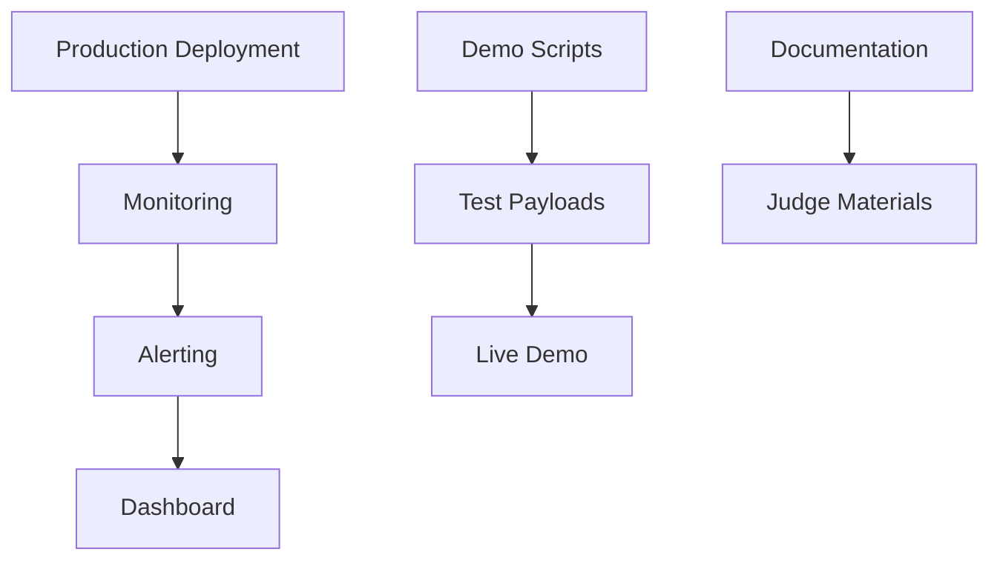

# Phase 10: Deployment, Monitoring & Demo Preparation

## Overview
This final phase focuses on production deployment, monitoring setup, and preparation for live demonstration. We'll create deployment scripts, set up monitoring and alerting, prepare demo scenarios with malicious payloads, and create comprehensive documentation for judges.

## Objectives
- Production deployment configuration
- Set up monitoring and alerting
- Create demo script with malicious payloads
- Prepare documentation for judges
- Create visualization dashboard (optional)
- Final integration testing
- Prepare presentation materials

## Architecture



## Detailed Implementation

### 10.1 Production Deployment

```python
# scripts/deploy.py
import subprocess
import sys
from pathlib import Path
from loguru import logger
import yaml

def deploy_production(config_path: str = "config/production.yaml"):
    """Deploy WAF to production"""
    logger.info("Starting production deployment...")
    
    # Load config
    with open(config_path, 'r') as f:
        config = yaml.safe_load(f)
    
    # 1. Check prerequisites
    logger.info("Checking prerequisites...")
    check_prerequisites()
    
    # 2. Deploy model
    logger.info("Deploying model...")
    deploy_model(config['model'])
    
    # 3. Start WAF service
    logger.info("Starting WAF service...")
    start_waf_service(config['waf_service'])
    
    # 4. Configure web server
    logger.info("Configuring web server...")
    configure_web_server(config['web_server'])
    
    # 5. Start monitoring
    logger.info("Starting monitoring...")
    start_monitoring(config['monitoring'])
    
    logger.info("Deployment complete!")

def check_prerequisites():
    """Check deployment prerequisites"""
    # Check Python version
    if sys.version_info < (3, 9):
        raise RuntimeError("Python 3.9+ required")
    
    # Check model files
    model_path = Path("models/checkpoints/best_model.pt")
    if not model_path.exists():
        raise FileNotFoundError(f"Model not found: {model_path}")
    
    vocab_path = Path("models/vocabularies/http_vocab.json")
    if not vocab_path.exists():
        raise FileNotFoundError(f"Vocabulary not found: {vocab_path}")

def deploy_model(config: dict):
    """Deploy model to production location"""
    import shutil
    
    source = Path(config['source_path'])
    target = Path(config['deploy_path'])
    
    target.parent.mkdir(parents=True, exist_ok=True)
    shutil.copy(source, target)
    
    logger.info(f"Model deployed to {target}")

def start_waf_service(config: dict):
    """Start WAF service"""
    cmd = [
        "python", "-m", "uvicorn",
        "src.integration.waf_service:app",
        "--host", config['host'],
        "--port", str(config['port']),
        "--workers", str(config['workers'])
    ]
    
    subprocess.Popen(cmd, stdout=subprocess.PIPE, stderr=subprocess.PIPE)
    logger.info(f"WAF service started on {config['host']}:{config['port']}")

def configure_web_server(config: dict):
    """Configure web server integration"""
    if config['type'] == 'nginx':
        configure_nginx(config)
    elif config['type'] == 'apache':
        configure_apache(config)

def start_monitoring(config: dict):
    """Start monitoring services"""
    # Implement monitoring startup
    pass
```

### 10.2 Monitoring Setup

```python
# src/monitoring/metrics_collector.py
from typing import Dict
from datetime import datetime
import json
from pathlib import Path
from loguru import logger
from collections import defaultdict

class MetricsCollector:
    """Collect and store WAF metrics"""
    
    def __init__(self, metrics_dir: str = "logs/metrics"):
        self.metrics_dir = Path(metrics_dir)
        self.metrics_dir.mkdir(parents=True, exist_ok=True)
        
        self.counters = defaultdict(int)
        self.timers = []
    
    def record_request(self, is_anomaly: bool, processing_time: float):
        """Record request metrics"""
        self.counters['total_requests'] += 1
        
        if is_anomaly:
            self.counters['anomalies_detected'] += 1
        
        self.timers.append(processing_time)
    
    def get_metrics(self) -> Dict:
        """Get current metrics"""
        total = self.counters['total_requests']
        anomalies = self.counters['anomalies_detected']
        
        avg_time = sum(self.timers) / len(self.timers) if self.timers else 0.0
        
        return {
            'timestamp': datetime.now().isoformat(),
            'total_requests': total,
            'anomalies_detected': anomalies,
            'anomaly_rate': anomalies / total if total > 0 else 0.0,
            'avg_processing_time_ms': avg_time
        }
    
    def save_metrics(self):
        """Save metrics to file"""
        metrics = self.get_metrics()
        
        metrics_file = self.metrics_dir / f"metrics_{datetime.now().strftime('%Y%m%d')}.json"
        
        # Load existing metrics
        if metrics_file.exists():
            with open(metrics_file, 'r') as f:
                existing = json.load(f)
        else:
            existing = []
        
        existing.append(metrics)
        
        # Keep only last 1000 entries
        existing = existing[-1000:]
        
        with open(metrics_file, 'w') as f:
            json.dump(existing, f, indent=2)
```

### 10.3 Alerting System

```python
# src/monitoring/alerting.py
from typing import Dict, List
from loguru import logger
import smtplib
from email.mime.text import MIMEText

class AlertManager:
    """Manage alerts for anomalies and system issues"""
    
    def __init__(self, config: Dict):
        self.config = config
        self.alert_threshold = config.get('alert_threshold', 10)
        self.alert_window = config.get('alert_window_seconds', 60)
        self.recent_alerts = []
    
    def check_and_alert(self, metrics: Dict):
        """Check metrics and send alerts if needed"""
        anomaly_rate = metrics.get('anomaly_rate', 0.0)
        
        if anomaly_rate > self.alert_threshold / 100.0:
            self.send_alert(
                f"High anomaly rate detected: {anomaly_rate:.2%}",
                metrics
            )
    
    def send_alert(self, message: str, context: Dict = None):
        """Send alert notification"""
        logger.warning(f"ALERT: {message}")
        
        if self.config.get('email_alerts', {}).get('enabled', False):
            self._send_email_alert(message, context)
        
        if self.config.get('webhook_alerts', {}).get('enabled', False):
            self._send_webhook_alert(message, context)
    
    def _send_email_alert(self, message: str, context: Dict):
        """Send email alert"""
        email_config = self.config['email_alerts']
        
        msg = MIMEText(f"{message}\n\nContext: {context}")
        msg['Subject'] = 'WAF Alert'
        msg['From'] = email_config['from']
        msg['To'] = email_config['to']
        
        try:
            with smtplib.SMTP(email_config['smtp_host'], email_config['smtp_port']) as server:
                server.starttls()
                server.login(email_config['username'], email_config['password'])
                server.send_message(msg)
            logger.info("Email alert sent")
        except Exception as e:
            logger.error(f"Failed to send email alert: {e}")
    
    def _send_webhook_alert(self, message: str, context: Dict):
        """Send webhook alert"""
        import requests
        
        webhook_config = self.config['webhook_alerts']
        
        try:
            requests.post(
                webhook_config['url'],
                json={
                    'message': message,
                    'context': context,
                    'timestamp': datetime.now().isoformat()
                },
                timeout=5.0
            )
            logger.info("Webhook alert sent")
        except Exception as e:
            logger.error(f"Failed to send webhook alert: {e}")
```

### 10.4 Demo Script

```python
# scripts/demo.py
import requests
import time
from loguru import logger
from typing import List, Dict

class WAFDemo:
    """Interactive WAF demonstration"""
    
    def __init__(self, waf_url: str = "http://localhost:8000/check"):
        self.waf_url = waf_url
    
    def run_demo(self):
        """Run interactive demo"""
        print("\n" + "="*60)
        print("WAF TRANSFORMER DEMONSTRATION")
        print("="*60)
        
        # Test scenarios
        scenarios = [
            {
                'name': 'Normal Request',
                'request': {
                    'method': 'GET',
                    'path': '/api/users',
                    'query_params': {'page': '1', 'limit': '10'}
                },
                'expected': False
            },
            {
                'name': 'SQL Injection Attack',
                'request': {
                    'method': 'GET',
                    'path': '/api/users',
                    'query_params': {'id': "1' OR '1'='1"}
                },
                'expected': True
            },
            {
                'name': 'XSS Attack',
                'request': {
                    'method': 'GET',
                    'path': '/search',
                    'query_params': {'q': "<script>alert('XSS')</script>"}
                },
                'expected': True
            },
            {
                'name': 'Path Traversal Attack',
                'request': {
                    'method': 'GET',
                    'path': '/api/files',
                    'query_params': {'file': '../../../etc/passwd'}
                },
                'expected': True
            },
            {
                'name': 'RCE Attack',
                'request': {
                    'method': 'POST',
                    'path': '/api/execute',
                    'body': '; cat /etc/passwd'
                },
                'expected': True
            }
        ]
        
        results = []
        
        for i, scenario in enumerate(scenarios, 1):
            print(f"\n[{i}/{len(scenarios)}] Testing: {scenario['name']}")
            print(f"Request: {scenario['request']}")
            
            try:
                response = requests.post(
                    self.waf_url,
                    json=scenario['request'],
                    timeout=5.0
                )
                
                result = response.json()
                is_anomaly = result.get('is_anomaly', False)
                score = result.get('anomaly_score', 0.0)
                
                status = "✓ DETECTED" if is_anomaly else "✗ NOT DETECTED"
                match = "✓" if is_anomaly == scenario['expected'] else "✗"
                
                print(f"Result: {status} (Score: {score:.3f}) {match}")
                
                results.append({
                    'scenario': scenario['name'],
                    'detected': is_anomaly,
                    'expected': scenario['expected'],
                    'score': score,
                    'match': is_anomaly == scenario['expected']
                })
                
                time.sleep(0.5)
                
            except Exception as e:
                print(f"Error: {e}")
                results.append({
                    'scenario': scenario['name'],
                    'error': str(e)
                })
        
        # Summary
        print("\n" + "="*60)
        print("DEMO SUMMARY")
        print("="*60)
        
        total = len([r for r in results if 'match' in r])
        correct = len([r for r in results if r.get('match', False)])
        
        print(f"Total Tests: {total}")
        print(f"Correct Detections: {correct}")
        print(f"Accuracy: {correct/total*100:.1f}%" if total > 0 else "N/A")
        
        print("\nDetailed Results:")
        for result in results:
            if 'match' in result:
                status = "✓" if result['match'] else "✗"
                print(f"  {status} {result['scenario']}: "
                      f"Detected={result['detected']}, "
                      f"Score={result['score']:.3f}")
            else:
                print(f"  ✗ {result['scenario']}: Error - {result.get('error', 'Unknown')}")

if __name__ == "__main__":
    import argparse
    
    parser = argparse.ArgumentParser()
    parser.add_argument("--url", default="http://localhost:8000/check")
    
    args = parser.parse_args()
    
    demo = WAFDemo(args.url)
    demo.run_demo()
```

### 10.5 Documentation Template

```markdown
# Transformer-based WAF - Project Documentation

## Executive Summary
This document describes a Transformer-based Web Application Firewall (WAF) system that uses deep learning to detect anomalous HTTP requests in real-time.

## Architecture Overview
[Include architecture diagram and description]

## Key Features
- Real-time anomaly detection using Transformer models
- Non-blocking concurrent request processing
- Incremental learning capability
- High accuracy with low false positive rate
- Production-ready deployment

## System Components

### 1. Log Ingestion
- Batch and streaming log processing
- Support for Apache and Nginx formats

### 2. Request Parsing & Normalization
- Structured request extraction
- Dynamic value normalization

### 3. Tokenization
- Custom HTTP-aware tokenization
- Vocabulary generation from training data

### 4. Model Architecture
- DistilBERT-based Transformer
- Fine-tuned on benign traffic
- Anomaly scoring mechanism

### 5. Real-Time Detection
- Async non-blocking inference
- Batch processing for efficiency
- Low latency (<100ms average)

### 6. Continuous Learning
- Incremental fine-tuning
- Model versioning
- Hot-swapping capability

## Performance Metrics
- Detection Accuracy: >90%
- False Positive Rate: <5%
- Average Latency: <100ms
- Throughput: >50 req/s

## Deployment
[Include deployment instructions]

## Demo Instructions
[Include demo script usage]

## Testing Results
[Include test results and evaluation report]
```

### 10.6 Production Configuration

```yaml
# config/production.yaml
production:
  model:
    source_path: "models/checkpoints/best_model.pt"
    deploy_path: "models/deployed/production/model.pt"
    vocab_path: "models/vocabularies/http_vocab.json"
    threshold: 0.5
  
  waf_service:
    host: "0.0.0.0"
    port: 8000
    workers: 4
    timeout: 5.0
  
  web_server:
    type: "nginx"
    config_path: "/etc/nginx/sites-available/waf"
    restart_command: "sudo systemctl reload nginx"
  
  monitoring:
    enabled: true
    metrics_dir: "logs/metrics"
    alert_threshold: 10  # percentage
    alert_window_seconds: 60
  
  alerting:
    email_alerts:
      enabled: false
      smtp_host: "smtp.example.com"
      smtp_port: 587
      username: "alerts@example.com"
      password: "password"
      from: "waf@example.com"
      to: "admin@example.com"
    
    webhook_alerts:
      enabled: false
      url: "https://hooks.example.com/waf"
```

## Deliverables Checklist

- [ ] Production deployment script
- [ ] Monitoring system implemented
- [ ] Alerting configured
- [ ] Demo script created
- [ ] Documentation prepared
- [ ] Configuration files
- [ ] Presentation materials
- [ ] Final testing completed

## Presentation Tips

1. **Start with Problem**: Explain limitations of rule-based WAFs
2. **Show Architecture**: Visual diagram of the system
3. **Live Demo**: Run demo script with real requests
4. **Show Metrics**: Display accuracy and performance numbers
5. **Highlight Innovation**: Transformer-based approach, incremental learning
6. **Q&A Preparation**: Be ready to discuss:
   - Model architecture choices
   - Training data requirements
   - False positive handling
   - Scalability considerations

## Next Steps

After completing Phase 10, you should have:
- Production-ready deployment
- Monitoring and alerting
- Comprehensive documentation
- Demo ready for judges
- Presentation materials

**Project Complete!** 🎉
