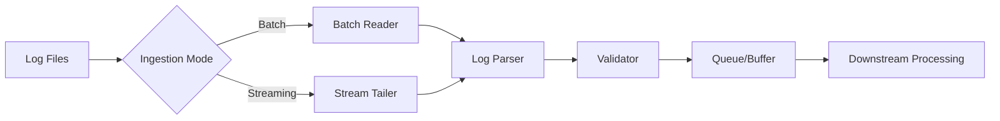

# Phase 2: Log Ingestion System

## Overview
This phase implements a robust log ingestion system that can handle both historical log files (batch mode) and real-time log streaming (streaming mode). The system must support multiple log formats (Apache Common/Combined, Nginx) and provide reliable error handling and retry mechanisms.

## Objectives
- Implement batch log reader for historical log processing
- Implement streaming log tailer for real-time log monitoring
- Support multiple log formats (Apache, Nginx)
- Create log queue/buffer for asynchronous processing
- Add comprehensive error handling and retry logic
- Implement log validation and sanitization

## Architecture



## Detailed Implementation

### 2.1 Log Format Detection

Create log format detector:

```python
# src/ingestion/log_formats.py
from enum import Enum
from typing import Optional
import re

class LogFormat(Enum):
    APACHE_COMMON = "apache_common"
    APACHE_COMBINED = "apache_combined"
    APACHE_DETAILED = "apache_detailed"
    NGINX_COMBINED = "nginx_combined"
    NGINX_DETAILED = "nginx_detailed"
    UNKNOWN = "unknown"

class LogFormatDetector:
    """Detect log format from sample lines"""
    
    APACHE_COMMON_PATTERN = r'^(\S+) (\S+) (\S+) \[([^\]]+)\] "(\S+) ([^"]+)" (\d+)'
    APACHE_COMBINED_PATTERN = r'^(\S+) (\S+) (\S+) \[([^\]]+)\] "(\S+) ([^"]+)" (\d+) (\d+) "([^"]*)" "([^"]*)"'
    NGINX_PATTERN = r'^(\S+) - (\S+) \[([^\]]+)\] "(\S+) ([^"]+)" (\d+)'
    
    @staticmethod
    def detect_format(log_line: str) -> LogFormat:
        """Detect log format from a sample line"""
        if not log_line.strip():
            return LogFormat.UNKNOWN
        
        # Check Apache Combined
        if re.match(LogFormatDetector.APACHE_COMBINED_PATTERN, log_line):
            return LogFormat.APACHE_COMBINED
        
        # Check Apache Common
        if re.match(LogFormatDetector.APACHE_COMMON_PATTERN, log_line):
            return LogFormat.APACHE_COMMON
        
        # Check Nginx
        if re.match(LogFormatDetector.NGINX_PATTERN, log_line):
            return LogFormat.NGINX_COMBINED
        
        return LogFormat.UNKNOWN
    
    @staticmethod
    def validate_format(log_file: str, format_type: LogFormat) -> bool:
        """Validate if log file matches expected format"""
        try:
            with open(log_file, 'r', encoding='utf-8', errors='ignore') as f:
                for i, line in enumerate(f):
                    if i >= 10:  # Check first 10 lines
                        break
                    detected = LogFormatDetector.detect_format(line)
                    if detected != format_type and detected != LogFormat.UNKNOWN:
                        return False
                return True
        except Exception as e:
            print(f"Error validating format: {e}")
            return False
```

### 2.2 Batch Log Reader

```python
# src/ingestion/batch_reader.py
import os
import gzip
from typing import Iterator, Optional, Callable
from pathlib import Path
from loguru import logger
import time

class BatchLogReader:
    """Read logs from files in batch mode"""
    
    def __init__(
        self,
        log_path: str,
        format_detector: Optional[Callable] = None,
        max_lines: Optional[int] = None,
        skip_lines: int = 0
    ):
        self.log_path = Path(log_path)
        self.format_detector = format_detector
        self.max_lines = max_lines
        self.skip_lines = skip_lines
        self.line_count = 0
        
    def _open_file(self):
        """Open log file, handling gzip compression"""
        if self.log_path.suffix == '.gz':
            return gzip.open(self.log_path, 'rt', encoding='utf-8', errors='ignore')
        else:
            return open(self.log_path, 'r', encoding='utf-8', errors='ignore')
    
    def read_lines(self) -> Iterator[str]:
        """Read log lines from file"""
        if not self.log_path.exists():
            logger.error(f"Log file not found: {self.log_path}")
            return
        
        try:
            with self._open_file() as f:
                # Skip initial lines if specified
                for _ in range(self.skip_lines):
                    next(f, None)
                
                for line in f:
                    line = line.strip()
                    if not line:
                        continue
                    
                    self.line_count += 1
                    
                    # Check max lines limit
                    if self.max_lines and self.line_count > self.max_lines:
                        break
                    
                    yield line
                    
        except Exception as e:
            logger.error(f"Error reading log file {self.log_path}: {e}")
            raise
    
    def get_file_size(self) -> int:
        """Get log file size in bytes"""
        return self.log_path.stat().st_size
    
    def get_line_count(self) -> int:
        """Get approximate line count (for progress tracking)"""
        try:
            with self._open_file() as f:
                return sum(1 for _ in f)
        except:
            return 0
    
    def read_chunks(self, chunk_size: int = 1000) -> Iterator[list]:
        """Read logs in chunks for batch processing"""
        chunk = []
        for line in self.read_lines():
            chunk.append(line)
            if len(chunk) >= chunk_size:
                yield chunk
                chunk = []
        if chunk:
            yield chunk
```

### 2.3 Streaming Log Tailer

```python
# src/ingestion/stream_reader.py
import os
import time
from pathlib import Path
from typing import Iterator, Optional, Callable
from loguru import logger
import select

class StreamLogReader:
    """Tail log files in real-time (streaming mode)"""
    
    def __init__(
        self,
        log_path: str,
        format_detector: Optional[Callable] = None,
        poll_interval: float = 0.1,
        follow: bool = True
    ):
        self.log_path = Path(log_path)
        self.format_detector = format_detector
        self.poll_interval = poll_interval
        self.follow = follow
        self.file_position = 0
        self.file_handle = None
        
    def _get_file_size(self) -> int:
        """Get current file size"""
        try:
            return self.log_path.stat().st_size
        except:
            return 0
    
    def _open_file(self):
        """Open log file for reading"""
        if not self.log_path.exists():
            # Wait for file to be created
            while not self.log_path.exists():
                time.sleep(self.poll_interval)
        
        return open(self.log_path, 'r', encoding='utf-8', errors='ignore')
    
    def _read_new_lines(self) -> Iterator[str]:
        """Read new lines since last position"""
        try:
            current_size = self._get_file_size()
            
            # File was truncated or rotated
            if current_size < self.file_position:
                logger.warning(f"Log file rotated: {self.log_path}")
                self.file_position = 0
                if self.file_handle:
                    self.file_handle.close()
                    self.file_handle = None
            
            # Open file if not already open
            if self.file_handle is None:
                self.file_handle = self._open_file()
                self.file_handle.seek(self.file_position)
            
            # Read new content
            while True:
                line = self.file_handle.readline()
                if not line:
                    break
                
                line = line.strip()
                if line:
                    yield line
                    self.file_position = self.file_handle.tell()
            
        except Exception as e:
            logger.error(f"Error reading stream: {e}")
            if self.file_handle:
                self.file_handle.close()
                self.file_handle = None
    
    def stream_lines(self) -> Iterator[str]:
        """Stream log lines in real-time"""
        logger.info(f"Starting to tail log file: {self.log_path}")
        
        # Read existing content first
        for line in self._read_new_lines():
            yield line
        
        # Follow new lines
        if self.follow:
            while True:
                try:
                    new_lines = list(self._read_new_lines())
                    for line in new_lines:
                        yield line
                    
                    if not new_lines:
                        time.sleep(self.poll_interval)
                        
                except KeyboardInterrupt:
                    logger.info("Streaming interrupted by user")
                    break
                except Exception as e:
                    logger.error(f"Error in streaming loop: {e}")
                    time.sleep(self.poll_interval)
        
        if self.file_handle:
            self.file_handle.close()
            self.file_handle = None
    
    def close(self):
        """Close file handle"""
        if self.file_handle:
            self.file_handle.close()
            self.file_handle = None
```

### 2.4 Log Queue & Buffer

```python
# src/ingestion/log_queue.py
from queue import Queue, Empty
from threading import Thread, Event
from typing import Optional, Callable
from loguru import logger
import time

class LogQueue:
    """Thread-safe queue for log processing"""
    
    def __init__(
        self,
        maxsize: int = 10000,
        timeout: float = 1.0,
        processor: Optional[Callable] = None
    ):
        self.queue = Queue(maxsize=maxsize)
        self.timeout = timeout
        self.processor = processor
        self.stop_event = Event()
        self.processor_thread = None
        
    def put(self, item, block: bool = True, timeout: Optional[float] = None):
        """Add item to queue"""
        try:
            self.queue.put(item, block=block, timeout=timeout or self.timeout)
        except Exception as e:
            logger.warning(f"Failed to add item to queue: {e}")
    
    def get(self, block: bool = True, timeout: Optional[float] = None):
        """Get item from queue"""
        try:
            return self.queue.get(block=block, timeout=timeout or self.timeout)
        except Empty:
            return None
    
    def start_processor(self):
        """Start background processor thread"""
        if self.processor and not self.processor_thread:
            self.stop_event.clear()
            self.processor_thread = Thread(target=self._process_loop, daemon=True)
            self.processor_thread.start()
            logger.info("Log queue processor started")
    
    def stop_processor(self):
        """Stop background processor"""
        if self.processor_thread:
            self.stop_event.set()
            self.processor_thread.join(timeout=5.0)
            self.processor_thread = None
            logger.info("Log queue processor stopped")
    
    def _process_loop(self):
        """Background processing loop"""
        while not self.stop_event.is_set():
            try:
                item = self.get(timeout=0.1)
                if item and self.processor:
                    self.processor(item)
            except Exception as e:
                logger.error(f"Error in processor loop: {e}")
                time.sleep(0.1)
    
    def size(self) -> int:
        """Get current queue size"""
        return self.queue.qsize()
    
    def is_empty(self) -> bool:
        """Check if queue is empty"""
        return self.queue.empty()
```

### 2.5 Main Ingestion Module

```python
# src/ingestion/ingestion.py
from typing import Optional, Iterator, Callable
from pathlib import Path
from loguru import logger
import yaml

from .batch_reader import BatchLogReader
from .stream_reader import StreamLogReader
from .log_formats import LogFormatDetector, LogFormat
from .log_queue import LogQueue

class LogIngestionSystem:
    """Main log ingestion system"""
    
    def __init__(self, config_path: str = "config/config.yaml"):
        self.config = self._load_config(config_path)
        self.format_detector = LogFormatDetector()
        self.queue = LogQueue(maxsize=10000)
        
    def _load_config(self, config_path: str) -> dict:
        """Load configuration from YAML file"""
        try:
            with open(config_path, 'r') as f:
                return yaml.safe_load(f)
        except Exception as e:
            logger.error(f"Error loading config: {e}")
            return {}
    
    def ingest_batch(
        self,
        log_path: str,
        max_lines: Optional[int] = None,
        skip_lines: int = 0,
        callback: Optional[Callable] = None
    ) -> Iterator[str]:
        """Ingest logs in batch mode"""
        logger.info(f"Starting batch ingestion from: {log_path}")
        
        reader = BatchLogReader(
            log_path=log_path,
            format_detector=self.format_detector.detect_format,
            max_lines=max_lines,
            skip_lines=skip_lines
        )
        
        total_lines = reader.get_line_count()
        logger.info(f"Estimated total lines: {total_lines}")
        
        processed = 0
        for line in reader.read_lines():
            processed += 1
            
            # Validate line
            if not self._validate_line(line):
                continue
            
            # Process or yield
            if callback:
                callback(line)
            else:
                yield line
            
            # Progress logging
            if processed % 10000 == 0:
                logger.info(f"Processed {processed}/{total_lines} lines")
        
        logger.info(f"Batch ingestion complete: {processed} lines processed")
    
    def ingest_stream(
        self,
        log_path: str,
        callback: Optional[Callable] = None,
        follow: bool = True
    ) -> Iterator[str]:
        """Ingest logs in streaming mode"""
        logger.info(f"Starting stream ingestion from: {log_path}")
        
        reader = StreamLogReader(
            log_path=log_path,
            format_detector=self.format_detector.detect_format,
            follow=follow
        )
        
        try:
            for line in reader.stream_lines():
                # Validate line
                if not self._validate_line(line):
                    continue
                
                # Process or yield
                if callback:
                    callback(line)
                else:
                    yield line
        finally:
            reader.close()
    
    def _validate_line(self, line: str) -> bool:
        """Validate log line format"""
        if not line or not line.strip():
            return False
        
        # Basic validation
        if len(line) > 100000:  # Sanity check
            logger.warning(f"Line too long: {len(line)} characters")
            return False
        
        return True
    
    def start_streaming_with_queue(self, log_path: str):
        """Start streaming with queue-based processing"""
        def enqueue_line(line: str):
            self.queue.put(line)
        
        # Start queue processor
        self.queue.start_processor()
        
        # Start streaming
        try:
            for line in self.ingest_stream(log_path, callback=enqueue_line):
                pass
        finally:
            self.queue.stop_processor()
```

### 2.6 Error Handling & Retry Logic

```python
# src/ingestion/retry_handler.py
from functools import wraps
from typing import Callable, Any
from loguru import logger
import time

class RetryHandler:
    """Handle retries with exponential backoff"""
    
    @staticmethod
    def retry_with_backoff(
        max_retries: int = 3,
        initial_delay: float = 1.0,
        max_delay: float = 60.0,
        exponential_base: float = 2.0
    ):
        """Decorator for retry logic"""
        def decorator(func: Callable) -> Callable:
            @wraps(func)
            def wrapper(*args, **kwargs) -> Any:
                delay = initial_delay
                last_exception = None
                
                for attempt in range(max_retries):
                    try:
                        return func(*args, **kwargs)
                    except Exception as e:
                        last_exception = e
                        if attempt < max_retries - 1:
                            logger.warning(
                                f"Attempt {attempt + 1}/{max_retries} failed: {e}. "
                                f"Retrying in {delay}s..."
                            )
                            time.sleep(delay)
                            delay = min(delay * exponential_base, max_delay)
                        else:
                            logger.error(f"All {max_retries} attempts failed")
                
                raise last_exception
            return wrapper
        return decorator
```

### 2.7 Usage Example

```python
# examples/ingestion_example.py
from src.ingestion.ingestion import LogIngestionSystem
from loguru import logger

def main():
    # Initialize ingestion system
    ingestion = LogIngestionSystem(config_path="config/config.yaml")
    
    # Example 1: Batch ingestion
    log_path = "/var/log/apache2/access.log"
    logger.info("Starting batch ingestion...")
    
    count = 0
    for line in ingestion.ingest_batch(log_path, max_lines=1000):
        count += 1
        if count % 100 == 0:
            logger.info(f"Processed {count} lines")
    
    # Example 2: Streaming ingestion
    logger.info("Starting stream ingestion...")
    try:
        for line in ingestion.ingest_stream(log_path, follow=True):
            logger.info(f"New log line: {line[:100]}...")
    except KeyboardInterrupt:
        logger.info("Streaming stopped by user")
    
    # Example 3: Streaming with queue
    ingestion.start_streaming_with_queue(log_path)

if __name__ == "__main__":
    main()
```

## Testing

### Unit Tests

```python
# tests/unit/test_ingestion.py
import pytest
from pathlib import Path
from src.ingestion.batch_reader import BatchLogReader
from src.ingestion.log_formats import LogFormatDetector, LogFormat

def test_format_detection():
    """Test log format detection"""
    detector = LogFormatDetector()
    
    apache_line = '127.0.0.1 - - [25/Dec/2023:10:00:00 +0000] "GET /test HTTP/1.1" 200 1234'
    format_type = detector.detect_format(apache_line)
    assert format_type in [LogFormat.APACHE_COMMON, LogFormat.APACHE_COMBINED]

def test_batch_reader(tmp_path):
    """Test batch log reader"""
    # Create test log file
    test_log = tmp_path / "test.log"
    test_log.write_text("line1\nline2\nline3\n")
    
    reader = BatchLogReader(str(test_log))
    lines = list(reader.read_lines())
    assert len(lines) == 3
    assert lines[0] == "line1"
```

## Configuration

Update `config/config.yaml`:

```yaml
ingestion:
  batch:
    chunk_size: 1000
    max_lines: null  # null = no limit
    skip_lines: 0
  
  streaming:
    poll_interval: 0.1
    follow: true
    buffer_size: 10000
  
  retry:
    max_retries: 3
    initial_delay: 1.0
    max_delay: 60.0
    exponential_base: 2.0
```

## Deliverables Checklist

- [ ] Log format detection implemented
- [ ] Batch log reader working
- [ ] Streaming log tailer working
- [ ] Log queue/buffer implemented
- [ ] Error handling and retry logic added
- [ ] Unit tests written and passing
- [ ] Configuration file updated
- [ ] Example usage scripts created

## Next Steps

After completing Phase 2, you should have:
- A working log ingestion system
- Support for both batch and streaming modes
- Robust error handling
- Ready to feed logs to the parsing system

**Proceed to Phase 3:** Request Parsing & Normalization
