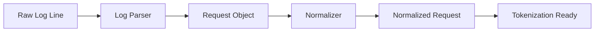

# Phase 3: Request Parsing & Normalization

## Overview
This phase focuses on extracting structured information from raw log lines and normalizing dynamic values that don't contribute to anomaly detection. The parser must handle various HTTP components (method, path, parameters, headers, payload) and intelligently replace dynamic values like UUIDs, timestamps, and session IDs with placeholders.

## Objectives
- Parse HTTP method, path, query parameters, headers, and payload
- Extract POST body content from logs
- Implement normalization rules for dynamic values
- Create normalized request object structure
- Build configuration system for normalization rules

## Architecture



## Detailed Implementation

### 3.1 Log Parser Implementation

```python
# src/parsing/log_parser.py
import re
from typing import Dict, Optional, List
from dataclasses import dataclass, field
from urllib.parse import urlparse, parse_qs, unquote
from loguru import logger

@dataclass
class HTTPRequest:
    """Structured representation of HTTP request"""
    method: str
    path: str
    query_params: Dict[str, List[str]] = field(default_factory=dict)
    headers: Dict[str, str] = field(default_factory=dict)
    body: Optional[str] = None
    remote_addr: Optional[str] = None
    timestamp: Optional[str] = None
    user_agent: Optional[str] = None
    referer: Optional[str] = None
    cookies: Dict[str, str] = field(default_factory=dict)
    content_type: Optional[str] = None
    content_length: Optional[int] = None
    
    def to_dict(self) -> Dict:
        """Convert to dictionary"""
        return {
            'method': self.method,
            'path': self.path,
            'query_params': self.query_params,
            'headers': self.headers,
            'body': self.body,
            'remote_addr': self.remote_addr,
            'timestamp': self.timestamp,
            'user_agent': self.user_agent,
            'referer': self.referer,
            'cookies': self.cookies,
            'content_type': self.content_type,
            'content_length': self.content_length
        }

class LogParser:
    """Parse various log formats into structured HTTPRequest objects"""
    
    # Apache Combined Log Format
    APACHE_COMBINED_PATTERN = re.compile(
        r'^(\S+) (\S+) (\S+) \[([^\]]+)\] "(\S+) ([^"]+)" (\d+) (\d+|-) '
        r'"([^"]*)" "([^"]*)"'
    )
    
    # Apache Detailed Format (with additional fields)
    APACHE_DETAILED_PATTERN = re.compile(
        r'^(\S+) (\S+) (\S+) \[([^\]]+)\] "(\S+) ([^"]+)" (\d+) (\d+|-) '
        r'"([^"]*)" "([^"]*)" "([^"]*)" "([^"]*)" "([^"]*)" "([^"]*)"'
    )
    
    # Nginx Combined Format
    NGINX_COMBINED_PATTERN = re.compile(
        r'^(\S+) - (\S+) \[([^\]]+)\] "(\S+) ([^"]+)" (\d+) (\d+) '
        r'"([^"]*)" "([^"]*)"'
    )
    
    def parse(self, log_line: str) -> Optional[HTTPRequest]:
        """Parse log line into HTTPRequest object"""
        # Try Apache Combined first
        match = self.APACHE_COMBINED_PATTERN.match(log_line)
        if match:
            return self._parse_apache_combined(match, log_line)
        
        # Try Apache Detailed
        match = self.APACHE_DETAILED_PATTERN.match(log_line)
        if match:
            return self._parse_apache_detailed(match, log_line)
        
        # Try Nginx
        match = self.NGINX_COMBINED_PATTERN.match(log_line)
        if match:
            return self._parse_nginx_combined(match, log_line)
        
        logger.warning(f"Could not parse log line: {log_line[:100]}")
        return None
    
    def _parse_apache_combined(self, match, log_line: str) -> HTTPRequest:
        """Parse Apache Combined format"""
        groups = match.groups()
        
        remote_addr = groups[0]
        remote_user = groups[1] if groups[1] != '-' else None
        timestamp = groups[3]
        
        # Parse request line
        method, path, query_params = self._parse_request_line(groups[5])
        
        status = int(groups[6])
        bytes_sent = int(groups[7]) if groups[7] != '-' else 0
        referer = groups[8] if groups[8] != '-' else None
        user_agent = groups[9] if groups[9] != '-' else None
        
        # Extract additional fields if present
        cookies = {}
        content_type = None
        content_length = None
        body = None
        
        # Try to extract from extended format
        if len(groups) > 10:
            x_forwarded_for = groups[10] if len(groups) > 10 and groups[10] != '-' else None
            cookie_str = groups[11] if len(groups) > 11 and groups[11] != '-' else None
            if cookie_str:
                cookies = self._parse_cookies(cookie_str)
            content_type = groups[12] if len(groups) > 12 and groups[12] != '-' else None
            content_length = int(groups[13]) if len(groups) > 13 and groups[13] != '-' else None
            body = groups[14] if len(groups) > 14 and groups[14] != '-' else None
        
        return HTTPRequest(
            method=method,
            path=path,
            query_params=query_params,
            headers={},
            body=body,
            remote_addr=remote_addr,
            timestamp=timestamp,
            user_agent=user_agent,
            referer=referer,
            cookies=cookies,
            content_type=content_type,
            content_length=content_length
        )
    
    def _parse_nginx_combined(self, match, log_line: str) -> HTTPRequest:
        """Parse Nginx Combined format"""
        groups = match.groups()
        
        remote_addr = groups[0]
        remote_user = groups[1] if groups[1] != '-' else None
        timestamp = groups[2]
        
        # Parse request line
        method, path, query_params = self._parse_request_line(groups[4])
        
        status = int(groups[5])
        bytes_sent = int(groups[6])
        referer = groups[7] if groups[7] != '-' else None
        user_agent = groups[8] if groups[8] != '-' else None
        
        return HTTPRequest(
            method=method,
            path=path,
            query_params=query_params,
            headers={},
            body=None,
            remote_addr=remote_addr,
            timestamp=timestamp,
            user_agent=user_agent,
            referer=referer
        )
    
    def _parse_request_line(self, request_line: str) -> tuple:
        """Parse HTTP request line: METHOD PATH?QUERY HTTP/VERSION"""
        parts = request_line.split(' ', 2)
        if len(parts) < 2:
            return 'GET', '/', {}
        
        method = parts[0]
        url_part = parts[1]
        
        # Parse URL
        parsed = urlparse(url_part)
        path = unquote(parsed.path)
        query_params = parse_qs(parsed.query, keep_blank_values=True)
        
        # Convert lists to single values where appropriate
        query_params = {k: v[0] if len(v) == 1 else v for k, v in query_params.items()}
        
        return method, path, query_params
    
    def _parse_cookies(self, cookie_str: str) -> Dict[str, str]:
        """Parse cookie string into dictionary"""
        cookies = {}
        for item in cookie_str.split(';'):
            item = item.strip()
            if '=' in item:
                key, value = item.split('=', 1)
                cookies[key.strip()] = value.strip()
        return cookies
    
    def _parse_apache_detailed(self, match, log_line: str) -> HTTPRequest:
        """Parse Apache Detailed format (with POST data)"""
        # Similar to combined but with additional fields
        return self._parse_apache_combined(match, log_line)
```

### 3.2 Normalization Rules

```python
# src/parsing/normalization_rules.py
import re
from typing import Dict, List, Callable, Any
from datetime import datetime
from loguru import logger

class NormalizationRule:
    """Base class for normalization rules"""
    
    def __init__(self, name: str, pattern: str, replacement: str, flags: int = 0):
        self.name = name
        self.pattern = re.compile(pattern, flags)
        self.replacement = replacement
    
    def apply(self, text: str) -> str:
        """Apply normalization rule"""
        return self.pattern.sub(self.replacement, text)

class NormalizationRules:
    """Collection of normalization rules"""
    
    def __init__(self):
        self.rules: List[NormalizationRule] = []
        self._load_default_rules()
    
    def _load_default_rules(self):
        """Load default normalization rules"""
        # UUIDs (8-4-4-4-12 format)
        self.add_rule(
            "uuid",
            r'[0-9a-fA-F]{8}-[0-9a-fA-F]{4}-[0-9a-fA-F]{4}-[0-9a-fA-F]{4}-[0-9a-fA-F]{12}',
            '<UUID>'
        )
        
        # Timestamps (ISO format)
        self.add_rule(
            "iso_timestamp",
            r'\d{4}-\d{2}-\d{2}T\d{2}:\d{2}:\d{2}(\.\d+)?(Z|[+-]\d{2}:\d{2})?',
            '<TIMESTAMP>'
        )
        
        # Unix timestamps
        self.add_rule(
            "unix_timestamp",
            r'\b\d{10}\b',
            '<TIMESTAMP>'
        )
        
        # Session IDs (common patterns)
        self.add_rule(
            "session_id",
            r'(session|sess|sid|jsessionid|phpsessid)=[a-zA-Z0-9]{20,}',
            r'\1=<SESSION_ID>'
        )
        
        # Numeric IDs (long numbers likely to be IDs)
        self.add_rule(
            "numeric_id",
            r'\b\d{6,}\b',
            '<NUMERIC_ID>'
        )
        
        # Email addresses
        self.add_rule(
            "email",
            r'\b[a-zA-Z0-9._%+-]+@[a-zA-Z0-9.-]+\.[a-zA-Z]{2,}\b',
            '<EMAIL>'
        )
        
        # IP addresses (but keep structure)
        self.add_rule(
            "ip_address",
            r'\b\d{1,3}\.\d{1,3}\.\d{1,3}\.\d{1,3}\b',
            '<IP_ADDRESS>'
        )
        
        # Credit card numbers (basic pattern)
        self.add_rule(
            "credit_card",
            r'\b\d{4}[-\s]?\d{4}[-\s]?\d{4}[-\s]?\d{4}\b',
            '<CARD_NUMBER>'
        )
        
        # Base64 encoded strings (long base64)
        self.add_rule(
            "base64",
            r'[A-Za-z0-9+/]{50,}={0,2}',
            '<BASE64>'
        )
        
        # JWT tokens
        self.add_rule(
            "jwt",
            r'eyJ[A-Za-z0-9-_]+\.[A-Za-z0-9-_]+\.[A-Za-z0-9-_]*',
            '<JWT_TOKEN>'
        )
        
        # API keys (common patterns)
        self.add_rule(
            "api_key",
            r'(api[_-]?key|apikey|access[_-]?token|auth[_-]?token)=[a-zA-Z0-9]{20,}',
            r'\1=<API_KEY>'
        )
    
    def add_rule(self, name: str, pattern: str, replacement: str, flags: int = 0):
        """Add a normalization rule"""
        rule = NormalizationRule(name, pattern, replacement, flags)
        self.rules.append(rule)
        logger.debug(f"Added normalization rule: {name}")
    
    def normalize(self, text: str) -> str:
        """Apply all normalization rules"""
        if not text:
            return text
        
        normalized = text
        for rule in self.rules:
            normalized = rule.apply(normalized)
        
        return normalized
```

### 3.3 Request Normalizer

```python
# src/parsing/normalizer.py
from typing import Dict, List
from .log_parser import HTTPRequest
from .normalization_rules import NormalizationRules
from loguru import logger

class RequestNormalizer:
    """Normalize HTTP requests by removing/replacing dynamic values"""
    
    def __init__(self, config_path: str = None):
        self.rules = NormalizationRules()
        if config_path:
            self._load_config(config_path)
    
    def normalize(self, request: HTTPRequest) -> HTTPRequest:
        """Normalize HTTP request"""
        # Normalize path
        normalized_path = self._normalize_path(request.path)
        
        # Normalize query parameters
        normalized_query = self._normalize_query_params(request.query_params)
        
        # Normalize headers
        normalized_headers = self._normalize_headers(request.headers)
        
        # Normalize body
        normalized_body = self._normalize_body(request.body) if request.body else None
        
        # Normalize cookies
        normalized_cookies = self._normalize_cookies(request.cookies)
        
        # Create normalized request
        normalized = HTTPRequest(
            method=request.method,
            path=normalized_path,
            query_params=normalized_query,
            headers=normalized_headers,
            body=normalized_body,
            remote_addr='<IP_ADDRESS>',  # Always normalize IPs
            timestamp=None,  # Remove timestamps
            user_agent=self._normalize_user_agent(request.user_agent),
            referer=self._normalize_referer(request.referer),
            cookies=normalized_cookies,
            content_type=request.content_type,
            content_length=request.content_length
        )
        
        return normalized
    
    def _normalize_path(self, path: str) -> str:
        """Normalize URL path"""
        if not path:
            return '/'
        
        # Normalize dynamic segments
        normalized = self.rules.normalize(path)
        
        # Replace numeric path segments
        normalized = re.sub(r'/\d+/', '/<ID>/', normalized)
        normalized = re.sub(r'/\d+$', '/<ID>', normalized)
        
        return normalized
    
    def _normalize_query_params(self, params: Dict) -> Dict:
        """Normalize query parameters"""
        normalized = {}
        for key, value in params.items():
            # Normalize key
            norm_key = self.rules.normalize(key)
            
            # Normalize value
            if isinstance(value, list):
                norm_value = [self.rules.normalize(str(v)) for v in value]
            else:
                norm_value = self.rules.normalize(str(value))
            
            normalized[norm_key] = norm_value
        
        return normalized
    
    def _normalize_headers(self, headers: Dict) -> Dict:
        """Normalize HTTP headers"""
        normalized = {}
        sensitive_headers = ['authorization', 'cookie', 'x-api-key', 'x-auth-token']
        
        for key, value in headers.items():
            key_lower = key.lower()
            
            # Remove or mask sensitive headers
            if key_lower in sensitive_headers:
                normalized[key] = '<SENSITIVE>'
            else:
                normalized[key] = self.rules.normalize(str(value))
        
        return normalized
    
    def _normalize_body(self, body: str) -> str:
        """Normalize request body"""
        if not body:
            return body
        
        # Normalize JSON bodies
        try:
            import json
            data = json.loads(body)
            normalized_data = self._normalize_json(data)
            return json.dumps(normalized_data, separators=(',', ':'))
        except:
            # Not JSON, apply general normalization
            return self.rules.normalize(body)
    
    def _normalize_json(self, data: Any) -> Any:
        """Recursively normalize JSON data"""
        if isinstance(data, dict):
            return {k: self._normalize_json(v) for k, v in data.items()}
        elif isinstance(data, list):
            return [self._normalize_json(item) for item in data]
        elif isinstance(data, str):
            return self.rules.normalize(data)
        elif isinstance(data, (int, float)):
            # Normalize large numbers (likely IDs)
            if data > 100000:
                return '<NUMERIC_ID>'
            return data
        else:
            return data
    
    def _normalize_cookies(self, cookies: Dict) -> Dict:
        """Normalize cookies"""
        normalized = {}
        for key, value in cookies.items():
            norm_key = self.rules.normalize(key)
            norm_value = self.rules.normalize(value)
            normalized[norm_key] = norm_value
        
        return normalized
    
    def _normalize_user_agent(self, user_agent: str) -> str:
        """Normalize user agent (keep structure, remove versions)"""
        if not user_agent:
            return None
        
        # Remove version numbers but keep browser/OS info
        normalized = re.sub(r'/\d+\.\d+', '', user_agent)
        normalized = re.sub(r'\d+\.\d+\.\d+', '<VERSION>', normalized)
        
        return normalized
    
    def _normalize_referer(self, referer: str) -> str:
        """Normalize referer URL"""
        if not referer:
            return None
        
        # Normalize domain and path
        normalized = self.rules.normalize(referer)
        # Replace domain with placeholder
        normalized = re.sub(r'https?://[^/]+', '<DOMAIN>', normalized)
        
        return normalized
```

### 3.4 Request Serialization

```python
# src/parsing/serializer.py
from typing import Dict
from .log_parser import HTTPRequest

class RequestSerializer:
    """Serialize HTTPRequest to string format for tokenization"""
    
    @staticmethod
    def to_string(request: HTTPRequest, format: str = "compact") -> str:
        """Convert request to string representation"""
        if format == "compact":
            return RequestSerializer._to_compact_string(request)
        elif format == "detailed":
            return RequestSerializer._to_detailed_string(request)
        else:
            raise ValueError(f"Unknown format: {format}")
    
    @staticmethod
    def _to_compact_string(request: HTTPRequest) -> str:
        """Compact string representation"""
        parts = []
        
        # Method and path
        parts.append(f"{request.method} {request.path}")
        
        # Query parameters
        if request.query_params:
            query_str = "&".join([f"{k}={v}" for k, v in request.query_params.items()])
            parts.append(f"?{query_str}")
        
        # Headers (selected)
        important_headers = ['content-type', 'user-agent', 'accept']
        header_parts = []
        for h in important_headers:
            if h in request.headers:
                header_parts.append(f"{h}:{request.headers[h]}")
        if header_parts:
            parts.append(" ".join(header_parts))
        
        # Body (truncated)
        if request.body:
            body_preview = request.body[:200] if len(request.body) > 200 else request.body
            parts.append(f"BODY:{body_preview}")
        
        return " | ".join(parts)
    
    @staticmethod
    def _to_detailed_string(request: HTTPRequest) -> str:
        """Detailed string representation"""
        lines = []
        
        # Request line
        query_str = ""
        if request.query_params:
            query_str = "?" + "&".join([f"{k}={v}" for k, v in request.query_params.items()])
        lines.append(f"{request.method} {request.path}{query_str}")
        
        # Headers
        for key, value in request.headers.items():
            lines.append(f"{key}: {value}")
        
        # Body
        if request.body:
            lines.append("")
            lines.append(request.body)
        
        return "\n".join(lines)
```

### 3.5 Complete Pipeline

```python
# src/parsing/pipeline.py
from typing import Iterator, Optional
from .log_parser import LogParser, HTTPRequest
from .normalizer import RequestNormalizer
from .serializer import RequestSerializer
from loguru import logger

class ParsingPipeline:
    """Complete parsing and normalization pipeline"""
    
    def __init__(self):
        self.parser = LogParser()
        self.normalizer = RequestNormalizer()
        self.serializer = RequestSerializer()
    
    def process_log_line(self, log_line: str) -> Optional[str]:
        """Process single log line: parse -> normalize -> serialize"""
        # Parse
        request = self.parser.parse(log_line)
        if not request:
            return None
        
        # Normalize
        normalized = self.normalizer.normalize(request)
        
        # Serialize
        serialized = self.serializer.to_string(normalized, format="compact")
        
        return serialized
    
    def process_batch(self, log_lines: Iterator[str]) -> Iterator[str]:
        """Process batch of log lines"""
        for line in log_lines:
            result = self.process_log_line(line)
            if result:
                yield result
```

## Testing

```python
# tests/unit/test_parsing.py
import pytest
from src.parsing.log_parser import LogParser
from src.parsing.normalizer import RequestNormalizer
from src.parsing.pipeline import ParsingPipeline

def test_apache_parsing():
    """Test Apache log parsing"""
    parser = LogParser()
    log_line = '127.0.0.1 - - [25/Dec/2023:10:00:00 +0000] "GET /test?id=123 HTTP/1.1" 200 1234'
    
    request = parser.parse(log_line)
    assert request is not None
    assert request.method == "GET"
    assert request.path == "/test"
    assert "id" in request.query_params

def test_normalization():
    """Test request normalization"""
    from src.parsing.log_parser import HTTPRequest
    
    request = HTTPRequest(
        method="GET",
        path="/users/550e8400-e29b-41d4-a716-446655440000",
        query_params={"session": "abc123def456", "timestamp": "1703505600"}
    )
    
    normalizer = RequestNormalizer()
    normalized = normalizer.normalize(request)
    
    assert "<UUID>" in normalized.path
    assert "<SESSION_ID>" in str(normalized.query_params)

def test_pipeline():
    """Test complete pipeline"""
    pipeline = ParsingPipeline()
    log_line = '127.0.0.1 - - [25/Dec/2023:10:00:00 +0000] "GET /api/users/123?token=abc123 HTTP/1.1" 200 1234'
    
    result = pipeline.process_log_line(log_line)
    assert result is not None
    assert "<NUMERIC_ID>" in result or "<ID>" in result
```

## Configuration

```yaml
# config/normalization.yaml
normalization:
  rules:
    - name: uuid
      pattern: '[0-9a-fA-F]{8}-[0-9a-fA-F]{4}-[0-9a-fA-F]{4}-[0-9a-fA-F]{4}-[0-9a-fA-F]{12}'
      replacement: '<UUID>'
    
    - name: timestamp
      pattern: '\d{4}-\d{2}-\d{2}T\d{2}:\d{2}:\d{2}'
      replacement: '<TIMESTAMP>'
  
  path_normalization:
    replace_numeric_segments: true
    max_path_length: 500
  
  query_normalization:
    preserve_structure: true
  
  body_normalization:
    json_normalize: true
    max_body_length: 10000
```

## Deliverables Checklist

- [ ] Log parser implemented for Apache/Nginx formats
- [ ] HTTPRequest dataclass created
- [ ] Normalization rules implemented
- [ ] Request normalizer working
- [ ] Serialization to string format
- [ ] Complete parsing pipeline
- [ ] Unit tests written
- [ ] Configuration file created

## Next Steps

After completing Phase 3, you should have:
- Structured request objects from raw logs
- Normalized requests ready for tokenization
- All dynamic values replaced with placeholders

**Proceed to Phase 4:** Tokenization & Sequence Preparation
