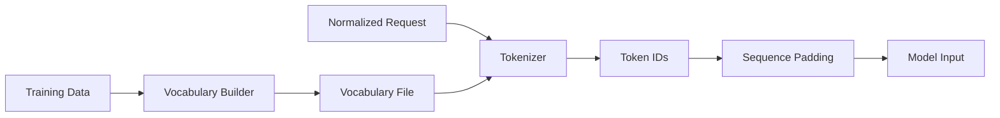

# Phase 4: Tokenization & Sequence Preparation

## Overview
This phase converts normalized HTTP requests into token sequences suitable for Transformer models. We'll design a tokenization strategy (character-level, subword, or custom), build vocabulary from training data, and prepare sequences with proper padding/truncation for variable-length inputs.

## Objectives
- Design tokenization strategy for HTTP requests
- Implement tokenizer class
- Generate vocabulary from training data
- Create sequence generation from request components
- Handle variable-length sequences (padding/truncation)
- Build data loader for training

## Architecture



## Detailed Implementation

### 4.1 Tokenization Strategy

We'll use a hybrid approach:
- **Subword tokenization** for common HTTP components
- **Character-level** for rare/unknown tokens
- **Special tokens** for request structure

```python
# src/tokenization/tokenizer.py
from typing import List, Dict, Optional, Union
from collections import Counter
import json
from pathlib import Path
from loguru import logger
import re

class HTTPTokenizer:
    """Tokenizer for HTTP requests optimized for anomaly detection"""
    
    # Special tokens
    PAD_TOKEN = "<PAD>"
    UNK_TOKEN = "<UNK>"
    CLS_TOKEN = "<CLS>"
    SEP_TOKEN = "<SEP>"
    MASK_TOKEN = "<MASK>"
    
    # HTTP-specific tokens
    METHOD_TOKENS = ["GET", "POST", "PUT", "DELETE", "PATCH", "HEAD", "OPTIONS"]
    STATUS_TOKENS = ["200", "404", "500", "403", "401"]
    
    def __init__(
        self,
        vocab_size: int = 10000,
        min_frequency: int = 2,
        max_length: int = 512
    ):
        self.vocab_size = vocab_size
        self.min_frequency = min_frequency
        self.max_length = max_length
        self.word_to_id: Dict[str, int] = {}
        self.id_to_word: Dict[int, str] = {}
        self.vocab_built = False
    
    def _initialize_special_tokens(self):
        """Initialize special tokens"""
        special_tokens = [
            self.PAD_TOKEN,
            self.UNK_TOKEN,
            self.CLS_TOKEN,
            self.SEP_TOKEN,
            self.MASK_TOKEN
        ]
        
        # Add HTTP method tokens
        special_tokens.extend(self.METHOD_TOKENS)
        
        # Add normalization placeholders
        special_tokens.extend([
            "<UUID>", "<TIMESTAMP>", "<SESSION_ID>", "<NUMERIC_ID>",
            "<EMAIL>", "<IP_ADDRESS>", "<CARD_NUMBER>", "<BASE64>",
            "<JWT_TOKEN>", "<API_KEY>", "<ID>", "<SENSITIVE>", "<DOMAIN>"
        ])
        
        return special_tokens
    
    def build_vocab(self, texts: List[str], save_path: Optional[str] = None):
        """Build vocabulary from training texts"""
        logger.info("Building vocabulary...")
        
        # Initialize with special tokens
        special_tokens = self._initialize_special_tokens()
        token_counter = Counter()
        
        # Tokenize all texts and count tokens
        for text in texts:
            tokens = self._tokenize_text(text)
            token_counter.update(tokens)
        
        # Build vocabulary
        self.word_to_id = {}
        self.id_to_word = {}
        
        # Add special tokens first
        token_id = 0
        for token in special_tokens:
            self.word_to_id[token] = token_id
            self.id_to_word[token_id] = token
            token_id += 1
        
        # Add most frequent tokens
        sorted_tokens = sorted(
            token_counter.items(),
            key=lambda x: x[1],
            reverse=True
        )
        
        for token, count in sorted_tokens:
            if token not in self.word_to_id and count >= self.min_frequency:
                if len(self.word_to_id) >= self.vocab_size:
                    break
                self.word_to_id[token] = token_id
                self.id_to_word[token_id] = token
                token_id += 1
        
        self.vocab_built = True
        logger.info(f"Vocabulary built: {len(self.word_to_id)} tokens")
        
        # Save vocabulary
        if save_path:
            self.save_vocab(save_path)
    
    def _tokenize_text(self, text: str) -> List[str]:
        """Tokenize text into subwords and characters"""
        tokens = []
        
        # Split by common delimiters
        parts = re.split(r'([\s|:;=/?&<>(){}[\]"\',])', text)
        
        for part in parts:
            if not part.strip():
                continue
            
            # If part is a delimiter, add as token
            if re.match(r'^[\s|:;=/?&<>(){}[\]"\',]$', part):
                tokens.append(part)
            else:
                # Try to split into subwords
                subwords = self._split_into_subwords(part)
                tokens.extend(subwords)
        
        return tokens
    
    def _split_into_subwords(self, word: str) -> List[str]:
        """Split word into subwords using common patterns"""
        if len(word) <= 3:
            return [word]
        
        # Split camelCase
        if re.match(r'^[a-z]+[A-Z]', word):
            parts = re.findall(r'[a-z]+|[A-Z][a-z]*', word)
            return [p.lower() for p in parts]
        
        # Split by underscores/hyphens
        if '_' in word or '-' in word:
            return re.split(r'[_-]', word)
        
        # Split long words into chunks
        if len(word) > 10:
            chunks = []
            for i in range(0, len(word), 5):
                chunks.append(word[i:i+5])
            return chunks
        
        return [word]
    
    def encode(self, text: str, add_special_tokens: bool = True) -> List[int]:
        """Encode text to token IDs"""
        if not self.vocab_built:
            raise ValueError("Vocabulary not built. Call build_vocab() first.")
        
        tokens = self._tokenize_text(text)
        token_ids = []
        
        # Add CLS token
        if add_special_tokens:
            token_ids.append(self.word_to_id.get(self.CLS_TOKEN, 0))
        
        # Convert tokens to IDs
        for token in tokens:
            token_id = self.word_to_id.get(token, self.word_to_id.get(self.UNK_TOKEN, 0))
            token_ids.append(token_id)
        
        # Add SEP token
        if add_special_tokens:
            token_ids.append(self.word_to_id.get(self.SEP_TOKEN, 0))
        
        return token_ids
    
    def decode(self, token_ids: List[int], skip_special_tokens: bool = True) -> str:
        """Decode token IDs to text"""
        tokens = []
        for token_id in token_ids:
            token = self.id_to_word.get(token_id, self.UNK_TOKEN)
            if skip_special_tokens and token in [self.PAD_TOKEN, self.CLS_TOKEN, self.SEP_TOKEN]:
                continue
            tokens.append(token)
        return " ".join(tokens)
    
    def save_vocab(self, path: str):
        """Save vocabulary to file"""
        vocab_data = {
            'word_to_id': self.word_to_id,
            'id_to_word': {int(k): v for k, v in self.id_to_word.items()},
            'vocab_size': len(self.word_to_id),
            'max_length': self.max_length
        }
        
        with open(path, 'w') as f:
            json.dump(vocab_data, f, indent=2)
        
        logger.info(f"Vocabulary saved to {path}")
    
    def load_vocab(self, path: str):
        """Load vocabulary from file"""
        with open(path, 'r') as f:
            vocab_data = json.load(f)
        
        self.word_to_id = vocab_data['word_to_id']
        self.id_to_word = {int(k): v for k, v in vocab_data['id_to_word'].items()}
        self.max_length = vocab_data.get('max_length', 512)
        self.vocab_built = True
        
        logger.info(f"Vocabulary loaded from {path}: {len(self.word_to_id)} tokens")
```

### 4.2 Sequence Preparation

```python
# src/tokenization/sequence_prep.py
from typing import List, Tuple
import torch
import numpy as np
from .tokenizer import HTTPTokenizer

class SequencePreparator:
    """Prepare sequences for model input"""
    
    def __init__(self, tokenizer: HTTPTokenizer):
        self.tokenizer = tokenizer
    
    def prepare_sequence(
        self,
        text: str,
        max_length: Optional[int] = None,
        padding: bool = True,
        truncation: bool = True
    ) -> Tuple[List[int], List[int]]:
        """Prepare single sequence with attention mask"""
        max_len = max_length or self.tokenizer.max_length
        
        # Encode text
        token_ids = self.tokenizer.encode(text, add_special_tokens=True)
        
        # Truncate if needed
        if truncation and len(token_ids) > max_len:
            token_ids = token_ids[:max_len]
        
        # Create attention mask
        attention_mask = [1] * len(token_ids)
        
        # Pad if needed
        if padding:
            pad_length = max_len - len(token_ids)
            pad_id = self.tokenizer.word_to_id.get(self.tokenizer.PAD_TOKEN, 0)
            token_ids.extend([pad_id] * pad_length)
            attention_mask.extend([0] * pad_length)
        
        return token_ids, attention_mask
    
    def prepare_batch(
        self,
        texts: List[str],
        max_length: Optional[int] = None,
        return_tensors: str = "pt"
    ) -> Dict[str, torch.Tensor]:
        """Prepare batch of sequences"""
        max_len = max_length or self.tokenizer.max_length
        
        batch_token_ids = []
        batch_attention_masks = []
        
        for text in texts:
            token_ids, attention_mask = self.prepare_sequence(
                text,
                max_length=max_len,
                padding=True,
                truncation=True
            )
            batch_token_ids.append(token_ids)
            batch_attention_masks.append(attention_mask)
        
        # Convert to tensors
        if return_tensors == "pt":
            return {
                'input_ids': torch.tensor(batch_token_ids, dtype=torch.long),
                'attention_mask': torch.tensor(batch_attention_masks, dtype=torch.long)
            }
        else:
            return {
                'input_ids': np.array(batch_token_ids),
                'attention_mask': np.array(batch_attention_masks)
            }
```

### 4.3 Data Loader

```python
# src/tokenization/dataloader.py
from torch.utils.data import Dataset, DataLoader
from typing import List, Dict
import torch
from .tokenizer import HTTPTokenizer
from .sequence_prep import SequencePreparator

class HTTPRequestDataset(Dataset):
    """Dataset for HTTP requests"""
    
    def __init__(
        self,
        texts: List[str],
        tokenizer: HTTPTokenizer,
        max_length: int = 512
    ):
        self.texts = texts
        self.tokenizer = tokenizer
        self.max_length = max_length
        self.preparator = SequencePreparator(tokenizer)
    
    def __len__(self):
        return len(self.texts)
    
    def __getitem__(self, idx):
        text = self.texts[idx]
        token_ids, attention_mask = self.preparator.prepare_sequence(
            text,
            max_length=self.max_length,
            padding=True,
            truncation=True
        )
        
        return {
            'input_ids': torch.tensor(token_ids, dtype=torch.long),
            'attention_mask': torch.tensor(attention_mask, dtype=torch.long),
            'text': text
        }

def create_dataloader(
    texts: List[str],
    tokenizer: HTTPTokenizer,
    batch_size: int = 32,
    max_length: int = 512,
    shuffle: bool = True,
    num_workers: int = 4
) -> DataLoader:
    """Create DataLoader for training"""
    dataset = HTTPRequestDataset(texts, tokenizer, max_length)
    
    return DataLoader(
        dataset,
        batch_size=batch_size,
        shuffle=shuffle,
        num_workers=num_workers,
        pin_memory=True
    )
```

### 4.4 Vocabulary Building Script

```python
# scripts/build_vocabulary.py
from src.ingestion.ingestion import LogIngestionSystem
from src.parsing.pipeline import ParsingPipeline
from src.tokenization.tokenizer import HTTPTokenizer
from loguru import logger
import yaml

def build_vocabulary(
    log_path: str,
    vocab_size: int = 10000,
    min_frequency: int = 2,
    max_lines: int = None
):
    """Build vocabulary from log files"""
    logger.info("Starting vocabulary building process...")
    
    # Initialize components
    ingestion = LogIngestionSystem()
    pipeline = ParsingPipeline()
    tokenizer = HTTPTokenizer(
        vocab_size=vocab_size,
        min_frequency=min_frequency
    )
    
    # Collect normalized texts
    texts = []
    logger.info("Processing logs and collecting texts...")
    
    count = 0
    for log_line in ingestion.ingest_batch(log_path, max_lines=max_lines):
        normalized_text = pipeline.process_log_line(log_line)
        if normalized_text:
            texts.append(normalized_text)
            count += 1
            
            if count % 10000 == 0:
                logger.info(f"Processed {count} requests")
    
    logger.info(f"Total texts collected: {len(texts)}")
    
    # Build vocabulary
    vocab_path = "models/vocabularies/http_vocab.json"
    tokenizer.build_vocab(texts, save_path=vocab_path)
    
    logger.info(f"Vocabulary built and saved to {vocab_path}")
    logger.info(f"Vocabulary size: {len(tokenizer.word_to_id)}")

if __name__ == "__main__":
    import argparse
    
    parser = argparse.ArgumentParser()
    parser.add_argument("--log_path", required=True, help="Path to log file")
    parser.add_argument("--vocab_size", type=int, default=10000, help="Vocabulary size")
    parser.add_argument("--min_frequency", type=int, default=2, help="Minimum token frequency")
    parser.add_argument("--max_lines", type=int, default=None, help="Maximum lines to process")
    
    args = parser.parse_args()
    
    build_vocabulary(
        args.log_path,
        vocab_size=args.vocab_size,
        min_frequency=args.min_frequency,
        max_lines=args.max_lines
    )
```

## Testing

```python
# tests/unit/test_tokenization.py
import pytest
from src.tokenization.tokenizer import HTTPTokenizer
from src.tokenization.sequence_prep import SequencePreparator

def test_tokenizer():
    """Test tokenizer functionality"""
    tokenizer = HTTPTokenizer(vocab_size=1000, min_frequency=1)
    
    # Build vocab from sample texts
    texts = [
        "GET /api/users/123 HTTP/1.1",
        "POST /api/login HTTP/1.1",
        "GET /test?param=value HTTP/1.1"
    ]
    
    tokenizer.build_vocab(texts)
    assert tokenizer.vocab_built
    
    # Test encoding
    text = "GET /api/users/123 HTTP/1.1"
    token_ids = tokenizer.encode(text)
    assert len(token_ids) > 0
    
    # Test decoding
    decoded = tokenizer.decode(token_ids)
    assert "GET" in decoded

def test_sequence_preparation():
    """Test sequence preparation"""
    tokenizer = HTTPTokenizer(vocab_size=1000, min_frequency=1)
    texts = ["GET /test HTTP/1.1", "POST /api HTTP/1.1"]
    tokenizer.build_vocab(texts)
    
    preparator = SequencePreparator(tokenizer)
    token_ids, attention_mask = preparator.prepare_sequence(
        "GET /test HTTP/1.1",
        max_length=128
    )
    
    assert len(token_ids) == 128
    assert len(attention_mask) == 128
    assert sum(attention_mask) > 0  # At least some tokens are not padding
```

## Configuration

```yaml
# config/tokenization.yaml
tokenization:
  vocab_size: 10000
  min_frequency: 2
  max_length: 512
  
  special_tokens:
    - "<PAD>"
    - "<UNK>"
    - "<CLS>"
    - "<SEP>"
    - "<MASK>"
  
  http_tokens:
    methods: ["GET", "POST", "PUT", "DELETE", "PATCH", "HEAD", "OPTIONS"]
    status_codes: ["200", "404", "500", "403", "401"]
  
  normalization_placeholders:
    - "<UUID>"
    - "<TIMESTAMP>"
    - "<SESSION_ID>"
    - "<NUMERIC_ID>"
    - "<EMAIL>"
    - "<IP_ADDRESS>"
```

## Deliverables Checklist

- [ ] HTTPTokenizer class implemented
- [ ] Vocabulary building functionality
- [ ] Sequence preparation with padding/truncation
- [ ] DataLoader for training
- [ ] Vocabulary building script
- [ ] Unit tests written
- [ ] Configuration file created

## Next Steps

After completing Phase 4, you should have:
- Tokenizer that converts requests to token sequences
- Vocabulary built from training data
- Data loaders ready for model training

**Proceed to Phase 5:** Transformer Model Architecture & Training
