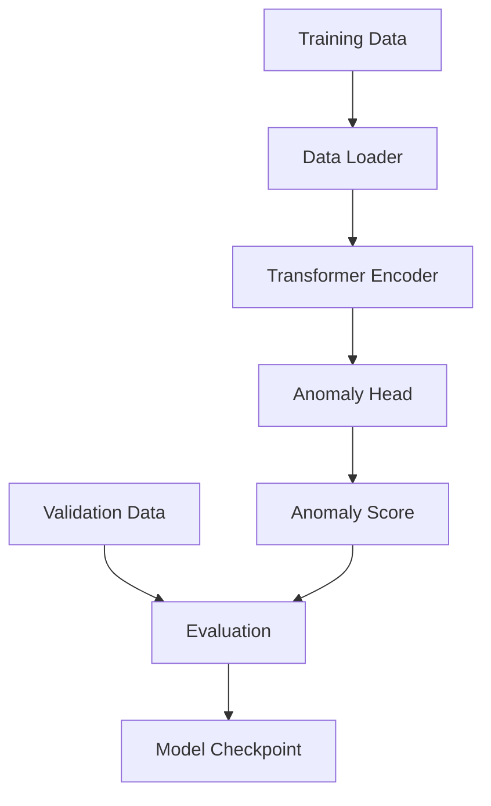

# Phase 5: Transformer Model Architecture & Training

## Overview
This phase focuses on selecting, designing, and training a Transformer-based anomaly detection model. We'll use a pre-trained Transformer architecture (like BERT or DistilBERT) and fine-tune it for anomaly detection on benign HTTP traffic. The model will learn to identify normal request patterns and flag deviations as anomalies.

## Objectives
- Select appropriate Transformer architecture
- Design model architecture for anomaly detection
- Generate synthetic benign dataset from 3 web applications
- Implement training pipeline with proper data splitting
- Train model on benign traffic only
- Implement anomaly scoring mechanism
- Evaluate model performance

## Architecture



## Detailed Implementation

### 5.1 Model Architecture Selection

We'll use **DistilBERT** as base model (faster, smaller than BERT):
- Pre-trained on large text corpus
- Good for sequence classification
- Efficient for real-time inference

### 5.2 Model Implementation

```python
# src/model/anomaly_detector.py
import torch
import torch.nn as nn
from transformers import DistilBertModel, DistilBertConfig
from typing import Dict, Optional

class AnomalyDetector(nn.Module):
    """Transformer-based anomaly detection model"""
    
    def __init__(
        self,
        vocab_size: int,
        hidden_size: int = 768,
        num_layers: int = 6,
        num_heads: int = 12,
        dropout: float = 0.1,
        max_length: int = 512
    ):
        super().__init__()
        
        # Use DistilBERT configuration
        config = DistilBertConfig(
            vocab_size=vocab_size,
            dim=hidden_size,
            n_layers=num_layers,
            n_heads=num_heads,
            max_position_embeddings=max_length,
            dropout=dropout
        )
        
        # Transformer encoder
        self.transformer = DistilBertModel(config)
        
        # Anomaly detection head
        self.anomaly_head = nn.Sequential(
            nn.Linear(hidden_size, hidden_size // 2),
            nn.ReLU(),
            nn.Dropout(dropout),
            nn.Linear(hidden_size // 2, hidden_size // 4),
            nn.ReLU(),
            nn.Dropout(dropout),
            nn.Linear(hidden_size // 4, 1),
            nn.Sigmoid()  # Output anomaly probability
        )
        
        # Initialize weights
        self._init_weights()
    
    def _init_weights(self):
        """Initialize model weights"""
        for module in self.anomaly_head:
            if isinstance(module, nn.Linear):
                nn.init.xavier_uniform_(module.weight)
                if module.bias is not None:
                    nn.init.zeros_(module.bias)
    
    def forward(
        self,
        input_ids: torch.Tensor,
        attention_mask: torch.Tensor
    ) -> Dict[str, torch.Tensor]:
        """Forward pass"""
        # Get transformer outputs
        outputs = self.transformer(
            input_ids=input_ids,
            attention_mask=attention_mask
        )
        
        # Use [CLS] token representation
        cls_embedding = outputs.last_hidden_state[:, 0, :]
        
        # Get anomaly score
        anomaly_score = self.anomaly_head(cls_embedding).squeeze(-1)
        
        return {
            'anomaly_score': anomaly_score,
            'embeddings': cls_embedding
        }
    
    def predict(self, input_ids: torch.Tensor, attention_mask: torch.Tensor) -> float:
        """Predict anomaly score for single input"""
        self.eval()
        with torch.no_grad():
            outputs = self.forward(input_ids, attention_mask)
            return outputs['anomaly_score'].item()
```

### 5.3 Synthetic Dataset Generation

```python
# src/training/dataset_generator.py
import random
from typing import List
from loguru import logger

class SyntheticDatasetGenerator:
    """Generate synthetic benign requests for training"""
    
    def __init__(self):
        self.methods = ["GET", "POST", "PUT", "DELETE", "PATCH", "HEAD", "OPTIONS"]
        self.paths = []
        self.query_params = []
        self.headers = []
    
    def load_from_applications(self, log_paths: List[str]):
        """Load patterns from application logs"""
        from src.ingestion.ingestion import LogIngestionSystem
        from src.parsing.pipeline import ParsingPipeline
        
        pipeline = ParsingPipeline()
        ingestion = LogIngestionSystem()
        
        for log_path in log_paths:
            logger.info(f"Loading patterns from {log_path}")
            for log_line in ingestion.ingest_batch(log_path, max_lines=10000):
                normalized = pipeline.process_log_line(log_line)
                if normalized:
                    # Extract patterns (simplified)
                    self._extract_patterns(normalized)
    
    def _extract_patterns(self, request_text: str):
        """Extract request patterns"""
        # Extract paths, parameters, etc.
        # This is simplified - implement based on your needs
        pass
    
    def generate_request(self) -> str:
        """Generate synthetic benign request"""
        method = random.choice(self.methods)
        path = self._generate_path()
        query = self._generate_query()
        
        request = f"{method} {path}"
        if query:
            request += f"?{query}"
        
        return request
    
    def _generate_path(self) -> str:
        """Generate synthetic path"""
        # Implement path generation based on learned patterns
        paths = [
            "/api/users",
            "/api/products",
            "/api/orders",
            "/dashboard",
            "/login",
            "/logout",
            "/profile"
        ]
        return random.choice(paths)
    
    def _generate_query(self) -> str:
        """Generate synthetic query string"""
        params = ["page=1", "limit=10", "sort=asc", "filter=active"]
        return "&".join(random.sample(params, k=random.randint(0, 2)))
    
    def generate_dataset(self, num_samples: int) -> List[str]:
        """Generate dataset of synthetic requests"""
        logger.info(f"Generating {num_samples} synthetic requests...")
        requests = []
        for i in range(num_samples):
            requests.append(self.generate_request())
            if (i + 1) % 1000 == 0:
                logger.info(f"Generated {i + 1}/{num_samples} requests")
        return requests
```

### 5.4 Training Script

```python
# src/training/train.py
import torch
import torch.nn as nn
from torch.utils.data import DataLoader
from torch.optim import AdamW
from torch.optim.lr_scheduler import CosineAnnealingLR
from tqdm import tqdm
from loguru import logger
import os
from pathlib import Path

from src.model.anomaly_detector import AnomalyDetector
from src.tokenization.tokenizer import HTTPTokenizer
from src.tokenization.dataloader import create_dataloader

class AnomalyDetectionTrainer:
    """Trainer for anomaly detection model"""
    
    def __init__(
        self,
        model: AnomalyDetector,
        tokenizer: HTTPTokenizer,
        device: str = "cuda" if torch.cuda.is_available() else "cpu"
    ):
        self.model = model.to(device)
        self.tokenizer = tokenizer
        self.device = device
        self.optimizer = None
        self.scheduler = None
    
    def train(
        self,
        train_loader: DataLoader,
        val_loader: DataLoader,
        num_epochs: int = 10,
        learning_rate: float = 2e-5,
        checkpoint_dir: str = "models/checkpoints",
        save_best: bool = True
    ):
        """Train the model"""
        # Setup optimizer
        self.optimizer = AdamW(
            self.model.parameters(),
            lr=learning_rate,
            weight_decay=0.01
        )
        
        # Setup scheduler
        self.scheduler = CosineAnnealingLR(
            self.optimizer,
            T_max=num_epochs
        )
        
        best_val_loss = float('inf')
        
        for epoch in range(num_epochs):
            logger.info(f"Epoch {epoch + 1}/{num_epochs}")
            
            # Training
            train_loss = self._train_epoch(train_loader)
            logger.info(f"Train Loss: {train_loss:.4f}")
            
            # Validation
            val_loss = self._validate(val_loader)
            logger.info(f"Val Loss: {val_loss:.4f}")
            
            # Save checkpoint
            checkpoint_path = os.path.join(checkpoint_dir, f"checkpoint_epoch_{epoch + 1}.pt")
            self._save_checkpoint(checkpoint_path, epoch, train_loss, val_loss)
            
            # Save best model
            if save_best and val_loss < best_val_loss:
                best_val_loss = val_loss
                best_path = os.path.join(checkpoint_dir, "best_model.pt")
                self._save_checkpoint(best_path, epoch, train_loss, val_loss)
                logger.info(f"Saved best model (val_loss: {val_loss:.4f})")
            
            # Update learning rate
            self.scheduler.step()
    
    def _train_epoch(self, train_loader: DataLoader) -> float:
        """Train for one epoch"""
        self.model.train()
        total_loss = 0.0
        num_batches = 0
        
        progress_bar = tqdm(train_loader, desc="Training")
        for batch in progress_bar:
            input_ids = batch['input_ids'].to(self.device)
            attention_mask = batch['attention_mask'].to(self.device)
            
            # Forward pass
            outputs = self.model(input_ids, attention_mask)
            anomaly_scores = outputs['anomaly_score']
            
            # Loss: We want all benign requests to have low anomaly scores
            # Using MSE loss with target = 0 (no anomaly)
            target = torch.zeros_like(anomaly_scores)
            loss = nn.MSELoss()(anomaly_scores, target)
            
            # Backward pass
            self.optimizer.zero_grad()
            loss.backward()
            torch.nn.utils.clip_grad_norm_(self.model.parameters(), 1.0)
            self.optimizer.step()
            
            total_loss += loss.item()
            num_batches += 1
            
            progress_bar.set_postfix({'loss': loss.item()})
        
        return total_loss / num_batches
    
    def _validate(self, val_loader: DataLoader) -> float:
        """Validate the model"""
        self.model.eval()
        total_loss = 0.0
        num_batches = 0
        
        with torch.no_grad():
            for batch in val_loader:
                input_ids = batch['input_ids'].to(self.device)
                attention_mask = batch['attention_mask'].to(self.device)
                
                outputs = self.model(input_ids, attention_mask)
                anomaly_scores = outputs['anomaly_score']
                
                target = torch.zeros_like(anomaly_scores)
                loss = nn.MSELoss()(anomaly_scores, target)
                
                total_loss += loss.item()
                num_batches += 1
        
        return total_loss / num_batches
    
    def _save_checkpoint(
        self,
        path: str,
        epoch: int,
        train_loss: float,
        val_loss: float
    ):
        """Save model checkpoint"""
        Path(path).parent.mkdir(parents=True, exist_ok=True)
        
        checkpoint = {
            'epoch': epoch,
            'model_state_dict': self.model.state_dict(),
            'optimizer_state_dict': self.optimizer.state_dict(),
            'train_loss': train_loss,
            'val_loss': val_loss,
            'vocab_size': len(self.tokenizer.word_to_id)
        }
        
        torch.save(checkpoint, path)
        logger.info(f"Checkpoint saved: {path}")
```

### 5.5 Training Pipeline

```python
# scripts/train_model.py
import argparse
from pathlib import Path
from loguru import logger

from src.ingestion.ingestion import LogIngestionSystem
from src.parsing.pipeline import ParsingPipeline
from src.tokenization.tokenizer import HTTPTokenizer
from src.tokenization.dataloader import create_dataloader
from src.model.anomaly_detector import AnomalyDetector
from src.training.train import AnomalyDetectionTrainer
from src.training.dataset_generator import SyntheticDatasetGenerator

def main():
    parser = argparse.ArgumentParser()
    parser.add_argument("--log_paths", nargs="+", required=True, help="Log file paths")
    parser.add_argument("--vocab_path", default="models/vocabularies/http_vocab.json")
    parser.add_argument("--checkpoint_dir", default="models/checkpoints")
    parser.add_argument("--num_epochs", type=int, default=10)
    parser.add_argument("--batch_size", type=int, default=32)
    parser.add_argument("--learning_rate", type=float, default=2e-5)
    parser.add_argument("--max_length", type=int, default=512)
    
    args = parser.parse_args()
    
    # Load tokenizer
    logger.info("Loading tokenizer...")
    tokenizer = HTTPTokenizer()
    tokenizer.load_vocab(args.vocab_path)
    
    # Generate/load training data
    logger.info("Preparing training data...")
    pipeline = ParsingPipeline()
    ingestion = LogIngestionSystem()
    
    texts = []
    for log_path in args.log_paths:
        logger.info(f"Processing {log_path}...")
        for log_line in ingestion.ingest_batch(log_path, max_lines=50000):
            normalized = pipeline.process_log_line(log_line)
            if normalized:
                texts.append(normalized)
    
    logger.info(f"Total training samples: {len(texts)}")
    
    # Split data
    split_idx = int(len(texts) * 0.8)
    train_texts = texts[:split_idx]
    val_texts = texts[split_idx:]
    
    # Create data loaders
    train_loader = create_dataloader(
        train_texts,
        tokenizer,
        batch_size=args.batch_size,
        max_length=args.max_length,
        shuffle=True
    )
    
    val_loader = create_dataloader(
        val_texts,
        tokenizer,
        batch_size=args.batch_size,
        max_length=args.max_length,
        shuffle=False
    )
    
    # Create model
    logger.info("Creating model...")
    model = AnomalyDetector(
        vocab_size=len(tokenizer.word_to_id),
        max_length=args.max_length
    )
    
    # Train
    trainer = AnomalyDetectionTrainer(model, tokenizer)
    trainer.train(
        train_loader,
        val_loader,
        num_epochs=args.num_epochs,
        learning_rate=args.learning_rate,
        checkpoint_dir=args.checkpoint_dir
    )
    
    logger.info("Training complete!")

if __name__ == "__main__":
    main()
```

### 5.6 Anomaly Scoring

```python
# src/model/scoring.py
import torch
from typing import Dict
import numpy as np

class AnomalyScorer:
    """Score requests for anomaly detection"""
    
    def __init__(
        self,
        model: AnomalyDetector,
        threshold: float = 0.5
    ):
        self.model = model
        self.model.eval()
        self.threshold = threshold
    
    def score(self, input_ids: torch.Tensor, attention_mask: torch.Tensor) -> Dict:
        """Score request for anomaly"""
        with torch.no_grad():
            outputs = self.model(input_ids, attention_mask)
            anomaly_score = outputs['anomaly_score'].item()
        
        is_anomaly = anomaly_score > self.threshold
        
        return {
            'anomaly_score': anomaly_score,
            'is_anomaly': is_anomaly,
            'threshold': self.threshold
        }
    
    def score_batch(
        self,
        input_ids: torch.Tensor,
        attention_mask: torch.Tensor
    ) -> Dict:
        """Score batch of requests"""
        with torch.no_grad():
            outputs = self.model(input_ids, attention_mask)
            anomaly_scores = outputs['anomaly_score'].cpu().numpy()
        
        is_anomaly = anomaly_scores > self.threshold
        
        return {
            'anomaly_scores': anomaly_scores.tolist(),
            'is_anomaly': is_anomaly.tolist(),
            'threshold': self.threshold
        }
```

## Testing

```python
# tests/unit/test_model.py
import pytest
import torch
from src.model.anomaly_detector import AnomalyDetector
from src.tokenization.tokenizer import HTTPTokenizer

def test_model_forward():
    """Test model forward pass"""
    vocab_size = 1000
    model = AnomalyDetector(vocab_size=vocab_size)
    
    batch_size = 2
    seq_length = 128
    input_ids = torch.randint(0, vocab_size, (batch_size, seq_length))
    attention_mask = torch.ones(batch_size, seq_length)
    
    outputs = model(input_ids, attention_mask)
    assert 'anomaly_score' in outputs
    assert outputs['anomaly_score'].shape == (batch_size,)
```

## Configuration

```yaml
# config/training.yaml
training:
  model:
    architecture: "distilbert"
    hidden_size: 768
    num_layers: 6
    num_heads: 12
    dropout: 0.1
    max_length: 512
  
  training:
    num_epochs: 10
    batch_size: 32
    learning_rate: 2e-5
    weight_decay: 0.01
    gradient_clip: 1.0
  
  data:
    train_split: 0.8
    val_split: 0.2
    max_samples: null  # null = use all
  
  anomaly:
    threshold: 0.5
    score_range: [0.0, 1.0]
```

## Deliverables Checklist

- [ ] Model architecture implemented
- [ ] Synthetic dataset generator created
- [ ] Training script implemented
- [ ] Model checkpoints saved
- [ ] Anomaly scoring mechanism
- [ ] Evaluation metrics calculated
- [ ] Configuration file created

## Next Steps

After completing Phase 5, you should have:
- Trained Transformer model for anomaly detection
- Model checkpoints saved
- Anomaly scoring functionality

**Proceed to Phase 6:** WAF Integration with Web Server
