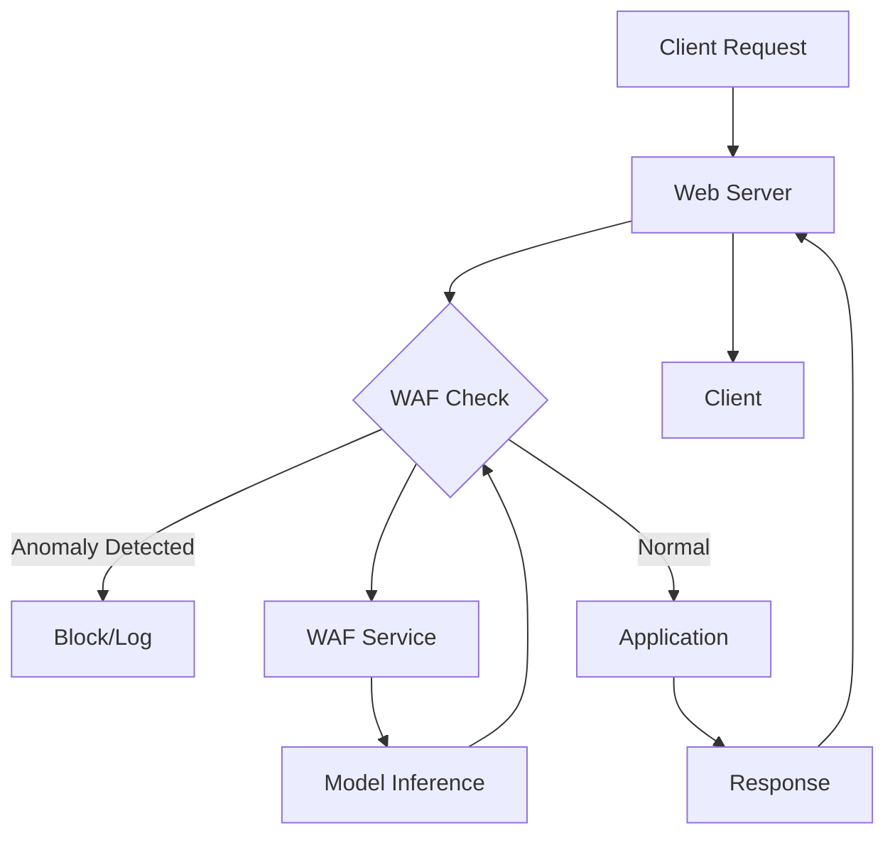

# Phase 6: WAF Integration with Web Server

## Overview
This phase integrates the trained Transformer model into the web server pipeline for real-time request inspection. We'll create a WAF service (microservice approach) and integrate it with Apache/Nginx using a reverse proxy or module pattern to intercept and inspect requests before they reach the application.

## Objectives
- Design WAF service architecture
- Implement WAF API service (FastAPI)
- Create web server integration (Apache/Nginx)
- Implement request forwarding to WAF service
- Add configuration for detection thresholds
- Set up health check endpoints

## Architecture



## Detailed Implementation

### 6.1 WAF Service Implementation

```python
# src/integration/waf_service.py
from fastapi import FastAPI, Request, HTTPException
from fastapi.responses import JSONResponse
from pydantic import BaseModel
from typing import Dict, Optional
import torch
from loguru import logger
import time

from src.model.anomaly_detector import AnomalyDetector
from src.model.scoring import AnomalyScorer
from src.tokenization.tokenizer import HTTPTokenizer
from src.tokenization.sequence_prep import SequencePreparator
from src.parsing.pipeline import ParsingPipeline

app = FastAPI(title="WAF Service", version="1.0.0")

class WAFService:
    """WAF Service for real-time anomaly detection"""
    
    def __init__(
        self,
        model_path: str,
        vocab_path: str,
        threshold: float = 0.5,
        device: str = "cpu"
    ):
        self.device = device
        self.threshold = threshold
        
        # Load tokenizer
        logger.info(f"Loading tokenizer from {vocab_path}")
        self.tokenizer = HTTPTokenizer()
        self.tokenizer.load_vocab(vocab_path)
        
        # Load model
        logger.info(f"Loading model from {model_path}")
        checkpoint = torch.load(model_path, map_location=device)
        vocab_size = checkpoint.get('vocab_size', len(self.tokenizer.word_to_id))
        
        self.model = AnomalyDetector(vocab_size=vocab_size)
        self.model.load_state_dict(checkpoint['model_state_dict'])
        self.model.to(device)
        self.model.eval()
        
        # Initialize scorer
        self.scorer = AnomalyScorer(self.model, threshold=threshold)
        self.preparator = SequencePreparator(self.tokenizer)
        self.pipeline = ParsingPipeline()
        
        logger.info("WAF Service initialized")
    
    def check_request(
        self,
        method: str,
        path: str,
        query_params: Dict = None,
        headers: Dict = None,
        body: Optional[str] = None
    ) -> Dict:
        """Check if request is anomalous"""
        try:
            # Reconstruct request string
            request_text = self._reconstruct_request(
                method, path, query_params, headers, body
            )
            
            # Normalize
            normalized = self.pipeline.process_log_line(request_text)
            if not normalized:
                # If parsing fails, treat as potentially suspicious
                return {
                    'anomaly_score': 0.8,
                    'is_anomaly': True,
                    'reason': 'parsing_failed'
                }
            
            # Tokenize and prepare
            token_ids, attention_mask = self.preparator.prepare_sequence(
                normalized,
                max_length=512,
                padding=True,
                truncation=True
            )
            
            # Convert to tensors
            input_ids = torch.tensor([token_ids], dtype=torch.long).to(self.device)
            attn_mask = torch.tensor([attention_mask], dtype=torch.long).to(self.device)
            
            # Score
            result = self.scorer.score(input_ids, attn_mask)
            
            return {
                'anomaly_score': result['anomaly_score'],
                'is_anomaly': result['is_anomaly'],
                'threshold': self.threshold
            }
            
        except Exception as e:
            logger.error(f"Error checking request: {e}")
            # On error, allow request but log
            return {
                'anomaly_score': 0.0,
                'is_anomaly': False,
                'error': str(e)
            }
    
    def _reconstruct_request(
        self,
        method: str,
        path: str,
        query_params: Dict = None,
        headers: Dict = None,
        body: Optional[str] = None
    ) -> str:
        """Reconstruct request string from components"""
        # Build request line
        query_str = ""
        if query_params:
            query_str = "?" + "&".join([f"{k}={v}" for k, v in query_params.items()])
        
        request_line = f'{method} {path}{query_str} HTTP/1.1'
        
        # For now, return simplified version
        # In production, include headers and body
        return request_line

# Global WAF service instance
waf_service: Optional[WAFService] = None

def initialize_waf_service(
    model_path: str,
    vocab_path: str,
    threshold: float = 0.5
):
    """Initialize WAF service"""
    global waf_service
    device = "cuda" if torch.cuda.is_available() else "cpu"
    waf_service = WAFService(model_path, vocab_path, threshold, device)

# Request models
class CheckRequest(BaseModel):
    method: str
    path: str
    query_params: Optional[Dict] = {}
    headers: Optional[Dict] = {}
    body: Optional[str] = None

class CheckResponse(BaseModel):
    anomaly_score: float
    is_anomaly: bool
    threshold: float
    processing_time_ms: float

@app.post("/check", response_model=CheckResponse)
async def check_request(request: CheckRequest):
    """Check if request is anomalous"""
    if waf_service is None:
        raise HTTPException(status_code=503, detail="WAF service not initialized")
    
    start_time = time.time()
    
    result = waf_service.check_request(
        method=request.method,
        path=request.path,
        query_params=request.query_params or {},
        headers=request.headers or {},
        body=request.body
    )
    
    processing_time = (time.time() - start_time) * 1000  # ms
    
    return CheckResponse(
        anomaly_score=result['anomaly_score'],
        is_anomaly=result['is_anomaly'],
        threshold=result['threshold'],
        processing_time_ms=processing_time
    )

@app.get("/health")
async def health_check():
    """Health check endpoint"""
    return {
        "status": "healthy",
        "service": "waf",
        "model_loaded": waf_service is not None
    }

@app.get("/metrics")
async def get_metrics():
    """Get WAF metrics"""
    # Implement metrics collection
    return {
        "total_requests": 0,
        "anomalies_detected": 0,
        "average_processing_time_ms": 0.0
    }
```

### 6.2 Nginx Integration (Reverse Proxy)

```nginx
# /etc/nginx/sites-available/waf-integration
upstream waf_service {
    server 127.0.0.1:8000;
}

upstream backend_app {
    server 127.0.0.1:8080;
}

server {
    listen 80;
    server_name localhost;
    
    # Logging
    access_log /var/log/nginx/waf_access.log;
    error_log /var/log/nginx/waf_error.log;
    
    location / {
        # Check with WAF first
        access_by_lua_block {
            local http = require "resty.http"
            local httpc = http.new()
            local res, err = httpc:request_uri("http://127.0.0.1:8000/check", {
                method = "POST",
                body = ngx.var.request_body,
                headers = {
                    ["Content-Type"] = "application/json",
                }
            })
            
            if err then
                ngx.log(ngx.ERR, "WAF check failed: ", err)
                ngx.exit(500)
            end
            
            local cjson = require "cjson"
            local data = cjson.decode(res.body)
            
            if data.is_anomaly then
                ngx.log(ngx.WARN, "Anomaly detected: ", data.anomaly_score)
                ngx.status = 403
                ngx.say("Request blocked by WAF")
                ngx.exit(403)
            end
        }
        
        # Forward to backend if passed
        proxy_pass http://backend_app;
        proxy_set_header Host $host;
        proxy_set_header X-Real-IP $remote_addr;
        proxy_set_header X-Forwarded-For $proxy_add_x_forwarded_for;
    }
}
```

### 6.3 Apache Integration (ModSecurity-like)

```python
# src/integration/apache_module.py
# This is a Python script that Apache can call via mod_python or mod_wsgi

def check_request(environ):
    """Apache module function to check requests"""
    import requests
    import json
    
    # Extract request details
    method = environ.get('REQUEST_METHOD', 'GET')
    path = environ.get('PATH_INFO', '/')
    query_string = environ.get('QUERY_STRING', '')
    
    # Parse query params
    query_params = {}
    if query_string:
        for param in query_string.split('&'):
            if '=' in param:
                key, value = param.split('=', 1)
                query_params[key] = value
    
    # Get headers
    headers = {}
    for key, value in environ.items():
        if key.startswith('HTTP_'):
            header_name = key[5:].replace('_', '-').title()
            headers[header_name] = value
    
    # Get body
    body = None
    if method in ['POST', 'PUT', 'PATCH']:
        try:
            body = environ['wsgi.input'].read()
        except:
            pass
    
    # Check with WAF service
    try:
        response = requests.post(
            'http://127.0.0.1:8000/check',
            json={
                'method': method,
                'path': path,
                'query_params': query_params,
                'headers': headers,
                'body': body.decode('utf-8') if body else None
            },
            timeout=1.0
        )
        
        result = response.json()
        
        if result.get('is_anomaly', False):
            return {
                'status': 403,
                'message': 'Request blocked by WAF'
            }
        
        return {'status': 200}
        
    except Exception as e:
        # On error, allow request (fail open)
        return {'status': 200}
```

### 6.4 Sidecar Pattern (Docker)

```yaml
# docker-compose.yml
version: '3.8'

services:
  waf-service:
    build: .
    ports:
      - "8000:8000"
    volumes:
      - ./models:/app/models
      - ./config:/app/config
    environment:
      - MODEL_PATH=/app/models/checkpoints/best_model.pt
      - VOCAB_PATH=/app/models/vocabularies/http_vocab.json
      - THRESHOLD=0.5
    command: uvicorn src.integration.waf_service:app --host 0.0.0.0 --port 8000
  
  nginx:
    image: nginx:alpine
    ports:
      - "80:80"
    volumes:
      - ./nginx.conf:/etc/nginx/nginx.conf
    depends_on:
      - waf-service
      - app1
  
  app1:
    image: tomcat:9
    ports:
      - "8080:8080"
    volumes:
      - ./webapps:/usr/local/tomcat/webapps
```

### 6.5 Service Startup Script

```python
# scripts/start_waf_service.py
import argparse
from uvicorn import run
from src.integration.waf_service import app, initialize_waf_service
from loguru import logger

def main():
    parser = argparse.ArgumentParser()
    parser.add_argument("--model_path", required=True, help="Path to model checkpoint")
    parser.add_argument("--vocab_path", required=True, help="Path to vocabulary file")
    parser.add_argument("--threshold", type=float, default=0.5, help="Anomaly threshold")
    parser.add_argument("--host", default="0.0.0.0", help="Host to bind to")
    parser.add_argument("--port", type=int, default=8000, help="Port to bind to")
    parser.add_argument("--workers", type=int, default=4, help="Number of workers")
    
    args = parser.parse_args()
    
    # Initialize WAF service
    logger.info("Initializing WAF service...")
    initialize_waf_service(
        model_path=args.model_path,
        vocab_path=args.vocab_path,
        threshold=args.threshold
    )
    
    # Start server
    logger.info(f"Starting WAF service on {args.host}:{args.port}")
    run(
        app,
        host=args.host,
        port=args.port,
        workers=args.workers,
        log_level="info"
    )

if __name__ == "__main__":
    main()
```

### 6.6 Configuration

```yaml
# config/integration.yaml
integration:
  waf_service:
    host: "0.0.0.0"
    port: 8000
    workers: 4
    timeout: 5.0
    model_path: "models/checkpoints/best_model.pt"
    vocab_path: "models/vocabularies/http_vocab.json"
    threshold: 0.5
  
  web_server:
    type: "nginx"  # or "apache"
    integration_method: "reverse_proxy"  # or "module", "sidecar"
    block_on_anomaly: true
    fail_open: true  # Allow requests if WAF service unavailable
  
  logging:
    log_anomalies: true
    log_all_requests: false
    log_file: "logs/waf_detections.log"
```

## Testing

```python
# tests/integration/test_waf_service.py
import pytest
import requests
from src.integration.waf_service import app, initialize_waf_service

@pytest.fixture
def waf_service():
    initialize_waf_service(
        model_path="models/checkpoints/best_model.pt",
        vocab_path="models/vocabularies/http_vocab.json",
        threshold=0.5
    )
    return app

def test_health_check(waf_service):
    """Test health check endpoint"""
    response = requests.get("http://localhost:8000/health")
    assert response.status_code == 200
    assert response.json()["status"] == "healthy"

def test_normal_request(waf_service):
    """Test normal request"""
    response = requests.post(
        "http://localhost:8000/check",
        json={
            "method": "GET",
            "path": "/api/users",
            "query_params": {"page": "1"}
        }
    )
    assert response.status_code == 200
    result = response.json()
    assert "anomaly_score" in result
    assert result["is_anomaly"] == False

def test_malicious_request(waf_service):
    """Test malicious request"""
    response = requests.post(
        "http://localhost:8000/check",
        json={
            "method": "GET",
            "path": "/api/users",
            "query_params": {"id": "1' OR '1'='1"}
        }
    )
    assert response.status_code == 200
    result = response.json()
    assert result["is_anomaly"] == True
```

## Deliverables Checklist

- [ ] WAF service API implemented
- [ ] Nginx integration configured
- [ ] Apache integration configured (optional)
- [ ] Docker/sidecar setup (optional)
- [ ] Health check endpoints
- [ ] Configuration files created
- [ ] Integration tests written

## Next Steps

After completing Phase 6, you should have:
- WAF service running and accessible
- Web server integrated with WAF
- Requests being checked in real-time

**Proceed to Phase 7:** Real-Time Non-Blocking Detection
