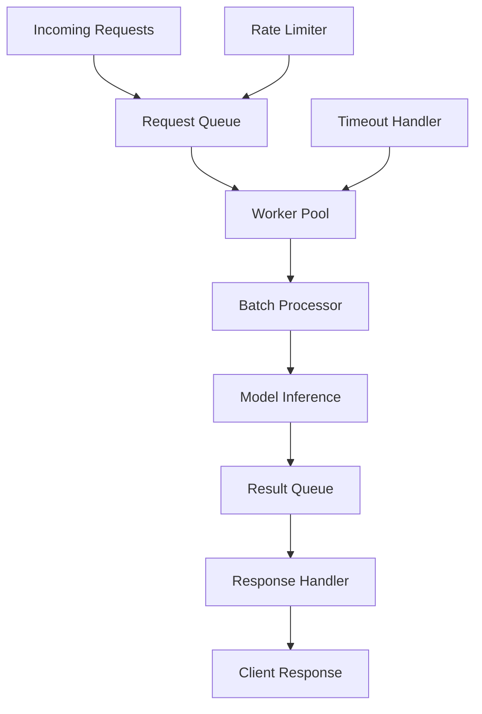

# Phase 7: Real-Time Non-Blocking Detection

## Overview
This phase implements concurrent, non-blocking request processing to handle high-throughput scenarios. The system must process multiple requests simultaneously without blocking each other or delaying normal traffic, using async processing, request queuing, and optimized model inference.

## Objectives
- Implement async request processing
- Use thread pool or async/await for concurrent inference
- Add request queuing mechanism
- Implement timeout handling
- Optimize model inference (batching, quantization)
- Create detection result structure
- Add logging for detected anomalies

## Architecture



## Detailed Implementation

### 7.1 Async WAF Service

```python
# src/inference/async_waf_service.py
from fastapi import FastAPI, Request, HTTPException, BackgroundTasks
from fastapi.responses import JSONResponse
from pydantic import BaseModel
from typing import Dict, Optional, List
import asyncio
from concurrent.futures import ThreadPoolExecutor
import torch
from loguru import logger
import time
from queue import Queue
from threading import Lock

from src.model.anomaly_detector import AnomalyDetector
from src.model.scoring import AnomalyScorer
from src.tokenization.tokenizer import HTTPTokenizer
from src.tokenization.sequence_prep import SequencePreparator
from src.parsing.pipeline import ParsingPipeline

app = FastAPI(title="Async WAF Service")

class AsyncWAFService:
    """Async WAF service with non-blocking inference"""
    
    def __init__(
        self,
        model_path: str,
        vocab_path: str,
        threshold: float = 0.5,
        device: str = "cpu",
        max_workers: int = 4,
        batch_size: int = 32,
        timeout: float = 5.0
    ):
        self.device = device
        self.threshold = threshold
        self.timeout = timeout
        self.batch_size = batch_size
        
        # Load model and tokenizer
        self._load_model(model_path, vocab_path)
        
        # Thread pool for CPU-bound operations
        self.executor = ThreadPoolExecutor(max_workers=max_workers)
        
        # Request queue for batching
        self.request_queue: Queue = Queue()
        self.batch_lock = Lock()
        self.processing = False
        
        # Metrics
        self.total_requests = 0
        self.anomalies_detected = 0
        self.avg_processing_time = 0.0
        
        logger.info("Async WAF Service initialized")
    
    def _load_model(self, model_path: str, vocab_path: str):
        """Load model and tokenizer"""
        logger.info(f"Loading tokenizer from {vocab_path}")
        self.tokenizer = HTTPTokenizer()
        self.tokenizer.load_vocab(vocab_path)
        
        logger.info(f"Loading model from {model_path}")
        checkpoint = torch.load(model_path, map_location=self.device)
        vocab_size = checkpoint.get('vocab_size', len(self.tokenizer.word_to_id))
        
        self.model = AnomalyDetector(vocab_size=vocab_size)
        self.model.load_state_dict(checkpoint['model_state_dict'])
        self.model.to(self.device)
        self.model.eval()
        
        self.scorer = AnomalyScorer(self.model, threshold=self.threshold)
        self.preparator = SequencePreparator(self.tokenizer)
        self.pipeline = ParsingPipeline()
    
    async def check_request_async(
        self,
        method: str,
        path: str,
        query_params: Dict = None,
        headers: Dict = None,
        body: Optional[str] = None
    ) -> Dict:
        """Check request asynchronously"""
        start_time = time.time()
        self.total_requests += 1
        
        try:
            # Run inference in thread pool
            loop = asyncio.get_event_loop()
            result = await asyncio.wait_for(
                loop.run_in_executor(
                    self.executor,
                    self._check_request_sync,
                    method, path, query_params, headers, body
                ),
                timeout=self.timeout
            )
            
            processing_time = (time.time() - start_time) * 1000  # ms
            
            # Update metrics
            self._update_metrics(processing_time, result['is_anomaly'])
            
            result['processing_time_ms'] = processing_time
            return result
            
        except asyncio.TimeoutError:
            logger.warning("Request check timed out")
            return {
                'anomaly_score': 0.0,
                'is_anomaly': False,
                'error': 'timeout',
                'processing_time_ms': self.timeout * 1000
            }
        except Exception as e:
            logger.error(f"Error checking request: {e}")
            return {
                'anomaly_score': 0.0,
                'is_anomaly': False,
                'error': str(e),
                'processing_time_ms': (time.time() - start_time) * 1000
            }
    
    def _check_request_sync(
        self,
        method: str,
        path: str,
        query_params: Dict = None,
        headers: Dict = None,
        body: Optional[str] = None
    ) -> Dict:
        """Synchronous request check (runs in thread pool)"""
        # Reconstruct request
        request_text = self._reconstruct_request(
            method, path, query_params, headers, body
        )
        
        # Normalize
        normalized = self.pipeline.process_log_line(request_text)
        if not normalized:
            return {
                'anomaly_score': 0.8,
                'is_anomaly': True,
                'reason': 'parsing_failed'
            }
        
        # Tokenize
        token_ids, attention_mask = self.preparator.prepare_sequence(
            normalized,
            max_length=512,
            padding=True,
            truncation=True
        )
        
        # Convert to tensors
        input_ids = torch.tensor([token_ids], dtype=torch.long).to(self.device)
        attn_mask = torch.tensor([attention_mask], dtype=torch.long).to(self.device)
        
        # Score
        result = self.scorer.score(input_ids, attn_mask)
        return result
    
    async def check_batch_async(
        self,
        requests: List[Dict]
    ) -> List[Dict]:
        """Check batch of requests asynchronously"""
        # Process in batches
        results = []
        for i in range(0, len(requests), self.batch_size):
            batch = requests[i:i + self.batch_size]
            batch_results = await self._process_batch(batch)
            results.extend(batch_results)
        
        return results
    
    async def _process_batch(self, batch: List[Dict]) -> List[Dict]:
        """Process batch of requests"""
        loop = asyncio.get_event_loop()
        
        # Prepare batch inputs
        input_ids_list = []
        attention_masks_list = []
        
        for req in batch:
            request_text = self._reconstruct_request(
                req['method'],
                req['path'],
                req.get('query_params', {}),
                req.get('headers', {}),
                req.get('body')
            )
            
            normalized = self.pipeline.process_log_line(request_text)
            if normalized:
                token_ids, attn_mask = self.preparator.prepare_sequence(
                    normalized, max_length=512, padding=True, truncation=True
                )
                input_ids_list.append(token_ids)
                attention_masks_list.append(attn_mask)
        
        # Batch inference
        if input_ids_list:
            input_ids = torch.tensor(input_ids_list, dtype=torch.long).to(self.device)
            attention_masks = torch.tensor(attention_masks_list, dtype=torch.long).to(self.device)
            
            # Run inference
            batch_results = await loop.run_in_executor(
                self.executor,
                self._batch_inference,
                input_ids,
                attention_masks
            )
            
            return batch_results
        
        return [{'anomaly_score': 0.0, 'is_anomaly': False}] * len(batch)
    
    def _batch_inference(
        self,
        input_ids: torch.Tensor,
        attention_masks: torch.Tensor
    ) -> List[Dict]:
        """Perform batch inference"""
        with torch.no_grad():
            outputs = self.model(input_ids, attention_masks)
            scores = outputs['anomaly_score'].cpu().numpy()
        
        results = []
        for score in scores:
            results.append({
                'anomaly_score': float(score),
                'is_anomaly': score > self.threshold
            })
        
        return results
    
    def _reconstruct_request(
        self,
        method: str,
        path: str,
        query_params: Dict = None,
        headers: Dict = None,
        body: Optional[str] = None
    ) -> str:
        """Reconstruct request string"""
        query_str = ""
        if query_params:
            query_str = "?" + "&".join([f"{k}={v}" for k, v in query_params.items()])
        
        return f'{method} {path}{query_str} HTTP/1.1'
    
    def _update_metrics(self, processing_time: float, is_anomaly: bool):
        """Update service metrics"""
        if is_anomaly:
            self.anomalies_detected += 1
        
        # Exponential moving average
        alpha = 0.1
        self.avg_processing_time = (
            alpha * processing_time + (1 - alpha) * self.avg_processing_time
        )
    
    def get_metrics(self) -> Dict:
        """Get service metrics"""
        return {
            'total_requests': self.total_requests,
            'anomalies_detected': self.anomalies_detected,
            'anomaly_rate': (
                self.anomalies_detected / self.total_requests
                if self.total_requests > 0 else 0.0
            ),
            'avg_processing_time_ms': self.avg_processing_time
        }

# Global service instance
waf_service: Optional[AsyncWAFService] = None

def initialize_service(
    model_path: str,
    vocab_path: str,
    threshold: float = 0.5,
    max_workers: int = 4,
    batch_size: int = 32
):
    """Initialize async WAF service"""
    global waf_service
    device = "cuda" if torch.cuda.is_available() else "cpu"
    waf_service = AsyncWAFService(
        model_path, vocab_path, threshold, device, max_workers, batch_size
    )

# Request/Response models
class CheckRequest(BaseModel):
    method: str
    path: str
    query_params: Optional[Dict] = {}
    headers: Optional[Dict] = {}
    body: Optional[str] = None

class CheckResponse(BaseModel):
    anomaly_score: float
    is_anomaly: bool
    threshold: float
    processing_time_ms: float

@app.post("/check", response_model=CheckResponse)
async def check_request(request: CheckRequest):
    """Check single request"""
    if waf_service is None:
        raise HTTPException(status_code=503, detail="WAF service not initialized")
    
    result = await waf_service.check_request_async(
        method=request.method,
        path=request.path,
        query_params=request.query_params or {},
        headers=request.headers or {},
        body=request.body
    )
    
    return CheckResponse(
        anomaly_score=result['anomaly_score'],
        is_anomaly=result['is_anomaly'],
        threshold=waf_service.threshold,
        processing_time_ms=result.get('processing_time_ms', 0.0)
    )

@app.post("/check/batch")
async def check_batch(requests: List[CheckRequest]):
    """Check batch of requests"""
    if waf_service is None:
        raise HTTPException(status_code=503, detail="WAF service not initialized")
    
    request_dicts = [req.dict() for req in requests]
    results = await waf_service.check_batch_async(request_dicts)
    
    return results

@app.get("/metrics")
async def get_metrics():
    """Get service metrics"""
    if waf_service is None:
        raise HTTPException(status_code=503, detail="WAF service not initialized")
    
    return waf_service.get_metrics()

@app.get("/health")
async def health_check():
    """Health check"""
    return {
        "status": "healthy",
        "service": "async_waf",
        "model_loaded": waf_service is not None
    }
```

### 7.2 Request Queue Manager

```python
# src/inference/queue_manager.py
from asyncio import Queue as AsyncQueue
from typing import Dict, Optional
import asyncio
from loguru import logger
import time

class RequestQueueManager:
    """Manage request queue for batching"""
    
    def __init__(self, max_size: int = 1000, batch_timeout: float = 0.1):
        self.queue = AsyncQueue(maxsize=max_size)
        self.batch_timeout = batch_timeout
        self.processing = False
    
    async def enqueue(self, request: Dict) -> Dict:
        """Enqueue request and wait for result"""
        result_queue = AsyncQueue()
        request['result_queue'] = result_queue
        
        await self.queue.put(request)
        
        # Wait for result
        result = await result_queue.get()
        return result
    
    async def process_queue(self, processor):
        """Process queue continuously"""
        self.processing = True
        
        while self.processing:
            batch = []
            batch_start = time.time()
            
            # Collect batch
            while len(batch) < 32:  # batch_size
                try:
                    # Wait for request with timeout
                    timeout = self.batch_timeout - (time.time() - batch_start)
                    if timeout <= 0:
                        break
                    
                    request = await asyncio.wait_for(
                        self.queue.get(),
                        timeout=timeout
                    )
                    batch.append(request)
                    
                except asyncio.TimeoutError:
                    break
            
            # Process batch
            if batch:
                await self._process_batch(batch, processor)
    
    async def _process_batch(self, batch: List[Dict], processor):
        """Process batch of requests"""
        try:
            # Extract request data
            requests = [req for req in batch if 'result_queue' in req]
            
            # Process batch
            results = await processor(requests)
            
            # Send results back
            for req, result in zip(requests, results):
                await req['result_queue'].put(result)
                
        except Exception as e:
            logger.error(f"Error processing batch: {e}")
            # Send error results
            for req in batch:
                if 'result_queue' in req:
                    await req['result_queue'].put({
                        'anomaly_score': 0.0,
                        'is_anomaly': False,
                        'error': str(e)
                    })
    
    def stop(self):
        """Stop processing"""
        self.processing = False
```

### 7.3 Model Optimization

```python
# src/inference/optimization.py
import torch
from torch.quantization import quantize_dynamic
from loguru import logger

def optimize_model(model: AnomalyDetector, method: str = "quantization"):
    """Optimize model for inference"""
    model.eval()
    
    if method == "quantization":
        # Dynamic quantization
        logger.info("Applying dynamic quantization...")
        quantized_model = quantize_dynamic(
            model,
            {torch.nn.Linear},
            dtype=torch.qint8
        )
        logger.info("Quantization complete")
        return quantized_model
    
    elif method == "torchscript":
        # TorchScript compilation
        logger.info("Compiling to TorchScript...")
        scripted_model = torch.jit.script(model)
        logger.info("TorchScript compilation complete")
        return scripted_model
    
    else:
        logger.warning(f"Unknown optimization method: {method}")
        return model

def load_optimized_model(model_path: str, optimization: str = None):
    """Load and optimize model"""
    checkpoint = torch.load(model_path, map_location='cpu')
    
    # Recreate model
    from src.model.anomaly_detector import AnomalyDetector
    model = AnomalyDetector(vocab_size=checkpoint.get('vocab_size', 10000))
    model.load_state_dict(checkpoint['model_state_dict'])
    model.eval()
    
    # Apply optimization
    if optimization:
        model = optimize_model(model, optimization)
    
    return model
```

### 7.4 Rate Limiting

```python
# src/inference/rate_limiter.py
from collections import deque
import time
from typing import Optional

class RateLimiter:
    """Rate limiter for request throttling"""
    
    def __init__(self, max_requests: int = 100, window_seconds: int = 1):
        self.max_requests = max_requests
        self.window_seconds = window_seconds
        self.requests = deque()
    
    def is_allowed(self) -> bool:
        """Check if request is allowed"""
        now = time.time()
        
        # Remove old requests
        while self.requests and self.requests[0] < now - self.window_seconds:
            self.requests.popleft()
        
        # Check limit
        if len(self.requests) >= self.max_requests:
            return False
        
        # Add current request
        self.requests.append(now)
        return True
    
    def get_wait_time(self) -> float:
        """Get time to wait before next request"""
        if not self.requests:
            return 0.0
        
        oldest = self.requests[0]
        wait_time = self.window_seconds - (time.time() - oldest)
        return max(0.0, wait_time)
```

## Testing

```python
# tests/performance/test_concurrent.py
import pytest
import asyncio
import time
from src.inference.async_waf_service import AsyncWAFService

@pytest.mark.asyncio
async def test_concurrent_requests():
    """Test concurrent request processing"""
    service = AsyncWAFService(
        model_path="models/checkpoints/best_model.pt",
        vocab_path="models/vocabularies/http_vocab.json",
        max_workers=4
    )
    
    # Create 100 concurrent requests
    requests = [
        {'method': 'GET', 'path': f'/api/test{i}', 'query_params': {}}
        for i in range(100)
    ]
    
    start_time = time.time()
    results = await service.check_batch_async(requests)
    elapsed = time.time() - start_time
    
    assert len(results) == 100
    assert elapsed < 10.0  # Should complete in reasonable time
    
    print(f"Processed 100 requests in {elapsed:.2f}s")
    print(f"Throughput: {100/elapsed:.2f} req/s")
```

## Configuration

```yaml
# config/inference.yaml
inference:
  async:
    max_workers: 4
    batch_size: 32
    timeout: 5.0
  
  optimization:
    quantization: true
    torchscript: false
  
  rate_limiting:
    enabled: true
    max_requests_per_second: 100
  
  metrics:
    collect: true
    update_interval: 60  # seconds
```

## Deliverables Checklist

- [ ] Async WAF service implemented
- [ ] Thread pool executor for concurrent processing
- [ ] Batch processing support
- [ ] Request queue manager
- [ ] Timeout handling
- [ ] Model optimization (quantization)
- [ ] Rate limiting
- [ ] Performance tests
- [ ] Metrics collection

## Next Steps

After completing Phase 7, you should have:
- Non-blocking concurrent request processing
- Optimized model inference
- High-throughput capability

**Proceed to Phase 8:** Continuous Learning & Incremental Updates
