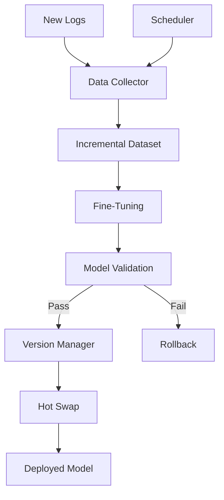

# Phase 8: Continuous Learning & Incremental Updates

## Overview
This phase implements an automated system for incremental model updates using new benign traffic. Instead of retraining from scratch, the system will fine-tune the existing model on incremental data, maintain model versioning, and support hot-swapping without service interruption.

## Objectives
- Implement incremental data collection from new logs
- Create fine-tuning pipeline (not full retraining)
- Design model versioning system
- Implement model hot-swapping mechanism
- Add validation before deploying new model
- Create scheduling mechanism for periodic updates
- Implement rollback capability

## Architecture



## Detailed Implementation

### 8.1 Incremental Data Collector

```python
# src/learning/data_collector.py
from typing import List, Iterator
from pathlib import Path
from datetime import datetime, timedelta
from loguru import logger
import json

from src.ingestion.ingestion import LogIngestionSystem
from src.parsing.pipeline import ParsingPipeline

class IncrementalDataCollector:
    """Collect new data for incremental learning"""
    
    def __init__(
        self,
        log_path: str,
        last_collection_time: Optional[datetime] = None,
        min_samples: int = 1000
    ):
        self.log_path = log_path
        self.last_collection_time = last_collection_time
        self.min_samples = min_samples
        self.ingestion = LogIngestionSystem()
        self.pipeline = ParsingPipeline()
    
    def collect_new_data(
        self,
        output_path: str,
        max_samples: Optional[int] = None
    ) -> List[str]:
        """Collect new data since last collection"""
        logger.info("Collecting new data for incremental learning...")
        
        texts = []
        collected_count = 0
        
        # Collect from logs
        for log_line in self.ingestion.ingest_batch(self.log_path):
            # Check timestamp if available
            if self.last_collection_time:
                # Parse timestamp from log (simplified)
                # In production, extract actual timestamp
                pass
            
            # Process and normalize
            normalized = self.pipeline.process_log_line(log_line)
            if normalized:
                texts.append(normalized)
                collected_count += 1
                
                if max_samples and collected_count >= max_samples:
                    break
        
        # Save collected data
        if texts:
            self._save_data(texts, output_path)
            logger.info(f"Collected {len(texts)} new samples")
        
        return texts
    
    def _save_data(self, texts: List[str], output_path: str):
        """Save collected data"""
        Path(output_path).parent.mkdir(parents=True, exist_ok=True)
        
        with open(output_path, 'w') as f:
            json.dump(texts, f, indent=2)
        
        logger.info(f"Saved data to {output_path}")
    
    def load_collected_data(self, data_path: str) -> List[str]:
        """Load previously collected data"""
        with open(data_path, 'r') as f:
            return json.load(f)
```

### 8.2 Fine-Tuning Pipeline

```python
# src/learning/fine_tuning.py
import torch
import torch.nn as nn
from torch.utils.data import DataLoader
from torch.optim import AdamW
from loguru import logger
from typing import List, Optional
from pathlib import Path

from src.model.anomaly_detector import AnomalyDetector
from src.tokenization.tokenizer import HTTPTokenizer
from src.tokenization.dataloader import create_dataloader

class IncrementalFineTuner:
    """Fine-tune model on incremental data"""
    
    def __init__(
        self,
        base_model_path: str,
        vocab_path: str,
        device: str = "cpu",
        learning_rate: float = 1e-5,  # Lower LR for fine-tuning
        num_epochs: int = 3  # Fewer epochs for incremental
    ):
        self.device = device
        self.learning_rate = learning_rate
        self.num_epochs = num_epochs
        
        # Load base model
        logger.info(f"Loading base model from {base_model_path}")
        checkpoint = torch.load(base_model_path, map_location=device)
        vocab_size = checkpoint.get('vocab_size', 10000)
        
        self.model = AnomalyDetector(vocab_size=vocab_size)
        self.model.load_state_dict(checkpoint['model_state_dict'])
        self.model.to(device)
        
        # Load tokenizer
        self.tokenizer = HTTPTokenizer()
        self.tokenizer.load_vocab(vocab_path)
    
    def fine_tune(
        self,
        new_data: List[str],
        validation_data: Optional[List[str]] = None,
        output_path: str = None
    ) -> AnomalyDetector:
        """Fine-tune model on new data"""
        logger.info(f"Fine-tuning on {len(new_data)} new samples...")
        
        # Create data loaders
        train_loader = create_dataloader(
            new_data,
            self.tokenizer,
            batch_size=16,  # Smaller batch for fine-tuning
            shuffle=True
        )
        
        val_loader = None
        if validation_data:
            val_loader = create_dataloader(
                validation_data,
                self.tokenizer,
                batch_size=16,
                shuffle=False
            )
        
        # Setup optimizer (lower learning rate)
        optimizer = AdamW(
            self.model.parameters(),
            lr=self.learning_rate,
            weight_decay=0.01
        )
        
        # Fine-tune
        best_val_loss = float('inf')
        
        for epoch in range(self.num_epochs):
            logger.info(f"Fine-tuning epoch {epoch + 1}/{self.num_epochs}")
            
            # Train
            train_loss = self._train_epoch(train_loader, optimizer)
            logger.info(f"Train loss: {train_loss:.4f}")
            
            # Validate
            if val_loader:
                val_loss = self._validate_epoch(val_loader)
                logger.info(f"Val loss: {val_loss:.4f}")
                
                if val_loss < best_val_loss:
                    best_val_loss = val_loss
                    if output_path:
                        self._save_checkpoint(output_path, epoch, train_loss, val_loss)
        
        logger.info("Fine-tuning complete")
        return self.model
    
    def _train_epoch(self, train_loader: DataLoader, optimizer) -> float:
        """Train for one epoch"""
        self.model.train()
        total_loss = 0.0
        num_batches = 0
        
        for batch in train_loader:
            input_ids = batch['input_ids'].to(self.device)
            attention_mask = batch['attention_mask'].to(self.device)
            
            # Forward pass
            outputs = self.model(input_ids, attention_mask)
            anomaly_scores = outputs['anomaly_score']
            
            # Loss: target is 0 (benign)
            target = torch.zeros_like(anomaly_scores)
            loss = nn.MSELoss()(anomaly_scores, target)
            
            # Backward pass
            optimizer.zero_grad()
            loss.backward()
            torch.nn.utils.clip_grad_norm_(self.model.parameters(), 1.0)
            optimizer.step()
            
            total_loss += loss.item()
            num_batches += 1
        
        return total_loss / num_batches if num_batches > 0 else 0.0
    
    def _validate_epoch(self, val_loader: DataLoader) -> float:
        """Validate for one epoch"""
        self.model.eval()
        total_loss = 0.0
        num_batches = 0
        
        with torch.no_grad():
            for batch in val_loader:
                input_ids = batch['input_ids'].to(self.device)
                attention_mask = batch['attention_mask'].to(self.device)
                
                outputs = self.model(input_ids, attention_mask)
                anomaly_scores = outputs['anomaly_score']
                
                target = torch.zeros_like(anomaly_scores)
                loss = nn.MSELoss()(anomaly_scores, target)
                
                total_loss += loss.item()
                num_batches += 1
        
        return total_loss / num_batches if num_batches > 0 else 0.0
    
    def _save_checkpoint(
        self,
        path: str,
        epoch: int,
        train_loss: float,
        val_loss: float
    ):
        """Save fine-tuned model"""
        Path(path).parent.mkdir(parents=True, exist_ok=True)
        
        checkpoint = {
            'epoch': epoch,
            'model_state_dict': self.model.state_dict(),
            'train_loss': train_loss,
            'val_loss': val_loss,
            'vocab_size': len(self.tokenizer.word_to_id),
            'fine_tuned': True
        }
        
        torch.save(checkpoint, path)
        logger.info(f"Checkpoint saved: {path}")
```

### 8.3 Model Versioning

```python
# src/learning/version_manager.py
from typing import Dict, List, Optional
from pathlib import Path
from datetime import datetime
import json
import shutil
from loguru import logger

class ModelVersionManager:
    """Manage model versions and deployments"""
    
    def __init__(self, models_dir: str = "models/deployed"):
        self.models_dir = Path(models_dir)
        self.models_dir.mkdir(parents=True, exist_ok=True)
        self.version_file = self.models_dir / "versions.json"
        self.versions = self._load_versions()
    
    def _load_versions(self) -> Dict:
        """Load version information"""
        if self.version_file.exists():
            with open(self.version_file, 'r') as f:
                return json.load(f)
        return {}
    
    def _save_versions(self):
        """Save version information"""
        with open(self.version_file, 'w') as f:
            json.dump(self.versions, f, indent=2)
    
    def create_version(
        self,
        model_path: str,
        metadata: Dict = None
    ) -> str:
        """Create new model version"""
        # Generate version number
        version = self._generate_version()
        
        # Copy model to versioned location
        version_dir = self.models_dir / version
        version_dir.mkdir(exist_ok=True)
        
        model_file = version_dir / "model.pt"
        shutil.copy(model_path, model_file)
        
        # Save metadata
        version_info = {
            'version': version,
            'created_at': datetime.now().isoformat(),
            'model_path': str(model_file),
            'metadata': metadata or {},
            'status': 'pending',
            'is_active': False
        }
        
        self.versions[version] = version_info
        self._save_versions()
        
        logger.info(f"Created model version: {version}")
        return version
    
    def _generate_version(self) -> str:
        """Generate version number"""
        if not self.versions:
            return "v1.0.0"
        
        # Get latest version
        latest = max(
            self.versions.keys(),
            key=lambda v: [int(x) for x in v[1:].split('.')]
        )
        
        # Increment patch version
        parts = latest[1:].split('.')
        parts[2] = str(int(parts[2]) + 1)
        return f"v{'.'.join(parts)}"
    
    def activate_version(self, version: str):
        """Activate a model version"""
        if version not in self.versions:
            raise ValueError(f"Version {version} not found")
        
        # Deactivate current active version
        for v in self.versions.values():
            if v['is_active']:
                v['is_active'] = False
                v['status'] = 'inactive'
        
        # Activate new version
        self.versions[version]['is_active'] = True
        self.versions[version]['status'] = 'active'
        self.versions[version]['activated_at'] = datetime.now().isoformat()
        
        self._save_versions()
        logger.info(f"Activated model version: {version}")
    
    def get_active_version(self) -> Optional[str]:
        """Get currently active version"""
        for version, info in self.versions.items():
            if info['is_active']:
                return version
        return None
    
    def get_version_path(self, version: str) -> Optional[str]:
        """Get model path for version"""
        if version in self.versions:
            return self.versions[version]['model_path']
        return None
    
    def rollback(self) -> Optional[str]:
        """Rollback to previous version"""
        # Find previous active version
        versions_by_date = sorted(
            [
                (v['created_at'], version)
                for version, v in self.versions.items()
                if v['status'] == 'inactive'
            ],
            reverse=True
        )
        
        if versions_by_date:
            previous_version = versions_by_date[0][1]
            self.activate_version(previous_version)
            logger.info(f"Rolled back to version: {previous_version}")
            return previous_version
        
        logger.warning("No previous version to rollback to")
        return None
```

### 8.4 Model Validator

```python
# src/learning/validator.py
from typing import Dict, List
import torch
from loguru import logger

from src.model.anomaly_detector import AnomalyDetector
from src.model.scoring import AnomalyScorer
from src.tokenization.tokenizer import HTTPTokenizer
from src.tokenization.sequence_prep import SequencePreparator

class ModelValidator:
    """Validate model before deployment"""
    
    def __init__(
        self,
        vocab_path: str,
        test_data: List[str],
        threshold: float = 0.5
    ):
        self.vocab_path = vocab_path
        self.test_data = test_data
        self.threshold = threshold
        
        # Load tokenizer
        self.tokenizer = HTTPTokenizer()
        self.tokenizer.load_vocab(vocab_path)
        self.preparator = SequencePreparator(self.tokenizer)
    
    def validate(
        self,
        model_path: str,
        max_false_positive_rate: float = 0.05
    ) -> Dict:
        """Validate model performance"""
        logger.info(f"Validating model: {model_path}")
        
        # Load model
        device = "cuda" if torch.cuda.is_available() else "cpu"
        checkpoint = torch.load(model_path, map_location=device)
        vocab_size = checkpoint.get('vocab_size', len(self.tokenizer.word_to_id))
        
        model = AnomalyDetector(vocab_size=vocab_size)
        model.load_state_dict(checkpoint['model_state_dict'])
        model.to(device)
        model.eval()
        
        scorer = AnomalyScorer(model, threshold=self.threshold)
        
        # Test on validation data
        false_positives = 0
        total = len(self.test_data)
        
        for text in self.test_data:
            token_ids, attention_mask = self.preparator.prepare_sequence(
                text, max_length=512, padding=True, truncation=True
            )
            
            input_ids = torch.tensor([token_ids], dtype=torch.long).to(device)
            attn_mask = torch.tensor([attention_mask], dtype=torch.long).to(device)
            
            result = scorer.score(input_ids, attn_mask)
            
            if result['is_anomaly']:
                false_positives += 1
        
        false_positive_rate = false_positives / total if total > 0 else 0.0
        
        # Validation result
        is_valid = false_positive_rate <= max_false_positive_rate
        
        result = {
            'is_valid': is_valid,
            'false_positive_rate': false_positive_rate,
            'max_allowed': max_false_positive_rate,
            'total_samples': total,
            'false_positives': false_positives
        }
        
        if is_valid:
            logger.info(f"Model validation passed (FPR: {false_positive_rate:.4f})")
        else:
            logger.warning(f"Model validation failed (FPR: {false_positive_rate:.4f})")
        
        return result
```

### 8.5 Hot-Swapping Mechanism

```python
# src/learning/hot_swap.py
from typing import Optional
from loguru import logger
import threading
import time

from src.integration.waf_service import WAFService
from src.learning.version_manager import ModelVersionManager

class HotSwapManager:
    """Manage hot-swapping of models without service interruption"""
    
    def __init__(self, waf_service: WAFService, version_manager: ModelVersionManager):
        self.waf_service = waf_service
        self.version_manager = version_manager
        self.swap_lock = threading.Lock()
    
    def swap_model(self, new_version: str) -> bool:
        """Hot-swap to new model version"""
        with self.swap_lock:
            logger.info(f"Hot-swapping to version: {new_version}")
            
            try:
                # Get model path
                model_path = self.version_manager.get_version_path(new_version)
                if not model_path:
                    logger.error(f"Model path not found for version: {new_version}")
                    return False
                
                # Create new service instance with new model
                new_service = WAFService(
                    model_path=model_path,
                    vocab_path=self.waf_service.tokenizer.vocab_path,
                    threshold=self.waf_service.threshold
                )
                
                # Atomic swap
                old_service = self.waf_service
                self.waf_service = new_service
                
                # Cleanup old service (optional)
                del old_service
                
                # Update active version
                self.version_manager.activate_version(new_version)
                
                logger.info(f"Successfully swapped to version: {new_version}")
                return True
                
            except Exception as e:
                logger.error(f"Error during hot-swap: {e}")
                return False
```

### 8.6 Update Scheduler

```python
# src/learning/scheduler.py
import schedule
import time
from threading import Thread
from loguru import logger
from datetime import datetime

from src.learning.data_collector import IncrementalDataCollector
from src.learning.fine_tuning import IncrementalFineTuner
from src.learning.version_manager import ModelVersionManager
from src.learning.validator import ModelValidator
from src.learning.hot_swap import HotSwapManager

class UpdateScheduler:
    """Schedule periodic model updates"""
    
    def __init__(
        self,
        log_path: str,
        base_model_path: str,
        vocab_path: str,
        validation_data: List[str],
        waf_service,
        update_interval_hours: int = 24
    ):
        self.log_path = log_path
        self.base_model_path = base_model_path
        self.vocab_path = vocab_path
        self.validation_data = validation_data
        self.waf_service = waf_service
        self.update_interval_hours = update_interval_hours
        
        self.collector = IncrementalDataCollector(log_path)
        self.version_manager = ModelVersionManager()
        self.hot_swap = HotSwapManager(waf_service, self.version_manager)
        
        self.running = False
        self.thread = None
    
    def start(self):
        """Start scheduler"""
        self.running = True
        
        # Schedule updates
        schedule.every(self.update_interval_hours).hours.do(self._update_model)
        
        # Start scheduler thread
        self.thread = Thread(target=self._run_scheduler, daemon=True)
        self.thread.start()
        
        logger.info(f"Scheduler started (update interval: {self.update_interval_hours} hours)")
    
    def stop(self):
        """Stop scheduler"""
        self.running = False
        if self.thread:
            self.thread.join(timeout=5.0)
        logger.info("Scheduler stopped")
    
    def _run_scheduler(self):
        """Run scheduler loop"""
        while self.running:
            schedule.run_pending()
            time.sleep(60)  # Check every minute
    
    def _update_model(self):
        """Perform model update"""
        logger.info("Starting scheduled model update...")
        
        try:
            # 1. Collect new data
            new_data = self.collector.collect_new_data(
                output_path=f"data/incremental/{datetime.now().strftime('%Y%m%d_%H%M%S')}.json",
                max_samples=5000
            )
            
            if len(new_data) < 100:  # Minimum samples
                logger.warning("Not enough new data for update")
                return
            
            # 2. Fine-tune model
            fine_tuner = IncrementalFineTuner(
                base_model_path=self.base_model_path,
                vocab_path=self.vocab_path
            )
            
            fine_tuned_model = fine_tuner.fine_tune(new_data)
            
            # 3. Save new version
            version = self.version_manager.create_version(
                model_path="models/checkpoints/fine_tuned_latest.pt",
                metadata={
                    'samples': len(new_data),
                    'update_type': 'incremental'
                }
            )
            
            # 4. Validate
            validator = ModelValidator(
                vocab_path=self.vocab_path,
                test_data=self.validation_data
            )
            
            validation_result = validator.validate(
                self.version_manager.get_version_path(version)
            )
            
            # 5. Deploy if valid
            if validation_result['is_valid']:
                self.hot_swap.swap_model(version)
                logger.info("Model update completed successfully")
            else:
                logger.warning("Model validation failed, update cancelled")
                
        except Exception as e:
            logger.error(f"Error during model update: {e}")
```

## Configuration

```yaml
# config/learning.yaml
learning:
  incremental:
    min_samples: 1000
    max_samples: 10000
    collection_interval_hours: 24
  
  fine_tuning:
    learning_rate: 1e-5
    num_epochs: 3
    batch_size: 16
  
  validation:
    max_false_positive_rate: 0.05
    test_data_path: "data/validation/test_set.json"
  
  versioning:
    models_dir: "models/deployed"
    keep_versions: 5
  
  scheduling:
    enabled: true
    update_interval_hours: 24
    auto_deploy: true
```

## Deliverables Checklist

- [ ] Incremental data collector implemented
- [ ] Fine-tuning pipeline created
- [ ] Model versioning system
- [ ] Model validator
- [ ] Hot-swapping mechanism
- [ ] Update scheduler
- [ ] Rollback capability
- [ ] Configuration files

## Next Steps

After completing Phase 8, you should have:
- Automated incremental learning system
- Model versioning and hot-swapping
- Scheduled updates capability

**Proceed to Phase 9:** Testing, Validation & Performance Tuning
